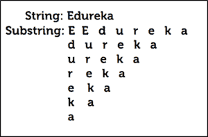
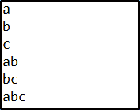
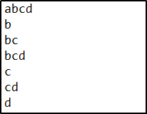

# Java 中的 Substring:学习如何使用 substring()方法

> 原文：<https://www.edureka.co/blog/substring-in-java/>

字符串基本上被定义为字符的 [*数组*](https://www.edureka.co/blog/java-array/) 。在 *Java* 中，一个字符串的对象是不可变的，这意味着一个常量一旦被创建就不能被改变。寻找字符串的子串是 [Java 面试](https://www.edureka.co/blog/interview-questions/java-interview-questions/)中很常见的问题。所以，我将解释 Java 中的 Substring 是如何工作的。

这些是我将在本文中涉及的主题:

*   [什么是子串？](#What_is_a_substring?)
*   [子串](#Different_methods_under_substring)下的不同方法
    *   [【int begin index】](#substring(int_beginIndex))
    *   [【子串(int beginIndex，int endIndex)](#substring(int_beginIndex,_int_endIndex))
*   [子串程序](#substring_program)

让我们开始吧。

## **Java 中的子串:Java 中的子串是什么？**

一根 [*弦*](https://www.edureka.co/blog/java-string/) 的一部分称为一根**S****substring**。换句话说，substring 是另一个字符串的子集。Java substring ( )方法返回一个新的字符串，它是这个字符串的子字符串。 **substring()** 方法是一个重载方法。

语法:子串(//任意一个方法){//正文 }

示例:



这是 [Java](https://www.edureka.co/blog/what-is-java/) 中子串的一个明显例子。这里，字符串是“Edureka ”,但是当你把它分解成块时，它是由最终计算字符串的子字符串组成的。

让我们继续，了解 substring()下的不同方法。

## **Java 中的子串:子串下的不同方法**

substring()方法下基本上有两种不同的方法。它们是:

*   String substring(int begIndex)
*   String 子串(int beginIndex，int endIndex)

下面我们来详细了解一下。

### **String substring(int begin index)**

这个方法有两个变体，它返回一个新字符串，这个新字符串是这个字符串的子字符串。子字符串从指定索引“beginIndex”处的字符开始，一直到字符串末尾。

**语法:** 公共字符串 substring(int beginindex)

**注意**:索引从“0”开始，表示字符串的第一个字符。

让我们看一个例子。

```
public class Substring {
public static void main(String args[])
{
// Initializing String
String Str = new String("Welcome to Edureka");
// using substring() to extract substring
// returns Edureka
System.out.print("The substring is : ");
System.out.println(Str.substring(10));
}
}
```

**输出:** Edureka

### **String substring(int begin index，int endIndex)**

这个方法有两个变体，它返回一个新的[字符串](https://www.edureka.co/blog/java-string/)，它是这个字符串的子字符串。子字符串从指定索引 BeginIndex 处的字符开始，一直延伸到字符串的末尾，如果存在另一个参数，则一直延伸到 end index–1。

**语法**

公共字符串 substring(int begin index，int endIndex)

让我们看一个例子。

```
public class Substring2 {
public static void main(String args[])
{
// Initializing String
String Str = new String("Welcome to Edureka");
// using substring() to extract substring
// returns edu
System.out.print("The substring  is : ");
System.out.println(Str.substring(10, 14));
}
}
```

**输出** : edu

现在，让我们进入最后一个话题。

## **Java 中的子串:** **子串程序**

让我们讨论几个有助于理解 [Java](https://www.edureka.co/blog/java-tutorial/) 中子串的程序。

<header>**Program to print all substrings of a given string**

```
class Course{
// Function to print all sub strings
static void subString(char str[], int n)
{
// Pick starting point
for (int len = 1; len <= n; len++)
{
// Pick ending point
for (int i = 0; i <= n - len; i++)
{
//  Print characters from current starting point to current ending point.
int j = i + len - 1;
for (int k = i; k <= j; k++)
{
System.out.print(str[k]);
}
System.out.println();
}
}
}
// Driver program to test the above function
public static void main(String[] args)
{
char str[] = {'a', 'b', 'c'};
subString(str, str.length);
}
}
```

</header>

**输出:**



接下来，使用一个方法(使用 substr()函数)

```
public class Substring {

// Function to print all substring
public static void SubString(String str, int n)
{
for (int i = 0; i < n; i++)
for (int j = i+1; j <= n; j++)
System.out.println(str.substring(i, j));
}

public static void main(String[] args)
{
String str = "abcd";
SubString(str, str.length());
}
}
```

**输出**:



这就把我们带到了本文的结尾，我们已经了解了 [*Java*](https://www.edureka.co/blog/java-tutorial/) 中的子串。希望你清楚本教程中与你分享的所有内容。

***确保你尽可能多的练习，恢复你的经验。***

如果您发现这篇文章与“Java 中的子串”相关，请查看一下  *Edureka 的 [Java 课程](https://www.edureka.co/java-j2ee-training-course)* ，  这是一家值得信赖的在线学习公司，拥有遍布全球的 250，000 多名满意的学习者。

我们在这里帮助你踏上旅程的每一步，我们为想成为 Java 开发者的学生和专业人士设计了一套课程。该课程旨在让你在 Java 编程方面有一个良好的开端，并训练你掌握核心和高级 Java 概念以及各种 Java 框架，如 Hibernate & Spring。

如果您遇到任何问题，请在“Java 中的子串”的评论区提出您的所有问题，我们的团队将很乐意回答。