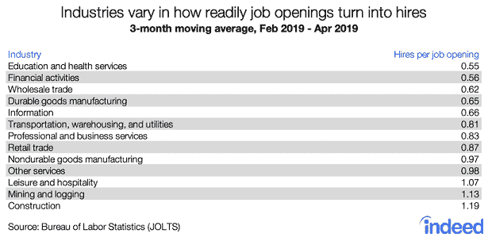

# 第十六卷–edu reka 职业观察–2019 年 7 月 13 日

> 原文：<https://www.edureka.co/blog/vol-xvi-edureka-career-watch>

*“It always seems impossible until it’s done,” Anonymous*

**2019 年是几十年来就业和职业趋势最好的一年。招聘统计数据正在上升，大多数公司、巨头和初创公司的职位空缺数量似乎都创下了历史新高。尽管这些趋势中的大部分是显而易见的，专业人士可以很容易地发现和理解它们，但有些故事却没有被注意到。因此，就像每隔两周一样，Edureka 职业观察又回来了，带来了业内最引人注目的职业和工作新闻。**

**所以，不要再拖延了，让我们看看本周就业市场为我们准备了什么。**

## ****工会预算 2019:关注技术技能和研究****

**2019 年印度政府联盟预算已经出炉，并呈现出一些耐人寻味的事实。着眼于在几年内使印度成为 5 万亿美元的经济体，财政部长 Nirmala Sitharaman 表示，现在是该国专注于培训和发展在技术领域工作的专业人员的时候了。新政策希望为超过 1000 万人提供人工智能、物联网和大数据等数字技术的技能培训。人工智能、数据科学和机器人过程自动化等领域的技能短缺在次大陆已经普遍存在了一段时间，中央政府的这一新决定将有助于填补这些重要领域的技能缺口。**

**印度拥有大量的 IT 专业人员，提高技能是这些专业人员获得工作的唯一途径。**

*****via[CIO](https://www.cio.in/news/union-budget-2019-ambitious-plans-fintech-startups-and-innovation-research)T5*****

***[今天就提升自己的技能](https://www.edureka.co/all-courses)以确保你的工作安全，成为这个国家最可雇佣的专业人士之一。***

****

## **Netrix 扩大在印度的业务，承诺增加 20%的员工**

**数字解决方案公司 Netrix 最近收购了印度的四个组织；喀拉拉邦两个，孟买和浦那各一个。解决方案品牌正计划扩大其在次大陆的影响力和业务覆盖面，并承诺增加 20%的员工。Netrix 多年来有着令人印象深刻的记录，被任命为亚马逊网络服务在喀拉拉邦的高级合作伙伴，也是微软在美国的十大黄金合作伙伴之一。Netrix India 的 Kochi 副总监 Jyothis Joseph 表示，该公司正在寻找“在未来几个月内具有创业精神的自我激励的 IT 专业人员，以支持我们不断扩大的业务”。**

*****经[通道世界](https://www.channelworld.in/media-releases/netrix-expands-its-operation-india-acquiring-4-organizations)*****

## ****美国工业很难填补职位空缺****

**美国就业市场经历了半个多世纪以来最好的一年，但招聘趋势似乎仍低于应有水平。Indeed 的一份新报告指出，公司在填补所有领域的职位空缺时都面临着困难。根据该报告，招聘趋势相当低，每个空缺职位每月仅招聘 0.8 人。虽然包括 IT 在内的所有领域都出现了类似的趋势，但据报道，教育和医疗服务、金融活动以及批发贸易领域的职位尤其难以填补。本季度的招聘数据如下:**

****

**这些指标降低的主要原因之一是市场中的技能缺口。因此，专业人士需要提高技能，以确保他们被录用。**

*****经[确](https://www.hiringlab.org/2019/07/08/hard-to-fill-industries/)*****

***[今天就提升自己的技能](https://www.edureka.co/all-courses)确保你能充分利用这些趋势。***

## ****印度雇主对未来 3 个月的招聘计划持乐观态度:调查****

**根据劳动力解决方案品牌 ManpowerGroup 的就业前景调查，印度雇主表示未来三个月的招聘计划乐观。该调查显示，印度的净就业率将达到 13 %,而服务业的净就业率将达到 16%。这份报告进一步阐述了次大陆目前的招聘趋势，以及政府和企业为促进该国的招聘和技能培养而采取的新举措。因此，专业人士可以预计今年剩余时间印度的招聘将呈上升趋势。**

*****经[印今日](https://www.indiatoday.in/education-today/news/story/indian-employers-have-upbeat-hiring-plans-for-next-three-months-indicates-employment-survey-1564464-2019-07-08)*****

## ****Mphasis 正在扩充其开发和管理团队****

**作为世界上最大的科技巨头之一，Mphasis 正在寻求扩大其开发和管理团队。仅在过去一周，该公司就为精通 Java、软件架构和管理的专业人士列出了超过 16 个招聘信息。职位空缺包括初级和有经验的 Java 开发人员、云架构师、SAP 和软件管理员。这意味着这些工作中的大部分都向具有不同经验和技能水平的人开放。**

**因此，如果你想在这些领域的知名公司发展事业，这是一个绝佳的机会。**

*****via[LinkedIn](https://www.linkedin.com/jobs/search/?f_TPR=r604800&keywords=mphasis)T5*****

***[提升自己的技能](https://www.edureka.co/all-courses)现在去插队，去像 Mphasis 这样的大公司工作。***

**我们还有更多好消息要告诉你！Edureka 职业观察现在也有视频了。在 [Instagram](https://www.instagram.com/edureka.co/) 、 [LinkedIn](https://www.linkedin.com/company/edureka/) 、[脸书](https://www.facebook.com/edurekaIN/)和 [Twitter](https://twitter.com/edurekaIN) 上关注我们，永远不要错过最新消息。**

**充分利用 Edureka 在教育和职业咨询领域的专业知识。请立即与我们的课程顾问联系，以更清晰地了解您的职业道路及更多信息。**拨打电话:*IND:[+91-960-605-8406](tel:9606058406)/*US:[1-833-855-5775](tel:18338555775)(免费)*。*****

**这些是本周市场上与职位空缺和职业趋势相关的主要新闻。如果你有任何问题，建议或者你想让我们报道的任何特定话题，请在下面的评论区联系我们。《Edureka 职业观察》将于下周为您带来您需要知道的头条新闻。所以，请确保您通过下面的订阅按钮订阅了我们的博客，千万不要错过这些重要的更新。**