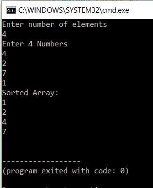

# 如何在 C 中实现选择排序？

> 原文：<https://www.edureka.co/blog/selection-sort-in-c/>

在上一篇文章中，我们已经讨论了 C 中[冒泡排序的实现。本文将向您简要介绍如何在 c 中实现选择排序。](https://www.edureka.co/blog/bubble-sort-in-c/)

*   [C 中的选择排序](#SelectionSortinC)
*   [选择排序算法](#AlgorithmforSelectionSort)
*   [实现选择排序的其他方式](#OtherwaystoimplementSelectionSort)

那就让我们开始吧，

## **C 中的选择排序**

选择排序是用于排序的另一种算法。这种排序算法遍历数组，找到数组中最小的数字，如果它小于第一个元素，就与第一个元素交换。接下来，它继续处理第二个元素，依此类推，直到所有元素都排序完毕。

**选择排序示例**

考虑阵列:

[10,5,2,1]

第一个元素是 10。下一部分我们必须从剩余的数组中找出最小的数。5 2 和 1 的最小数字是 1。所以我们用 1 代替 10。

新的数组又是[1，5，2，10]，重复这个过程。

最后，我们得到排序后的数组为[1，2，5，10]。

让我们继续这篇关于 C 语言中选择排序的文章，看看算法是如何工作的，

**选择排序的算法:**

**步骤 1**—将最小值设置到第一个位置

**步骤 2**—搜索数组中的最小元素

**步骤 3**–用数组中的最小值交换第一个位置

**步骤 4**–将第二个元素指定为最小值。

**步骤 5**—重复这个过程，直到我们得到一个排序后的数组。

让我们看一下编程实现的代码，

**选择排序代码:**

```

#include <stdio.h>
int main()
{
int a[100], n, i, j, position, swap;
printf("Enter number of elementsn");
scanf("%d", &n);
printf("Enter %d Numbersn", n);
for (i = 0; i < n; i++)
scanf("%d", &a[i]);
for(i = 0; i < n - 1; i++)
{
position=i;
for(j = i + 1; j < n; j++)
{
if(a[position] > a[j])
position=j;
}
if(position != i)
{
swap=a[i];
a[i]=a[position];
a[position=swap;
}
}
printf("Sorted Array:n");
for(i = 0; i < n; i++)
printf("%dn", a[i]);
return 0;
}

```

**输出:**



在上面的程序中，我们首先从用户那里获取项数并存储在 n 中，接下来，用户需要输入数组。该数组被接受并存储在[]中。

第一个“for 循环”处理要匹配的元素。它将 I 赋给位置变量。内部的“for 循环”用于遍历剩余的元素并找到最小的元素。一旦找到最小的元素，j 就被赋给位置变量。j 保存最小元素的索引。

然后，检查位置变量是否不等于 I。如果不等于 I，则使用交换变量进行交换。现在让我们转到本文的最后一点，关于 C 语言中的选择排序，

**实现选择排序的其他方式:**

进行选择排序还有其他方法。一种方法是使用排序函数。在这个程序中，我们将在函数中进行排序。该计划的其余方面将是相同的。

下面是代码:

**输出:**

```

#include <stdio.h>
void SelSort(int array[],int n);
int main()
{
int array[100], n,i;
printf("Enter number of elementsn");
scanf("%d", &n);
printf("Enter %d Numbersn", n);
for(i = 0; i < n; i++)
scanf("%d", &array[i]);
SelSort(array,n);
return 0;
}
void SelSort(int array[], int n)
{
int i, j, position, swap;
for(i = 0; i < (n - 1); i++)
{
position=i;
for(j = i + 1; j < n; j++)
{
if(array[position]>array[j])
position=j;
}
if(position != i)
{
swap=array[i];
array[i]=array[position];
array[position]=swap;
}
}
printf("Sorted Array:n");
for(i = 0; i < n; i++)
printf("%dn", array[i]);
}

```

程序的执行是相同的，但是唯一的区别是在这个程序中调用了一个函数来进行排序。

**选择排序以这种方式完成。**

至此，我们结束了这篇关于“C 语言中的选择排序”的博客。我希望你发现这是有益的，请继续关注更多类似主题的教程。您也可以查看我们的培训计划 t 以深入了解 jQuery 及其各种应用程序，您可以 [**在此**](https://www.edureka.co/masters-program/full-stack-developer-training) 注册在线实时培训，24/7 全天候支持，终身访问。

有问题要问我们吗？在这个博客的评论部分提到他们，我们会回复你。