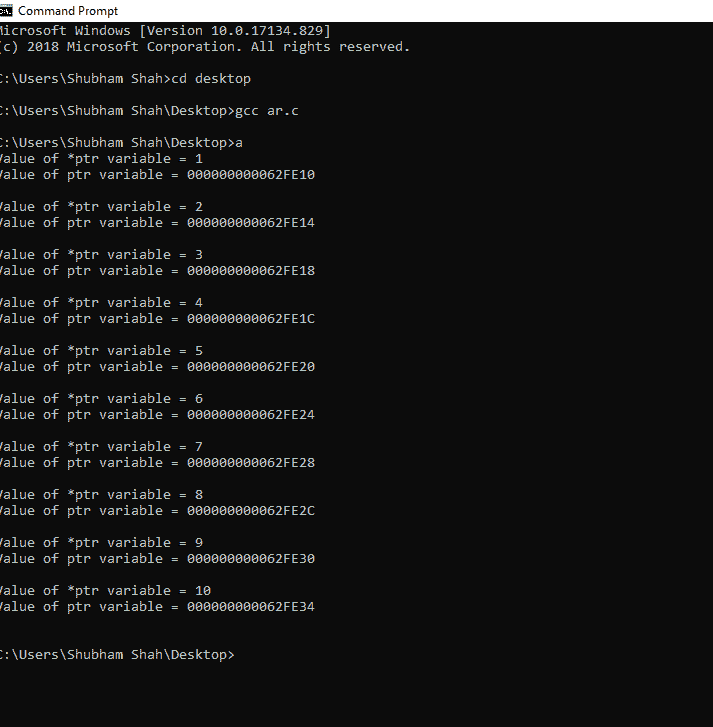
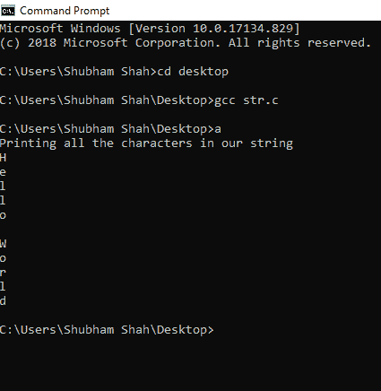

# 关于 C 语言中的指针，你需要知道的一切

> 原文：<https://www.edureka.co/blog/pointers-in-c/>

在学习 C 语言的时候，你可能遇到过“指针”这个术语，并且经常听说这是一个很难理解的概念。指针在各种编程任务中很有帮助，并且理解起来并不困难。本文将向你介绍 C 语言中的指针，并告诉你为什么它们并不像看起来那么难学。

以下是本文涉及的要点，

1.  [什么是指针？](#WhatIsAPointer?)
2.  [引用和反引用操作符](#ReferenceAndDe-ReferenceOperators)
3.  [指针类型](#TypesOfPointers)
4.  [如何使用指针](#HowToUseAPointer)

让我们从 C 文章中这个指针的第一位开始，

## **C 语言中的指针**

## **什么是指针？**

指针是一个变量，它能够存储变量的地址。现在，你可能会问那有什么用？基本上，指针指向提供了地址的变量的内存位置。该属性有助于动态内存分配，这是编程的一个重要方面。

让我们了解一下它的语法，看看一个例子

```
Data_Type *pointer_name;
```

**例子:**int * ptr；

下面是这篇 C 语言指针文章的下一部分

## **引用和取消引用操作符**

在深入研究指针的概念之前，让我们先了解一些对我们以后有帮助的基础知识。在使用指针的时候，你肯定会用到“&”和“*”操作符。现在是了解它们的意义和用途的时候了。

首先，让我们了解一下引用运算符通常被称为“地址”运算符。对变量使用(“与”)运算符会返回一个内存位置，也就是给定变量的地址。

**例子**

```
int *ptr;
int a;
ptr = &a;

```

变量‘a’的地址存储在变量 ptr 中。

现在，让我们来了解引用或“Value at”运算符，用星号(*)表示。它有助于从存储在指针变量中的内存位置获取值

**例子**

```
int *ptr;
int a;
*ptr = &a;
printf("Value of a = %dn", *ptr);

```

**指针类型** 声明指针时使用的*不是为了解引用，而是告诉编译器给定的变量是指针。上述 print 语句打印内存位置中的值，该内存位置由指针指向。即变量“a”的值。

根据在程序中的使用方式，指针有几种不同的类型。 我们来看看一些最常用的类型。

### **空指针**

当你不确定要分配什么地址时，空值被分配给指针。这可以通过在声明时将“NULL”值赋给指针来实现。这个指针的值是 0。

```
int *ptr = NULL;
```

**百搭指针**

一个通配符指针是通过不给指针变量赋值而创建的。应该小心使用，因为它可能会导致意想不到的结果。

**悬空指针**

当一个指针指向一个被删除的变量或被释放的内存时，这个指针被称为悬空指针。这个指针指向一个不存在的内存位置。下面让我们来看看 C 文章中的这个指针

## 如何使用指针

现在我们对引用和取消引用操作符有了一个简单的了解。在本节中，我们将了解如何使用指针。到目前为止，我们已经学会了如何声明一个指针并使用它进行一些基本的操作。至此，我们已经有了足够的知识，可以通过对指针进行算术运算，将指针用于真正令人惊叹的编程任务。

通常，这些操作是在数组上执行的。减去 2 个地址可以得到 2 个内存位置之间的距离。

```
int main()
{
int First_array[10] = {1, 2, 3, 4, 5, 6, 7, 8, 9, 10}; /*Our array on which we will perform operations*/
int *ptr; /*Pointer*/
ptr = First_array; /*Assign the address of array to the pointer variable*/
for (int i = 0; i < 10; i++) /*Performing operations*/
{
printf("Value of *ptr variable = %dn", *ptr);
printf("Value of ptr variable = %pnn", ptr);
ptr++;
}
}

```

**输出**

自己尝试实现代码，进行不同的算术运算。 让我们用带字符串的指针。

```
#include <stdio.h>
#include <string.h>
int main()
{
char str[]="Hello World";&nbsp; /*Creating an array*/
char *p; /*Pointer*/
p=str;
printf("Printing all the characters in our stringn");
p=str;
for(int i=0;i<strlen(str);i++)
{
printf("%cn",*p);
p++;}
return 0;
}

```

 关于“C 语言中的指针”，我们的博客到此结束。我希望你发现这是有益的，请继续关注更多类似主题的教程。您也可以查看我们的培训项目 t  以获得关于 jQuery 及其各种应用程序的深入知识，您可以 [ **在此** ](https://www.edureka.co/masters-program/full-stack-developer-training) 注册参加实时在线培训，享受全天候支持和终身访问。 用不同的字符串和修改实现上面的代码。现在，我们已经很好地理解了与指针相关的所有关键概念。

有问题要问我们吗？在这个博客的评论部分提到他们，我们会回复你。