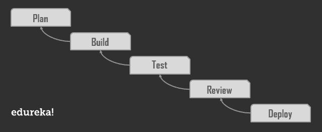
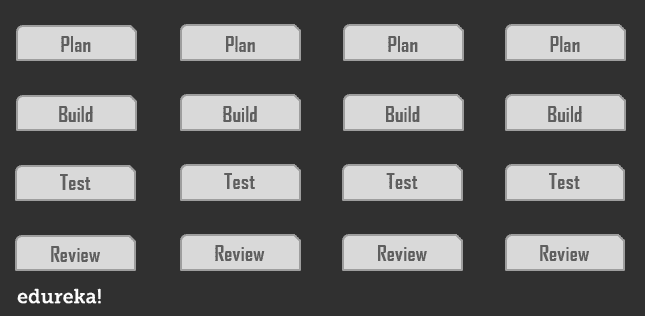
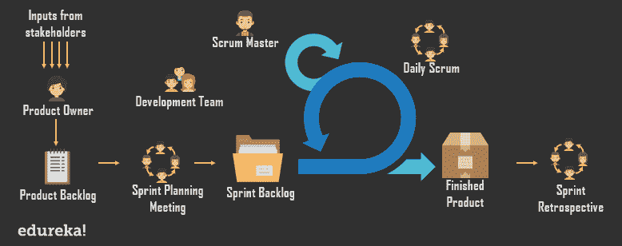

# 关于 SCRUM 你需要知道的一切

> 原文：<https://www.edureka.co/blog/scrum-methodology/>

[***Scrum***](https://www.edureka.co/blog/what-is-scrum/) 是一个**框架**，人们可以在其中解决复杂的适应性问题，同时富有成效和创造性地交付尽可能高价值的产品。多用于**产品开发策略**。

[***获得 CSM 认证***](https://www.edureka.co/certified-scum-master-certification-training) 是深入了解 Scrum 最快最好的方法。Scrum 经常被认为是一种方法论，但是我们不能把 scrum 看作一种方法论，我们必须把它看作一个过程管理的框架。

关于 Scrum，我需要马上解决三件事。Scrum 是；

1.  **轻量级**
2.  **通俗易懂**
3.  **难以实现**

记住这一点，希望接下来的内容能给你 Scrum 的基础知识。

*   [**什么是 SCRUM？**](#whatisscrum)
*   [**谁是 Scrum 高手？**](#whoisascrummaster)
*   [**SCRUM 框架**](#scrumframework)
*   [**什么是短跑？**](#whatisasprint)
*   [**抢球仪式**](#scrumceremonies)
*   [**SCRUM 人工制品**](#scrumartefacts)

## 什么是 SCRUM？

为了理解 [***Scrum***](https://www.edureka.co/blog/what-is-scrum/) 的重要性，我们需要先看看一个更传统的替代方案——**瀑布模型**。

### **什么是瀑布模型？**

在**瀑布模型**中，所有的计划都发生在开发过程的开始，并且投入了大量的时间。然后进行产品的完整开发，接着进行测试。然后最后是产品的评审和部署，整个过程大约需要一年时间。

****

### **问题**

现在，这种方法的问题是，计划完全不知道团队在开发过程中可能面临的挑战。这可能会导致许多倒退和延迟。

此外，在这个漫长的周期结束时，你可能会意识到市场的需求已经完全改变，你的产品不再满足它的要求。这使你回到起点。

### **解决方案**

在 Scrum 中，你有下面的方法。

*   首先，你**计划**刚好足以开始你的项目。
*   第二，你**用一套最少的基本功能来构建**你的产品。
*   第三，你根据你的计划测试这些特性。

最后，您进行**评审**，向利益相关者展示所述产品以供接受。你这里有一个*潜在的可运输产品*。

这四个步骤由一个*迭代*组成，这个迭代一次又一次地重复，减少了每个*增量发布*或产品版本所花费的时间。

### **那么，Scrum 到底是什么？**

Scrum 实现了 [***敏捷***](https://www.edureka.co/blog/what-is-agile-testing/) 方法，通过**迭代**和**增量**到**交付最大价值**的过程、技术和实践来构建**潜在可交付的**软件。Scrum 不是方法论。它是一个简单、轻量级的框架，用于复杂产品的有效团队协作。

## 谁是 Scrum 大师？

要解释谁是，我需要借助一个假设。

### **问题**

假设一个房间里有许多人，他们必须根据他们各自的身高排队，尽可能用最少的时间。

现在，有两种方法可以解决这个问题。

### **解决方案 1:主管进场**

****

这种方法需要一个人负责组织其他人排队。然而，这种方法占用了太多的时间，而且没有给人们留下独立思考的空间。

### **解决方案 Scrum 大师方法**

****

Scrum **Master** 允许团队自我组织并快速做出改变。他/她促进了**敏捷**原则。scrum master 管理信息交换的过程。

这消耗了更少的时间，团队通过学会独立思考而成长。

## **SCRUM 框架**

Scrum 不是一种方法论，它基于经验主义的科学方法。它基本上用一种更加*启发式(自我学习)*的方法取代了编程的算法方法，尊重人和自我组织来处理软件开发中障碍的不可预测性。

### **什么是经验主义？**

经验主义只不过是以基于事实、基于经验和基于证据的方式工作。经验过程是这样一个过程，其中进展基于对现实的观察，*而不是虚构的计划*。

经验主义有三大支柱，即*透明*、*检验*和*适应*。

#### **透明度**

这意味着如实陈述事实。所有相关员工——客户、首席执行官、个人贡献者——在与他人的日常交往中都是透明的。

#### **检查**

Scrum 团队的每个成员都应该为产品、过程、人的方面、实践和持续改进做这件事。

#### **适应**

它是指基于检查结果的适应能力。这个术语在上下文中是关于持续改进的。

### **Scrum 生命周期**

****

**Step1:** 流程从一个  ***产品负责人*** 开始。这个人创建了一个  ***产品积压*，** 最终产品需要的任务和需求的优先级列表。

**第二步:** 团队聚在一起进行  ***冲刺规划*** ，一起决定从产品待办事项中先做什么。这个项目子集变成了  ***冲刺积压*。**

**Step3:** 在冲刺阶段，团队每天开会交流进度和问题，这个会议叫做  ***每日 scrum。scrum 主管监督它，并确保所有团队成员遵循 Scrum 的理论、规则和实践。***

**Step4:** 在每次冲刺的最后，由产品负责人组织一次  **冲刺评审** 会议。在会议期间，  ***开发团队*** 展示了上一次冲刺所做的工作。然后，产品负责人讨论剩余的产品待办事项和完成项目的预计时间(如果需要)。

***注:** 在 scrum 中，在每一次冲刺的最后，团队应该有一个功能正常、可用的产品片段来展示他们的工作*。

**Step5:** 评审结束后，scrum 团队在  ***sprint 回顾会议**、* 上进行总结，团队在会上讨论哪些做得好，哪些做得不好，以及是否可以做得更好。可能是技术限制阻碍了他们的发展，或者是团队成员的任务负担过重。团队决定如何  *解决这些问题* ，并计划在下一次冲刺阶段进行改进。

**step 6:*****循环重复*** 为产品积压中剩余的任务。这种情况会一直持续下去，直到发生下列情况之一；

*   截止日期到了
*   预算用完了
*   产品所有者对所述产品满意

## **什么是短跑？**

Sprint 是 Scrum 中的一次迭代。它的时间限制为一个月，结果是创建一个可用的、可发布的产品。在前一次冲刺结束后，新的冲刺会立即开始。

在这个冲刺的过程中；

*   *没有做出会危及**冲刺目标**的*变更
*   增量*的质量没有*下降
*   项目范围*可能由**产品负责人**和**团队**重新协商*

每个 Sprint 都有一个要建立的目标(Sprint 目标)。它是一个设计蓝图或一个灵活的计划，将指导建立最终的产品增量。

## **混战仪式**

Scrum 中有四个*仪式/事件*。

### **冲刺规划**

在冲刺阶段要完成的工作是在冲刺规划阶段计划的。它是由整个 Scrum 团队的协作工作计划出来的。对于一个月的 Sprint，Sprint 计划的时间限制是最多 8 小时。

冲刺策划回答以下问题；

*   *在即将到来的增量中可以交付什么？*
*   如何完成本次冲刺所需的工作？

### **每日混战**

每日 scrum 是一个 15 分钟的限时活动，Scrum 团队 计划并同步未来 24 小时的活动。它在短跑比赛的每一天举行。

在日常的 scrum 中，每个成员都要回答以下问题；

*   我昨天做了些什么？
*   我今天要做什么？
*   我的障碍是什么？

Scrum 大师的工作是最小化团队任务中的障碍，以保证冲刺的时间限制。

### **冲刺复习**

Sprint 评审是一个非正式的会议，Scrum 团队和利益相关者就 sprint 中所做的事情进行合作。基于此以及在冲刺阶段对**产品积压** 的任何更改，他们计划接下来可以做的事情以优化价值。

### **冲刺回顾**

冲刺回顾发生在冲刺评审 之后，在即将到来的冲刺计划会议之前。T4:他的一个月短跑项目是三个小时。

在 Sprint 回顾中，团队讨论了以下内容:

*   什么进展顺利？
*   *没用的东西？*
*   *应该有哪些不同的做法？*

## **SCRUM 人工制品**

Scrum 的产品代表了为检查和适应提供透明度和机会的工作。它们是专门为最大化关键信息的透明度而设计的。因此，scrum 团队中的每个人都有*相同的* *对产品的*理解。

scrum 中有三个工件，即*产品积压*、*冲刺积压*和*增量*。

### **产品积压**

产品待办事项是产品中所需的所有东西的有序列表。这是**产品负责人**的责任。一个产品积压就是**永远无法完成**。最初，它包含最容易理解的需求，并随着产品及其环境的发展而逐渐演变，使*适合*和*与当前市场需求*相关。

### **冲刺积压**

Sprint Backlog 是为 Sprint 选择的产品 Backlog 项目集，带有交付下一个增量的计划。它由开发团队预测，解释下一个增量中期望的功能以及交付这些功能所需的工作。

### **增量**

一个增量是在一次冲刺 和之前所有冲刺中完成的所有产品积压 项的总和。在 Sprint 结束时，新的增量*必须处于可用状态*并且满足 Scrum 团队对**完成**的定义。

*当一个增量被描述为**完成**时，每个人都必须同意一个检查表，该检查表在被完全检查后，宣布产品“完成”。*

## **结论**

Scrum 的工作不是因为它有三个角色、五个事件和三个工件，也不是因为一种方法论，而是因为它坚持迭代的、基于价值的增量交付的基本敏捷原则。您经常收集客户反馈，并对市场变化做出反应。这导致更快的上市时间，更好的交付可预测性，提高客户响应能力。并且它给你增强的软件质量，和改进的风险管理。