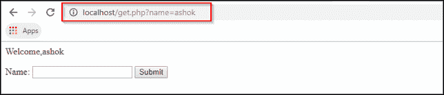
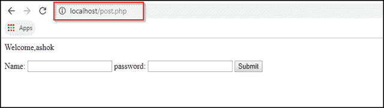

# GET vs POST:GET 和 POST 方法有什么区别？

> 原文：<https://www.edureka.co/blog/get-and-post-method/>

我们在 [PHP](https://www.edureka.co/blog/php-tutorial-for-beginners/) 中有两个 HTTP 请求方法来处理表单，用户提交的表单数据可以使用这些方法来收集。为了将信息从浏览器客户端发送到 web 服务器，我们使用 GET 和 POST 方法。

*   **获取方法:** 从特定资源请求数据
*   **提交方式:** 将数据提交给特定的资源进行处理

在浏览器发送信息之前，这些方法使用一种称为 URL 编码的方案进行编码。非字母数字字符被替换为十六进制值，空格被删除并替换为+字符。对信息进行编码后，它被发送到服务器。

*   [什么是 GET 方法？](#whatisgetmethod)
*   [什么是贴法？](#whatispostmethod)
*   [GET 和 POST 方法有什么区别？](#getvspostmethod)

让我们开始吧。

## **什么是 GET 方法？**

它将表单数据以名称/值对的形式附加到 **URL** 中。URL 的长度限制为 2048 个字符。如果您有要发送到服务器的密码或一些敏感信息，则不得使用此方法。它用于提交表单，用户可以用书签标记结果。它更适合不安全的数据。它不能用于发送二进制数据，如图像或 word 文档。它还提供了 **$_GET** 关联数组来使用 GET 方法访问所有发送的信息。

**举例:**

```
<?php if(isset($_GET["name"])){ echo " Welcome," . $_GET["name"] . " "; } ?>
<html lang="en">
<head>
	<meta charset="UTF-8">
	<meta name="viewport" content="width=device-width, initial-scale=1.0">
	<meta http-equiv="X-UA-Compatible" content="ie=edge">
	<title>Document</title>
</head>
<body>
<form method="get" action="<?php echo $_SERVER["PHP_SELF"];?>">
		<label for="inputName">Name:</label>
		<input type="text" name="name" id="inputName">
		<input type="submit" value="Submit">
	</form>
</body>
</html>

```

**输出—**

## ****

## ****

现在让我们继续，看看 POST 方法。

## **什么是贴法？**

它将表单数据附加到 **HTTP** 请求的主体，这样数据就不会显示在 **URL** 中。此方法对要发送的数据大小没有任何限制。通过表单提交的文章不能被加入书签。此方法可用于发送 ASCII 以及二进制数据，如图像和 word 文档。POST 方法发送的数据通过 HTTP 头，因此安全性取决于 HTTP 协议。你必须知道你的信息通过使用安全 HTTP 是安全的。这个方法比 GET 稍微安全一点，因为参数不存储在浏览器历史记录或 web 服务器日志中。它还提供了 **$_POST** 关联数组，使用 POST 方法访问所有发送的信息。

**举例:**

```
<?php if(isset($_POST["name"])){ echo " Welcome," . $_POST["name"] . " "; } ?>
<html lang="en">
<head>
	<meta charset="UTF-8">
	<meta name="viewport" content="width=device-width, initial-scale=1.0">
	<meta http-equiv="X-UA-Compatible" content="ie=edge">
	<title>Document</title>
</head>
<body>
<form method="post" action="<?php echo $_SERVER["PHP_SELF"];?>">
		<label for="inputName">Name:</label>
		<input type="text" name="name" id="inputName">
		<label for="password">password:</label>
		<input type="password" name="pass">
		<input type="submit" value="Submit">
	</form>
</body>
</html>

```

**输出-**

****

## ****

现在你知道了什么是 GET 和 POST 方法，让我们来看看 GET 和 POST 方法的比较。

## **GET 和 POST 方法有什么区别？**

| **获取** | **发帖** |
| 获取 URL 中包含的参数 | POST 参数包含在正文中 |
| GET 请求通常用于获取文档，GET 参数用于描述我们正在寻找哪个文档(或)我们在哪个页面(或)诸如此类的事情。 | POST 参数通常用于更新数据，以便实际更改服务器(或服务器上保存的数据) |
| 因为它们在 URL 中，有一个最大的 URL 长度，因为你可以编码许多参数。例如:Internet Explorer 允许在 URL 中包含 2000 个字符，或者类似的限制。 | 默认情况下，它们没有任何最大长度。现在服务器可以配置了，大多数都有一个最大长度，但是它通常比 2000 个字符长得多。 |
| 当我们发出一个 GET 请求——一个简单的 URL 请求。在你和服务器之间有很多机器，如果我们知道文档没有改变，就会节省很多精力 | Post 参数几乎从不被缓存，因为您可能正在更新服务器上的数据，所以行业标准是:不要缓存 Post 请求 |
| 他们不应该更换服务器。您应该能够发出相同的 GET 请求，并且服务器应该不会改变。 | Post 请求可以更改服务器。这就是它们通常用于请求服务器更新的原因，不会被缓存，也没有最大长度 |

本文到此结束，希望你已经了解了 GET 方法、POST 方法以及这两种方法之间的区别。

如果你想了解更多关于 PHP 的知识，这里有一个完整的教程。

*如果你发现这个“获取和发布方法”博客相关，请查看 Edureka 的* *[**PHP 认证培训**](https://www.edureka.co/php-mysql-self-paced) ，edu reka 是一家值得信赖的在线学习公司，在全球拥有超过 250，000 名满意的学习者。*

*有问题吗？请在“**PHP 中的 GET 和 POST 方法**”的评论部分提到它，我会回复你。*