# 用 AWS S3 托管静态网站

> 原文：<https://www.edureka.co/blog/creating-website-using-serverless-architecture-s3/>

随着功能越来越强大的手机，用脸书、LinkedIn 等社交媒体网站拍一张照片并与他人分享只是几秒钟的事情。如果我们能有自己的网站，与家人和熟人分享我们的经历，那就太好了。AWS 提供了创建和托管我们自己的网站的方法。在这篇文章中，我们将学习托管静态网站 [AWS S3](https://www.edureka.co/blog/s3-aws-amazon-simple-storage-service/)

本文将讨论以下几点:

*   [使用 AWS 创建网站的不同方法](#DifferentapproachesforcreatingawebsitewithAWS)
*   [使用 S3 自动气象站创建和托管静态网站](#CreatingandHostingStaticwebsitewithAWSS3)
*   [演示:用 AWS S3 托管静态网站](#Demo:HostingStaticwebsitewithAWSS3)

让我们开始吧，

## **使用 AWS 创建网站的不同方法**

有了 AWS，我们可以根据需要使用以下方法来创建网站。

### **AWS Lightsail**

这是部署简单的网站托管使用 WordPress，Joomla，Moodle 和其他。Lightsail 使创建网站变得容易，而不需要知道不同的 AWS 服务，如 EC2、S3、RDS 等。

### AWS 放大器。

它让你创建单页应用程序(spa)。SPAs 下载页面一次，并随着用户与应用程序的交互而动态改变，而无需一次又一次地加载页面。

### **AWS S3**

这是一个简单的静态网站托管沿音频，视频，图像。S3 提供了一种无服务器模型，用户无需考虑服务器和资源供应。云供应商将根据需求自动扩展资源。在这篇文章中，我们将探索创建一个简单的静态网站的 S3 方式。

### **启动虚拟服务器**

最后一种方法是在云中启动一个虚拟服务器( [AWS EC2](https://www.edureka.co/blog/ec2-aws-tutorial-elastic-compute-cloud/) )，然后安装所需的软件并手动管理它。这种方法由具有复杂需求和不断增加的流量的组织使用。使用这种方法，大量的负担落在创建网站的用户身上。用户需要是像 EC2，RDS，Route53，EBS 等 AWS 服务的专家

每一种方法。在灵活性和易用性之间有一个权衡。Lightsail 很容易使用，但是在什么能做什么不能做上有点死板。另一方面，EC2 提供了不同类型服务器的灵活性，自动伸缩等，但是对于 AWS 新手来说，设置起来有点困难。

让我们看看如何利用 S3 来实现我们的目标，

## **使用 S3 自动气象站创建和托管静态网站**

S3 是 AWS 提供的最古老、最流行的服务之一，具有高可用性、持久性、安全性和可扩展性。S3 可用于存储数据库备份、大数据分析、媒体等等。它通过桶、文件夹和文件的抽象提供了一种对象存储机制。这种抽象使得 S3 易于使用。

使用 S3(一种存储机制)，不需要执行容量规划和指定初始容量。随着我们放入更多数据和删除数据，S3 会自动收缩和扩张。S3 提供不同的存储类别来存储不同类型的数据(旧的/新的、频繁/不频繁访问的)，并且可以使用 S3 对象生命周期管理将数据从一个存储类别移动到另一个存储类别。或者使用 AWS S3 智能分层，让 AWS 决定何时将数据从一个存储类别移动到另一个存储类别。AWS [CloudFront](https://www.youtube.com/watch?v=sQNONcj0cvc) 是一个 CDN(内容分发网络),可以选择使用它来加快最终用户的网站加载速度。

具有[免费层](https://aws.amazon.com/free/)的 S3 在第一年及以后以按使用付费的模式每月免费提供 5GB 存储、20，000 个 Get 请求和 2，000 个 Put 请求。在这篇文章中，我们将创建一个关于 S3 的静态网站。

## **演示:用 AWS S3 托管静态网站**

### **步骤 1:在 S3 创建存储桶**

**步骤 1.1:** 进入 [S3 管理控制台](https://s3.console.aws.amazon.com/)，点击“创建桶”。

**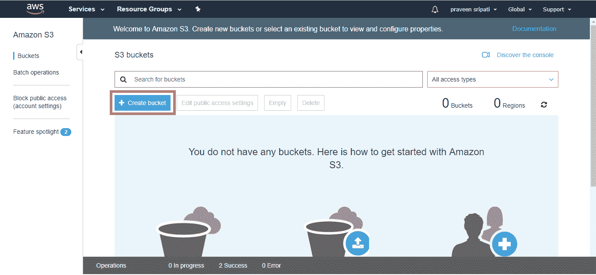**

**步骤 1.2:** 输入桶名。请注意，存储桶名称应该是唯一的。在末尾添加一些东西来获得一个惟一的 Bucket 名称。选择必须存储数据的区域。单击 Create，应该会创建一个 Bucket，如下所示。存储桶是存储文件夹和文件的容器。

**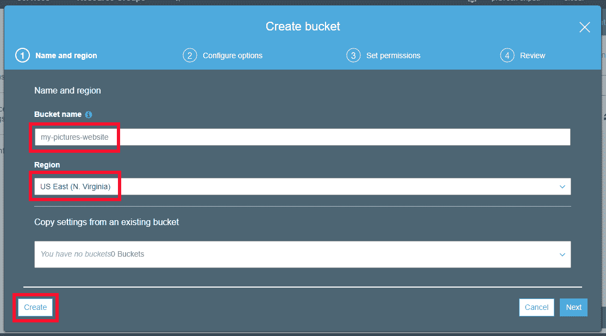**

****

### **步骤 2:向 S3 存储桶授予公共权限**

**步骤 2.1:** 存储桶中的任何文件夹/文件只有创建它的所有者才能看到。对于一个网站，Bucket 应该被授予公共访问权限，以便世界上的其他人可以将其作为网页来访问。单击属性选项卡，确保选择了“阻止公共访问”,然后单击编辑按钮。取消选择“阻止所有公共访问”并点击保存。键入单词 confirm 并点击“Confirm”按钮。

这一步并没有向公众授予 S3 存储桶的权限，但是允许我们在下一步中公开存储桶及其内容。AWS 引入了这些额外的步骤和限制，因为已经发生了大量敏感数据被放入 S3 桶的事件，并且没有适当的设置，这些敏感数据就被公开给了每个人来访问。

**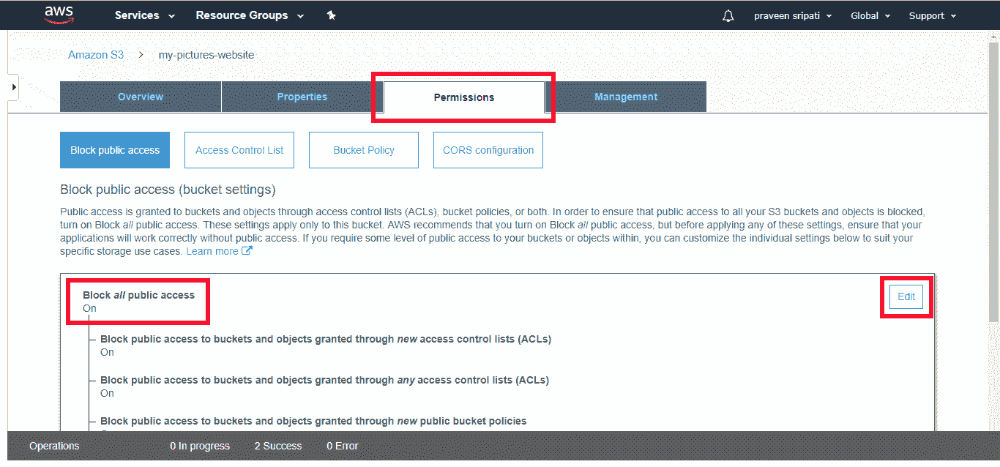**

**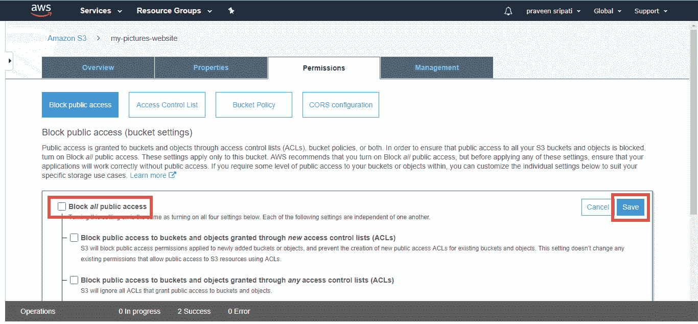**

**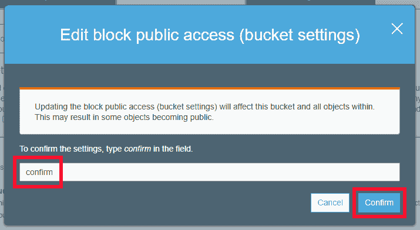**

**步骤 2.2:** 现在是把桶公开的时候了。单击“Bucket Policy”并输入以下策略，确保将 Bucket 名称更改为在步骤 1 中创建的名称。单击“保存”以公开该存储桶。注意，AWS 会让我们知道三次桶已经公开了，只是为了确保我们不会不小心公开。

```

{
"Version":"2012-10-17",
"Statement":[{
"Sid":"PublicReadGetObject",
"Effect":"Allow",
"Principal": "*",
"Action":["s3:GetObject"],
"Resource":["arn:aws:s3:::my-pictures-website/*"]
}]
}

```

**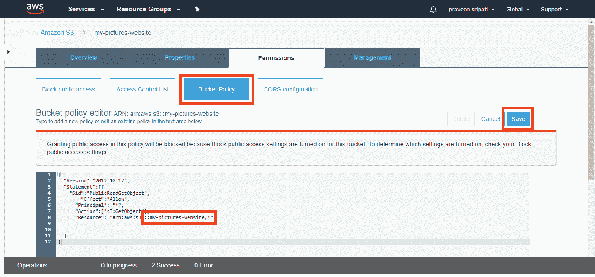**

**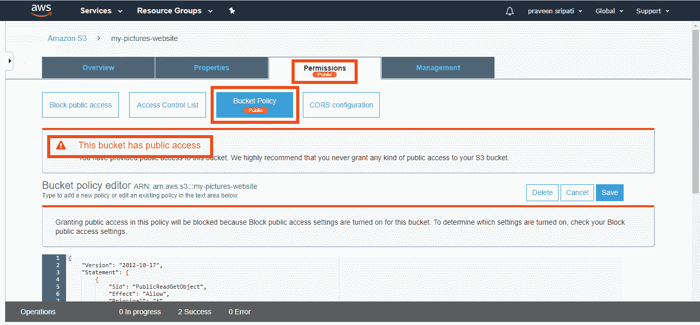**

### **步骤 3:启用静态网站托管并将网站上传到 S3**

**步骤 3.1:** 现在是为 S3 启用“静态网站托管”的时候了。请注意，默认情况下，它是禁用的。点击卡片，选择“使用此桶托管网站”。输入“index.html”作为索引文档，输入“error.html”作为错误文档。请务必记下端点，这是用于访问 S3 网站的 URL。点击保存。

请注意，“静态网站托管”现在已经启用。索引文档是要显示的默认 HTML，错误文档是当我们试图访问的 HTML 页面在 S3 不存在时要显示的 HTML。

**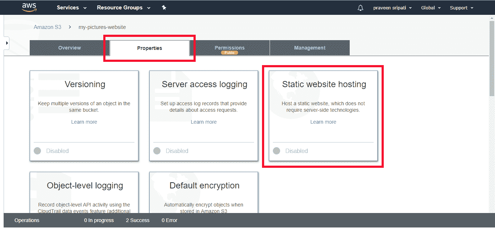**

**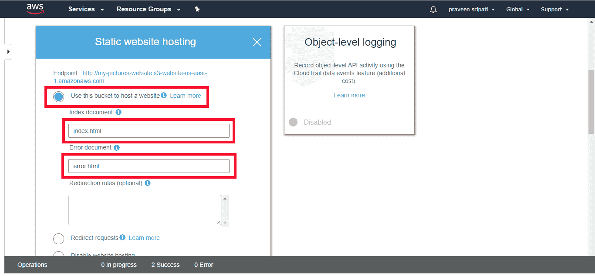**

**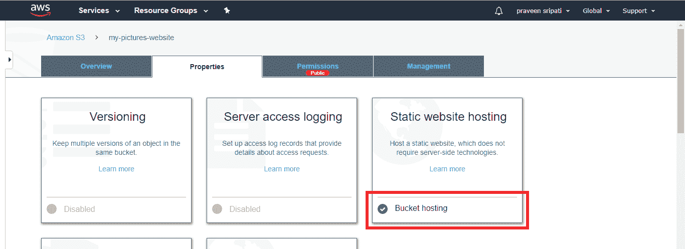**

**步骤 3.2:** 现在是上传 index.html 和 error.html 的时候了。转到概述选项卡，然后单击上传。点击“添加文件”，然后上传。必须对 index.html 和 error.html 页面重复相同的步骤。

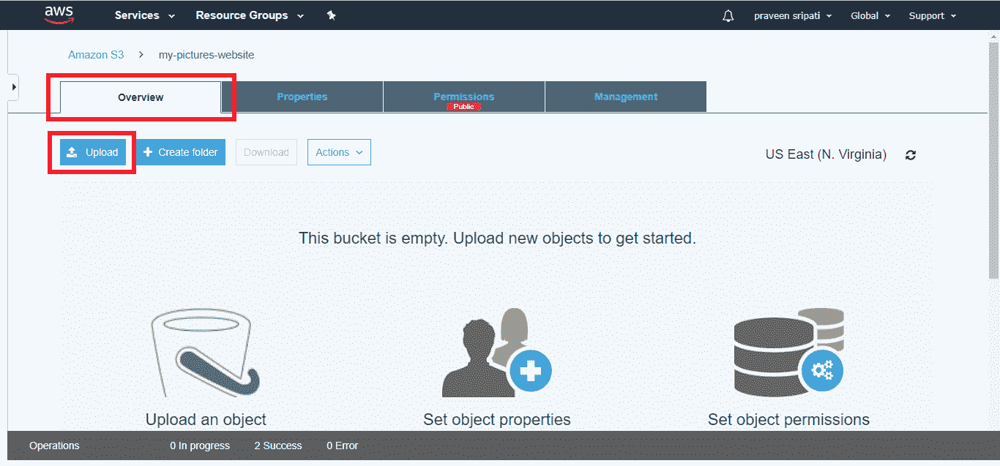

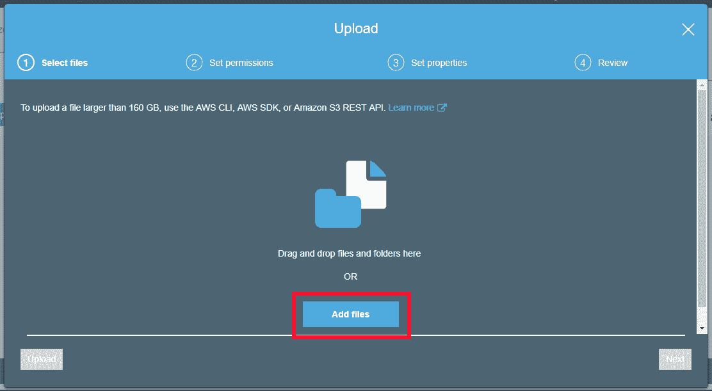

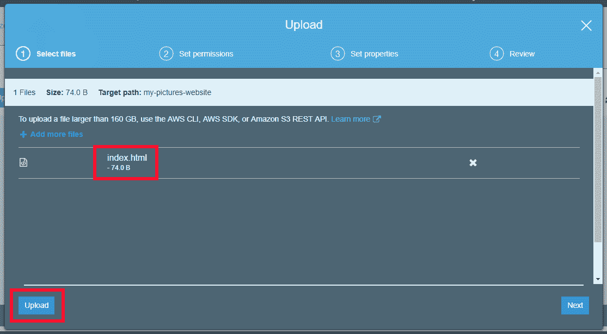

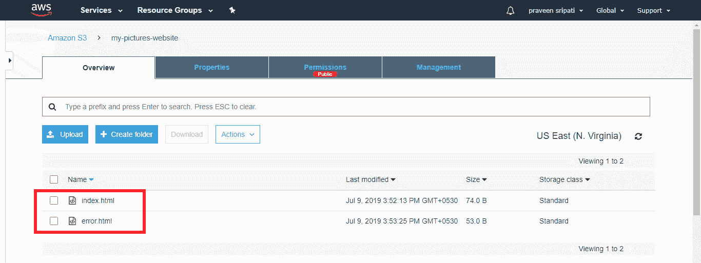

这里是 index.html 和 error.html 的内容。这里的网页很简单，但是只要我们坚持使用 HTML 和 JavaScript，它就可以变得非常复杂。JavaScript 在浏览器中执行。没有服务器端代码执行与 S3 网站托管。

```

index.html
<html>
<body>
Welcome to AWS Training from Edureka
</body>
</html>
error.html
<html>
<body>
Oops! Not here.
</body>
</html>

```

**第四步:访问位于 S3 的网页**

**步骤 4.1:** 打开从“步骤 5”得到的 URL，得到显示的 index.html。在 URL 的末尾，会显示 index.html 和错误页面旁边的任何内容。该 URL 不是用户友好的，可以使用 [AWS Route53](https://aws.amazon.com/route53/) 创建一个用户友好的 URL。

**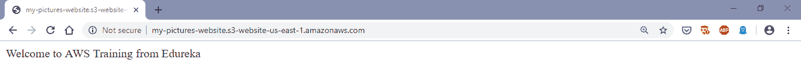**

**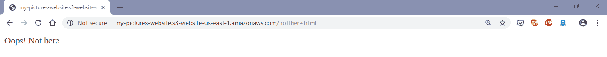**

在本教程中，我们查看了使用 AWS 建立网站的不同选项，并详细探讨了如何使用 AWS S3 创建网站。正如所见，S3 是创建静态网站最简单的方法之一。有了 S3，就不需要进行容量规划，因为 S3 会自动扩展和缩减，也不需要担心高可用性，因为 S3 在给定的一年内提供 99.99%的可用性。

如果你觉得这篇文章有用，你也可以看看 Edureka 在行业从业者共同创建的 [AWS 课程](https://www.edureka.co/aws-certification-training)上的现场和讲师指导课程。

*有问题吗？请在 AWS EC2 教程的评论部分提到它，我们会回复您。*