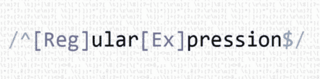

# JavaScript 正则表达式——你需要知道的重要正则表达式

> 原文：<https://www.edureka.co/blog/javascript-regex/>

从文本中解析和提取数据或者验证文本的特定模式是编程中的一个重要需求。 [JavaScript](https://www.edureka.co/javascript-jquery-training) 使用正则表达式来描述字符模式。这篇 **JavaScript Regex** 文章将按以下顺序列出使用表达式的不同方法:

*   [什么是正则表达式？](#regex)
*   [JavaScript 正则表达式](#javascriptregex)
*   [修饰词](#modifiers)
*   [括号](#brackets)
*   [元字符](#metacharacters)
*   [量词](#quantifiers)
*   [对象属性](#properties)
*   [方法](#methods)

## **什么是正则表达式？**

一个**正则表达式**是一个构建搜索模式的字符序列。当您在文本中搜索数据时，您可以使用这种搜索模式来描述您要查找的内容。



正则表达式可以是一个**单字符**或者更复杂的模式。它可用于任何类型的文本搜索和文本替换操作。正则表达式模式由简单字符组成，比如/abc/，或者简单字符和特殊字符组合，比如 **/ab*c/** 或 **/example(d+)。d*/。**

## **JavaScript 正则表达式**

在 [JavaScript](https://www.edureka.co/blog/javascript-tutorial/) 中，正则表达式是描述字符模式的对象。 [JavaScript](https://free-javascript-editor.soft112.com/) **RegExp** 类表示正则表达式，String 和 RegExp 都定义方法。它使用正则表达式对文本执行**模式匹配**和**搜索和替换**功能。

**语法:**

使用 **RegExp ()** 构造函数将正则表达式定义为:

```

var pattern = new RegExp(pattern, attributes);

```

或者只是

```

var pattern = /pattern/attributes;

```

这里，

*   **Pattern–**指定正则表达式或另一个正则表达式的模式的字符串。
*   **Attributes–**可选字符串，包含指定全局、不区分大小写和多行匹配的属性。

使用 JavaScript 正则表达式有不同的方法。所以让我们继续，看看不同的表达方式。

## **修饰词**

修饰符用于执行**不区分大小写的**和**全局**搜索。

| 修改 | **描述** |
| **g** | 它执行全局匹配 |
| **我** | 这将执行任何不区分大小写的匹配 |
| **m** | 它执行多行匹配 |

让我们举个例子，看看这些修饰符是如何在 JavaScript 中使用的。

**g** **修改:**

```

let str = "This is the example";
let pattern = /is/g;

```

**输出:**

```
is,is
```

**我修改:**

```

let str = "Welcome to Edureka";
let pattern = /edureka/i;

```

**输出:**

```
Edureka
```

**m** **修改:**

```

var str = "nthe dog ran after nthe cat";
var patt1 = /^the/m;

```

**输出:**

```
the
```

## **括号**

括号用于查找一个**范围的字符。**

| **表情** | **描述** |
| **【ABC】** | 它查找括号之间的任何字符 |
| **【^abc】** | 它查找不在括号内的任何字符 |
| **【0-9】** | 这将查找括号之间的任何数字 |
| **【^0-9】** | 它查找不在括号内的任何非数字 |

**举例:**

```

var str = "Edureka Online 123";
var ex1 = /[e]/gi;    //[abc]
var ex2 = /[^e]/gi;   //[^abc]
var ex3 = /[2]/g;      //[0-9]
var ex4 = /[^2]/g;     //[^0-9]

```

**输出:**

```
E,e,e
d,u,r,k,a,O,n,l,i,n,1,2,3
2
E,d,u,r,e,k,a,O,n,l,i,n,e,1,3
```

## **元字符**

元字符是具有特殊含义的字符。

| **元字符** | **描述** |
| **w** | 它寻找一个单词字符 |
| **W** | 它找到一个非单词字符 |
| **d** | 它找到一个数字 |
| **D** | 它找到一个非数字字符 |
| **s** | 它找到一个空白字符 |
| **S** | 它会找到一个非空白字符 |
| **b** | 它在单词的开头/结尾找到匹配项 |
| **B** | 它寻找匹配，但不是在单词的开头/结尾 |
| **f** | 它找到一个换页符 |
| **r** | 它找到一个回车符 |
| **v** | 它会找到一个垂直制表符 |
| **t** | 它会找到一个制表符 |

让我们举个例子来看看这些**元字符**是如何使用的:

```

var str = "100% Genuine";
var pattern1 = /w/g;
var pattern2 = /W/g;
var pattern2 = /d/g;
var pattern2 = /D/g;
var pattern2 = /s/g;
var pattern2 = /S/g;

```

**输出:**

```
1,0,0,G,e,n,u,i,n,e
%
1,0,0
%,G,e,n,u,i,n,e
```

```
1,0,0,%,G,e,n,u,i,n,e
```

## **量词**

| **量词** | **描述** |
| **n+** | 它匹配任何包含至少一个 n 的字符串 |
| **n*** | 它匹配任何包含零个或多个 n 的字符串 |
| **n？** | 它匹配任何包含零个或一个 n 的字符串 |
| **n{X}** | 它匹配任何包含 X n 序列的字符串 |
| **n{X，Y}** | 它匹配任何包含 X 到 Y n 序列的字符串 |
| **n{X，}** | 它匹配任何包含至少 X 个 n 的序列的字符串 |
| **n$** | 它匹配任何以 n 结尾的字符串 |

我们举个例子来看看这些**量词**是怎么用的:

```

var str = "Hello, welcome to edureka! 1 12 123";
var quant1 = /e+/g;
var quant2 = /el*/g;
var quant3 = /1?/g;
var quant4 = /d{2}/g;

```

**输出:**

```
e,e,e,e,e
ell,el,e,e,e
,,,,,,,,,,,,,,,,,,,,,,,,,,,1,,1,,,1,,,
12,12
```

## **对象属性**

| **属性** | **描述** |
| **构造器** | 返回创建 RegExp 对象原型的函数 |
| **全局** | 检查是否设置了“g”修饰符 |
| **忽略案例** | 检查是否设置了“I”修饰符 |
| **lastIndex** | 指定开始下一个匹配的索引 |
| **multiline** | 检查是否设置了“m”修饰符 |

让我们举个例子来看看这些**对象属性**是如何使用的:

```

var pattern1 = new RegExp("Welcome to Edureka", "g");
var result1 = pattern1.constructor;
var str = "Hello World!";
var pattern2 = /Wor/g;
var result2 = pattern2.global;
var pattern3 = /hel/i;
var result3 = pattern3.ignoreCase;

```

**输出:**

```
function RegExp() { [native code] }
true
true
```

## **对象方法**

| **方法** | **描述** |
| **编译()** | 它编译一个正则表达式 |
| **exec()** | 它测试字符串中的匹配项并返回第一个匹配项 |
| **测试()** | 它测试字符串中的匹配，并返回 true 或 false |
| **toString()** | 它返回正则表达式的字符串值 |

**exec()**T2【方法:

```

var str = "Edureka online courses";
var method1 = new RegExp("e");
var result = method1.exec(str);

```

**输出:**

```
e
```

**测试()方法**:

```

var str = "Edureka online courses";
var method1 = new RegExp("e");
var result = method1.exec(str);

```

**输出:**

```
true
```

**toString()**方法 :

```

<span>var method2 = new RegExp("Welcome to edureka", "g");</span>
<span>var result = method2.toString();</span>

```

**输出:**

```
/Welcome to edureka/g
```

这些是定义 **JavaScript Regex** 的不同方法。说到这里，我们的文章就到此为止了。我希望你理解了什么是 JavaScript 正则表达式以及定义表达式的不同方法。

*既然你已经了解了 JavaScript 函数，那就去看看 Edureka 的 **[Web 开发认证培训](https://www.edureka.co/complete-web-developer)** 。* *Web 开发认证培训将帮助您学习如何使用 HTML5、CSS3、Twitter Bootstrap 3、jQuery 和 Google APIs 创建令人印象深刻的网站，并将其部署到亚马逊简单存储服务(S3)。*

*有问题吗？请在“JavaScript Regex”的评论部分提到它，我们会回复您。*