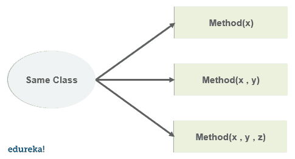
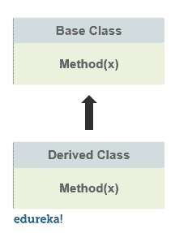

# 方法重载和重写有什么区别？

> 原文：<https://www.edureka.co/blog/method-overloading-and-overriding-in-java/>

说到[面向对象编程](https://www.edureka.co/blog/object-oriented-programming/)，Java 编程语言是最好的选择。有了[类](https://www.edureka.co/blog/java-objects-and-classes/)、[对象](https://www.edureka.co/blog/java-tutorial/#obj)、[继承、](https://www.edureka.co/blog/inheritance-in-java/) [多态性](https://www.edureka.co/blog/polymorphism-in-java/)等概念，使用 [Java](https://www.edureka.co/java-j2ee-training-course) 就变得极其容易。易于访问和简单的语法使得代码更高效，也不太复杂。在本文中，我们将学习 Java 中的方法重载和覆盖。以下是本博客讨论的主题:

*   [什么是 Java 中的方法重载？](#overloading)
*   [为什么方法重载？](#need)
*   [方法重载示例](#overloadingexample)
*   什么是方法重写？
*   [方法覆盖规则](#rules)
*   [方法覆盖示例](#overridingexample)
*   [重载与重写:方法重载与方法重写的区别](#keydifferences)

## **什么是 Java 中的方法重载？**

方法重载允许方法具有相同的名称，但根据参数或参数类型的不同而不同。这可能与编译时多态性有关。以下是在 Java 中重载方法时我们必须记住的几点。

*   我们不能支配一个返回类型。

*   尽管我们可以重载[静态方法](https://www.edureka.co/blog/static-keyword-in-java/)，但参数或输入参数必须不同。

*   如果两个方法只有一个静态关键字不同，我们就不能重载它们。

*   像其他静态方法一样，main()方法也可以被重载。



让我们看一个简单的程序来理解 python 中方法重载的工作原理。

```
public class Div{
public int div(int a , int b){
         return (a / b); }

public int div(int a , int b , int c){
         return ((a + b ) / c); }

public static void main(String args[]){
Div ob = new Div();
ob.div(10 , 2);
ob.div(10, 2 , 3);
}
}

```

```
Output:  5 
         4
```

在上面的程序中，我们有两个同名但参数不同的方法。这就是方法重载在 [Java](https://www.edureka.co/blog/java-tutorial/) 中的工作方式。

## **为什么方法重载？**

在 Java 中使用方法重载的主要优点是，它给了我们自由，不用为做同一件事而一次又一次地定义一个函数。在下面的例子中，这两个方法基本上是在执行除法，所以我们可以有名称相同但参数不同的不同方法。这也有助于编译时的多态性。

**重载 main()方法:**

下面是一个在 java 中使用 main_)方法的例子。

```
public class Edureka{
public static void main(String[] args){
System.out.println("hello");
Edureka.main("edurekan");
}

public static void main(String arg1){
System.out.println(" welcome" + arg1);
Edureka.main("welcome" , "to edureka");
}

public static void main(String arg1 , String arg2){
System.out.println("hello" , +arg1 , +arg2);
}
}

```

```
Output: hello welcome edurekan
        hello, welcome to edureka
```

## **方法重载示例**

*   **用 java 编写重载静态方法的程序。**

```
public class Test{
public static int func(int a ){
       return 100;
}
public static char func(int a , int b){
      return "edureka";
}
public static void main(String args[]){
System.out.println(func(1));
System.out.println(func(1,3));
}
}

```

```
Output: 100
        edureka
```

*   **程序重载三个同名的方法。**

```
public class Add{
public int add(int a , int b){
       return (a + b);
}
public int add(int a , int b , int c){
       return (a + b + c) ;
}
public double add(double a , double b){
       return (a + b);
}
public static void main( String args[]){
Add ob = new Add();
ob.add(15,25);
ob.add(15,25,35);
ob.add(11.5 , 22.5);
}
}

```

```
Output: 40
        75
        34
```

## **Java 中什么是方法重写？**

java 中的继承涉及父类和子类之间的关系。每当两个类都包含具有相同名称和参数的方法时，可以肯定的是，其中一个方法将在执行过程中覆盖另一个方法。将要执行的方法取决于对象。

如果子类对象调用方法，子类方法将覆盖父类方法。否则，如果父类对象调用该方法，将执行父类方法。

方法覆盖也有助于在 java 中实现运行时多态性。让我们举一个简单的例子来理解方法覆盖在 java 中是如何工作的。



```
class Parent{
void view(){
System.out.println("this is a parent class method);
}}
class Child extends Parent{
void view(){
System.out.println("this is a child class method);
}}
public static void main(String args[]){
Parent ob = new Parent();
ob.view();
Parent ob1 = new Child();
ob1.view();

```

```
Output: this is a child class method
```

## **方法覆盖规则**

*   [访问修饰符](https://www.edureka.co/blog/access-modifiers-in-java/)只能允许被覆盖方法的更多访问。

*   一个 [final](https://www.edureka.co/blog/final-finally-and-finalize-in-java/) 方法不支持方法覆盖。

*   静态方法不能被重写。

*   私有方法不能被重写。

*   重写方法的返回类型必须相同。

*   我们可以使用 super 关键字在重写方法中调用父类方法。

*   不能覆盖[构造函数](https://www.edureka.co/blog/constructor-in-java/)，因为子类和父类不能有同名的构造函数。

## **方法覆盖示例**

*   **程序使用超级关键字**显示覆盖

```
class Parent {
void show(){
System.out.println("parent class method");
}
class Child extends Parent {
void show(){
super.show();
System.out.println("child class method");
}
public static void main(String args[]){
Parent ob = new Child();
ob.show();
}
}

```

```
Output: parent class method
        child class method
```

## **重载 vs 重写:方法重载和方法重写的区别**

下面是 Java 中方法重载和重写的主要区别。

| **方法重载** | **方法覆盖** |
| 

*   It is used to increase the readability of the program.

 | 

*   Provides information that is already in the parent class

中的方法的具体实现 |
| 

*   It's in the same class

内进行的 | 

*   It involves multiple classes.

 |
| 

*   Parameters must be different to prevent overload.

 | 

*   Parameters must be the same to prevent overwriting.

 |
| 

*   Is an example of compile-time polymorphism.

 | 

*   This is an example of runtime polymorphism.

 |
| 

*   The types of returns can be different, but you must also change the parameters.

 | 

*   Covering

时返回类型必须相同 |
| 

*   Static methods can be overloaded.

 | 

*   Overrides do not involve static methods.

 |

在这篇博客中，我们已经详细讨论了方法重载和方法覆盖。随着类、对象以及继承和多态等概念的引入，清楚地理解 java 中重载或覆盖方法的含义变得相当重要。

如果你刚刚开始，那么看看这篇 Java 教程，了解基本的 Java 概念。

[https://www.youtube.com/embed/aqHhpahguVY](https://www.youtube.com/embed/aqHhpahguVY)

Java 编程语言是面向对象编程的巅峰，它包含了许多应用程序。随着需求和流行，一个有抱负的 java 开发人员必须精通编程语言的基本概念。注册 Edureka 的 [Java 认证](https://www.edureka.co/java-j2ee-training-course)计划，开始您的学习。

有问题要问我们吗？请在本文“java 中的方法重载和方法重写”的评论部分提到这一点，我们会尽快回复您。