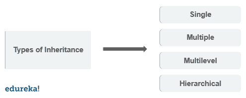

# Python 中的继承及示例:您需要知道的一切

> 原文：<https://www.edureka.co/blog/inheritance-in-python/>

[Python 编程语言](https://www.edureka.co/blog/python-programming-language)很容易学习，并且同时适用于过程式和[面向对象编程](https://www.edureka.co/blog/object-oriented-programming-python/)方法。继承是面向对象编程中的一个概念。代码可重用性是继承的强项，当我们在 Python 上工作时，它在很多应用程序中都有帮助。以下是本文中讨论的概念:

*   [什么是继承？](#whatisinheritance)
*   [初始化函数](#init)
*   [继承的类型](#types)
    *   [单一继承](#single)
    *   [多重继承](#multiple)
    *   [多级继承](#multilevel)
    *   [层次继承](#hierarchial)
    *   [混合遗传](#hybrid)
*   [Python 超级()函数](#super)
*   [Python 方法覆盖](#overriding)

## **什么是继承？**

将父类[的属性继承到子类](https://www.edureka.co/blog/python-class/)的方法称为继承。这是一个面向对象的概念。下面是继承的好处。

1.  代码可重用性——我们不必一次又一次地编写相同的代码，我们可以在子类中继承我们需要的属性。

2.  它代表了父类和子类之间的真实关系。

3.  它在本质上是可传递的。如果子类从父类继承属性，那么子类的所有其他子类也将继承父类的属性。

下面是 python 中一个简单的继承例子。

```

class Parent():
       def first(self):
           print('first function')

class Child(Parent):
       def second(self):
          print('second function')

ob = Child()
ob.first()
ob.second()

```

```
Output: first function
second function
```

在上面的程序中，您可以使用子类对象来访问父类函数。

### **子分类**

通过在子类的声明中提到父类名来调用父类的构造函数称为子类化。子类通过子类化来识别它的父类。

## **__init__()函数**

__init__()函数在每次使用类创建对象时被调用。当我们在父类中添加 __init__()函数时，子类将不再能够继承父类的 __init__()函数。子类的 __init__()函数覆盖父类的 __init__()函数。

```
class Parent:
     def __init__(self , fname, fage):
          self.firstname = fname
          self.age = fage
     def view(self):
         print(self.firstname , self.age)
class Child(Parent):
     def __init__(self , fname , fage):
          Parent.__init__(self, fname, fage)
          self.lastname = "edureka"
     def view(self):
          print("course name" , self.firstname ,"first came",  self.age , " years ago." , self.lastname, " has courses to master python")
ob = Child("Python" , '28')
ob.view()

```

## **继承的种类**

根据所涉及的子类和父类的数量，python 中有四种类型的继承。



## **单继承**

当子类只继承一个父类时。

```
class Parent:
     def func1(self):
          print("this is function one")
class Child(Parent):
     def func2(self):
          print(" this is function 2 ")
ob = Child()
ob.func1()
ob.func2()

```

## **多重继承**

当子类从多个父类继承时。

```
class Parent:
   def func1(self):
        print("this is function 1")
class Parent2:
   def func2(self):
        print("this is function 2")
class Child(Parent , Parent2):
    def func3(self):
        print("this is function 3")

ob = Child()
ob.func1()
ob.func2()
ob.func3()

```

## **多级遗传**

当一个子类成为另一个子类的父类时。

```
class Parent:
      def func1(self):
          print("this is function 1")
class Child(Parent):
      def func2(self):
          print("this is function 2")
class Child2(Child):
      def func3("this is function 3")
ob = Child2()
ob.func1()
ob.func2()
ob.func3()

```

## **分层继承**

分层继承涉及来自同一个基类或父类的多重继承。

```
 class Parent:
      def func1(self):
          print("this is function 1")
class Child(Parent):
      def func2(self):
          print("this is function 2")
class Child2(Parent):
      def func3(self):
          print("this is function 3")

ob = Child()
ob1 = Child2()
ob.func1()
ob.func2()

```

## **杂交遗传**

混合继承涉及在单个程序中发生的多重继承。

```

class Parent:
     def func1(self):
         print("this is function one")

class Child(Parent):
     def func2(self):
         print("this is function 2")

class Child1(Parent):
     def func3(self):
         print(" this is function 3"):

class Child3(Parent , Child1):
     def func4(self):
         print(" this is function 4")

ob = Child3()
ob.func1()

```

## **Python 超级()函数**

超级函数允许我们从父类调用一个方法。

```

class Parent:
     def func1(self):
         print("this is function 1")
class Child(Parent):
     def func2(self):
          Super().func1()
          print("this is function 2")

ob = Child()
ob.func2()

```

## **Python 方法覆盖**

**方法覆盖**

您可以在 python 中重写方法。看看下面的例子。

```

class Parent:
    def func1(self):
        print("this is parent function")

class Child(Parent):
    def func1(self):
        print("this is child function")

ob = Child()
ob.func1()

```

父类方法的功能通过在子类中重写相同的方法来改变。

继承是面向对象的最重要的概念之一。它提供了代码的可重用性、可读性和属性转换，这有助于优化和高效的代码构建。Python 编程语言加载了继承之类的概念。在最近的市场上，巨大的 python 应用程序需要越来越多的 python 程序员。要掌握技能并开始学习，请注册 Edureka 的 [python 认证](https://www.edureka.co/python-programming-certification-training)计划，立即成为 python 开发人员。

*有什么问题吗？在评论区提到它们。我们的团队会尽快回复您。*