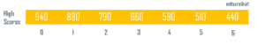
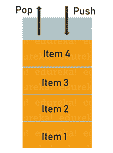
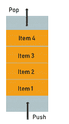
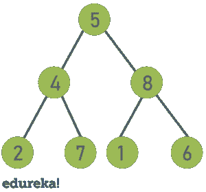
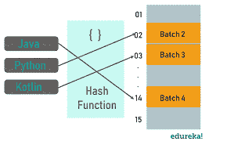

# 你需要知道的 Java 顶级数据结构和算法

> 原文：<https://www.edureka.co/blog/data-structures-algorithms-in-java/>

如果我必须选择软件开发中最重要的一个话题，那就是数据结构和算法。你可以把它看作是每个计算机程序员都可以使用的基本工具。在编程时，我们使用 ***数据结构*** 来存储和组织数据，使用 ***算法*** 来操作这些结构中的数据。这篇文章包含了对 Java[中所有常见数据结构和算法的详细回顾，以使读者有充分的准备。](https://www.edureka.co/blog/java-tutorial/)

下面列出了本文中讨论的主题:

*   [Java 中的数据结构](#datastructures)
    *   [线性数据结构](#linear)
    *   [分层数据结构](#hierarchical)
*   [Java 中的算法](#algorithms)
    *   [排序算法](#Sort)
    *   [搜索算法](#Search)

## **Java 中的数据结构**

***数据结构是一种在计算机中存储和组织数据的方式，以便可以有效地使用。它提供了一种有效管理大量数据的方法。高效的数据结构是设计高效算法的关键。***

在这篇“Java 中的数据结构和算法”文章中，我们将介绍基本的数据结构，例如:

*   线性数据结构
    *   [链表](#linkedlist)
    *   [堆栈](#stack)
    *   [队列](#queue)

*   分层数据结构
    *   [二叉树](#tree)
    *   [堆](#heap)
    *   [哈希表](#hash)

让我们逐一了解一下。

### **Java 中的线性数据结构**

在 [Java](https://www.edureka.co/blog/java-tutorial/) 中的线性数据结构是那些元素是连续的，并且以这样的方式排序:只有一个*第一个元素*并且只有一个*下一个元素*，只有一个*最后一个元素*并且只有一个*前一个元素*，而所有其他元素都有一个*下一个*和一个*前一个*元素。

### **数组**

一个[数组](https://www.edureka.co/blog/java-array/)是一个线性数据结构，代表一组相似的元素，通过索引访问。在存储数据之前，必须提供数组的大小。下面列出了数组的属性:

*   数组中的每个元素都具有相同的数据类型和大小
*   数组的元素存储在连续的存储位置，第一个元素从最小的存储位置开始
*   数组的元素可以被随机访问
*   数组数据结构不是完全动态的



***例如*** ，我们可能想要一个视频游戏来记录该游戏的前十名得分。在这项任务中，我们可以用一个名字代表整个小组，并用指数来表示该小组中的高分，而不是使用十个不同的[变量](https://www.edureka.co/blog/instance-variable-in-java/)。

### **链表**

一个[链表](https://www.edureka.co/blog/linked-list-in-java/)是一个包含多个节点的线性数据结构，其中每个元素存储自己的数据和一个指向下一个元素位置的指针。链表中的最后一个链接指向 null，表示链的结束。链表中的一个元素称为**节点** 。第一个节点叫做 **头**。最后一个节点叫做**尾**。

**链表的类型**

单向链表(单向)


双向链表(双向)


循环链表


***这里有一个简单的例子:*** 想象一个链表就像一串连接在一起的回形针。您可以轻松地在顶部或底部添加另一个回形针。中间插一个甚至很快。你所要做的就是从中间断开链条，装上新的回形针，然后重新连接另一半。链表也是类似的。

### **堆栈**

栈，一种抽象的数据结构，是按照的原则插入和取出的[对象](https://www.edureka.co/blog/java-objects-and-classes/)的集合。可以在任何时间点将对象插入到堆栈中，但是任何时候都只能移除最近插入的(即“最后一个”)对象。下面列出了堆栈的属性:



*   这是一个只能在一端进行插入和删除的有序列表，称为 *顶端*
*   指针指向其顶部元素的递归数据结构
*   遵循**【后进先出】的原则**
*   支持两种最基本的方法
    *   push(e):将元素 e 插入堆栈的顶部
    *   pop():移除并返回栈顶元素

栈的实际例子包括反转一个单词时、检查、和括号序列的正确性、在浏览器中实现后退功能等等。

### **队列**

[](https://www.edureka.co/blog/java-collections/#queue)队列也是另一种类型的抽象数据结构。与堆栈不同，队列是根据 ***先进先出(FIFO)*** 原则插入和移除的对象的集合。也就是说，可以在任何时间点插入元素，但是任何时候都只能删除队列中时间最长的元素。下面列出的是队列的属性:



*   通常称为*先进先出*列表
*   支持两种最基本的方法
    *   enqueue(e):在队列的*后面*插入元素 e
    *   dequeue():从队列的*前端*移除并返回元素

队列用于两个进程之间的异步数据传输、CPU 调度、磁盘调度以及其他多用户共享资源并基于先到先服务的情况。接下来，在这篇“Java 中的数据结构和算法”文章中，我们将介绍分层数据结构。

### **Java 中的分层数据结构**

### **二叉树**

二叉树是一种层次树形数据结构，其中*每个节点最多有两个子节点*，分别称为*左子节点*和*右子节点*。每个二叉树有以下节点组:

*   根节点:它是最顶层的节点，通常被称为主节点，因为所有其他节点都可以从根节点到达
*   左边的子树，也是二叉树
*   右子树，也是二叉树



下面列出了二叉树的属性:

*   二叉树有两种遍历方式:
    *   *深度优先遍历*:按序(左根-右)、前序(根-左-右)和后序(左-右根)
    *   *广度优先遍历*:层次顺序遍历
*   树遍历的时间复杂度:O(n)
*   级别“l”的最大节点数= 2 <sup>l-1</sup> 。

二叉树的应用包括:

*   在许多数据不断进出的搜索应用程序中使用
*   作为为视觉效果合成数字图像的工作流程
*   几乎在每个高带宽路由器中使用，用于存储路由表
*   也用于无线网络和内存分配
*   用于压缩算法和许多其他算法

### **二进制堆**

二叉堆是一棵完整的二叉树，它回答了堆的性质。简单来说，它是一个二叉树的变体，具有以下属性:

*   *Heap 是一棵完全二叉树:*如果一棵树的所有层次都是完全的，除了可能最深的层次之外，则称该树是完全的。T 他的二进制堆的属性使得它适合存储在一个[数组](https://www.edureka.co/blog/java-arraylist/)中。
*   *遵循堆属性:*二进制堆或者是*最小堆*或者是*最大堆*。
    *   最小二进制堆:F 或堆中的每个节点，节点的值 *小于或等于子节点的* 值
    *   Max Binary Heap: F 或者一个堆中的每个节点，该节点的值 *大于等于其子节点的* 值

二进制堆的流行应用包括实现高效的优先级队列，高效地找到数组中 k 个最小(或最大)的元素等等。

### **哈希表**

假设您有一个[对象](https://www.edureka.co/blog/java-objects-and-classes/),您想为它分配一个键以使搜索变得非常容易。要存储键/值对，可以使用一个简单的数组，比如数据结构，其中键(整数)可以直接用作存储数据值的索引。但是，如果键太大，不能直接用作索引，就要使用一种叫做散列的技术。

在散列法中，通过使用  **散列函数**将大密钥转换成小密钥。这些值随后被存储在一个叫做**散列表的数据结构中。** 哈希表是实现字典 ADT 的数据结构，这种结构可以将唯一的键映射到值。



通常，哈希表有两个主要组成部分:

1.  ***桶数组:*** 哈希表的桶数组是一个大小为 N 的数组 A，其中 A 的每个单元格都被认为是一个“桶”，即键值对的集合。整数 N 定义了数组的容量。
2.  ***Hash 函数:*** 它是将我们映射中的每个键 k 映射到范围[0，n1]内的一个整数的任何函数，其中 N 是这个表的桶数组的容量。

当我们将对象放入哈希表时，不同的对象可能有相同的哈希值。这叫做 **碰撞** 。为了处理冲突，有像链接和开放寻址这样的技术。

这些是 Java 中最基本和最常用的数据结构。现在你已经意识到了这些，你可以开始在你的 Java 程序中实现它们了。至此，我们已经完成了“Java 中的数据结构和算法”这篇文章的第一部分。在下一部分，我们将学习的基本算法以及如何在实际应用中使用它们，例如排序和搜索、分治、贪婪算法、动态规划。

## **Java 中的算法**

历史上，算法被用作解决复杂数学计算的工具，它与计算机科学，尤其是数据结构有着密切的联系。*算法是* *描述在有限时间内解决特定问题的方法的指令序列。*它们有两种表现方式:

*   ***流程图***——它是一个算法控制流程的可视化表示
*   ***伪代码***–It是近似最终源代码的算法的文本表示

***注:**算法的性能是基于时间复杂度和空间复杂度来衡量的。大多数情况下，任何算法的复杂性都取决于问题和算法本身。*

我们来探讨一下 Java 中的两大类算法，分别是:

*   [Java 中的排序算法](#sort)
*   [Java 中的搜索算法](#search)

### **Java 中的排序算法**

排序算法是将列表中的元素按一定顺序排列的算法。最常用的顺序是数字顺序和词典顺序。在这篇“数据结构和算法”文章中，让我们探索一些排序算法。

**Java 中的冒泡排序**

冒泡排序，通常被称为下沉排序，是最简单的排序算法。它反复遍历要排序的列表，比较每对相邻的元素，如果它们的顺序不对，就交换它们。冒泡排序得名于它过滤掉数组顶部的元素，就像浮在水面上的气泡一样。

下面是代表冒泡排序算法的伪代码(升序排序上下文)。

```
a[] is an array of size N
begin BubbleSort(a[])

declare integer i, j
for i = 0 to N - 1
   for j = 0 to N - i - 1
      if a[j] > a[j+1] then 
         swap a[j], a[j+1]
      end if
   end for
  return a

end BubbleSort

```

这段代码将 N 个数据项的一维数组按升序排序。外部循环在阵列上进行 N-1 遍。每次传递都使用一个内部循环来交换数据项，使得下一个最小的数据项“冒泡”到数组的开头。但问题是，算法需要一次完整的传递，而没有任何交换，才能知道列表已排序。

**最坏和平均情况时间复杂度:** O(n*n)。最坏的情况发生在数组反向排序时。

**最佳情况时间复杂度:** O(n)。最好的情况发生在数组已经排序的时候。

### **Java 中的选择排序**

选择排序是搜索和排序的结合。该算法通过从未排序的部分中重复查找最小元素(考虑升序)并将其放在数组中的适当位置来对数组进行排序。

下面是代表选择排序算法(升序排序上下文)的伪代码。

```
a[] is an array of size N
begin SelectionSort(a[])

 for i = 0 to n - 1
   /* set current element as minimum*/
      min = i    
      /* find the minimum element */
       for j = i+1 to n 
         if list[j] < list[min] then
            min = j;
         end if
      end for
  /* swap the minimum element with the current element*/
      if min != i  then
         swap list[min], list[i]
      end if
   end for

end SelectionSort

```

从代码中可以看出，排序通过数组的次数比数组中的项数少 1。内部循环查找下一个最小值，外部循环将该值放入适当的位置。选择排序从不进行超过 O(n)次的交换，当内存写操作开销很大时会很有用。

时间复杂度: O(n <sup>2</sup> )因为有两个嵌套循环。

**辅助空间:** O(1)。

### **Java 中的插入排序**

插入排序是一种简单的排序算法，它通过一次消耗一个输入元素来遍历列表，并构建最终的排序数组。它非常简单，在较小的数据集上更有效。这是一种稳定的原位排序技术。

下面是代表插入排序算法(升序排序上下文)的伪代码。

```
a[] is an array of size N
begin InsertionSort(a[])

for i = 1 to N
   key = a[ i ]
   j = i - 1
   while ( j >= 0 and a[ j ] > key0
      a[ j+1 ] = x[ j ]
      j = j - 1
   end while
   a[ j+1 ] = key
end for

end InsertionSort

```

从代码中可以看出，插入排序算法从输入数据中删除一个元素，找到它在排序列表中的位置，并将其插入到那里。重复这一过程，直到没有输入元素保持未排序状态。

**最佳情况:**最佳情况是当输入是一个已经排序的数组时。在这种情况下，插入排序具有线性运行时间(即θ(n))。

**最坏情况:** 最简单的最坏情况输入是一个逆序排序的数组。

### **Java 中的快速排序**

Quicksort 算法是一种快速、递归、不稳定的排序算法，采用分治原则。它选取一个元素作为轴心，并围绕该选取的轴心划分给定的数组。

**实现快速排序的步骤:**

1.  挑一个合适的“支点”。
2.  基于这个 pivot 元素将列表分成两个列表。小于 pivot 元素的每个元素都放在左侧列表中，大于 pivot 元素的每个元素都放在右侧列表中。如果一个元素等于 pivot 元素，那么它可以出现在任何列表中。 这叫分区操作。
3.  递归排序每个较小的列表。

这是代表快速排序算法的伪代码。

```
QuickSort(A as array, low as int, high as int){
    if (low < high){
        pivot_location = Partition(A,low,high)
        Quicksort(A,low, pivot_location)
        Quicksort(A, pivot_location + 1, high)
    }
}
Partition(A as array, low as int, high as int){
     pivot = A[low]
     left = low

     for i = low + 1 to high{
         if (A[i] < pivot) then{
             swap(A[i], A[left + 1])
             left = left + 1
         }
     }
     swap(pivot,A[left])

    return (left)}

```

在上面的伪代码中， *partition()* 函数执行分区操作， *Quicksort()* 函数为每个生成的较小列表重复调用分区函数。快速排序的复杂度在一般情况下是θ(n log(n))在最坏情况下是θ(N2)。

### **Java 中的合并排序**

Mergesort 是一种快速、递归、稳定的排序算法，它也是按照分治原则工作的。与快速排序类似，合并排序将元素列表分为两个列表。这些列表被独立排序，然后被组合。在组合列表的过程中，元素被插入(或合并)到列表中的正确位置。

下面是代表合并排序算法的伪代码。

```
procedure MergeSort( a as array )
   if ( n == 1 ) return a

   var l1 as array = a[0] ... a[n/2]
   var l2 as array = a[n/2+1] ... a[n]

   l1 = mergesort( l1 )
   l2 = mergesort( l2 )

   return merge( l1, l2 )
end procedure

procedure merge( a as array, b as array )

   var c as array
   while ( a and b have elements )
      if ( a[0] > b[0] )
         add b[0] to the end of c
         remove b[0] from b
      else
         add a[0] to the end of c
         remove a[0] from a
      end if
   end while

   while ( a has elements )
      add a[0] to the end of c
      remove a[0] from a
   end while

   while ( b has elements )
      add b[0] to the end of c
      remove b[0] from b
   end while

   return c

end procedure

```

*mergesort()* 函数将列表一分为二，分别对这些列表调用 *mergesort()* ，然后将它们作为参数发送给 merge()函数进行组合。该算法的复杂度为 O(n log (n))，具有广泛的应用。

### **Java 中的堆排序**

Heapsort 是一种基于比较的排序算法二进制堆数据结构。你可以把它看作是改进版的 f 选择排序，其中把它的输入分成一个排序的和一个未排序的区域，它通过提取最大的元素并把它移动到排序的区域来迭代地缩小未排序的区域。

**实现快速排序的步骤(升序):**

1.  用排序数组构建一个最大堆
2.  此时，最大的项存储在堆的根部。用堆的最后一项替换它，并将堆的大小减少 1。最后，填充树根
3.  重复上述步骤，直到堆的大小大于 1

下面是代表堆排序算法的伪代码。

```
Heapsort(a as array)

for (i = n / 2 - 1) to i >= 0
        heapify(a, n, i); 

    for i = n-1 to 0
        swap(a[0], a[i])
        heapify(a, i, 0); 
    end for
end for

heapify(a as array, n as int, i as int)
    largest = i //Initialize largest as root 
    int l eft = 2*i + 1; // left = 2*i + 1 
    int right = 2*i + 2; // right = 2*i + 2 

    if (left < n) and (a[left] > a[largest])
        largest = left

    if (right < n) and (a[right] > a[largest])
        largest = right

    if (largest != i)
        swap(a[i], A[largest])
        Heapify(a, n, largest)
end heapify

```

除此之外，还有其他一些不太为人所知的排序算法，如 Introsort、Counting Sort 等。继续这篇“数据结构和算法”文章的下一组算法，让我们探索搜索算法。

### **Java 中的搜索算法**

搜索是常规业务应用程序中最常见和最频繁执行的操作之一。搜索算法是用于在项目集合中查找具有指定属性的项目的算法。让我们探索两种最常用的搜索算法。

### **Java 中的线性搜索算法**

线性搜索或顺序搜索是最简单的搜索算法。它包括在给定的数据结构中顺序搜索一个元素，直到找到该元素或到达该结构的末尾。如果找到了元素，则返回该项的位置，否则算法返回 NULL。

下面是代表 Java 中线性搜索的伪代码:

```
procedure linear_search (a[] , value)
for i = 0 to n-1
   if a[i] = value then
      print "Found " 
      return i
   end if
print "Not found"
end for

end linear_search
```

是一个蛮力算法。 虽然它肯定是最简单的，但它肯定不是最常见的，因为它效率低下。线性搜索的时间复杂度为 *O(N)* 。

### **Java 中的二分搜索法算法**

二分搜索法，也称为对数搜索，是一种在已经排序的数组中查找目标值位置的搜索算法。它将输入集合分成相等的两半，并将条目与列表的中间元素进行比较。如果找到了元素，搜索就在这里结束。否则，我们继续寻找元素，根据目标元素是小于还是大于中间的元素，划分并选择数组的适当分区。

下面是用 Java 表示二分搜索法的伪代码:

```
Procedure binary_search
   a; sorted array
   n; size of array
   x; value to be searched

    lowerBound = 1
    upperBound = n 

   while x not found
      if upperBound < lowerBound 
         EXIT: x does not exists.

      set midPoint = lowerBound + ( upperBound - lowerBound ) / 2

      if A[midPoint] < x set lowerBound = midPoint + 1 if A[midPoint] > x
         set upperBound = midPoint - 1 

      if A[midPoint] = x 
         EXIT: x found at location midPoint
   end while

end procedure
```

当上限(我们的指针)经过下限(最后一个元素)时，搜索终止，这意味着我们已经搜索了整个数组，并且该元素不存在。它是最常用的搜索算法，主要是因为它的搜索时间快。二分搜索法的时间复杂度为 *O(N)* ，这是对线性搜索的 *O(N)* 时间复杂度的显著改进。

“Java 中的数据结构和算法”这篇文章到此结束。我已经介绍了 Java 最基本也是最重要的主题之一。 希望你清楚本文与你分享的一切。

***确保你尽可能多的练习，恢复你的经验。***

*查看 Edureka 提供的 [**Java 课程**](https://www.edureka.co/java-j2ee-training-course) 培训，edu reka 是一家值得信赖的在线学习公司，在全球拥有超过 250，000 名满意的学习者。我们在这里帮助你的旅程中的每一步，为了成为一个除了这个 java 面试问题，我们提出了一个课程，这是为学生和专业人士谁想要成为一个 Java 开发人员设计的。*

*有问题吗？请在这篇“Java 中的数据结构和算法”* *文章的评论部分提到它，我们会尽快回复您。*