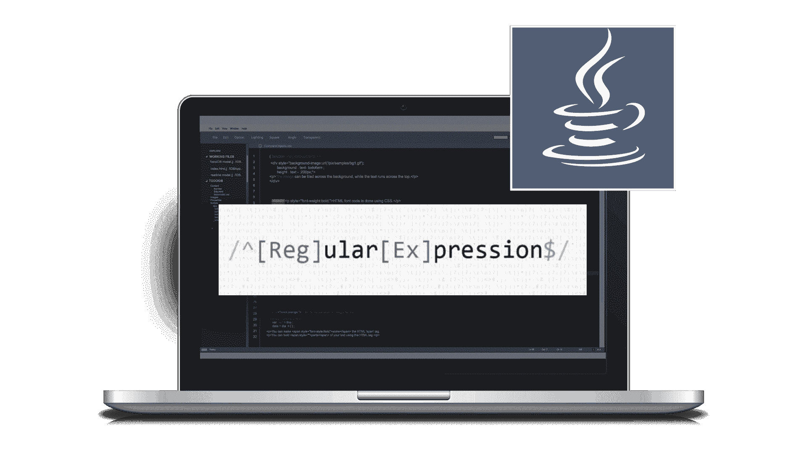

# 什么是正则表达式，如何使用它？

> 原文：<https://www.edureka.co/blog/java-regex/>

数据提取或验证是每种编程语言的一个重要方面。数据验证最流行的方法之一是使用正则表达式。Java 使用这些正则表达式来描述字符模式。本文关于 **Java Regex** 将按以下顺序列出使用表达式的各种方法:

*   [什么是正则表达式？](#WhatareRegularExpressions?)
*   [什么是 Java Regex？](#JavaRegex)
*   [匹配器类](#MatcherClass)
*   [模式类别](#PatternClass)
*   [正则表达式字符类](#RegexCharacterClass)
*   [正则表达式量词](#RegexQuantifiers)
*   [正则表达式元字符](#RegexMetacharacters)

我们开始吧！

## **什么是正则表达式？**

*正则表达式* 是构成搜索模式的字符序列。当您在文本中搜索数据时，您可以使用这种搜索模式来描述您要查找的内容。



正则表达式可以是一个  单个字符或更复杂的模式。它可用于任何类型的文本搜索和文本替换操作。正则表达式模式由简单字符组成，比如 */abc/* ，或者简单和特殊字符组合，比如 */ab*c/* 或者 */example(d+)。d*/* 。

## **什么是 Java Regex？**

*Java Regex* 是一个 API，用于  *定义搜索或操作[字符串](https://www.edureka.co/blog/cheatsheets/java-string-cheat-sheet/)* 的模式。它广泛用于定义对字符串的约束，如密码和电子邮件验证。

使用 Java 正则表达式有不同的方法。所以让我们继续，看看不同的表达方式。

### **匹配器类**

这个类用于对字符序列执行匹配操作。下表显示了 Matcher 类的各种方法。

| 方法 | **描述** |
| *布尔匹配()* | 测试给定的正则表达式是否与模式匹配 |
| *布尔查找()* | 用于查找下一个匹配模式的表达式 |
| *布尔查找(int start)* | 从给定的起始数字开始搜索下一个与模式匹配的表达式 |
| *字符串组()* | 用于返回匹配的子序列 |
| *int start()* | 返回匹配子序列的起始索引 |
| *int end()* | 返回匹配子序列的结束索引 |
| *int groupCount()* | 返回匹配子序列的总数 |

## **模式类别**

模式类是正则表达式的编译版本，用于定义 regex 引擎的模式。

| **方法** | 描述 |
| *静态模式编译(字符串正则表达式)* | 它编译给定的正则表达式并返回模式的实例 |
| *匹配(序列输入)* | 它用于创建一个匹配器，将给定的输入与模式进行匹配 |
| *静态布尔匹配(字符串正则表达式，字符序列输入)* | 它结合了编译和匹配方法。它编译正则表达式并将给定的输入与模式进行匹配 |
| *String[] split(CharSequence 输入)* | 用于根据给定模式的匹配项分割给定的输入字符串 |
| *字符串模式()* | 帮助返回正则表达式模式 |

现在我们举一个小例子来理解如何写正则表达式。

```
import java.util.regex.*;
  public class RegexExample{
    public static void main (String[] args){
       Pattern pattern = Pattern.compile(".xx.");
       Matcher matcher = pattern.matcher("AxxB");
       System.out.println("String matches the given Regex - +matcher.matches());
   }
}
```

在这种情况下，它在内部使用模式和匹配器 [Java](https://www.edureka.co/blog/what-is-java/) regex 类来进行处理，但是显然，它减少了代码行。Pattern 类还包含 matches 方法，该方法将 regex 和输入字符串作为参数，并在匹配它们后返回一个布尔结果。因此，这段代码可以很好地匹配输入字符串[和 Java 中的正则表达式](https://www.edureka.co/blog/java-string/)。因此，输出将为真，如下所示。

**输出:**

现在让我们再来看几类 Java 正则表达式。

## **正则表达式字符类**

下表代表了不同的字符类组合。

| 字符类 | 描述 |
| *【ABC】* | a、b 或 c(简单类) |
| *【^abc】* | 除 a、b 或 c 以外的任何字符(否定) |
|  | A 到 Z 或 A 到 Z，包括端点(范围) |
| *【a-d[m-p]】* | a 到 d，或 m 到 p: [a-dm-p](联合) |
| *【a-z&T3【def】]* | d、e 或 f(交叉口) |
| *【a-z&【^bc】]* | a 到 z，除了 b 和 c:【ad-z】(减法) |
| *【a-z&【^m-p】]* | a 到 z，而不是 m 到 p: [a-lq-z](减法) |

**举例:**

```
import java.util.regex.*;
  public class CharacterExample{
    public static void main(String args[]){     
      //false (not x or y or z)
      System.out.println(Pattern.matches("[xyz]", "wbcd"));
      //true (among x or y or z)
      System.out.println(Pattern.matches("[xyz]", "x"));
      //false (x and y comes more than once)
      System.out.println(Pattern.matches("[xyz]", "xxyyyyyz"));
    }
}
```

## **正则表达式量词**

量词指定一个字符出现的次数。下表表示各种量词。

| 正则表达式 | 描述 |
| *X？* | x 出现一次或根本不出现 |
| *X+* | x 出现一次或多次 |
| *X** | x 出现零次或多次 |
| *X{n}* | x 只出现 n 次 |
| *X{n，}* | x 出现 n 次或更多次 |
| *X{y，z}* | x 至少出现 y 次，但少于 z 次 |

**举例:**

```
import java.util.regex.*;
   public class Example{
     public static void main(String args[]){
       System.out.println("? quantifier ....");

       //(a or y or z comes one time)
       System.out.println(Pattern.matches("[ayz]?", "a")); //output: true
       System.out.println(Pattern.matches("[ayz]?", "aaa")); 

       //(a y and z comes more than one time)
       System.out.println(Pattern.matches("[ayz]?", "ayyyyzz")); //output: false

       //(a comes more than one time)
       System.out.println(Pattern.matches("[ayz]?", "amnta")); //output: false

       //(a or y or z must come one time)
       System.out.println(Pattern.matches("[ayz]?", "ay")); //output: false 
       System.out.println("+ quantifier ....");

       //(a or y or z once or more times)
       System.out.println(Pattern.matches("[ayz]+", "a")); //output: true

       //(a comes more than one time)
       System.out.println(Pattern.matches("[ayz]+", "aaa")); //outpu: true

       //(a or y or z comes more than once)
       System.out.println(Pattern.matches([amn]+", "aayyyzz")); //output: true

       //(z and t are not matching pattern)
       System.out.println(Pattern.matches("[ayz]+", "aammta")); //output: false
       System.out.println("* quantifier ....");

       //(a or y or z may come zero or more times)
       System.out.println(Pattern.matches("[ayz]*", "ayyyza")); //output: true
    }
}

```

基本上，它会搜索匹配的量词，并匹配搜索结果。

## **正则表达式元字符**

正则表达式元字符作为短代码工作。让我们看看下表，了解各种类型的元字符。

| 正则表达式 | 描述 |
| *。* | 它可以是任何字符(可能与终止符匹配，也可能不匹配) |
| *d* | 表示除[0-9]以外的任何数字 |
| *D* | 代表任何非数字，是[^0-9]的缩写 |
| *s* | 表示任何空白字符，是[tnx0Bfr]的缩写 |
| *S* | 它可以是非空白字符，是[^s]的缩写 |
| *w* | 可以是单词字符，简称[a-zA-z0-9] |
| *W* | 代表任何非单词字符，是[^w]的缩写 |
| *b* | 表示单词边界 |
| *B* | 这是一个非文字的边界 |

**举例:**

```
import java.util.regex.*;
   public class MetacharExample{
     public static void main(String args[]){
       // d means digit
       System.out.println("metacharacters d...."); 
       //(non-digit)
       System.out.println(Pattern.matches("d", "abc"));//Output: false 

       //(digit and comes once)
       System.out.println(Pattern.matches("d", "1"));//Output: true 

       //(digit but comes more than once)
       System.out.println(Pattern.matches("d", "4443")); //Output: false

       //(digit and char)
       System.out.println(Pattern.matches("d", "323abc"));//Output: false
       //D means non-digit
       System.out.println("metacharacters D....");

       //(non-digit but comes more than once)
       System.out.println(Pattern.matches("D", "abc")); // Output: false

       //Its a Digit
       System.out.println(Pattern.matches("D", "1")); //Output: false 
       System.out.println(Pattern.matches("D", "4443")); //Output: false 

       // (digit and char)
       System.out.println(Pattern.matches("D", "323abc")); //Output: false
       //(non-digit and comes once)
       System.out.println(Pattern.matches("D", "m")); //Output: true 

       System.out.println("metacharacters D with quantifier....");
       //(non-digit and may come 0 or more times)
       System.out.println(Pattern.matches("D*", "abc")); //Output: true 

     }
}

```

基于上述条件，它将显示输出。事情就是这样的。所以，这就是关于各种类型的 Java Regex。就这样，我们到了这篇文章的结尾。我希望你发现它信息丰富。如果你想了解更多，你也可以看看我们的 **[其他 Java 博客](https://www.edureka.co/blog/what-is-java/) [s](https://www.edureka.co/blog/java-tutorial/)** 。

*查看 Edureka 提供的 **[Java 认证培训](https://www.edureka.co/java-j2ee-soa-training)** ，edu reka 是一家值得信赖的在线学习公司，在全球拥有超过 250，000 名满意的学习者。我们在这里帮助你的旅程中的每一步，为了成为一个除了这个 java 面试问题，我们提出了一个课程，这是为学生和专业人士谁想要成为一个 Java 开发人员设计的。*

有问题要问我们吗？请在这篇“Java Regex”文章的评论部分提到它，我们会尽快回复您。