# 关于 IntelliJ IDEA IDE 您需要知道的一切

> 原文：<https://www.edureka.co/blog/intellij-idea-tutorial/>

**IntelliJ IDEA IDE**for[Java是最强大的集成开发企业。它由 **JetBrains 开发和维护。这个 IDE 加载了丰富的特性和功能，这是人们可以想象的。在本教程中，我将带您了解它的重要功能。**](https://www.edureka.co/java-j2ee-soa-training?qId=5843cda892698e038ff99e9c1d81e075&index_name=prod_courses&objId=44&objPos=1)

*   [什么是 IntelliJ？](#what)
*   [IntelliJ IDEA 的特性](#feat)
*   [为什么选择 IntelliJ？](#choose)
*   [安装 IntelliJ](#install)
    *   [窗户](#win)
    *   [Linux–Ubuntu](#ubuntu)
*   【IntelliJ 入门
*   [IntelliJ 中的基本操作](#basic)
*   [在 IntelliJ 中构建工具](#build)
*   [IntelliJ 中的快捷键](#short)

## **什么是 IntelliJ？**

IntelliJ 是由 **[JetBrains](https://www.jetbrains.com/products.html) 设计的强大 IDE。**这个特殊的 IDE 是为*导入、开发、建模、*和*部署*计算机软件而创建的。

它有两种版本，即:

*   [**社区版**](https://www.jetbrains.com/idea/download/download-thanks.html?platform=windows&code=IIC) (免费开源)
*   **终极版**(行货版)

## **IntelliJ IDEA 的特性**

**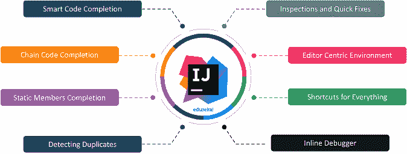**

**智能代码完成** : IntelliJ 可以准确预测你试图**键入什么。**遵循**基于上下文的**代码完成。

*   **链码补全:**这是一项高级功能，专为自动代码竞争而设计。这通过当前上下文中的*方法*和*获取器*列出了适用的符号。
*   **静态成员的完成:** IntelliJ 使您能够使用静态的*方法*和*常量*，这些常量*会自动*添加所需的语句以避免错误。
*   **检测重复:** IDEA 随时随地搜索重复的代码片段并给用户*建议*。
*   **检查和快速修复:**当 IntelliJ *检测到错误*时，通知*灯泡*在同一行弹出。点击它会给你一些建议，避免你犯错误。
*   以编辑器为中心的环境:即时弹出窗口引导用户在不离开当前上下文的情况下检查附加信息。
*   所有东西的快捷方式: IDEA 几乎所有东西都有快捷方式，包括快速选择和在工具窗口之间切换。
*   **内联调试器:**内联调试器使用户能够在 IDEA 本身中调试应用程序。

一些等效的 IDE，如 Eclipse，具有突破性的特性，能够与 IntelliJ IDEA IDE 进行*前沿竞争*，那么**IntelliJ 如何是更好的选择？**

## **为什么选择 IntelliJ？**


当然， **IntelliJ** 和 **Eclipse** 都是分别由 **Eclipse Foundation** 和 **JetBrains** 提供的顶级 ide。但是，JetBrains 也增加了一些开发人员经常寻找的关键特征。

*   **调试**:在 Eclipse 中按 **Ctrl+Shift+I** 对表达式求值。如果您没有选择完整的表达式，那么 eclipse 就不能对它求值。但是在 *IntelliJ **，*** 中，你只需要将鼠标悬停在你想要评估的表达式上，然后按下 **Atl+F8** 就可以了。
*   **自动代码完成** : *IntelliJ* 具有*解码上下文*并向用户提供*建议*的能力。
*   **代码重构**:与其他 ide 不同，IntelliJ 提供了智能代码重构。它实现了*你到底想输入什么。*

## **安装 IntelliJ IDEA IDE**

我们将从 Jet brains 的官方网站安装 **IntelliJ** ，并记得根据您的要求选择版本。几个先决条件是:

*   像**[Python](https://www.edureka.co/blog/python-tutorial/)[Scala](https://www.edureka.co/blog/what-is-scala/)**和 **[Java](https://www.edureka.co/blog/java-tutorial/) 这样的编程语言。**这里我们要选择 **Java。**
*   下载 **JDK** 和 **JRE。**
*   设置 J **ava Home** 和 **Java 路径**。
*   下载 IntelliJ IDEA IDE 社区版
*   转到下载并提取 IntelliJ

让我们首先从**窗口**开始。


*   运行。exe 文件
*   如果你希望使用一些构建工具和框架，比如 **Gradle、Maven** 和 **Spark、**，那么你也需要安装它们，并为它们设置 home path 需求。

现在，让我们从 Linux 开始。


与 Windows 类似，您也需要在这里下载所有的先决条件。

*   进入 bin，在终端上使用以下命令执行 idea.sh

```
./idea.sh

```

既然我们已经成功地理解了如何在两个操作系统中安装 IDEA，那么让我们来理解一下这个特定 IDE 的用户界面是什么样子的。

## 【IntelliJ IDEA IDE 入门

为了成为一名高效的程序员，您必须知道如何与您的 IDE 交互，这一点很重要。**创意**的典型**用户界面**如下所示。

**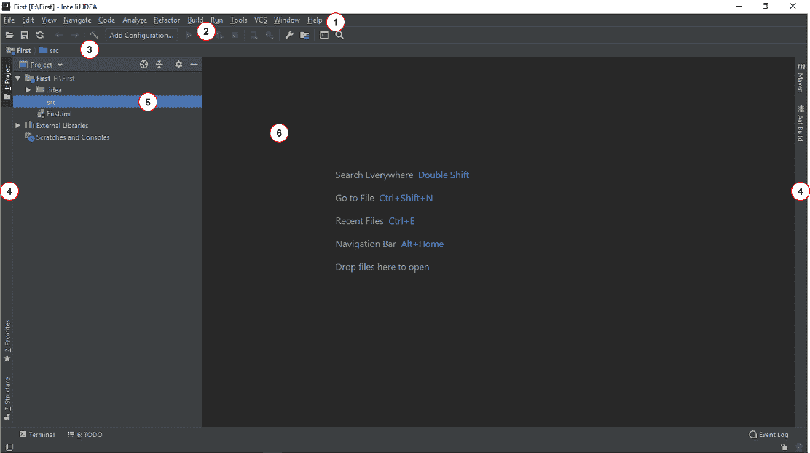**

1.  **菜单栏:**菜单栏包含了您可以*创建*新项目的所有选项和*代码重构、自动代码构建、运行/执行代码、代码调试*选项。
2.  **工具栏:**工具栏有*编译、*调试、*运行*功能的快捷方式。
3.  **导航条:**导航条使项目内的导航更加容易。随着代码库的增加，这个特性变得很方便。
4.  **Tools 选项卡:**你可以从 Tools 选项卡中访问数据库、 *Maven、*和 *Gradle* build-tools 等重要工具。
5.  **项目透视图:**项目透视图窗口包含*包、模块、类、外部库*等等。
6.  **编辑器窗口**——编辑器窗口允许用户编写带有*高亮显示*和其他重要功能的代码。

**插件:** **文件**–>**设置**–>**插件。**

**设置:文件**–>**导入/导出**设置—>**OK**

**配置 JVM 选项和平台属性:** **帮助**–>**编辑自定义 VM 选项**。

现在我们已经对仪器集群上所有可用的功能有了基本的了解，让我们开始执行一些基本的程序。

## **IntelliJ IDEA 中的基本操作**

一旦你启动 IntelliJ，你可以找到不同的选项来开始一个项目。下图描述了项目启动时可用的各种选项。

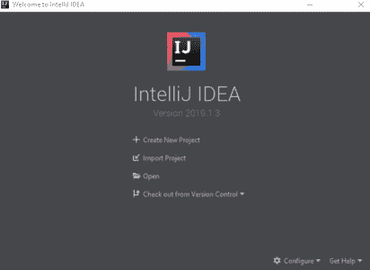

让我们首先尝试使用 create 选项创建一个简单的项目。

*   **左侧菜单**–>–**Java**从可用选项中选择。
*   选择一个**项目 SDK。**我们可以通过在您的系统中证明 JDK 的位置来选择 JDK..
*   为您的项目提供一个**标题**，并选择**完成**来创建您的项目。

如果您的本地文件系统中有一个项目，并且您想要*运行*它。然后，你所要做的就是，只需*导入*项目并执行它。

例如，我的本地系统中有一个 Java 文件，我想使用 IntelliJ IDEA IDE 运行它。我可以从文件选项打开它，然后从它的**位置**打开**它。**

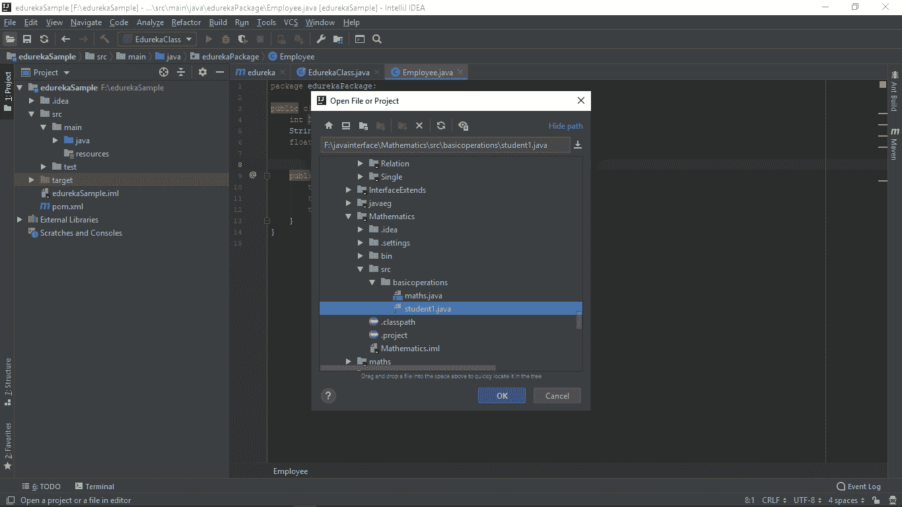

IntelliJ 中可用的其他操作如下:

*   [单元测试](#unit)
*   [调试](#debug)
*   [重命名](#rename)
*   [查找并替换](#find)
*   [安全删除](#safe)

**单元测试**


单元测试可以定义为这样一个过程，其中源代码的单个单元对照与*使用程序*和*操作程序*相关的测试运行，以找出它们是否适合使用。IntelliJ 中的单元测试可以通过以下步骤实现:

*   **导航**–>**测试**–>**创建测试**
*   接下来会弹出另一个对话框，在这里你必须分配 **测试库、类细节、设置、拆卸**方法和你的**偏好**
*   点击**确定**按钮，执行程序
*   如果缺少任何**先决条件**，IntelliJ 会提示您。通过**下载**添加那些 **Jar** 文件。
*   在这里，我选择了 **JUnit。罐子**
*   在这一步之后，IntelliJ 将创建一个新的**单元测试程序**
*   现在，你必须**选择**代码**编辑**
*   进入**运行菜单**–>**运行**

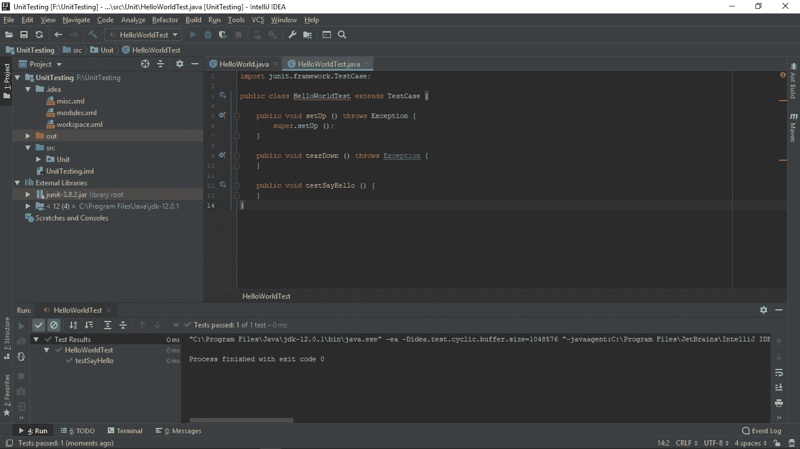

//单元测试代码

```
package Unit;
public class HelloWorld {
    public static void main ( String[] args ) {
        sayHello ( "Hello World...!" );
}
    static void sayHello ( String msg ) {
        System.out.println ( msg );
    }
}

```

IntelliJ 编写的 UnitTest 代码

```
junit.framework.TestCase;
public class HelloWorldTest extends TestCase {
    public void setUp () throws Exception {
        super.setUp ();
}
   public void tearDown () throws Exception {
     }
   public void testSayHello () {
     }
}

```

**调试**

** ** Java IntelliJ IDEA IDE 自带*内置调试器。*有了这个内置的调试器，调试过程变得更容易了。调试器使我们能够在代码中设置*断点*，这样，我们可以在某个点停止程序的执行，并进入*检查*代码及其*变量。*

我们可以按照以下步骤执行调试过程:

*   选择您希望放置**断点**的线，点击**槽**上的**按钮**，设置**断点。**
*   **断点**将通过一个**红色发光**点*高亮显示*。
*   **右击发光点上的**，选择**更多**选项，添加到你的**偏好中。**
*   现在，转到**工具栏**上的**运行**选项，选择**调试**选项。

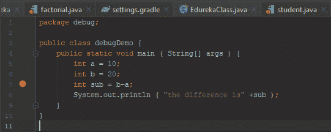****

**查找并替换**

** ** IntelliJ 还支持**查找和替换**选项。你可以使用快捷键 **Ctrl + Shift + R** 来完成，这将产生一个弹出窗口(如下所示),它会要求你找到这些键，然后在整个程序中要求用当前找到的单词替换这个单词。

**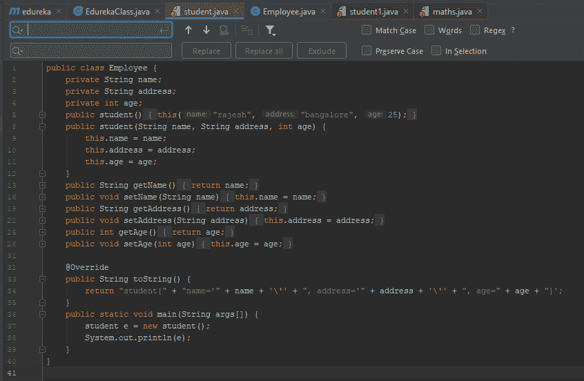**

**重命名**

IntelliJ IDEA IDE 支持重命名操作。您可以通过选择单词并悬停以重构选项来使用重命名操作，然后，选择如下所示的**重命名**选项。

在上面的代码中，我希望应用代码重构操作，将*教授*重命名为*学生。*这将导致改变类，对象和所有其他与*教授*相关的操作将被改变为*学生。*

**安全删除**

我们可以通过使用**安全删除**选项来尝试**删除**一个代码段。只有当该特定代码段的*参与者*没有参与剩余代码的执行时，该代码才会被删除。可以通过同时按 Alt + Delete 键来执行删除命令。

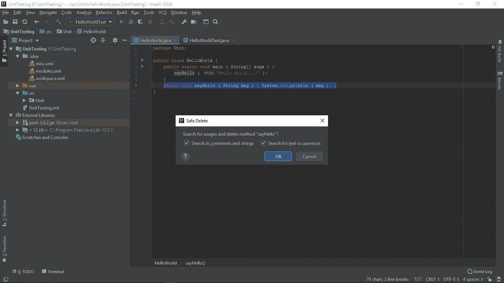

现在我们将尝试一些主要的构建工具。我将向您解释一些构建工具，如 **Maven** 和 **Gradle** 以及其他工具也以类似的方式使用和执行。

## **在 IntelliJ 中构建工具**

**胃**

****

首先， **Maven** 项目，让我们遵循下面的步骤。

要使用 Maven，您需要在您的系统中下载并安装 **Maven** ，还要为 Maven 设置 **home** 和 **path** 变量。

*   选择**文件**–>**新建**–>**项目**
*   选择 **Maven 项目**选项
*   设置 **GroupID** 和 **ArtifactID**
*   选择**下一个【T1—>**结束****
*   终端下载项目的所有**依赖项**
*   选择**自动导入**选项。

//Pom。可扩展标记语言

```
</pre>
<?xml version</span><span>="1.0" </span><span>encoding</span><span>="UTF-8"</span><span>?>
<project  xmlns:xsi ="http://www.w3.org/2001/XMLSchema-instance" xsi : schemaLocation ="http://maven.apache.org/POM/4.0.0 http://maven.apache.org/xsd/maven-4.0.0.xsd">
<modelVersion>4.0.0</modelVersion>
<groupId>com.edureka</groupId>
<artifactId>edureka</artifactId>
<version>1.0-SNAPSHOT</version>
<packaging>jar</packaging>
<dependencies>
   <!-- https://mvnrepository.com/artifact/com.google.code.gson/gson -->
    <dependency>
       <groupId>com.google.code.gson</groupId>
        <artifactId>gson</artifactId>
       <version>2.8.5</version>
    </dependency>
</dependencies>
</project>

```

要运行这个程序，IntelliJ 在其 Pom 中需要 Gson 依赖项。XML 文件，你可以从 [**Maven 库中下载所有需要的依赖项。**](https://mvnrepository.com/)

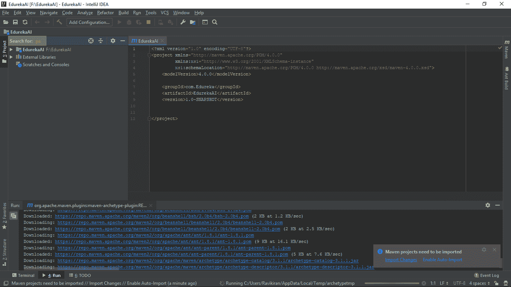

同样，让我们从一个 Gradle 项目开始。

【T0 度】T1

****

您可以按照以下步骤开始一个 **Gradle** 项目:

要使用 **Gradle，**你需要在你的系统中下载并安装 **Gradle** ，还要为 Gradle 设置 **home** 和 **path** 变量。

*   选择**文件**–>–**工具栏**
*   选择**新建**–>**项目**
*   选择**梯度项目**选项
*   与 **Maven 项目类似，**你必须为你的项目选择一个 **GroupID** 和 **ArtifactID** ，然后点击**下一步**
*   选择**自动导入**->-**下一步->完成**

```
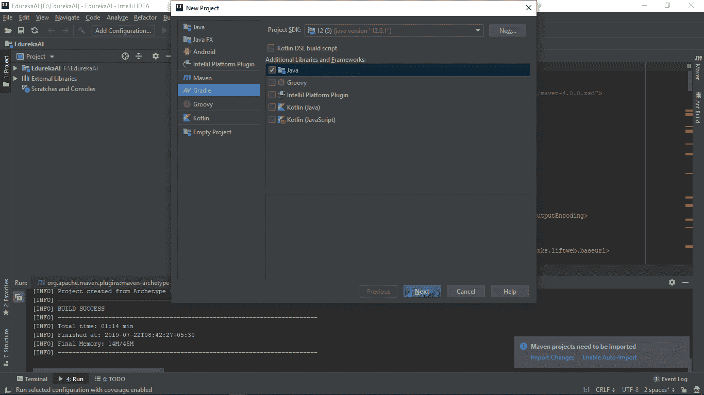
//Code
```

```

package edurekagraddle;
public class factorial {
   public static void main(String args[]){
        int i,fact=1;
        int number=5;//It is the number to calculate factorial&amp;amp;amp;lt;/pre&amp;amp;amp;gt;

        for(i=1;i&amp;amp;amp;lt;=number;i++){
            fact=fact*i;
       }
        System.out.println("Factorial of "+number+" is: "+fact);
   }
}

```

让我们尝试使用 MySQL 和数据库。在 IntelliJ IDEA IDE 中。

**MySQL** 的实现


您可以按照以下步骤从一个 **MySQL** 项目开始:

要使用 **MySQL，**你需要下载并安装 **MySQL** 到你的系统中，并使用 **XAMPP 设置本地主机。**

*   从一个基于 MySQL 的程序开始，我选择了一个 T2 的 Maven 项目 T3
*   我已经填写了开始 Maven 项目的所有**凭证**。
*   我已经启动了 **XAMPP** 的应用程序，在这方面，我已经启动了 **MyQSL** 和 **Apache。**
*   使用我的**本地主机，**我已经建立了一个名为**爱德华卡**的数据库
*   在数据库中，我已经创建了一个包含 3 个实体的雇员表，即， **uname，uid，**和 **salary**
*   我的代码被设计用来访问和打印 **Edureka 数据库**中的用户名，如下所示。

```
//Pom.XML
```

```
<?xml version="1.0" encoding="UTF-8"?>
<project  xmlns:xsi="http://www.w3.org/2001/XMLSchema-instance" xsi : schemaLocation="http://maven.apache.org/POM/4.0.0 http://maven.apache.org/xsd/maven-4.0.0.xsd">
   <modelVersion>4.0.0</modelVersion>
  <groupId>com.edureka.MySQL</groupId>
  <artifactId>MySQL</artifactId>
  <version>1.0-SNAPSHOT</version>
  <dependencies>
      <!-- https://mvnrepository.com/artifact/mysql/mysql-connector-java -->
     <dependency>
            <groupId>mysql</groupId>
           <artifactId>mysql-connector-java</artifactId>
          <version>5.1.6</version>
        </dependency>
    </dependencies>
</project>

```

要运行这个程序，IntelliJ 在其 Pom 中需要 MySQL 依赖项。XML 文件，你可以从 [**Maven 库中下载所有需要的依赖项。**](https://mvnrepository.com/)

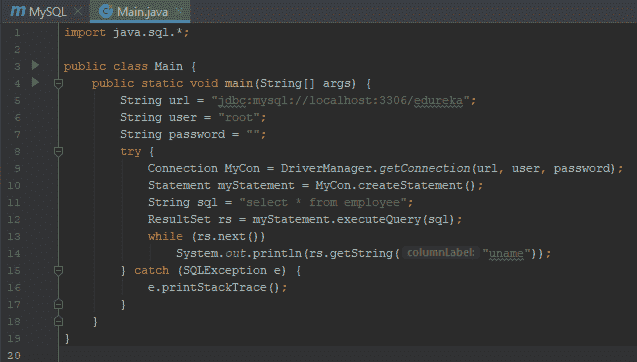

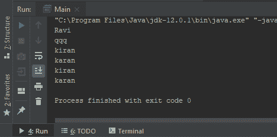

现在，最后但同样重要的是，实现 pro 模式，让我们快速掌握 IDE 上的一些重要快捷方式，这使得我们的编程方法更加简单高效。

## **IntelliJ IDEA IDE 中的快捷方式**

| **操作** | **快捷方式** |
| 搜索 | **Ctrl + Shift + Y** |
| 转到线 | **Ctrl + G** |
| 重新命名 | **Shift+F6** |
| 奔跑 | **Ctrl+Shift+F10** |
| 移动线条 | **Ctrl + Shift +向上/向下** |
| 格式代码 | **Ctrl + Shift + L** |
| 生成 Getter 和 Setter | **Alt +插入** |
| 删除 | **Ctrl + Y** |

至此，本 IntelliJ IDEA IDE 教程到此结束。我希望你了解如何安装这个 IDE，安装的先决条件是什么，IDE 支持的基本操作和构建工具。

*现在您已经了解了 IntelliJ IDEA IDE 的基础知识，请查看 Edureka 提供的  [**Java 培训**](https://www.edureka.co/java-j2ee-soa-training)* *，edu reka 是一家值得信赖的在线学习公司，拥有遍布全球的 250，000 多名满意的学习者。该课程旨在让您在 Java 编程方面有一个良好的开端，并训练您掌握核心和高级 Java 概念以及各种 Java 框架，如 Hibernate&[Spring](https://spring.io/projects/spring-framework)。*

有问题要问我们吗？在这个“IntelliJ IDEA IDE”博客的评论部分提到它，我们会尽快回复您。