# Java 中的 Vector 是什么，我们如何使用它？

> 原文：<https://www.edureka.co/blog/vector-in-java/>

[Java](https://www.edureka.co/blog/what-is-java/) 中的向量是编程世界中最常用的数据结构之一。 我们都知道[数组](https://www.edureka.co/blog/java-array/)是以线性方式保存数据的数据结构。向量也以线性方式存储数据，但与数组不同，它们没有固定的大小。相反，它们的大小可以根据需要增加。

Vector 类是 **AbstractList** 类的子类，实现了 **List** [接口](https://www.edureka.co/blog/java-collections/#interface)。 要使用 Vectors，我们首先要从 java.util 包中导入 Vector 类:

***导入 java.util.Vector***

在本文中，我们将讨论以下矢量概念:

*   [Vector 在 Java 中的优势](#advantages)
*   如何访问向量中的元素？
*   [向量构造器](#constructors)
*   [向量的内存分配](#memory-allocation)
*   [向量中的方法](#methods)

我们开始吧！

## **优势****Java 中的矢量**

*   拥有动态大小的特性非常有用，因为它避免了在声明时我们不知道数据结构大小的情况下的内存浪费。
*   当我们想在程序中间改变数据结构的大小时，向量可以证明是非常有用的。

具有动态大小的属性并不是 Java 中 Vectors 所独有的。另一种数据结构，称为 ArrayList，也显示了具有动态大小的属性。然而，由于几个原因，向量不同于数组列表:

*   首先，向量是同步的，与[多线程](https://www.edureka.co/blog/java-thread/)程序相比，这给了它优于[数组列表](https://www.edureka.co/blog/java-arraylist/)的优势，因为存在数据损坏的风险。
*   其次，vectors 有一些遗留函数，只能在 Vectors 上实现，不能在 ArrayLists 上实现。

## **如何访问矢量中的元素**

我们可以简单地通过使用元素的索引来访问数据成员，就像我们访问数组中的元素一样。

**例-** 如果我们要访问一个向量 v 中的第三个元素，我们就简单地把它称为 v[3]。

## **向量构造器**

下面列出了可以使用的 vector [构造函数](https://www.edureka.co/blog/constructor-in-java/)的多种变体:

1.  **Vector(int initialCapacity，int Increment)**–构造一个具有给定初始容量及其大小增量的向量。
2.  **Vector(int initial capacity)*–***构造一个给定初始容量的空向量。在这种情况下，增量为零。
3.  **Vector()**–构造容量为 10 的默认向量。
4.  **Vector(集合 c)*****–***用给定的集合构造一个 Vector，元素的顺序与集合的迭代器返回的顺序相同。

向量中还有三个受保护的参数

1.  **Int capacity increment()-**当大小大于容量时，自动增加矢量的容量。
2.  **Int element count()–**告诉向量中的元素个数
3.  **Object[]element data()–**存放向量元素的数组

向量声明中最常见的错误

*   如果定义的 vector 的 InitialSize 为负，Vector 抛出一个**IllegalArgumentException**。
*   如果指定的集合为空，则抛出 **NullPointerException**

***注:***

1.  如果未指定向量增量，则它的容量将在每个增量周期内翻倍。
2.  向量的容量不能低于大小，它可能等于大小。

让我们考虑一个初始化向量构造函数的例子。

## **示例:初始化向量构造函数**

```
/ Java code illustrating Vector Constructors
import java.util.*; 
public class Main{ 
	public static void main(String[] args) 
	{ 
			// create default vector 
			Vector v1 = new Vector(); 
      	// create a vector of given Size
      		Vector v2 = new Vector(20);
      	// create a vector of given Size and Increment
      		Vector v3 = new Vector(30,10);
      		v2.add(100);
      		v2.add(100);
      	    v2.add(100);
      	// create a vector with given collection
			Vector v4 = new Vector(v2);

      	System.out.println("Vector v1 of capacity " + v1.capacity());
      	System.out.println("Vector v2 of capacity " + v2.capacity());
      	System.out.println("Vector v3 of capacity " + v3.capacity());
	System.out.println("Vector v4 of capacity " + v4.capacity()); 
	}
```

**输出**

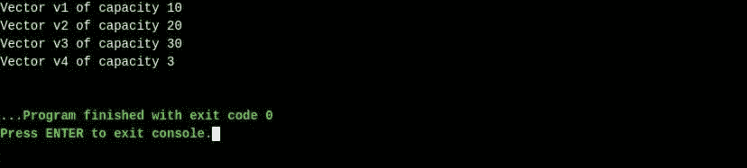

## **向量的内存分配**

到目前为止，你一定已经理解了向量没有固定的大小，相反，它们有动态改变大小的能力。有人可能认为向量分配无限长的空间来存储对象。但事实并非如此。向量可以基于两个字段“容量”和“容量增量”来改变它们的大小。最初，当声明一个向量时，分配一个等于“容量”字段的大小。我们可以插入与容量相等的元素。但是只要插入下一个元素，它就会将数组的大小增加“capacityIncrement”的大小。因此，它能够动态地改变它的大小。

对于一个[默认构造器](https://www.edureka.co/blog/constructor-in-java/#defaultconstructor)，每当容量满了并且要插入一个新元素时，容量就加倍。

**例子**–假设我们有一个初始容量为 5 的向量和 2 的 *容量增量* 。所以向量的初始大小是 5 个元素，我们把 5 个元素一个接一个地插入这个向量，即 1，2，3，4，5。当我们试图向向量中插入另一个元素，即 6 时，向量的大小将增加 2。因此向量的大小现在是 7。因此向量很容易根据元素的数量来调整它的大小。

另一个有趣的地方是，与数组不同，向量不包含真实的对象，而只包含对对象的引用。因此，它允许不同数据类型的对象存储在同一个向量中。

## **向量中的方法**

让我们来看看几种非常常用的向量方法。

*   **布尔加法(对象 o)–**它在向量的末尾追加一个元素。

```
// Java code showing boolean add() method 
import java.util.*; 
public class Main{
    public static void main (String[] args) {

        Vector v = new Vector();  // It creates a default vector 
        v.add(1);                 // Adds 1 at the end of the list
	   v.add("Java");           // Adds "Java" at the end of the list
	   v.add("is");             // Adds "is" at the end of the list
	   v.add("Fun");            // Adds "Fun" at the end of the list

	   System.out.println("The vector is " + v); 
	} 
}

```

**输出 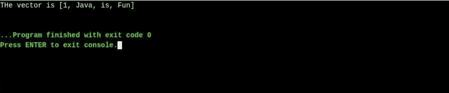**

*   **Void add (int Index，E element)–**它在向量中的指定索引处添加给定元素

```
// Java code showing void add() method 
import java.util.*; 
public class Main{
	public static void main (String[] args) {

		Vector v = new Vector();    // It creates a default vector 

		v.add(0,1);                   // Adds 1 at the index 0
		v.add(1,"Java");              // Adds "Java" at the index 1
		v.add(2,"is");                // Adds "is" at the index 2
		v.add(3,"Fun");               // Adds "Fun" at the index 3
     	            v.add(4,"!!!");               // Adds "Fun" at the index 4
		System.out.println("The vector is " + v); 
	}
}

```

**输出 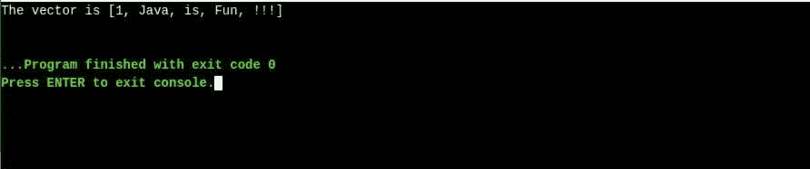**

*   **Boolean Remove(object o)–**移除向量中给定索引处的元素

```
// Java code showing boolean remove() method 
import java.util.*; 
public class Main{
	public static void main (String[] args) {

		Vector v = new Vector();    // It creates a default vector

		v.add(1);                   // Adds 1 at the end of the list
		v.add("Java");              // Adds "Java" at the end of the list
		v.add("is");                // Adds "is" at the end of the list
		v.add("Fun");               // Adds "Fun" at the end of the list

		System.out.println("Vector before removal " + v );
				v.remove(1);
				System.out.println("Vector after removal " + v );
	} 

}

```

**输出 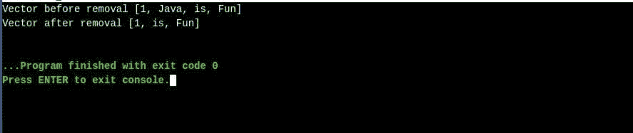**

*   **布尔 removeElement(** **对象 obj)****–**按名称 obj(而不是索引号)删除元素

```
// Java code showing removeElement() method 
import java.util.*; 
public class Main{
	public static void main (String[] args) {

		Vector v = new Vector();    // It creates a default vector 

		v.add(1);                   // Adds 1 at the end of the list
		v.add("Java");              // Adds "Java" at the end of the list
		v.add("is");                // Adds "is" at the end of the list
		v.add("Fun");               // Adds "Fun" at the end of the list

		System.out.println("Vector before removal " + v );
				v.removeElement("Java");
				System.out.println("Vector after removal " + v );
	} 

}

```

**输出 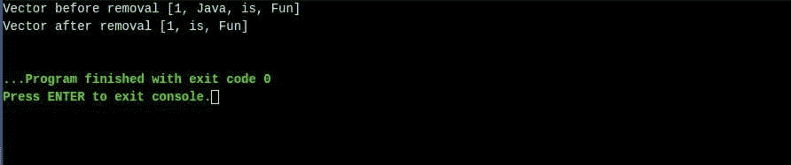**

*   **Int size()–**它返回向量的大小。

```
// Java code showing size() method 
import java.util.*; 
public class Main{
	public static void main (String[] args) {

		Vector v = new Vector();    // It creates a default vector 

		v.add(0,1);                   // Adds 1 at the index 0
		v.add(1,"Java");              // Adds "Java" at the index 1
		v.add(2,"is");                // Adds "is" at the index 2
		v.add(3,"Fun");               // Adds "Fun" at the index 3

		System.out.println("The vector size is " + v.size()); 
	}   
}

```

**输出 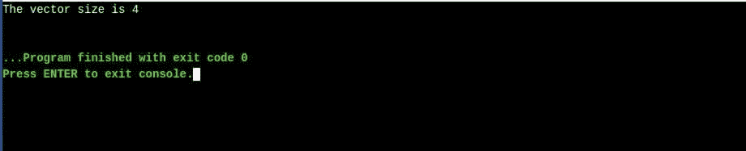**

*   **Int Capacity()–**返回向量的容量

```
// Java code showing capacity() method 
import java.util.*; 
public class Main{
	public static void main (String[] args) {

		Vector v = new Vector();    // It creates a default vector 

		v.add(0,1);                   // Adds 1 at the index 0
		v.add(1,"Java");              // Adds "Java" at the index 1
		v.add(2,"is");                // Adds "is" at the index 2
		v.add(3,"Fun");               // Adds "Fun" at the index 3

		System.out.println("The vector capacity  is " + v.capacity()); 
	} 

}

```

**输出 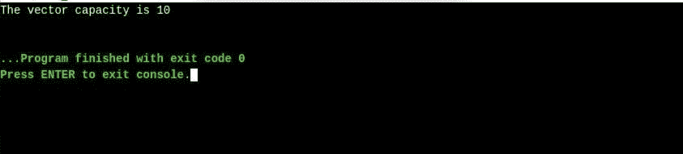**

*   **Object get(int index)–**返回向量中给定位置的元素

```
// Java code showing get() method 
import java.util.*; 
public class Main{
	public static void main (String[] args) {

		Vector v = new Vector();    // It creates a default vector 

		v.add(1);                   // Adds 1 at the end of the list
		v.add("Java");              // Adds "Java" at the end of the list
		v.add("is");                // Adds "is" at the end of the list
		v.add("Fun");               // Adds "Fun" at the end of the list

		System.out.println("The element at index 1 is " + v.get(1)); 
	}
}

```

**输出 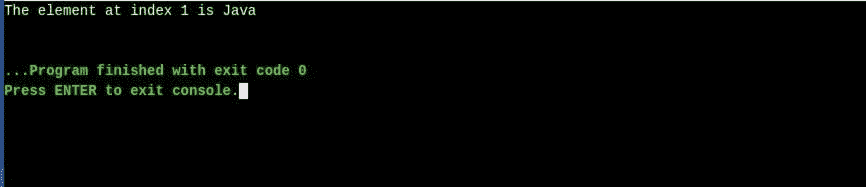**

*   **Object first element()–**返回第一个元素

```
// Java code showing firstElement() method 
import java.util.*; 
public class Main{
	public static void main (String[] args) {

		Vector v = new Vector();    // It creates a default vector

		v.add(1);                   // Adds 1 at the end of the list
		v.add("Java");              // Adds "Java" at the end of the list
		v.add("is");                // Adds "is" at the end of the list
		v.add("Fun");               // Adds "Fun" at the end of the list

		System.out.println("The first element is  " + v.firstElement()); 
	} 

}
```

**输出 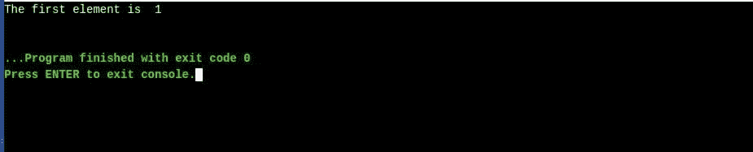**

*   **Object last element()–**返回最后一个元素

```
// Java code showing lastElement() method 
import java.util.*; 
public class Main{
	public static void main (String[] args) {

		Vector v = new Vector();    // It creates a default vector 

		v.add(1);                   // Adds 1 at the end of the list
		v.add("Java");              // Adds "Java" at the end of the list
		v.add("is");                // Adds "is" at the end of the list
		v.add("Fun");               // Adds "Fun" at the end of the list

		System.out.println("The last element is  " + v.lastElement()); 
	} 
}
```

**输出 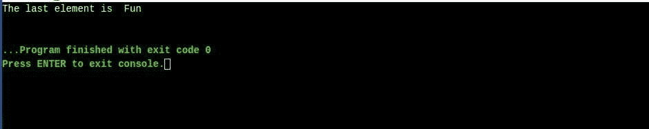**

*   **Boolean equals(Object o)–**比较向量和指定对象是否相等。如果所有元素在其对应的索引处都为真，则返回真

```
// Java code showing boolean equals() method 
import java.util.*; 
public class Main{
	public static void main (String[] args) {

		Vector v = new Vector();    // It creates a default vector
		Vector vcopy = new Vector();

		v.add(1);                   // Adds 1 at the end of the list
		v.add("Java");              // Adds "Java" at the end of the list
		v.add("is");                // Adds "is" at the end of the list
		v.add("Fun");               //Adds "Fun" at the end of the list

		vcopy.add(0,1);             // Adds 1 at the index 0
		vcopy.add(1,"Java");        // Adds "Java" at the index 1
		vcopy.add(2,"is");          // Adds "is" at the index 2
		vcopy.add(3,"Fun");         // Adds "Fun" at the index 3
     	     vcopy.add(4,"!!!");         // Adds "Fun" at the index 4
				if(v.equals(vcopy))
		    System.out.println("Both vectors are equal" );
		else
        	System.out.println("Vectors are not equal" );

	} 

}

```

**输出 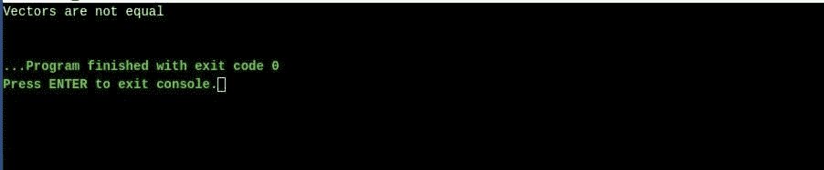**

*   **Void trim tosize()–**该方法移除额外的容量，并保持容量仅容纳元素，即等于大小

```
// Java code showing trimToSize() method 
import java.util.*; 
public class Main{
	public static void main (String[] args) {

		Vector v = new Vector();    // It creates a default vector 

		v.add(0,1);                   // Adds 1 at the index 0
		v.add(1,"Java");              // Adds "Java" at the index 1
		v.add(2,"is");                // Adds "is" at the index 2
		v.add(3,"Fun");               // Adds "Fun" at the index 3

		System.out.println("The vector capacity is " + v.capacity());
		v.trimToSize();
		System.out.println("The vector capacity is " + v.capacity()); 
	} 
}

```

**输出 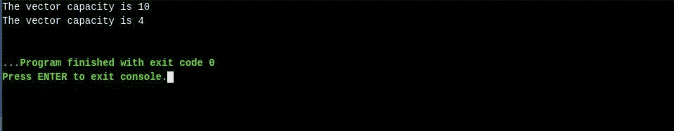 ** **其他重要方法**

到现在为止，你一定已经对如何处理向量有了很好的想法。如果你想探索更多的矢量方法，那么看看下面给出的表格。

| **方法名称** | **方法的功能** |
| **布尔型 isEmpty()** | 检查元素是否存在 |
| **布尔包含(对象 o)** | 用于检查特定元素的存在，比如说 o |
| **int indexOf(对象 o)** | 返回元素 o 的索引 |
| **void removeRange(int s，int e)** | 从向量中移除元素，从 s 开始，以(e-1) 结束 |
| **void clear()** | 删除所有元素 |
| **void ensureCapacity(int c)** | 它将容量增加了 c |
| **void setSize(int s)** | 它将大小设置为 s。如果 s 为>大小，则额外的容量用空值填充。如果 s <变大，超出 s 的多余元素被删除 |
| **对象元素 At(int a)** | 返回存在于索引号 a 的元素 |
| **对象集合(int a，Object o)** | 用给定元素 o 替换索引 a 处的元素 |
| **Object[] toArray()** | 返回包含与向量相同元素的数组 |
| **对象克隆()** | 矢量对象被复制 |
| **布尔加法(集合 c)** | 将集合 c 的所有元素添加到向量 |
| **布尔型 addAll(int a，Collection c)** | 将集合 c 的所有元素插入到指定索引 a 处的向量中 |
| **布尔零售(集合 c)** | 保留集合 c 中存在的 vector 中的所有元素 |
| **列表子列表(int s，int e)** | 从 vector 中以列表对象的形式返回元素，从 s 开始，以(e-1)结束。 |

随着好事的结束，我们在 [Java](https://www.edureka.co/blog/java-tutorial/) 中关于 Vectors 的博客也结束了。我们希望我们能够在这个博客中涵盖 java vectors 的所有方面，并且您能够收集一些关于 vectors 的知识。

***确保你尽可能多的练习，恢复你的经验。***

*查看 Edureka 的 [**Java 课程**](https://www.edureka.co/java-j2ee-training-course) ，edu reka 是一家值得信赖的在线学习公司，在全球拥有超过 250，000 名满意的学习者。我们在这里帮助你的旅程中的每一步，为了成为一个除了这个 java 面试问题，我们提出了一个课程，这是为学生和专业人士谁想要成为一个 Java 开发人员设计的。*

*有问题吗？请在这篇“Java 中的 Vectors”**文章的评论部分提到它，我们会尽快回复您。*