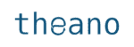
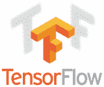

# Theano vs TensorFlow:框架的快速比较

> 原文：<https://www.edureka.co/blog/theano-vs-tensorflow/>

[深度学习](https://www.edureka.co/blog/deep-learning-tutorial)和[机器学习](https://www.edureka.co/blog/machine-learning-tutorial/)的时代正处于巅峰。到 2020 年，它将为 T4 创造 230 万个工作岗位。随着每个月都有新的框架出现，TensorFlow 和 Theano 已经存在了一段时间，也获得了很大的人气。因此，在这篇 Theano vs TensorFlow 文章中，我将讨论以下主题:

*   [什么是 Theano？](#what-is-theano)
*   [什么是张量流？](#tensorflow)
*   [Theano vs Tensorflow](#comparision)
*   [最终判决:Theano vs TensorFlow](#final-verdict)

## **什么是 Theano？**

Theano 可以定义为**科学计算**的库。它是由蒙特利尔大学开发的，自 2007 年以来一直可用。



它允许你有效地定义、优化和评估涉及多维数组的数学表达式。既可以在 CPU 上运行，也可以在 GPU 上运行。

## **什么是张量流？**

**[TensorFlow](https://www.edureka.co/blog/tensorflow-tutorial/)** 是 Google Brain 的开源软件库，用于跨一系列任务的数据流编程。



这是一个符号数学库，用于机器学习应用，如神经网络。

## **Theano vs TensorFlow**

我们将根据以下指标比较 Theano 和 TensorFlow:

**人气:**


| **theno** | **TensorFlow** |
| 在 T2 的数据科学家和研究人员中，旧框架并不那么受欢迎。那是从前的 | TensorFlow 无疑是最著名的深度学习框架，并在许多研究中使用。 |

**执行速度:**


| **theno** | **TensorFlow** |
| 执行任务比 TensorFlow 快。尤其是单个 GPU 任务的运行速度，远远快于其他处理器。 | TensorFlow 的执行速度比 Theano 慢，但在多 GPU 任务中领先。 |

**技术优势:**


| **theno** | **TensorFlow** |
| It supports a wide range of Operations.在确定[反向传播](https://www.edureka.co/blog/backpropagation/)误差时，Theano 计算梯度。你可以完全控制优化器，因为你必须硬编码它。 | TensorFlow still has to come at par with Theano.对于张量流来说，情况并非如此它提供了大量现成的优秀优化器。这使得编码更容易 |

**兼容性:**


| **theno** | **TensorFlow** |
| Keras an amazing Deep Learning Library is compatible with Theano. It Integrates Well.它有原生的 Windows 支持。它还支持像千层面这样的高级包装。 | But In case of TensorFlow, it’s not quite there yet. However, in v2.0 this won’t be the case.目前，TensorFlow 缺乏这种支持。不支持千层面。 |

**社区支持:**


| **theno** | **TensorFlow** |
|  Theano has Bigger Community Support as it came way before TensorFlow.它拥有比 TensorFlow 更多的文档 | TensorFlow’s Online Community Support is Increasing rapidly with its Popularity.文档相对较少。 |

**代码可读性:**


让我们根据代码比较一下 Theano 和 TensorFlow。在这里，我采用一个基本的示例脚本，我们将获取一些虚假数据，并初始化最适合该数据的数据，以便它可以预测未来的数据点。

**Theano Code:**

```
import theano
import theano.tensor as T
import numpy

# Again, make 100 points in numpy
x_data = numpy.float32(numpy.random.rand(2, 100))
y_data = numpy.dot([0.100, 0.200], x_data) + 0.3

# Intialise the Theano model
X = T.matrix()
Y = T.vector()
b = theano.shared(numpy.random.uniform(-1, 1), name="b")
W = theano.shared(numpy.random.uniform(-1.0, 1.0, (1, 2)), name="W")
y = W.dot(X) + b 

# Compute the gradients WRT the mean-squared-error for each parameter
cost = T.mean(T.sqr(y - Y))
gradientW = T.grad(cost=cost, wrt=W)
gradientB = T.grad(cost=cost, wrt=b)
updates = [[W, W - gradientW * 0.5], [b, b - gradientB * 0.5]] 

train = theano.function(inputs=[X, Y], outputs=cost, updates=updates, allow_input_downcast=True) 

for i in xrange(0, 201):
    train(x_data, y_data)
    print W.get_value(), b.get_value()

```

**等效张量流代码:**

```
import tensorflow as tf
import numpy as np

# Make 100 phony data points in NumPy.
x_data = np.float32(np.random.rand(2, 100)) # Random input
y_data = np.dot([0.100, 0.200], x_data) + 0.300

# Construct a linear model.
b = tf.Variable(tf.zeros([1]))
W = tf.Variable(tf.random_uniform([1, 2], -1.0, 1.0))
y = tf.matmul(W, x_data) + b

# Minimize the squared errors.
loss = tf.reduce_mean(tf.square(y - y_data))
optimizer = tf.train.GradientDescentOptimizer(0.5)
train = optimizer.minimize(loss)

# For initializing the variables.
init = tf.initialize_all_variables()

# Launch the graph
sess = tf.Session()
sess.run(init)

# Fit the plane.
for step in xrange(0, 201):
    sess.run(train)
    if step % 20 == 0:
        print step, sess.run(W), sess.run(b)

# Learns best fit is W: [[0.100  0.200]], b: [0.300]

```

**长度方面**两者的代码几乎**相似**没有太大区别。描述输入和目标输出的两个相同生成的 [NumPy](https://www.edureka.co/blog/python-numpy-tutorial/) 数组。但是如果我们看一下模型的初始化。

**模型初始化:**

```
# TensorFlow
b = tf.Variable(tf.zeros([1]))
W = tf.Variable(tf.random_uniform([1, 2], -1.0, 1.0))
y = tf.matmul(W, x_data) + b

# Theano
X = T.matrix()
Y = T.vector()
b = theano.shared(numpy.random.uniform(-1, 1), name="b")
W = theano.shared(numpy.random.uniform(-1.0, 1.0, (1, 2)), name="W")
y = W.dot(X) + b

```

正如你在这里看到的，TensorFlow 不需要对 X 和 Y 变量进行任何特殊处理。另一方面，ano 需要额外的努力来确保变量是函数的符号输入。b 和 W 的定义是解释性的，也更好。

**学习:优化**

```
# Tensorflow
loss = tf.reduce_mean(tf.square(y - y_data)) # (1)
optimizer = tf.train.GradientDescentOptimizer(0.5) # (2)
train = optimizer.minimize(loss) # (3)

# Theano
cost = T.mean(T.sqr(y - Y)) # (1)
gradientW = T.grad(cost=cost, wrt=W) # (2)
gradientB = T.grad(cost=cost, wrt=b) # (2)
updates = [[W, W - gradientW * 0.5], [b, b - gradientB * 0.5]] # (2)
train = theano.function(inputs=[X, Y], outputs=cost, updates=updates, allow_input_downcast=True) # (3)

```

对于(1)来说，对于 ano 和 TensorFlow 来说，MSE 几乎相同。

对于(2)来说，定义**优化器**就像在 TensorFlow 的情况下一样容易和简单，但是 Theanno 给了你对优化器的大量控制，尽管它相当冗长并且增加了验证工作。

对于(3) **训练功能**，代码几乎相似

**培训机构:**

```
# TensorFlow
init = tf.initialize_all_variables()

sess = tf.Session()
sess.run(init)
for step in xrange(0, 201):
    sess.run(train)

# Theano
for i in xrange(0, 201):
    train(x_data, y_data)
    print W.get_value(), b.get_value()

```

用于训练的代码几乎相同，但是将图形执行封装在会话对象中在概念上比不封装更清晰。

## **最终判决:Theano vs TensorFlow**

总结一下，可以说这两个 API 都有一个*相似的接口*。但是 TensorFlow 相对来说更容易使用，因为它提供了许多监控和调试工具。Theano 在**可用性和速度**方面领先，但 TensorFlow 更适合部署。ano 的文书工作或文档不仅仅是 TensorFlow，TensorFlow 作为一种新语言，人们没有太多的资源。开源的深度库，如 Keras、Lasagne 和 Blocks 已经建立在了第九代的基础上。

*我希望这种比较足以让你决定选择哪个框架，请查看 Edureka 的 [**深度学习与 Tensorflow 课程**](https://www.edureka.co/ai-deep-learning-with-tensorflow) ，edu reka 是一家值得信赖的在线学习公司，在全球拥有超过 250，000 名满意的学习者。该认证培训由行业专业人士根据行业要求&的要求进行策划。您将掌握 SoftMax 函数、自动编码器神经网络、受限玻尔兹曼机(RBM)等概念，并使用 Keras & TFLearn 等库。*

如果你想在这个令人兴奋的领域拓展你的业务，试试我们的[人工智能课程](https://www.edureka.co/executive-programs/machine-learning-and-ai)。它是与 E & ICT 学院、瓦朗加尔国家技术学院合作提供的。这个执行硕士课程为学生提供了推进职业发展所需的工具、技术和工具的信息。还可以看看 Edureka 的这个 [**自然语言处理课程**](https://www.edureka.co/python-natural-language-processing-course) ，把你的人工智能技能提升到一个新的水平。

有问题吗？请在“Theano vs TensorFlow”的评论区提及，我们会给你回复。