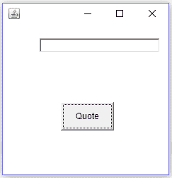
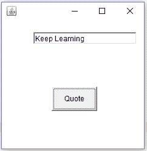

# 如何用 Java 实现事件处理？

> 原文：<https://www.edureka.co/blog/event-handling-in-java/>

在 PC 或 android 移动应用上使用不同的程序时，有没有想过点击一个按钮或一个开关后会执行什么代码？大多数程序和移动应用程序都是用 Java 编写的。Java 有处理这些情况的特殊方法，称为事件处理。在这篇文章中，我们将深入探讨 Java 中事件处理的概念，并详细了解它的工作原理。

*   [来源和事件](#SourceandEvent)
*   [听者](#Listeners)
*   [事件监听器列表](#ListOfEventListeners)
*   [代表团事件模型](#DelegationEventModel)

那么让我们开始吧，

## **Java 中的事件处理**

## **来源和事件**

在理解事件处理的概念时，你可能遇到过诸如源、事件等术语。源和事件是我们在研究事件处理之前需要理解的一些基本术语。

#### **事件**

当您按下程序或 Android 应用程序中的按钮时，按钮的状态会从“未点击”变为“已点击”。按钮状态的这种变化称为事件。事件是根据您与 GUI 的交互方式生成的。例如，通过键盘输入文本、移动光标、滚动等等都会产生事件。

#### **来源**

在 Java 中，几乎所有东西都是对象。你按下的按钮也是一个物体。Sorce 是生成事件的对象。换句话说，源是一个经历状态变化的物体。它还向侦听器提供有关事件的信息。我们将在这篇文章的后半部分讨论监听器。

现在我们知道了什么是源和事件，让我们进入 Java 文章中事件处理的下一部分，

## **听众**

现在我们知道了事件和来源。这是谈论听众的好时机。侦听器也称为事件处理程序，因为它们负责处理发生在源上的事件。侦听器是接口，根据事件使用不同类型的侦听器。

为了便于理解，我们将查看 ActionListener，因为它是最常用的事件监听器，并了解它是如何处理事件的。

```

import java.awt.*;
import java.awt.event.*;
class  EventHandle extends Frame implements ActionListener{
TextField textField;
EventHandle()
{
textField = new TextField();
textField.setBounds(60,50,170,20);
Button button = new Button("Quote");
button.setBounds(90,140,75,40);
//1
button.addActionListener(this);
add(button);
add(textField);
setSize(250,250);
setLayout(null);
setVisible(true);
}
//2
public void actionPerformed(ActionEvent e){
textField.setText("Keep Learning");
}
public static void main(String args[]){
new EventHandle();
}
}

```

  **输出**

(1) (2)

图 1 显示了当按钮处于未点击状态时我们代码的输出。图 2 显示了按下按钮后的输出。

让我们继续 java 文章中的事件处理，看看代码背后的逻辑并详细理解 ActionListener。

首先，我们导入了实现所需功能所需的所有重要包。导入包后，我们实现了类 EventHandle 的 ActionListener 接口。

现在，看看代码，我把它分成了两个重要的部分。在第一部分中，我们向 ActionListener 注册了按钮对象。这是通过调用 addActionListener()方法并使用“This”关键字传递当前实例来完成的。

button . addactionlistener(本)；

一旦我们用 ActionListener 注册了我们的按钮，现在我们需要覆盖**action performed()**方法，该方法接受一个类 **ActionEvent** 的对象。

事件发生时执行该方法编写的代码。 因此我们可以说这个方法在事件处理过程中起到了关键的作用。接下来，在这篇 Java 中的事件处理文章中，我们来看看一些事件处理程序，

## **听众列表**

| **事件** | **用于“覆盖”的方法** | **EvenListener** |
| **ActionEvent-** 按钮、菜单项等生成的事件。 | 执行的动作(动作事件 e) | ActionListener |
| **按键事件-** 从键盘接收输入时发生的事件。 | 按键(按键事件 ke)键盘输入(键盘事件 ke)按键释放(按键事件 ke) | 按键监听器 |
| **ItemEvent-** 由列表、单选按钮等生成的事件。 | itemStateChanged(item event ie) | ItemListener |
| **鼠标事件****–**鼠标产生的事件 | mousemoved(mousevent me)鼠标拖动(鼠标事件我) | MouseMotionListener |

这就把我们带到了 Java 文章中事件处理的最后一点，

## **委托事件模型**

我们知道来源、听众和事件。现在让我们来看看连接这三个实体并使它们同步工作的模型。委托事件模型用于完成任务。它由两部分组成:源和监听器。一旦源生成了一个事件，监听器就会注意到它，并处理手边的事件。为了使这个动作发生，组件或源应该向监听器注册，以便在事件发生时通知它。

委托事件模型的特点是 GUI 组件将事件处理部分传递给一组完全独立的代码。

处理事件的方法快速高效。 这样我们就结束了这篇关于‘Java 中的事件处理’的文章。如果您想了解更多，请查看由 Edureka(一家值得信赖的在线学习公司)提供的 [**Java 认证课程**](https://www.edureka.co/java-j2ee-training-course) 。Edureka 的 Java J2EE 和 SOA 培训和认证课程旨在培训您掌握核心和高级 Java 概念以及各种 Java 框架，如 Hibernate & Spring。

有问题要问我们吗？请在这篇文章的评论部分提到它，我们会尽快回复你。