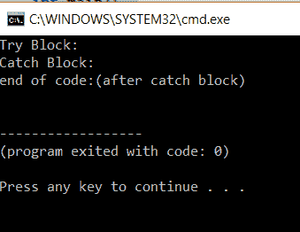
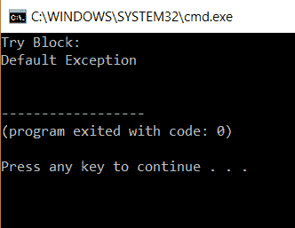
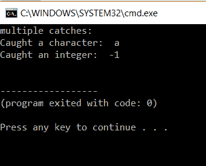

# 如何在 C++中实现异常处理？

> 原文：<https://www.edureka.co/blog/exception-handling-in-cpp/>

***异常*** 是运行时或编译时的异常情况。 [*异常处理*](https://www.edureka.co/blog/java-exception-handling) 是 c++中一个非常本质的概念。本文将向您介绍 C++中的异常处理及其不同类型。

本文将涉及以下几点:

*   [异常类型](#TypesOfExceptions)
*   什么是异常处理？
*   [抓块故障](#CatchBlockFailure)
*   [多个抓块](#MultipleCatchBlocks)

那么让我们开始吧，

## **c++中的异常处理**

## **异常类型**

有两种类型的异常，

**运行时间异常**

它是在运行时捕获的异常。

**编译时异常**

是编译时捕获的异常。

继续这篇关于 C++异常处理的文章，

## 什么是异常处理？

错误会扰乱程序的正常执行。异常处理是非常必要的，它是处理错误或异常的过程。它确保程序的执行不受异常的影响，并缓慢地处理它们，而不会给程序执行带来任何问题。

当您考虑异常处理时，有三个术语与之相关，

**试试**

这个块中的代码就像一个试验代码，可能会抛出异常。这个异常是在 catch 块中捕获的。

**接住**

当 try 块中的代码抛出异常时，执行该块中的代码。

**投掷**

该关键字用于在遇到异常时抛出异常。异常被发送到异常处理程序。

**语法:**

执行 try 块中的代码。如果生成了错误，那么关键字 throw 会将异常抛出给异常处理程序，即 catch 块。然后，catch 块执行其块内的代码，从而处理异常。

让我们来看看 c++中异常处理的示例代码

**样本代码**

```
#include <iostream>
using namespace std;
try{
//code for try
throw &ldquo;exception&rdquo;;
}
catch(exception){
//code for catch
}
int main()
{
int x = 1;
try{
cout << "Try Block: "<<endl;
if(x < 10)
{
throw x;
}
}
catch (int x ) {
cout << "Catch Block: "<<endl;
}
cout<<"end of code:(after catch block) "<<endl;
return 0;
}

```

**输出:**



**解释**

这个程序演示了异常处理。我们有一个变量 x，它被赋值为 1。然后我们有了 try 块的开始。在这个块中，我们有一个条件为 x < 10 的 if 语句。

在我们的例子中，当 x 为 1 时，条件为真。然后程序抛出一个异常，控制转移到 catch 块。我们执行 catch 部分中的条件并退出该块。

```
catch (...) {
cout << "Default Exceptionn"<<endl;
}

```

最后，我们在 catch 块和 exit 程序之后执行剩余的语句。

*可以有多个 catch 语句，* 视可能的异常数量而定。

继续 C++中的异常处理文章，

## **抓块故障**

考虑前面的程序，如果 throw 关键字抛出“ABC”而不是 x，那么 catch 函数将不能处理它。它将显示一个错误，

在这种情况下，我们可以显示我们的错误信息。

为了解决这个问题，我们需要在代码中添加一个默认的 catch 函数来处理这样的问题。

```
#include <iostream>
using namespace std;
int main()
{
int x = 1;
try {
cout << "Try Block: "<<endl;
if(x < 10)
{
throw "ABC";
}
}
catch (int x ) {
cout << "Catch Block: n"<<endl;
}
catch(...){
cout << "Default Exceptionn"<<endl;
}
return 0;
}

```

**输出:T1**

****

**说明:**

这段代码和上一段类似。唯一的变化是抛出的异常是 char 类型的。这导致我们的 catch 函数无用。所以我们包含了一个默认的 catch 函数。

如果 catch 语句都不匹配，则执行默认的 catch。

**多个抓块**

一个 try 块可以有多个 catch 块。

这里有一个例子，

```
#include <iostream>
using namespace std;
int test(int a) {
try{
if(a < 0)
throw a;
else
throw 'a';
}catch(int a){
cout<<"Caught an integer: " << a<<endl;
}catch (char a){
cout<<"Caught a character: " << a<<endl;
}
return 0;
}
int main() {
cout<<"multiple catches:"<<endl;
test(10);
test(-1);
return 0;
}

```

**输出:**

****

**说明:**

在上面的代码中，我们使用了多个 catch 语句。我们有一个生成异常的函数测试。在第一个测试案例中，值是 10。因为 10 大于零，所以字符“a”被抛出，并被第二个 catch 函数捕获。

在第二种情况下，值小于 0，因此抛出值-1，并被整数异常捕获

**基类和派生类中的异常处理:**

如果基类和派生类异常被捕获，那么派生类的捕获必须在基类之前执行。

这里有一些例外:

*   **std::异常**

*   **逻辑 _ 错误**

*   **运行时 _ 错误**

*   **bad _ alloc**

*   **糟糕 _ 施展**

*   **糟糕 _ 异常**

至此，我们结束了这篇关于“C++中的异常处理”的博客。我希望你发现这是有益的，请继续关注更多类似主题的教程。您也可以查看我们的培训计划 t 以深入了解 jQuery 及其各种应用程序，您可以 [**在此**](https://www.edureka.co/masters-program/full-stack-developer-training) 注册在线实时培训，24/7 全天候支持，终身访问。

有问题要问我们吗？在这个博客的评论部分提到他们，我们会回复你。