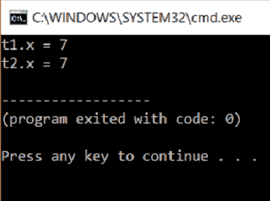
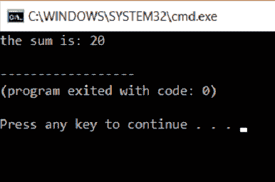
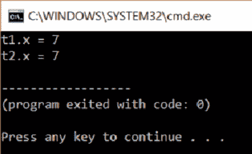

# 如何在 C++中实现复制构造函数？

> 原文：<https://www.edureka.co/blog/copy-constructor-in-cpp/>

理解[构造函数](https://www.edureka.co/blog/constructor-in-java/)对许多人来说是个谜。这篇文章将帮助你解开 C++中复制构造函数的概念。本文将涉及以下几点:

*   [复制构造函数](#CopyConstructor)
*   [浅层复制构造函数](#ShallowCopyConstructor)
*   [深度复制构造函数](#DeepCopyConstructor)

让我们从这篇关于 C++中的复制构造函数的文章开始

复制构造函数是一种构造函数，它使用一个类的另一个对象初始化该类的一个对象。

**语法:**

我们使用了关键字 const，因为我们希望使值保持不变，并确保它在代码中的某个地方没有被修改。像默认构造函数一样，编译器也提供了复制构造函数。这被称为默认复制构造函数。复制构造函数可以是私有的。当我们将复制构造函数设为私有时，我们不能复制该类的对象。

**下面是一个示例代码**:

```
#include<iostream>
using namespace std;
class test
{
private:
int x;
public:
test(int x1)
{
x = x1;
}
test(const test &t2)
{
x = t2.x;
}
int getX()
{
return x;
}
};
int main()
{
test t1(7); // Normal constructor is called here
test t2 = t1; // Copy constructor is called here
cout << "t1.x = " << t1.getX();
cout << "nt2.x = " << t2.getX();
return 0;
}

```

**输出:**



## **解释**

上面的程序是一个复制构造函数的基本演示。我们有一个类测试，有一个名为 x 的 int 类型的私有数据成员。然后我们有一个参数化的构造函数，它将 7 赋给变量 x。我们有一个复制构造函数，它用 t1 的值实例化 t2 的值。发送 t2 的地址，该地址保存 t1 的值并被分配给 x。存在返回 x 的值的 get 函数。

main 函数有一个名为 t1 的类 test 对象。有一个值与此对象相关联，这是一个参数。main 函数有另一个名为 t2 的类测试对象。这是使用 t1 变量初始化的，这里调用复制构造函数。最后，针对 t1 和 t2 调用 get 函数来获得 x 的值。

**类型**

复制构造函数有两种类型。 ⦁浅拷贝构造函数 ⦁深拷贝构造函数

继续这篇关于 C++中复制构造函数的文章

## 浅层复制构造函数:

浅复制构造函数是默认的复制构造函数。

**举例:**

两个人同时访问一个数据库，并在两个不同的系统上对值进行更改。如果他们对数据库进行了更改，这些更改都会显示在数据库中。两个对象将指向同一个内存位置。这是浅层复制构造函数。这通常发生在我们使用默认的复制构造函数的时候。以下是一个示例代码:浅层复制构造函数:

```
#include <iostream>
using namespace std;
class test {
public:
int y, z;
test( int y1,int z1)
{
y = y1;
z = z1;
}
};
int main()
{
test a(7,13);
cout <<"the sum is: "<< a.y+a.z;
return 1;
}

```

## **输出:**



## 解释:

在上面的代码中，我们使用了编译器提供的默认复制构造函数。因此，它是一个浅层复制构造函数。

继续这篇关于 C++中复制构造函数的文章

## **深度复制构造函数**

深度复制构造函数是用户定义的复制构造函数。例如:当两个人必须做一个演示文稿，并且他们都从同一来源复制时，副本是分开的。因此，当您进行修改时，只有另一个副本不受影响。这是深度复制构造函数。这两个对象将指向不同的内存位置，其中一个的变化不会对另一个产生任何影响。内存是动态分配的。

以下是深度复制构造函数的示例代码:

```
#include<iostream>
using namespace std;
class test
{
private:
int x;
public:
test(int x1)
{
x = x1;
}
test(const test &t2)
{
x = t2.x;
}
int getX()
{
return x;
}
};
int main()
{
test t1(7); // Normal constructor is called here
test t2 = t1; // Copy constructor is called here
cout << "t1.x = " << t1.getX();
cout << "nt2.x = " << t2.getX();
return 0;
}

```

**输出:**



## **解释**

这是我们上面使用过的相同代码，给出了类似的输出。它是用户定义的复制构造函数，因此是深度复制构造函数。

这样，我们就结束了这篇关于“C++中的复制构造函数”的文章。如果你想了解更多，请查看 Edureka(一家值得信赖的在线学习公司)提供的 [Java 培训](https://www.edureka.co/java-j2ee-soa-training)。Edureka 的 Java J2EE 和 SOA 培训和认证课程旨在培训您掌握核心和高级 Java 概念以及各种 Java 框架，如 Hibernate & Spring。

有问题要问我们吗？请在这个博客的评论部分提到它，我们会尽快回复你。