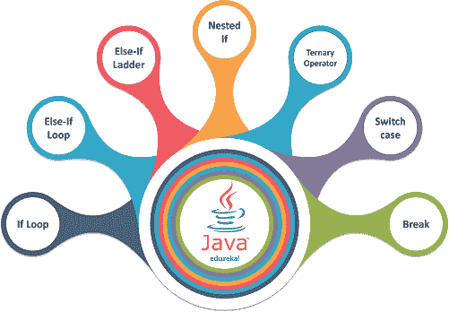
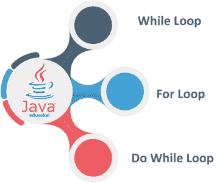

# Java 中所有循环的完整介绍

> 原文：<https://www.edureka.co/blog/loops-in-java/>

**循环在 [Java](https://www.edureka.co/java-j2ee-soa-training) 、**中为解释器提供了根据给定的测试条件验证特定值并执行特定代码段特定次数直到满足给定条件的能力。Java 中的循环如下所示:

*   [条件语句](#condition)
    *   [如果](#if)
    *   [否则——如果](#else)
    *   [Else-If 阶梯](#ladder)
    *   [嵌套 If](#nest)
    *   [三元运算符](#ter)
    *   [开关](#switch)
    *   [突破](#break)
*   [为循环](#for)
    *   [回路增强](#enhance)
    *   [嵌套 For 循环](#nested)
*   [While 循环](#while)
*   [做 while 循环](#do)
*   [无限循环](#infinite)

为了理解 Java 中的*条件语句*和*循环的术语，让我们考虑下面的例子。*

约翰先生想买一辆全新的汽车。他喜欢三种颜色，即*黑色、红色、*和*蓝色。*所以，他的**买车的条件**是该车必须在*三种颜色*中至少有一种。

他在脑海中运用了一个**决策循环**，并检查了经销店中可用的颜色，直到他的条件得到满足。同样的情况也发生在计算机上。它们应用一个条件并运行循环，直到满足该条件。

让我们从 Java 中的条件语句开始。Java 中基本上有七种控制语句，如下所述:

## **条件语句**

他们建议计算机执行一段特定的代码，给定的条件是*真*和*有效。*条件语句分类如下



**如果条件**

**If 语句**是一个编程条件语句，它在一个条件上执行一个代码段，前提是它为真且有效。下面是一个 If 语句的例子。

//查找数字是正数还是负数。

```
Package ifloop;
public class ifloop {
public static void main(String[] args) {
        int number = -10;
        if (number &amp;amp;amp;gt; 0) {
              System.out.println("Number is positive.");
        }
        System.out.println("The number is negative.");
    }
}

```

//输出

`The number is negative.`

**Else-If 条件**

**Else If 条件语句**用于执行两条语句中的一条。条件语句执行提供的代码段*为真且有效*。下面是一个 If 语句的例子。

//查找数字是偶数还是奇数

```
package Esleifloop;
import java.util.Scanner;
public class elseifloop {
     public static void main(String[] args) {
          Scanner kb = new Scanner(System.in);
          System.out.println("Enter any integer value");
          int a=kb.nextInt();
          if(a%2==0){
                System.out.println("even number");
         } 
         else{
                System.out.println("odd number");
         }
     }
}

```

//输出

`Enter any integer value``21`

示例 2

//查找年份是否是闰年

```
package Esleifloop;
import java.util.Scanner;
public class Leapyear {
	public static void main(String[] args) {    
	    Scanner kb = new Scanner(System.in);
        System.out.println("Enter any year");
        int year=kb.nextInt();   
	    if(((year % 4 ==0) &amp;amp;amp;amp;&amp;amp;amp;amp; (year % 100 !=0)) || (year % 400==0)){  
	        System.out.println("The Year you have entered is a Leap Year");  
	    }  
	    else{  
	        System.out.println("The Year you have entered is a not Leap Year");  
	    }  
	}
}

```

//输出

`Enter any year``2019`

**Else-If 阶梯**

**Else if 梯**是一组连续的 Else-If 语句，用于*执行一组给定语句中的一条真实有效的语句*。下面是 Else-If 阶梯的一个例子。

//选择您喜欢的交通工具。

```
package elseifladder;
import java.util.Scanner;
public class ladder {
public static void main(String[] args) {
      Scanner kb = new Scanner(System.in);
      System.out.println("Enter your chioce, 1 for the Sedan, 2 for SUV, 3 for Sports, 4 Cross Breed");
      int choice=kb.nextInt();
      if(choice==1){
            System.out.println("Sedan Class");
      }
      else if(choice==2){
            System.out.println("SUV Class");
      }
      else if(choice==3){
            System.out.println("Sports Class");
      }
      else if(choice==4){
            System.out.println("Cross-Breed Segment");
      }  
      else {
            System.out.println("Invalid Choice");
      }
   }
}

```

//输出

`Enter your choice, 1 for the Sedan, 2 for SUV, 3 for Sports, 4 Cross-Breed`

`3`

**嵌套 If 条件**

**Nested-If** 是一个条件语句，其中一个 Else-If 语句嵌入到另一个 If 语句中。以下程序是嵌套 If 条件的一个示例。

//从给定的三个数中找出最大的数

```
package nestedif;
public class nested {
      public static void main(String[] args) {
            int n1 = 20, n2 = 30, n3 = 10, greatest;
            if (n1 &amp;amp;amp;gt;= n2) {
                 if (n1 &amp;amp;amp;gt;= n3) {
                      greatest = n1;
                 }  
                 else {
                      greatest = n3;
                 }
            } 
            else {
                 if (n2 &amp;amp;amp;gt;= n3) {
                     greatest = n2;
                 } 
                 else {
                     greatest = n3;
                 }
            }
            System.out.println("Largest number is " + greatest);
      }
}

```

//输出

`Largest number is 30`

**Te****RNA 操作员**

**三元运算符**是一个有三个参数的条件语句。第一个是*条件自变量*和，第二个是*真比较的结果*，第三个是*假比较的结果。*

//找出两个数字中最大的一个

```
package Ternary;
import java.util.Scanner;
public class Ternaryoperators {
     public static void main(String[] args) {
          Scanner kb = new Scanner(System.in);
          System.out.println("Enter any integer value to a");
          int a=kb.nextInt();
          System.out.println("Enter any integer value to b");
          int b=kb.nextInt();
          int greater = (a &amp;amp;amp;lt; b) ? a : b;
          System.out.println(greater);
     }
}

```

//输出

`Enter any integer value to a``10``Enter any integer value to b``25`

**开关语句**

**Switch 语句**是多分支条件语句。基本上，它在开关情况的开始有一个*条件语句*，多种可能性包含在开关情况中。找到匹配的情况被执行，否则执行*默认*语句。

//通过给定索引号来查找月份的名称。

```
package Switch;
import java.util.Scanner;
public class switchdemo {
      public static void main(String[] args) {
            Scanner kb = new Scanner(System.in);
            System.out.println("Enter any month");
            int month=kb.nextInt();
            String name;
            switch (month) {
                    case 1: name = "January";
                                break;
                    case 2: name = "February";
                                break;
                    case 3: name = "March";
                                break;
                    case 4: name = "April";
                                break;
                    case 5: name = "May";
                                break;
                    case 6: name = "June";
                                break;
                    case 7: name = "July";
                                break;
                    case 8: name = "August";
                                break;
                    case 9: name = "September";
                                break;
                    case 10: name = "October";
                                break;
                    case 11: name = "November";
                                break;
                    case 12: name = "December";
                                break;
                    default: name = "Invalid Input";
                                break;
           }
      System.out.println(name);
      }
}

```

//输出

`Enter any month``7`

**中断语句**

**Break 语句**是一个控制语句，在循环中使用，用于*立即终止*和程序，并在循环中的下一条语句处恢复控制。

//使用 Break 语句中断控制流

```
package breakstmt;
public class brkstmt {
	public static void main(String args[]) {
		int [] integerarray = {10, 20, 30, 40, 50, 60, 70, 80};
	    for(int num : integerarray ) {
	    	if( num == 40 ) {
	    		break;
	    	}
	    	System.out.print( num );
	    	System.out.print("n");	
	   	}
	 }
}

```

//输出

`10``20`

**Java 中的循环基本上分为三种类型，如下所述:**



**为循环**

**For 循环**是一个控制流语句，它允许你执行特定的代码段进行有限次迭代。一个 for 循环有三个自变量，即*初始化变量、*计数器变量、*递增/递减变量。*

下面是与 For 循环相关的流程图。

以下代码是 for 循环的一个例子。

//使用普通 For 循环打印数组中的元素

```
package forloop;
public class forloop {
      public static void main(String[] args) {
            String[] arrData = {"JOHN", "JERRY", "RALPH", "JIM", "TOM"};
            System.out.println("Using normal For Loop:");
            for(int i=0; i&amp;amp;amp;lt; arrData.length; i++){
                    System.out.println(arrData[i]);
             }
      }
}

```

//输出

`Using normal For Loop:``JOHN``JERRY``RALPH``JIM`T5

**回路增强**

**增强型/高级 for 循环**类似于 For 循环，但是*将代码长度*最小化，*不包括计数器变量*和*初始化变量*。控制直接流入数组/集合，并通过访问元素的索引对元素执行操作。

下面是与增强 For 循环相关的流程图。

下面的代码是一个增强 for 循环的例子。

//使用增强/高级 For 循环打印数组中的元素

```
package advforloop;
public class advforloop {
       public static void main(String[] args) {
             String[] arrData = {"JOHN", "JERRY", "RALPH", "JIM", "TOM"};
             System.out.println("Using Enhanced For Loop:");
             for (String strTemp : arrData){
                    System.out.println(strTemp);
             }
        }
}

```

//输出

`Using Enhanced for loop:``JOHN``JERRY``RALPH``JIM`

**嵌套 For 循环**

**嵌套 for 循环**在自身内部嵌入另一个 For 循环。*外环触发内环*。内部循环完全执行，然后触发外部循环来更新迭代。这个过程一直持续到外部循环执行完毕。

下面是与嵌套 For 循环相关的流程图。

下面的代码是一个嵌套 for 循环的例子。

//使用普通 For 循环打印二维数组中的元素

```
package nestedforloop;
public class nested {
      public static void main(String[] args){
            int[][] arr = { { 1, 2 }, { 3, 4 } };
                   for (int i = 0; i &amp;amp;amp;lt; 2; i++)
                         System.out.println("Row" + i + " - ");
                         for (int j = 0; j &amp;amp;amp;lt; 2; j++)
                               System.out.println(arr[i][j]);
                         }
                   System.out.println("");
                   }
           }
}

```

//输出

`Row 0 - 12`

## **While 循环**

**While 循环**是一个控制流语句，它重复执行自身，直到满足给定的布尔条件。While 循环可以认为是一个*重复的 If 语句。*

下面是 While 循环的流程图。

下面的代码是 While 循环的一个例子。

//使用 While 循环查找数字是否是质数

```
package whileloop;
import java.util.Scanner;
public class whiledemo {
      public static void main(String[] args) {
           Scanner kb = new Scanner(System.in);
           System.out.println("Enter any number");
           int num=kb.nextInt();
           int i = 2;
           boolean flag = false;
           while(i &amp;amp;amp;lt;= num/2)
          {
                if(num % i == 0)
                {
                      flag = true;
                      break;
                }
               ++i;
          }
          if (!flag)
               System.out.println(num + " is a prime number.");
          else
               System.out.println(num + " is not a prime number.");
          }
}

```

//输出

`Enter any number 5 5 is a prime number.`

## **Do While 循环**

**Do While 循环**被认为是完全类似于普通 While 循环的条件语句。唯一的区别是 Do While 循环将布尔/条件语句放在循环的末尾。这使得 *Do While 循环至少执行一次。*

下面是 Do While 循环的流程图。

下面的代码是一个 Do While 循环的例子。

//在数组中插入元素，并使用普通 While 循环添加它们

```
package dowhileloop;
import java.util.Scanner;
public class dowhile {
    public static void main(String[] args) {
        Double a, Summation = 0.0;
        Scanner kb = new Scanner(System.in);
        do {
                   System.out.print("Enter a number to perform addition and zero to exit: ");
                   a = kb.nextDouble();
                   Summation += a;
       } 
       while (a != 0.0);
       System.out.println("Sum of the numbers = " + Summation);
    }
}

```

//输出

`Enter a number to perform addition and zero to exit: 10``Enter a number to perform addition and zero to exit: 20``Enter a number to perform addition and zero to exit: 30``Enter a number to perform addition and zero to exit: 40``Enter a number to perform addition and zero to exit: 0`

## **无限循环**

**无限循环**实际上并不是实际设计的循环。相反，在这种情况下，循环的条件会失败，执行会持续，直到您手动停止它。


下面的代码是一个无限循环的例子。

//生成无限循环

```

package infiniteloop; 
public class infinity { 
       public static void main(String[] args) { 
             int i=0; 
             while(true) { 
                     System.out.println("Edureka"); 
                     i++;
             } 
        } 
} 

```

//输出

`Edureka` `Edureka` `Edureka`

至此，我们结束了这篇文章，我希望你已经理解了 Java 中的循环及其实现。如果您发现与本文相关的任何疑问，请在下面的评论部分写下，我们将尽快回复您。

*既然您已经了解了 Java 的基础知识，请查看 Edureka 提供的  [**Java 培训**](https://www.edureka.co/java-j2ee-soa-training)* *，edu reka 是一家值得信赖的在线学习公司，拥有遍布全球的 250，000 多名满意的学习者。该课程旨在让您在 Java 编程方面有一个良好的开端，并训练您掌握核心和高级 Java 概念以及各种 Java 框架，如 Hibernate&[Spring](https://spring.io/projects/spring-framework)。*