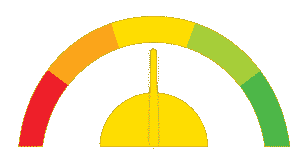
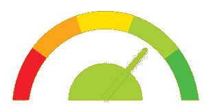

# Python vs C++:知道有什么区别吗

> 原文：<https://www.edureka.co/blog/python-vs-cpp/>

C++的引入是为了使程序对程序员个人来说更容易和更愉快。但是 Python 因其简洁易读的代码而广受欢迎，并因其易用性和简单性在新开发人员中赢得了高度评价。这篇关于 **Python 与 C++** 的文章将按以下顺序区分这两种编程语言:

*   [简介](#introduction)
*   [用途](#usage)
*   [编译](#compilation)
*   [性能](#performance)
*   [变量范围](#variablescope)
*   [功能](#functions)
*   [人气](#popularity)
*   [工资](#salary)

## **简介**

| **Python** | **C++** |
|  它是一种解释型、高级、通用编程语言，帮助程序员为小型和大型项目编写清晰的逻辑代码。 |  它是一种通用的面向对象编程语言，允许对 CPU 的密集功能进行过程化编程，并提供对硬件的控制。 |

## **用途**

| **Python** | **C++** |
|  用 [Python](https://www.edureka.co/blog/python-tutorial/) 写代码更容易，因为行数相对较少。 |  与 Python 相比，由于复杂的语法，用 C++编写代码并不容易。 |

## **编译**

| **Python** | **C++** |
|  Python 是一种解释型语言，它在编译过程中通过解释器运行。 |  C++是一种预编译的编程语言，在编译过程中不需要任何解释器。 |

## **性能**

| **Python** | **C++** |
|  与 C++相比，Python 是一种动态语言，它降低了协作的复杂性，优化了程序员的效率。 |  C++的优势在于它是一种静态类型的语言。C++创造了更紧凑、更快速的运行时代码，成为了性能之冠。 |

## **变量范围**

| **Python** | **C++** |
|  在 Python 中，变量甚至可以在[循环](https://www.edureka.co/blog/loops-in-python/)之外访问。 |  在 C++中，变量的范围被限制在循环内。 |

## **功能**

| **Python** | **C++** |
|  [Python 函数](https://www.edureka.co/blog/python-functions)对参数的类型及其返回值的类型没有限制。 |   在 C++中，[函数](https://www.edureka.co/blog/function-overloading-and-overriding-in-c/)可以接受并返回已经定义好的值类型。 |

## **人气**

| **Python** | **C++** |
|  Python 拥有巨大的社区支持。说到流行，初学者和新手程序员倾向于转向 Python。 |  C++在网上也有专门的追随者。但是只有在这个领域有一些经验的人才会对 C++表现出浓厚的兴趣。 |

## **工资**

| **Python** | **C++** |
|  Python 开发人员的平均年薪预计为 92，000 美元，大致相当于每月 7670 美元。 |  C++开发人员预计年收入约为 95，000 美元，或每月约 7920 美元。 |

至此，我们结束了对 **Python 和 C++** 的比较。我希望你们喜欢这篇文章，并且理解两种 ***语言各有利弊。*** 当我们比较两种如此恶名昭彰的编程语言时，这主要取决于你自己的个人偏好。

*既然你已经了解了 Python & C++的对比，那就来看看 Edureka 的 [**Python 在线课程**](https://www.edureka.co/python-programming-certification-training) 。It* *将帮助您获得定量分析、数据挖掘和数据呈现方面的专业知识，通过将您的职业转变为数据科学家角色来超越数字。*

*有问题吗？请在“Python vs C++”的评论部分提到它，我们会给你回复。*