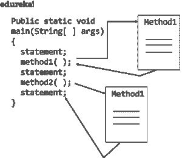
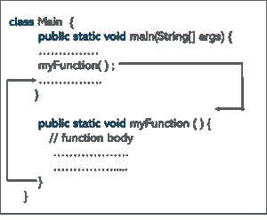

# Java 中的方法有哪些？从头开始了解 Java 方法

> 原文：<https://www.edureka.co/blog/java-methods/>

*[Java](https://www.edureka.co/blog/java-tutorial/)* 是一种通用编程语言，你需要一个函数来对应用程序执行所需的操作。这些函数通常被称为方法。在本文中，您将了解 Java 中的方法到底是如何工作的。

本文讨论了以下主题:

*   [什么是方法？](#What_is_a_method?)
*   [Java 中不同类型的方法](#Different_types_of_methods_in_Java)
    *   [标准库方法](#Standard_Library_Methods)
    *   [用户自定义方法](#User-defined_Methods)
*   [如何创建方法？](#How_to_create_a_method?)
*   [如何调用方法/方法调用](#How_to_call_a_method/_method_calling)
*   [方法参数](#Method_parameters)
*   [方法调用的内存分配](#Memory_allocation_for_methods_calls)

我们开始吧！

## **什么是方法？**

一个 方法 基本上是一组代码，通过名字来引用，可以在程序中的任何一点调用，只要利用方法的名字。每个方法都有自己的名字。当该名称在程序中时，执行分支到该方法的主体。假设方法完成，控制返回到调用它的代码区域，程序继续执行下一行代码。



方法基本上被称为**省时器**，这意味着它们允许你不必重新输入代码就可以重复代码段。除此之外，方法还可以在新开发的[程序](https://www.edureka.co/blog/java-programs/)中被保存和反复使用。这些 **方法**用于执行某些动作，它们也被称为  函数。

## **Java 中不同类型的方法**

谈到所使用的不同类型的方法，有两种类型，它们是:

*   标准库方法
*   用户定义的方法

下面我们来详细了解一下。

### **标准库方法**

标准库方法是 [*Java*](https://www.edureka.co/blog/what-is-java/) 中的内置方法，随时可供使用。这些标准库与 Java 类库一起出现，Java 类库存在于 Java 档案(*。jar)文件与 [JVM 和 JRE](https://www.edureka.co/blog/what-is-java/#ComponentsinJava) 。

### **如何使用标准库？**

文件 *stdlib.jar* 将所有标准库放在一个文件中。要访问这些库，您必须添加 *stdlib.jar* t o 您的 **Java 类路径** **。有几种方法可以做到这一点。这里有两种方法，你可以这样做:**

*   **使用 javac-introcs 和 java-introcs 命令** *。**javac-introcs*和 *java-introcs* 命令可以通过命令行(对于 OS X 或 Linux)或 Git Bash(对于 Windows)访问。

```
% javac-introcs MyProject.java
% java-introcs  MyProject
```

*   **使用 IntelliJ 项目文件夹**。如果使用 IntelliJ，项目文件夹会被预先配置为在类路径中包含 *stdlib.jar* 。

标准库的一些例子有:

*   **print():** 这个方法属于 *java.io.PrintSteam* ，它帮助打印写在报价中的[字符串](https://www.edureka.co/blog/java-string/)。
*   **sqrt():** 这个是 Math 类的一个方法，返回那个特定数字的平方根。

## **如何创建方法？**

方法必须在特定的[类](https://www.edureka.co/blog/java-objects-and-classes/)中声明。它由方法名定义，后跟括号“()”。Java 提供了一些预定义的方法，比如 *System.out.println()* 等等。

**语法:**

```
public static int methodName(int x, int y) 
{

   // body

}
```

上面的代码可以分解为:

*   **公共静态**—访问修饰符
*   **int**返回类型
*   **方法名称**—方法的名称
*   **x，y**—形式参数
*   **int x，int y**—参数列表

方法定义由方法头和方法体组成。

现在，我们来了解一下如何在 Java 中创建一个用户自定义的方法？

##### **如何在 Java 中创建自定义方法？**

**语法:**

```
public static void my() 
{

	System.out.println(“My Function is created”);

}
```

这里定义了一个名为 myMethod()的方法。

您可以在函数名前看到三个[访问修饰符](https://www.edureka.co/blog/access-modifiers-in-java/)——public、static 和 void。

*   **public** 关键字使 myMethod()方法成为公共的。可以从类外部访问公共成员。要了解更多信息，请访问:Java 中的 [*访问修饰符*](https://www.edureka.co/blog/access-modifiers-in-java/)
*   **静态**关键字表示无需创建该类的[对象](https://www.edureka.co/blog/java-object/)就可以访问该方法。
*   **void**关键字表示该方法不返回任何值。

## **如何调用方法/方法调用？**

要在 [Java 中调用一个方法，](https://www.edureka.co/blog/what-is-java/)你必须写下方法名，后跟括号 ***()*** 和分号***；***

对于在程序中使用方法，应该调用它。调用方法有两种方式，即方法返回值或不返回值。

方法调用的过程很简单。当程序调用一个方法时，程序控制自动转移到被调用的方法。该被调用方法在以下两种情况下将控制权返回给调用方，即:

*   当执行*返回*语句时。
*   当控件到达结束大括号的方法时。



在这种情况下，

*   当 Java 执行程序代码时，它会遇到代码中的方法。
*   然后，执行分支到 myFunction()方法，并执行该方法体内的代码。
*   方法体内部的代码执行完成后，程序返回原始状态，执行下一条语句。

让我们通过定义一个 Java 类来看看 Java 方法的实际应用。

```
 class Main {
public static void main(String[] args) {
System.out.println("In order to encounter a method");
// method call
myMethod();
System.out.println("the method was executed successfully!");
// method definition
private static void myMethod(){
System.out.println("Printing from inside myMethod()!");
}
}
```

当您运行该程序时，输出将是:

为了遇到一个从 myMethod()内部打印的方法！方法执行成功！

现在我们来谈谈方法参数。

**方法参数**

参数在类中的方法名后面的括号内指定。您可以添加任意数量的参数，但只需用逗号分隔即可。数据可以作为参数传递给函数。实际上，参数在方法内部充当*变量*。

让我们看一个例子来理解这一点。

```
 public class MyClass
{
static void myMethod(String fname)
{
System.out.println(fname + " Certification course");
}
public static void main(String[] args)
{
myMethod("Java");
myMethod("Kotlin");
myMethod("Selenium");
}
} 
```

其输出将是:

Java 认证课程 Kotlin 认证课程 Selenium 认证课程

您也可以使用任何原始数据类型或内置 Java 类作为参数的数据类型，或者您也可以使用自己的类作为参数类型。

这是关于 Java 中的方法参数。

现在，让我们了解如何为被调用的方法分配内存。

**方法调用的内存分配**

*   方法调用通过堆栈实现。
*   每当堆栈调用一个方法时，就会在堆栈区域内创建一个框架。
*   之后，参数被传递给，本地变量和被调用方法返回的值被存储在堆栈框架中。
*   当被调用方法执行完毕时，分配的堆栈帧将被删除。
*   还有一个堆栈指针寄存器，它跟踪堆栈的顶部，可以相应地进行调整。

这就把我们带到了本文的结尾，在这里我们学习了关于 Java 方法的。希望你清楚本教程中与你分享的所有内容。

***确保你尽可能多的练习，恢复你的经验。***

如果您发现这篇文章与“Java 中的方法”相关，请查看一下  *Edureka 的 [Java 课程](https://www.edureka.co/java-j2ee-training-course)* ，  这是一家值得信赖的在线学习公司，拥有遍布全球的 250，000 多名满意的学习者。  *我们在这里为您的每一步旅程提供帮助，我们为想要成为 Java 开发人员的学生和专业人士设计了一套课程。该课程旨在为您提供 Java 编程的良好开端，并训练您掌握核心和高级 Java 概念以及各种 Java 框架，如 Hibernate & Spring。*

如果您遇到任何问题，请在“Methods n Java”的评论部分自由提问，我们的团队将很乐意回答。