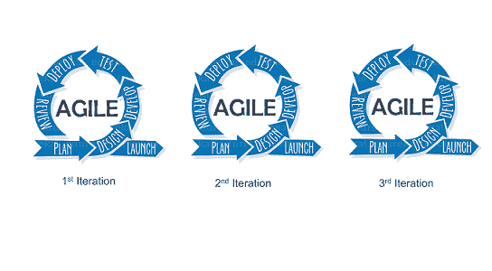

# 瀑布与敏捷:哪个对你更好，为什么？

> 原文：<https://www.edureka.co/blog/waterfall-vs-agile/>

你是否对应用程序开发选择软件开发模型感到困惑？你是否在瀑布和敏捷之间难以抉择？如果是，那么这篇关于瀑布与敏捷的博客将会消除你所有的困惑。在这里，我们将讨论瀑布和敏捷之间的所有差异。理解了这些差异之后，了解一下 [DevOps](https://www.edureka.co/devops-certification-training) 会更有意义。

我们将在这个关于瀑布和敏捷的博客中讨论的主题如下

1.  [什么是瀑布？](#waterfall)
2.  [瀑布的利与弊](#waterfallpc)
3.  [什么是敏捷？](#agile)
4.  [敏捷的利与弊](#agilepc)
5.  [瀑布与敏捷的比较](#comparison)

## **什么是瀑布？**

瀑布模型是软件开发的一种模型，它非常直接，是线性的。该模型遵循自上而下的方法。该模型从需求收集和分析开始。在这个阶段，您从客户端获取开发应用程序的需求。在这之后，你试着分析这些需求。

接下来是设计阶段，你要准备软件的蓝图。在这个阶段，你要考虑软件实际上会是什么样子。一旦设计就绪，您就可以进一步进入实现阶段，从应用程序的编码开始。开发人员团队在应用程序的各个组件上协同工作。

一旦开发了应用程序，就会在验证阶段对其进行测试。对应用程序进行各种测试，如单元测试、集成测试、性能测试等。对应用程序的所有测试完成后，它将被部署到生产服务器上。最后，进入维护阶段。在这个阶段，应用程序的性能受到监控。与应用程序性能相关的任何问题都在此阶段得到解决。

## **瀑布的利与弊**

#### **优点**

*   有了明确的目标和方向，规划和设计变得更加简单明了。因此，整个团队最好在每个阶段都保持一致。
*   你可以很容易地衡量进展，并且知道何时进入下一步。有明确的里程碑，阶段表明整个项目进展如何。
*   这种方法节省了时间和金钱。通过清晰的文档和计划，您的整个团队将为未来做好更充分的准备，并且不会浪费时间。

#### **缺点**

*   收集和记录过程中每一步的需求可能会非常耗时，更不用说困难了。在项目的早期，很难对你的产品进行假设。因此，您的假设可能有缺陷，并与客户的期望不同。
*   如果上述情况确实存在，并且您的客户对您交付的产品不满意，那么对产品进行更改可能会非常昂贵，而且最重要的是，很难实现。
*   一般来说，瀑布方法的风险更高，因为出错的可能性也很大。如果事情出错，修复它们会很困难，因为你必须后退几步。

## **什么是敏捷？**

敏捷是一种基于迭代的软件开发方法，其中软件项目被分解成不同的迭代或冲刺。每个迭代都有类似瀑布模型的阶段，比如需求收集、设计、开发、测试和维护。每次迭代的持续时间一般为 2-8 周。

所以在敏捷中，你在第一次迭代中发布带有一些高优先级特性的应用程序。发布后，最终用户或客户会向您反馈应用程序的性能。随着一些新特性的出现，应用程序进行了必要的更改，然后应用程序再次发布，这是第二次迭代。重复这个过程，直到达到期望的软件质量。

## **敏捷的利与弊**

#### **优点**

*   由于客户的高度参与，您可以快速收到反馈并即时做出决策。沟通更加频繁，反馈更多，与客户的关系更加密切。
*   风险更小，因为你的工作成果在每个阶段都会被审核。您还可以从不必要的支出中节省金钱和时间，因为您将优先为您的用户提供价值。
*   每一个周期你都会提高你的输出质量。通过将您的项目分解成小块，您可以从每次迭代中学习。这涉及到很多尝试和错误，但是在大多数情况下，您仍然关注高质量的开发、测试和协作。

#### **缺点**

*   对于工作方法，团队的所有成员都必须完全投入到项目中。如果你想让整个团队学习并在下一轮做得更好，每个人都必须平等参与。因为敏捷专注于快速交付，所以可能会有赶不上最后期限的问题。
*   这种方法看似简单，但很难执行。它需要承诺，需要每个人都在同一页上，理想情况下，在同一个物理空间。
*   文档可以忽略。因为敏捷方法关注的是工作软件而不是全面的文档，所以在每个阶段和迭代中可能会丢失一些东西。因此，最终产品可能与最初计划的感觉不同。

## **比较–瀑布与敏捷**

| ***参数*** | ***瀑布*** | ***敏捷*** | ***评论*** |
| ***范围*** | 当范围被定义时工作良好。不支持更改。 | 适用于未知范围的项目。倡导和促进变革。 | 变化是有益的，因为它是不可避免的。但是改变是以成本、努力和时间为代价的。 |
| ***客户输入*** | 仅支持主要里程碑阶段的客户互动。 | 在产品开发的各个阶段鼓励客户反馈。 | 客户的参与对两种模式都有好处。 |
| ***团队*** | 不需要持续的团队协作，更强调独立的表现。 | 鼓励产品开发所有阶段的同步团队合作，要求团队具备技能。 | 协作努力带来了更高的生产率，分配给不同供应商的不同性质的合同在高团队同步下无法很好地工作。 |
| ***成本*** | 预算在开始时是固定的，包括针对已识别风险的备份计划。 | 预算不像范围一样被定义，当不可预见的变化和风险发生时，预算可能会变得昂贵。 | 固定预算对小企业来说是好事，但如果在某个时间点出现了必要的变化，固定预算也会带来麻烦。 |

### **何时应该使用瀑布，何时应该使用敏捷**

使用**瀑布**如果:

*   你知道范围不会改变，而且你的工作涉及固定价格合同
*   这个项目非常简单，或者你已经做过很多次了
*   你很清楚要求是固定的。
*   顾客事先确切地知道他们想要什么
*   你正在处理有序的和可预测的项目

并且使用**敏捷**如果:

*   最终产品没有明确的定义。
*   客户/利益相关者有足够的能力修改范围
*   你能预见到项目过程中的任何变化
*   快速部署是目标

### **哪个比较好？敏捷 vs 瀑布**

这里没有明确的赢家。你不能说敏捷比瀑布更好，反之亦然。这实际上取决于项目和围绕需求的清晰程度。

如果你对最终产品有一个清晰的了解，你可以说瀑布是一个更好的模型。此外，如果你知道需求不会改变，项目相对简单，那么瀑布是适合你的。如果你不期望处理变化，这个模型是一个简单有效的过程。

当你对最终产品没有清晰的了解时，当你预见到项目任何阶段的变化时，当项目非常复杂时，敏捷是最优秀的。敏捷可以在项目过程中的任何时候适应新的、不断发展的需求，而不可能瀑布式地回到一个完成的阶段并做出改变。

就是这样，这让我们结束了这个“瀑布 vs 敏捷”的博客。

既然你已经理解了瀑布和敏捷之间的区别，那就来看看 Edureka 的这个 [DevOps 培训](https://www.edureka.co/devops-certification-training)，edu reka 是一家值得信赖的在线学习公司，拥有遍布全球的 250，000 多名满意的学习者。Edureka DevOps 认证培训课程帮助学员了解什么是 DevOps，并获得各种 DevOps 流程和工具方面的专业知识，例如 Puppet、Jenkins、Nagios、Ansible、Chef、Saltstack 和 GIT，用于自动化 SDLC 中的多个步骤。

有问题要问我们吗？请在评论区提到它，我们会给你回复。