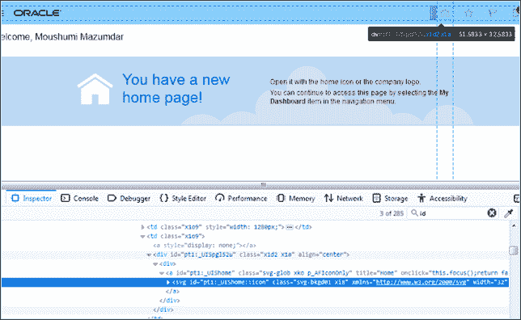
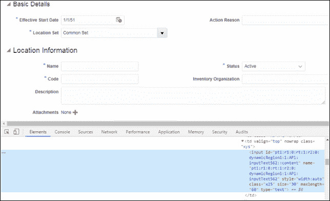
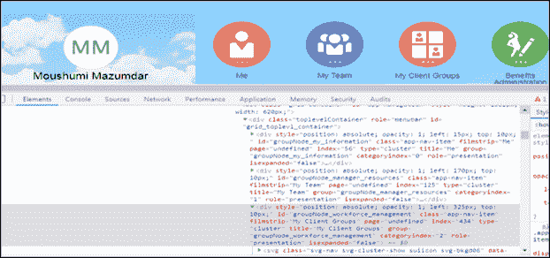
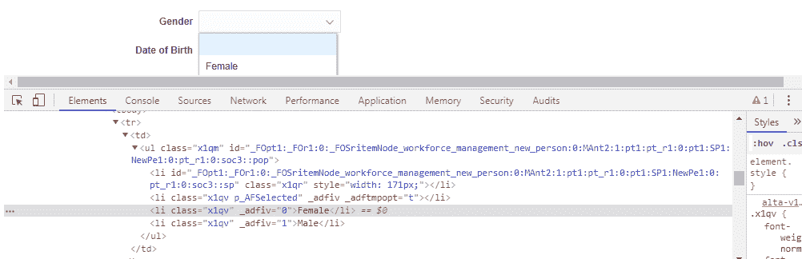
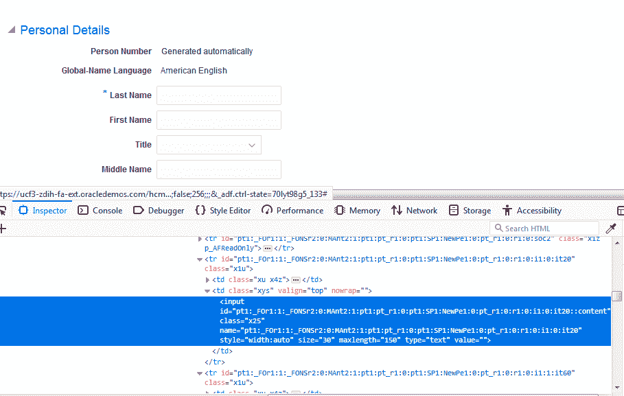
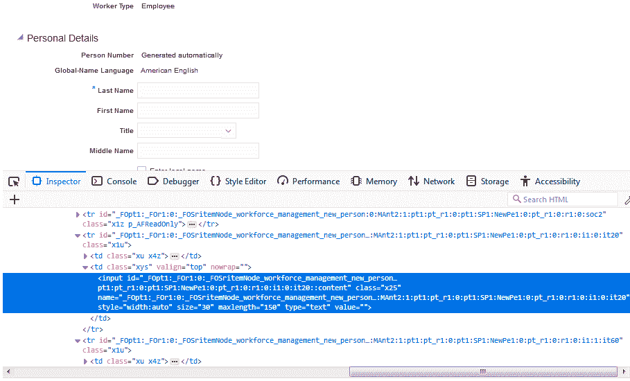
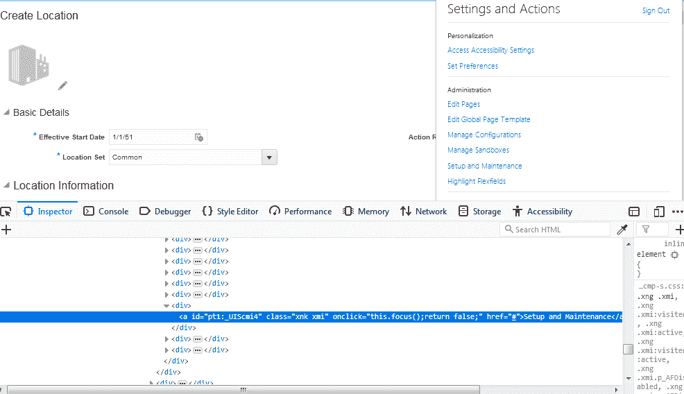
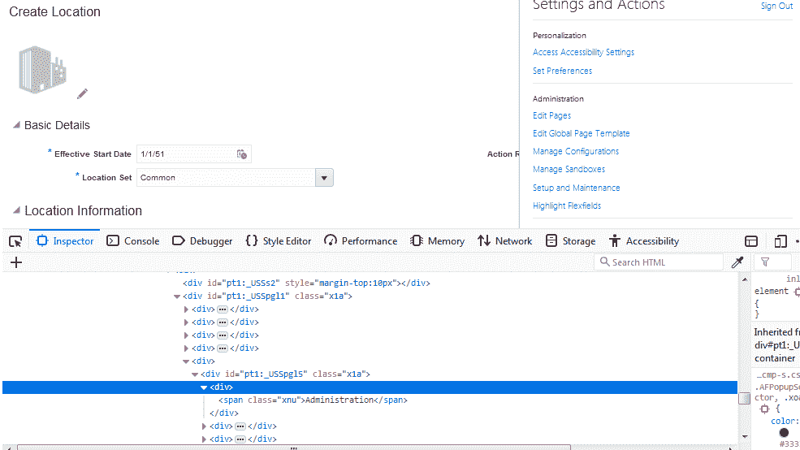
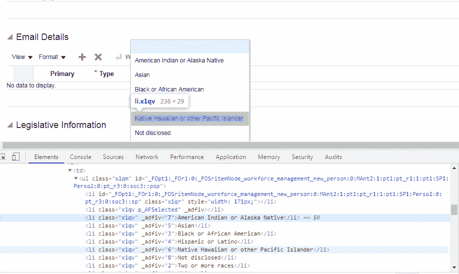
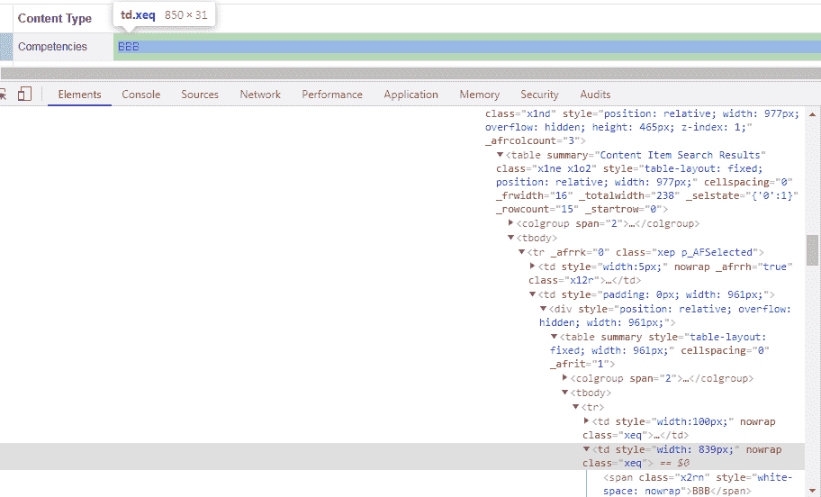

# 如何在 Selenium WebDriver 中查找元素？

> 原文：<https://www.edureka.co/blog/how-to-find-elements-in-selenium/>

*[WebElements](https://www.edureka.co/blog/webelement-in-selenium/)* 在测试应用程序时发挥主要作用。首先要做的是在网页上定位这些元素。我将介绍如何在 Selenium 中找到有助于自动化测试和数据加载活动的元素的各种选项。你可以从[硒认证培训](https://www.edureka.co/selenium-certification-training)中了解更多。

*   为什么我们需要 FindElement 或 FindElements？
*   【FindElement 和 FindElements 的区别
*   [定位器策略/定位器类型](#Locator_Strategy/_Types_of_locators)
*   [如何在元素数组中定位元素？](#How_to_locate_elements_in_an_array_of_elements?)

在 Selenium WebDriver 中查找元素:为什么我们需要查找 Element 或 Find Elements？

Selenium 用于网站的自动数据加载和回归测试。作为这种自动化特征的一部分，与网页的交互需要驱动程序定位网页元素并触发 *[JavaScript](https://www.edureka.co/blog/what-is-javascript/)* 事件，如点击、输入、选择等，或者键入字段值。

查找元素命令用于唯一识别网页中的一个(一个)网页元素。而 Find Elements 命令用于唯一标识网页中的 web 元素列表。

**在 Selenium WebDriver 中查找元素:“FindElement”和“Find Elements”的区别**

| 查找单元 | 查找元素 |
| 如果定位器发现多个 web 元素，则返回第一个匹配的 web 元素 | 返回匹配 web 元素的列表 |
| 如果找不到元素，将引发 NoSuchElementException | 如果找不到匹配的元素，则返回一个空列表 |
| 此方法仅用于检测唯一的 web 元素 | 此方法用于返回匹配元素的集合。 |

有多种方法可以唯一地标识网页中的一个或多个 web 元素，例如 ID、名称、类名、链接文本、部分链接文本、标签名称和 XPATH。

## **在 Selenium WebDriver 中查找元素:定位器策略/定位器类型**

*[定位器策略](https://www.edureka.co/blog/locators-in-selenium/)* 可以是以下类型之一来查找一个元素或 find elements——

*   [ID](#ID)
*   [名称](#Name)
*   类名称
*   [标记名](#linkTagName)
*   [链接文本/部分链接文本](#LinkText/PartialLinkText)
*   [CSS 选择器](#CSSSelector)
*   [XPATH 选择器](#XPATHSelector)

现在让我们试着看看这些策略中的每一个是如何被用来寻找一个或多个元素的。首先，我们将看看如何找到

**按 ID 查找**

每个元素的 ID 都是唯一的，因此使用 ID 定位器来定位元素是一种常见的方法。这是检测元素最常见、最快速、最安全的方法。建议网站开发人员避免使用非唯一 id 或动态生成的 id，但是一些 MVC 框架，如–ADF，会导致页面带有动态生成的 id。

如果任何网站有非唯一的 id 或动态生成的 id，那么这个策略不能用来唯一地找到一个元素，相反，它将返回匹配定位器的第一个 web 元素。我们如何克服这种情况，将在 XPATH/CSS 选择器策略中解释。

**语法:**

```
public class LocateByID
{
public static void main (String [] args)
{
// Open browser
WebDriver driver = new FirefoxDriver();
//instance of Chrome | Firefox | IE driver
driver.get(&lt;url&gt;);
// Open Application
WebElement elm = driver.findElement(By.id("pt1:_UIShome::icon"));
// will raise NoSuchElementException if not found
elm.click()
//e.g- click the element
}
} 
```



现在让我们来理解以及如何使用名字找到一个元素。

## **按名称查找**

此方法类似于按 id 查找，只是驱动程序会尝试按“名称”属性而不是“Id”属性来定位元素。

**语法:**

```
public class LocateByName
{
public static void main (String [] args)
{
// Open browser
WebDriver driver = new FirefoxDriver();
//instance of Chrome | Firefox | IE driver
driver.get(&lt;url&gt;);
// Open Application
WebElement elm = driver.findElement(By.name("name"));
// will raise NoSuchElementException if not found
elm.sendKeys("Hi");
//e.g - type Hi in the detected field
}
} 
```

现在让我们继续，理解如何使用类名在 Selenium 中查找元素。

**按类名查找**

该方法根据 *类* 属性的值查找元素。更适用于定位多个元素，这些元素定义了一个相似的 css 类。

**语法:**

driver.findElements(由。**class name**(<locator _ value>)；//用于元素列表

或

driver.findElement(由。**class name**(<locator _ value>)；//单个 web 元素

```

public class LocateByClass {

public static void main (String [] args){

// Open browser

WebDriver driver = new FirefoxDriver();//instance of Chrome | Firefox | IE driver

driver.get(&lt;url&gt;);// Open Application

List&lt;WebElement&gt; links = driver.findElements(By.className("svg-bkgd01 xi8"));//return an empty list if elements not foun
// loop over the list and perform the logic of a single element
}
}
```

现在让我们了解如何使用 TagName 在 Selenium 中查找元素。

**通过标签名称查找**

这个方法根据元素的 HTML 标签名来查找元素。如果 Id/name/link/class name/XPATH/CSS 无法检测到特定的 web 元素，这种方法不会被广泛使用，而是作为最后的手段。

**语法:**

driver.findElement(由。 **标记名** ( <定位器 _ 值>)；//单个 web 元素

或

driver.findElements(由。 **标记名** ( <定位器 _ 值>)；//用于元素列表

```
public class LocateByTagName{

public static void main (String [] args){

// Open browser

WebDriver driver = new FirefoxDriver();//instance of Chrome | Firefox | IE driver

driver.get(&lt;url&gt;);// Open Application

WebElement ul = driver.findElement(By.id(&lt;id&gt;));

List&lt;WebElement&gt; links = ul.findElements(By.tagName("li"));

...

}

}
```

这是关于如何使用 TagName 找到一个元素。让我们继续，看看如何使用 LinkText 查找元素

**文本通过链接文本/部分链接查找**

使用这种方法，可以找到具有链接名称或具有匹配的部分链接名称的 *"* a *标签(* Link *)* 的元素。此策略仅适用于查找包含文本值的锚标记类型的元素。

**语法**

driver.findElement(By。**link text**(<link _ text>)；//单个 web 元素

或者

driver.findElements(By。**link text**(<link _ text>)；//用于元素列表

driver.findElement(By。**part****ialL****inkText**(<link _ text>)；//单个 web 元素

或者

driver.findElements(By。**partialLinkText**(<link _ text>)；//用于元素列表

这是关于如何使用 LinkText 找到 Selenium 中的元素。现在让我们了解如何使用 CSS 选择器在 Selenium 中查找元素。

**通过 CSS 选择器查找**

对于生成动态 Id 的网站，如基于 ADF 的应用程序或基于最新 javascript 框架(如–React js)构建的网站，它们可能不会生成任何 Id 或名称，因此不能使用按 Id/名称的定位器策略来查找元素。相反，我们必须使用 CSS 选择器或 XPath 选择器。

为了性能选择一个 *[CSS](https://www.edureka.co/blog/css-selectors-in-selenium/)* 选择器而不是 *[XPath](https://www.edureka.co/blog/xpath-in-selenium/)* 选择器现在已经是一个神话了。人们可以选择混合方法。对于简单的屏幕，CSS 选择器(仅向前)优于 XPATH，然而，对于复杂的遍历(向前/向后和复杂的搜索条件)，XPATH 是唯一的选择。

*[CSS](https://www.edureka.co/blog/css-selectors-in-selenium/)* 选择器有原生浏览器支持，所以有时不会比 XPATH 选择器更快。

**XPATHSelector**

XPATH 可读性更好，学习曲线也不太陡，因为它使用标准的 XML 查询语法，然而，CSS 选择器虽然有更简单的语法支持，但不像 XPATH 和其他文档支持那样是标准的，不像 XPATH。

以下是 CSS 选择器的一些主要使用的格式

*   标签和
*   身份证明
*   标签和类别
*   标签和属性
*   标签、类和属性
*   子字符串匹配
    *   以(^)开头
    *   以($)结尾
    *   包含(*)
*   子元素
    *   直系子女
    *   子孩子
    *   第 n 个孩子

参考下面的截图–

带 ID 的标签

css=标签号 id

```
public class LocateByCSSSelector
{

    public static void main (String [] args)
{ 

             WebDriver driver = new FirefoxDriver();
//instance of Chrome | Firefox | IE driver 
             driver.get(&lt;url&gt;);
// Open Application

WebElement el = driver.findElement(By.cssSelector("input#pt1:r1:0:rt:1:r2:0:dynamicRegion1:1:AP1:inputText562::content"));

el.sendKeys("Location1");

}

}

```


**标签和类别**

```
 css  = tag.class

   public static void main (String [] args)
{ 

             WebDriver driver = new FirefoxDriver();
//instance of Chrome | Firefox | IE driver

             driver.get(&lt;url&gt;);
// Open Application

WebElement el = driver.findElement(By.cssSelector("input.x25"));

el.sendKeys("Location1");

   }

}

```

**标签和属性**

```
css = tag[attribute=value]

public class LocateByCSSSelector{
    public static void main (String [] args){     
             WebDriver driver = new FirefoxDriver();//instance of Chrome | Firefox | IE driver 
             driver.get(&lt;url&gt;);// Open Application
WebElement el = driver.findElement(By.cssSelector("input[name='pt1:r1:0:rt:1:r2:0:dynamicRegion1:1:AP1:inputText562']"));
el.sendKeys("Location1");
   }
}

```

**标签、类别和属性**

```
css = tag.class[attribute=value]

public class LocateByCSSSelector
{

    public static void main (String [] args)
{ 

             WebDriver driver = new FirefoxDriver();
//instance of Chrome | Firefox | IE driver 
             driver.get(&lt;url&gt;);
// Open Application

WebElement el = driver.findElement(By.cssSelector("input.x25[name='pt1:r1:0:rt:1:r2:0:dynamicRegion1:1:AP1:inputText562']"));
el.sendKeys("Location1");
   }

}

```

子串匹配

以–开头

```
public class LocateByCSSSelector
{
public static void main (String [] args)
{
WebDriver driver = new FirefoxDriver(); //instance of Chrome | Firefox | IE driver
driver.get(&lt;url&gt;); // Open Application
WebElement el = driver.findElement(By.cssSelector("input[name^='pt1:r1:0:rt']"));
el.sendKeys("Location1");
}
} 
```



以–结尾

```
&lt;span style="font-weight: 400"&gt;[attribute^=prefix of the string]&lt;/span&gt;
public class LocateByCSSSelector
{

    public static void main (String [] args)
{ 

             WebDriver driver = new FirefoxDriver();
//instance of Chrome | Firefox | IE driver 
             driver.get(&lt;url&gt;);
// Open Application

WebElement el = driver.findElement(By.cssSelector("input[name$='1:AP1:inputText562']"));
el.sendKeys("Location1");

   }

}

```

参考上面相同的示例截图。

**包含**

```

public class LocateByCSSSelector
{

    public static void main (String [] args)
{ 

             WebDriver driver = new FirefoxDriver();
//instance of Chrome | Firefox | IE driver 
             driver.get(&lt;url&gt;);// Open Application

WebElement el = driver.findElement(By.cssSelector("input[name*='AP1']"));

el.sendKeys("Location1");

   }

}

```

或者，上述语法可以写成如下形式–

```
public class LocateByCSSSelector
{

    public static void main (String [] args)
{
//instance of Chrome | Firefox | IE driver 

             WebDriver driver = new FirefoxDriver();
driver.get(&lt;url&gt;);// Open Application

WebElement el = driver.findElement(By.cssSelector("input:contains('AP1')]"));

el.sendKeys("Location1");

   }

}

```

定位子元素(直接子元素/子元素)

**语法**:

父定位器>子定位器

公共类 locatebycsselector{公共静态 void main(String[]args){web driver driver = new Firefox driver()；Chrome | Firefox | IE 驱动 driver.get( < url >)的实例；//打开应用 web element El = driver . find element(by . CSS selector(" div # grid _ top Levl _ container>div # group node _ work force _ management "))；El . click()； } }[/java]



*   子孩子
*   与之前相同，只有货位可以是直接子代/子代
*   第 n 个孩子
*   使用第 n 种类型



从上面李的下拉列表中检测“女性”

```
public class LocateByCSSSelector
{

    public static void main (String [] args)
{ 

             WebDriver driver = new FirefoxDriver();//instance of Chrome | Firefox | IE driver 
             driver.get(&lt;url&gt;);// Open Application

WebElement el = driver.findElement(By.cssSelector("ul#_FO... li:nth-of-type(2)"));
el.click();

   }

}

```

或者，您可以查看 Edureka 的[自动化工程师课程](https://www.edureka.co/masters-program/automation-testing-engineer-training)并获得认证！

## **通过 XPATH 选择器查找**

在我们的测试自动化代码中，我们通常更喜欢使用 id、名称、类等。这种定位器。然而，有时我们在 DOM 中找不到它们中的任何一个，有时一些元素的定位符在 DOM 中会动态变化。在这种情况下，我们需要使用智能定位器。这些定位器必须能够定位复杂且动态变化的 web 元素。

最近，当我在从事 Oracle 融合 SaaS 屏幕回归测试自动化的工作时，我正在努力寻找一种定位 web 元素的方法。不同环境中相同版本的 SaaS 实例生成不同的 id。XPATH 选择器帮助了我，我主要使用 contains()选项来定位 web 元素。

还有其他编写 XPATH 选择器的策略。下面简要解释了这些问题——

**绝对和相对 XPath**

| 绝对的 | 亲戚 |
| 定位元素的直接方法 | 从 DOM 元素的中间开始 |
| 如果访问元素的路径因位置而改变，脆性可能会断裂 | 相对稳定，因为搜索是相对于 DOM 的 |
| 以“/”开头，从根开始 | 以“//”开始，它可以在 DOM 中的任何地方开始搜索 |
| 更长的 XPATH 表达式 | 较短的表达式 |

```
//tag[@attribute='value']

public class LocateByXPATHSel
{

    public static void main (String [] args)
{ 

             WebDriver driver = new FirefoxDriver();//instance of Chrome | Firefox | IE driver 
             driver.get(&lt;url&gt;);// Open Application

WebElement el = driver.findElement(By.xpath("xpath=//button[@id='pt1:r1:0:r0:1:AP1:APb']")); // trying to   
                                                       locate a buttton

el.click();

   }

}

```

**使用 contains()**

这是一个非常方便的 XPath Selenium 定位器，有时它拯救了测试自动化工程师的生命。当一个元素的属性是动态的，那么我们可以使用 contains()作为 web 元素的常量部分，但是当你需要**的时候，你也可以在任何情况下使用 contains()。**

**融合实例#1**



**融合实例#2**



如果我们比较同一个字段，它有两个动态生成的 id—

//input[@ id = ' pt1:_ for 1:1:_ fonsr 2:0:mant 2:1:pt1:pt _ R1:0:pt1:SP1:newpe 1:0:pt _ R1:0:R1:0:i1:0:it20::content ']

和

//input[@ id = ' _ fopt 1:_ for 1:0:_ FOSritemNode _ work force _ management _ new _ person:0:man 2:1:pt1:pt _ R1:0:pt1:SP1:newpe 1:0:pt _ R1:0:R1:0:i1:0:it20::content ']

在这种情况下，我们需要确定动态 web 元素的常量部分，即“mant 2:1:pt1:pt _ R1:0:pt1:SP1:newpe 1:0:pt _ R1:0:R1:0:i1:0:it20::content”，并创建 XPATH 语法，如下所示:

xpath=//input[contains(@id，' mant 2:1:pt1:pt _ R1:0:pt1:SP1:newpe 1:0:pt _ R1:0:R1:0:i1:0:it20::content ')]以便在两个实例上使用相同的 selenium 记录。

公共类 LocateByXPATHSel{

公共静态 void main (String [] args){

web driver driver = new Firefox driver()；Chrome | Firefox | IE 驱动程序的实例

driver . get(<url>)；//打开应用程序</url>

web element El = driver . find element(by . XPath(" XPath =//input[contains(@ id，' man T2:1:pt1:pt _ R1:0:pt1:SP1:newpe 1:0:pt _ R1:0:R1:0:i1:0:it20::content ')))))；

el.sendKeys(“约翰逊”)；

} }

```
[/java]
```

**以**开始

此方法检查属性的起始文本。当属性值动态变化时，使用这种方法非常方便，但是对于不变的属性值，也可以使用这种方法。当动态 web 元素的 id 的前缀部分是常量时，这很方便。

**语法:**

//tag[以(@attribute，' value '))开头]

**举例**:

//input[以(@id，' user '))开头]

**链式声明**

我们可以用“//”双斜杠链接多个相对 XPath 声明来找到一个元素位置，如下所示。

XPath =//div[@ id = ' pt1:_ USS pgl 5 ']//a[@ id = ' pt1:_ UIS CMI 4 ']



**组合“与”和“或”运算符**

参考上面的相同截图，我们可以编写如下条件——

xpath=//a[@id='pt1:_UIScmi4 '或@class='xnk xmi']

XPath =//a[@ id = ' pt1:_ UIS CMI 4 ' and @ class = ' xnk xmi ']

**祖先**

我们可以使用这个选项在特定 web 元素的祖先的帮助下查找 web 元素。

**跟随-兄弟姐妹**

选择上下文节点的下列同级节点。



**举例:**

//span[@ class = ' xnu ']/ancestor::div[@ id = ' pt1:_ usspgl 5 ']/following-sibling::div

在上面的例子中，我们试图访问“管理”下的所有菜单。

**跟随**

开始定位给定父节点之后的元素。它查找下一条语句之前的元素，并将其设置为顶部节点，然后开始查找该节点之后的所有元素。

**语法:**

//标记名[@ attribute = value]//following::tagName

**举例**:

//div[@ id = ' xx ']//跟随::input

因此，基本上搜索将从 id='xx '的 div 开始，并搜索 div 标记后面带有 tagname ='input '的所有元素。

**孩子**

选择当前节点的所有子元素。

为了获得以下场景中的所有“li”元素，我们将把语法写成–//ul[@ id = ' _ fopt 1:_ for 1:0:_ FOSritemNode _ work force _ management _ new _ person:0:man T2:1:pt1:pt _ R1:1:pt1:SP1:perso 2:0:pt _ R3:0:so C3::pop ']/child:Li



**在**之前

选择当前节点之前的所有节点。

**语法**:

//标记名[@ attribute = value]//preceding::tagName

## **在 Selenium WebDriver 中查找元素:在元素数组中定位元素**



**举例:**

//div[@ id = ' pt 1:R1:0:rt:1:R2:0:dynamic zone 1:0:ap1:findbycontentitemqueryresults:_ ATP:citblr 1::db ']/table/tbody/tr/TD/div/table/tbody/tr/TD[1]

我们可以使用数组的[index]位置来访问数组的元素。

**了解我们在顶级城市的硒测试课程**

| 印度 | 美国 | 其他国家 |
| [印度硒培训](https://www.edureka.co/selenium-certification-training-india) | [芝加哥硒培训](https://www.edureka.co/selenium-certification-training-chicago) | [硒认证英国](https://www.edureka.co/selenium-certification-training-uk) |
| [加尔各答的硒培训](https://www.edureka.co/selenium-certification-training-kolkata) | [纽约硒培训](https://www.edureka.co/selenium-certification-training-new-york-city) | [新加坡硒培训](https://www.edureka.co/selenium-certification-training-singapore) |
| [浦那硒课程](https://www.edureka.co/selenium-certification-training-pune) | [美国硒培训](https://www.edureka.co/selenium-certification-training-us) | [硒训练悉尼](https://www.edureka.co/selenium-certification-training-australia) |

这或多或少涵盖了用于在网页上定位元素的各种选择器和策略。希望对你有帮助，让你的知识增值。

如果您希望学习 Selenium 并在测试领域建立自己的事业，那么请查看我们的交互式在线课程，这些课程提供 24*7 支持，在整个学习期间为您提供指导。

*有问题吗？请在“如何在 Selenium WebDriver 中查找元素？”文章，我们会回来找你。*