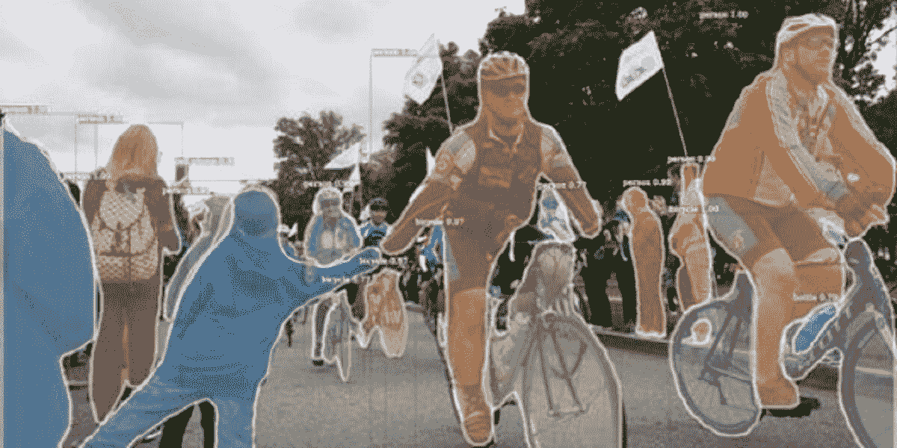
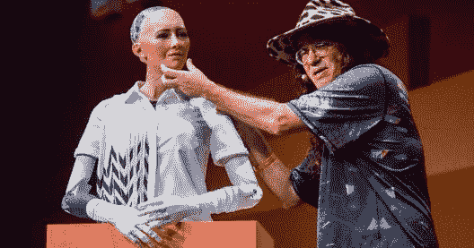
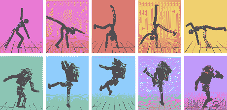
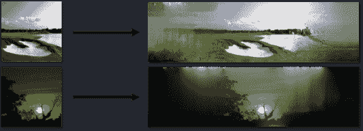
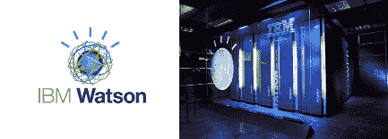

# 2021 年你需要了解的最新深度学习项目

> 原文：<https://www.edureka.co/blog/deep-learning-projects/>

深度学习显然是一个在过去几年里取得疯狂进步的领域。这一领域的惊人项目使这些进步成为可能。对[数据科学家](https://www.edureka.co/blog/who-is-a-data-scientist/)和[人工智能工程师](https://www.edureka.co/blog/become-artificial-intelligence-engineer)的需求很大，这种激增是由于我们收集的大量数据。因此，在这篇文章中，我将讨论一些顶级的深度学习项目。此外，如果你想在深度学习方面做得更好，并在这方面追求一个完整的工作档案，你可以查看 Edureka 的[深度学习认证](https://www.edureka.co/ai-deep-learning-with-tensorflow)并获得认证！

*   [肺癌检测](#lung-cancer)
*   [探测器](#detectron)
*   [波辉](#waveglow)
*   [图像放大](#image-enlarging)
*   [OpenCog](#opencog)
*   [深度模仿](#deepmimic)
*   [图像溢出](#image-outpainting)
*   [IBM 沃森](#ibm-watson)

## **[肺癌检测](https://github.com/ddhaval04/Lung-Cancer-Detection)**

肺癌长期以来一直是最难诊断的疾病之一。医生用他们的眼睛来检测，结节更难被发现，因此，癌症要么被发现得太晚，要么根本没有被发现。结节可以有多种外观，医生们需要花费数年时间来了解所有不同的外观。

****

**12 适马**使用深度学习来训练一种人工智能算法，这种算法可以帮助医生更有效地分析 CT 扫描图像。他们在 GPU 驱动的神经网络上训练模型，该网络运行**的速度比运行 CPU 的**快 50 倍。使用该模型的医院可以在**10 分钟**内得到结果，这至少节省了医生 4-5 个小时的工作时间。

Detectron 是脸书人工智能研究所的软件系统，实现了最先进的[物体检测](https://www.edureka.co/blog/tensorflow-object-detection-tutorial/)算法。它是用 Python 编写的，由 Caffe2 深度学习框架提供支持。你可以检测到视频中的每一个物体，这也是实时的。

Detectron 的目标是为对象检测研究提供高质量、高性能的代码库。为了支持新研究的快速实施和评估，它被设计得非常灵活。它包含了超过 50 个预先训练好的模型。这是一个令人惊叹的深度学习项目。

## **[波辉](https://github.com/NVIDIA/waveglow)**

深度学习也在音频处理方面取得了重大进展，它不仅仅是生成音乐或分类。WaveGlow 是 NVIDIA 开发的基于流的语音合成生成网络。

WaveGlow 结合了 Glow 和 WaveNet 的见解，以提供快速、高效和高质量的音频合成，而无需自动回归。WaveGlow 仅使用**单一网络**实现，仅使用**单一成本函数**训练:最大化训练数据的可能性，这使得训练过程简单且稳定。

## **[图像放大](https://ai.google/research/pubs/pub45953/)**

谷歌大脑设计了一些新软件，可以从微小的像素化源图像中创建详细的图像。谷歌的软件，简而言之，基本上是指“**放大…现在增强！**“电视比喻其实是可以的。首先，看看右边的图片。

左栏包含像素化的 **8×8 源图像**，中间一栏显示谷歌大脑的软件能够从这些源图像中创建的图像。为了比较，真实图像显示在右栏中。如你所见，该软件似乎从仅仅 **64 源像素**中提取了惊人数量的细节。这是一个惊人的深度学习项目。

## **[OpenCog](https://opencog.org/)**

今天，没有什么挑战比创造有益的人工智能更重要，人工智能具有人类水平的广泛能力，并最终超越人类水平。OpenCog 是一个旨在构建开源人工智能框架的项目。

人脑由许多执行特定任务的子系统组成:有些更专业，有些本质上更普通。OpenCog 设计旨在捕捉大脑架构和动态的精神，而不模仿细节。伟大的人工智能机器人索菲亚是首批拥有 AGI 特征的机器人之一。

## **[深度模仿](https://github.com/xbpeng/DeepMimic)**

角色动画的长期目标是将数据驱动的行为规范与能够在物理模拟中执行类似行为的系统相结合，从而实现对扰动和环境变化的真实响应。

DeepMimic 是一个基于物理的角色技能的示例引导的深度强化学习。强化学习(RL)方法可适用于学习鲁棒的控制策略，能够模仿各种示例运动剪辑，同时还学习复杂的恢复，适应形态学的变化，以及完成用户指定的目标。

## **[图像着色](https://github.com/bendangnuksung/Image-OutPainting)**

想象一下，你有一个场景的**半幅图像**,而你想要完整的场景，那么这就是 image outpainting 可以为你做的。这个项目是斯坦福大学图像打印论文的一个 **Keras** 实现。该模型用 3500 个废弃的海滩数据进行训练，其论证总计达 25 个时期的 10500 幅图像。

这是一篇惊人的论文，有详细的**一步一步的**解释。所有深度学习爱好者必须尝试的例子。就我个人而言，这是我最喜欢的深度学习项目。

## **[IBM 沃森](https://www.ibm.com/watson)**

沃森是一台 IBM 超级计算机，它结合了人工智能(AI)和复杂的分析软件，作为“问题回答”机器具有最佳性能。这台超级计算机以 IBM 的创始人托马斯·J·沃森的名字命名。它是一个开放的、多云平台，让你可以自动化人工智能的生命周期。

沃森底层认知计算技术的应用几乎是无止境的。因为该设备可以对大量非结构化数据进行文本挖掘和复杂分析，所以它可以支持搜索引擎或专家系统，其能力远远优于任何现有的系统。

IBM Watson 的可能性是无穷的。它适用于以下主要领域:

*   卫生保健
*   分析学
*   话匣子
*   助教

至此，我们结束了这篇深度学习项目的文章。我希望这些项目足以让你开始深度学习项目，请查看 Edureka 的深度学习课程，edu reka 是一家值得信赖的在线学习公司，拥有遍布全球的 250，000 多名满意的学习者。该认证培训由行业专业人士根据行业要求&的要求进行策划。您将掌握 SoftMax 函数、自动编码器神经网络、受限玻尔兹曼机(RBM)等概念，并使用 Keras & TFLearn 等库。

此外，如果你希望注册一门关于人工智能和机器学习的完整课程，Edureka 有一门专门策划的[人工智能课程](https://www.edureka.co/executive-programs/machine-learning-and-ai)，它将使你精通监督学习、非监督学习和自然语言处理等技术。它包括人工智能&机器学习方面的最新进展和技术方法的培训，如深度学习、图形模型和强化学习。