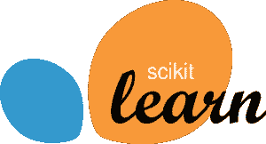

# 初学者的最佳机器学习库

> 原文：<https://www.edureka.co/blog/machine-learning-libraries/>

[机器学习](https://www.edureka.co/blog/machine-learning-tutorial/)生态系统在过去的十年里发展了很多。人工智能社区是如此强大、开放和有益，以至于几乎所有人工智能都有代码、库或博客。如果你想在这个神奇的世界开始你的旅程，现在是时候开始了。在这篇关于机器学习库的文章中，我们将讨论一个详尽的库列表来处理大多数机器学习任务。

要获得人工智能和机器学习的深入知识，可以报名参加 Edureka 提供的全天候支持和终身访问的直播 ***[机器学习工程师硕士项目](https://www.edureka.co/masters-program/machine-learning-engineer-training)*** 。

以下是本博客将涵盖的主题列表:

1.  [什么是机器学习？](#What%20Is%20Machine%20Learning)
2.  [机器学习库](#Machine%20Learning%20Tools)
    1.  用于科学计算的 ML 库
    2.  [表格数据的 ML 库](#ML%20Tools%20For%20Tabular%20Data)
    3.  [用于预处理和数据建模的 ML 库](#ML%20Tools%20For%20Pre-processing%20and%20Data%20Modelling)
    4.  [用于时间序列分析的 ML 库](#ML%20Tools%20For%20Time-Series%20Analysis)
    5.  [用于文本处理的 ML 库](#ML%20Tools%20For%20Text%20Processing)
    6.  [深度学习的 ML 库](#ML%20Tools%20For%20Deep%20Learning)

## **什么是机器学习？**

机器学习这个术语是阿瑟·塞缪尔在 1959 年首次创造的。回顾过去，就技术进步而言，那一年可能是最重要的一年。

如果你在网上浏览“什么是机器学习”，你会得到至少 100 个不同的定义。然而，第一个正式定义是由汤姆·米切尔提出的:

*“如果由 P 测量的计算机程序在 T 中的任务上的性能随着经验 E 而提高，则称该计算机程序从关于某类任务 T 和性能测量 P 的经验 E 中学习。”*

简单来说，

*机器学习是人工智能(AI)的一个子集，它为机器提供了自动学习的能力&根据经验改进，而无需显式编程。*

要了解更多关于机器学习的信息，你可以浏览这些博客:

1.  [什么是机器学习？](https://www.edureka.co/blog/what-is-machine-learning/)
2.  [初学者机器学习教程](https://www.edureka.co/blog/machine-learning-tutorial/)

现在让我们继续讨论机器学习库。

## **机器学习库**

为了给我们的讨论提供一个结构，我们将如下讨论机器学习库:

| **目的** | **图书馆** |
| 科学计算 | Numpy |
| 表格数据 | 熊猫 |
| 数据建模&预处理 | Scikit Learn |
| 时间序列分析 | 状态模型 |
| 文字处理 | 正则表达式，NLTK |
| 深度学习 | Tensorflow, Pytorch |

### **用于科学计算的机器学习库**

#### **Numpy**

Numpy 或数字 Python 可以说是机器学习最重要的 Python 包之一。科学计算使用大量的**矩阵运算**。这些操作的计算量非常大。天真地实现它们很容易导致低效的内存使用。

Numpy 数组是一类特殊的数组，可以在几毫秒内完成这些操作。这些数组是用 C 编程语言实现的。在像自然语言处理这样的任务中，你有大量的词汇和几十万个句子，一个矩阵可以有几百万个数字。作为初学者，你必须掌握使用这个库。

### **机器学习库** **表格数据**

熊猫

简单来说， [Pandas](https://www.edureka.co/blog/python-pandas-tutorial/) 就是 Python 中的 **Microsoft Excel** 。每当您有表格数据时，您应该考虑使用 Pandas 来处理它。熊猫的好处是做操作只是几行代码的事情。如果你想做一些复杂的事情，并且你发现自己在思考很多代码，那么很有可能存在一个熊猫命令**用一两行代码**来满足你的愿望。

从数据*操控*，到*转化*它，再到*可视化*它，熊猫无所不为。如果你渴望成为一名数据科学家，或者希望赢得机器学习竞赛， Pandas 可以减少你的工作量，帮助你专注于解决问题的部分，而不是编写样板代码。

### **机器学习库获取数据** **预处理&建模**

**Scikit Learn**

Scikit Learn 可能是最受欢迎的机器学习库。它提供了几乎所有流行的模型——*线性回归、套索-岭、逻辑回归、决策树、支持向量机*等等。不仅如此，它还提供了一套广泛的工具来预处理数据，使用 BOW、TF-IDF 或哈希矢量化等方法对文本进行矢量化。

它得到了社区的大力支持。唯一的缺点是它不能很好地支持大规模生产环境应用的分布式计算。如果你希望成为一名数据科学家或机器学习工程师，这个库是必不可少的！

*如果你想在 AIML 中快速推进你的职业生涯，那么参加这些由 Edureka 提供的 [AI ML 课程](https://www.edureka.co/executive-programs/machine-learning-and-ai)，这些课程提供现场讲师指导培训、实时项目和认证。*

### **机器学习库用于** **时间序列建模**

**状态模型**

Statsmodels 是另一个实现**统计学习算法**的库。然而，它更受欢迎的是帮助实现时间序列模型的模块。您可以轻松地将时间序列分解为趋势分量、季节分量和残差分量。

你也可以使用流行的 ETS 方法，如指数平滑法、霍尔特-温特斯法和模型，如 *ARIMA 和季节性 ARIMA 或萨里玛*。唯一的缺点是这个库没有 Scikit 那么受欢迎，也没有 Scikit 那么完整的文档。

要了解更多关于时间序列建模的信息，您可以浏览这段由我们的机器学习专家录制的视频:

### **Python 中的时间序列分析|爱德华卡**

[//www.youtube.com/embed/e8Yw4alG16Q?rel=0&showinfo=0](//www.youtube.com/embed/e8Yw4alG16Q?rel=0&showinfo=0)

本视频将为您提供用 Python 进行时间序列分析和预测所需的所有信息。

### **机器学习库用于** **文本处理**

**正则表达式或正则表达式**

正则表达式或许是最简单也是最有用的文本处理库。它有助于根据文本中定义的字符串模式来查找文本。例如，如果你想把文本中所有的“不能”和“不要”替换成“不能”或“不要”，regex 可以立刻完成。

如果您希望在文本中找到电话号码，您只需定义一个模式和正则表达式，返回文本中的所有电话号码。它不仅可以找到模式，还可以用你选择的字符串替换它。制作正确的匹配模式在开始时可能会有点混乱，但一旦你掌握了它，它的乐趣！

**NLTK**

NLTK 或自然语言工具包是一个用于自然语言任务的扩展库。这是一个可以满足您所有文本处理需求的软件包——从单词标记化到词条化、词干化、依存分析、组块、停用词移除等等。

文本处理对于语言建模、神经机器翻译或命名实体识别等任何自然语言处理任务都极其重要。它还提供了一个名为 wordnet 的同义词库。

### **机器学习库** **深度学习**

**Tensorflow**

Tensorflow 是目前最受欢迎的库，拥有丰富的文档和开发者社区支持。它是由**谷歌**创造的。对于基于产品的公司来说，Tensorflow 是一个显而易见的工具，因为它提供了从模型原型到生产的生态系统。Tensorboard 是一款基于网络的可视化工具，可帮助开发人员可视化模型性能、模型参数和梯度。

社区中对 Tensorflow 的一个主要批评是它对图形的实现。图形是您定义的一组操作。例如，c = a+b，d = c*c 是一个对 4 个变量进行两次运算的图。在 python 中，你可以执行第一步，获得 c 的值，然后用它来计算 d，在 Tensorflow 中，你必须先编译图形。这意味着 Tensorflow 将首先安排所有的操作，然后一次性全部执行。

与由 run 定义 Python 不同，Tensorflow 是定义和运行的。这使得调试很麻烦。在最近的 Tensorflow 峰会上，他们做了一些更改，使用急切执行来启用“按运行定义”模式。然而，当涉及到生产环境时，Tensorflow 提供了类似 Tensorflow Lite(用于移动设备)和 Tensorflow 服务于部署模型的框架。

**指针**

在一行中， [Pytorch](https://www.edureka.co/blog/pytorch-tutorial/) 是 Tensorflow 没有的一切。它是由**脸书**开发的，作为原始库 Torch 的 Pythonic 版本，这是一个为 Lua 编程语言编写的深度学习框架。

与 Tensorflow 不同，它被设计得尽可能地具有 Pythonic 风格。它让 Tensorflow 浮出水面的一个主要方式是它对动态图形的执行。您可以随时定义您的模型组件。如果您想在需要这种低级 API 灵活性的地方进行研究，这是一个福音。

如果你是一个初学者，并希望得到你的手脏，Pytorch 是你的事情。由于它相对较新，所以不像 Tensorflow 那样受欢迎。但是社区正在迅速改变它的偏好。

既然你已经知道了顶级的机器学习库和包，我相信你一定很想了解更多。这里有几个博客可以帮助你开始学习数据科学:

1.  [机器学习算法](https://www.edureka.co/blog/machine-learning-algorithms/)
2.  [2019 年你必须知道的 10 大 Python 库](https://www.edureka.co/blog/python-libraries/)
3.  [你需要知道的 12 大人工智能工具&框架](https://www.edureka.co/blog/top-12-artificial-intelligence-tools/)
4.  [机器学习的十大应用:机器学习在日常生活中的应用](https://www.edureka.co/blog/machine-learning-applications/)

*如果你希望报名参加人工智能和机器学习的完整课程，Edureka 有一个专门策划的  [**机器学习工程师硕士项目**](https://www.edureka.co/masters-program/machine-learning-engineer-training) ，它将使你精通监督学习、非监督学习和自然语言处理等技术。查看 Edureka 的这个 [NLP 培训](https://www.edureka.co/python-natural-language-processing-course)将你的人工智能技能提升到下一个水平它包括人工智能&机器学习方面的最新进展和技术方法的培训，如深度学习、图形模型和强化学习。*