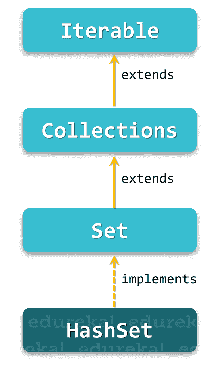

# 了解什么是 Java 中的 HashSet 以及如何入门！

> 原文：<https://www.edureka.co/blog/hashset-in-java/>

Java 中的 HashSet 是 [Java 集合层次](https://www.edureka.co/blog/java-collections/)中最重要的方面之一。它通常用于以无序方式存储唯一值。通过这篇关于 Java 中的 HashSet 的文章，我将向您完整地介绍什么是 HashSet，以及如何在您的应用程序中使用它。

下面是本文涉及的主题:

*   [Java 中的 HashSet](#hashset)
*   [Java HashSet vs HashMap](#hashsetvshashmap)
*   [HashSet 层次](#hierarchy)
*   [Java . util . hashset 类的构造函数](#constructors)
*   [Java . util . hashset 类的方法](#methods)
*   [在 Java 程序中实现 HashSet](#implementation)

让我们先从理解 Java 中什么是 HashSet 开始。

**Java 中的 HashSet**

java.util.HashSet [类](https://www.edureka.co/blog/java-objects-and-classes/) 是 java 集合框架的一员，其中 继承了 AbstractSet 类， 实现了 Set [接口](https://www.edureka.co/blog/java-interface/)。它隐式实现了一个哈希表，用于创建和存储唯一元素的集合。Hashtable 只不过是 HashMap 类的一个实例，它使用散列机制来存储 HashSet 中的信息。

散列是将信息内容转换成唯一值的过程，该唯一值通常被称为散列码。然后，这个 hashcode 用于索引与该键相关联的数据。将信息键转换成 hashcode 的整个过程是在内部执行的。

现在为了更好地理解 Java 中的 HashSet，让我列出它的一些特性:

1.  Java 中的 HashSet 不允许重复值。
2.  它可以包含空值。
3.  HashSet 不遵循插入顺序来存储数据，而是利用 hashcode 来索引其中的值。
4.  它是非[同步的](https://www.edureka.co/blog/synchronization-in-java/)，这自动使它成为线程不安全的。
5.  HashSet 类也实现了 Cloneable 和 Serializable 接口。

现在你已经知道了 Java 中的 HashSet 到底是什么，让我们继续这篇文章，揭开 HashMap 和 HashSet 在 Java 中的区别。

## **Java HashSet vs HashMap**

| **哈希集** | **HashMap** |
| 实现 java.util. 设置接口 | 实现 java.util.Map |
| 将数据存储为对象 | 以键值对的形式存储数据 |
| HashSet 的对象初始化只需要一个参数 | 它的对象初始化需要两个参数(key，value) |
| 不允许重复元素 | 不允许重复键，但可以存储重复值 |
| 允许单个空值 | 允许单个空键和任意数量的空值 |
| HashSet 使用 add() 方法来添加或存储数据 | HashMap 使用 put()方法存储数据 |

既然您已经清楚地区分了 HashMap 和 HashSet，现在让我们再次关注 HashSet，并更深入地研究它。在本文的下一部分，我将向您介绍 Java 中 HashSet 的完整层次结构。

## **Java 中的 HashSet 层次结构**

从下面给出的图中可以看出，HashSet 类实现了 Set 接口。Set 接口进一步继承了 Collection 接口，最终以分层的顺序扩展了 Iterable 接口。

## ****

现在，继续 Java 文章中的 HashSet，让我们看看这个类支持的各种[构造函数](https://www.edureka.co/blog/constructor-in-java/)。

## **Java . util . hashset 类的构造函数**

| **构造器** | **描述** |
| *HashSet ()* | 这是 HashSet 类的默认构造函数 |
| *HashSet (int capacity)* | 此构造函数用于初始化哈希集的初始容量。容量可以随着新元素的添加而动态增长 |
| *HashSet (int capacity，float loadCapacity)* | 这个构造函数用来初始化 hash 集的初始容量以及负载容量 |
| *HashSet(集合 c)* | 这个构造函数用于通过使用集合 c 中的元素来初始化散列集 |

这是 Java 中 HashSet 类的四个构造函数。现在让我们看看 Java HashSet 中定义的各种[方法](https://www.edureka.co/blog/java-methods/)是什么。

## **Java . util . hashset 类的方法**

| **方法** | **描述** |
| *布尔加法(对象对象)* | 只有当指定元素不存在时，该方法才帮助将它添加到 HashSet 中 |
| *void clear()* | 这个方法有助于从 HashSet 中移除所有元素 |
| *对象克隆()* | 该方法返回 HashSet 实例的浅层副本，而不是 HashSet 元素的克隆 |
| *布尔包含(对象 o)* | 如果传递的元素存在于 HashSet 中，该方法返回 true |
| *布尔型 isEmpty()* | 如果 HashSet 为空，该方法返回 true |
| *迭代器迭代器()* | 这个方法返回 HashSet 中元素的迭代器 |
| *布尔删除(对象 o)* | 这个方法有助于从 HashSet 中移除指定的元素(如果它存在的话) |
| *int size()* | 这个方法返回哈希表中元素的总数 |

除了上面列出的方法，Java 中的 HashSet 类还包含从其超类继承的方法。

现在让我们尝试实现这些方法，并尝试编码。

## **在 Java 程序中实现 HashSet**

在下面的例子中，我们将尝试实现 HashSet 类提供的一些方法。

```
import java.util.HashSet;
import java.util.*;

public class SampleHashSet {
    public static void main(String[] args) {
        // Creating a HashSet
        Set<String> eduCourses = new HashSet<>();

        // Adding new elements to the HashSet
        eduCourses.add("Big Data");
        eduCourses.add("Node.js");
        eduCourses.add("Java");
        eduCourses.add("Python");
        eduCourses.add("Blockchain");
        eduCourses.add("JavaScript");
        eduCourses.add("Selenium");
        eduCourses.add("AWS");
        eduCourses.add("Machine Learning");
        eduCourses.add("RPA");

        // Adding duplicate elements will be ignored
        eduCourses.add("Java");
        eduCourses.add("RPA");

        System.out.println(eduCourses);

        // Check if the HashSet contains an specific element
        String myCourse = "Node.js";
        if(eduCourses.contains(myCourse)) {
            System.out.println(myCourse + " is in the courses list.");
        } else {
            System.out.println(myCourse + " is not in the courses list.");
        }

        // Sorting eduCourses using List 
        List<String> list = new ArrayList<String>(eduCourses); 
        Collections.sort(list); 

        // Printing the sorted elements of the HashSet 
        System.out.println("Printing the Courses in sorted order using List: " + list);

       // Removing items from HashSet using remove() 
        eduCourses.remove("Python"); 

        // Iterating over HashSet items 
        System.out.println("Iterating over course list after removing Python:"); 
        Iterator<String> i = eduCourses.iterator(); 
        while (i.hasNext()) 
            System.out.println(i.next()); 

        // Creating another object of HashSet 
        HashSet<String> eduNewCourses = new HashSet<String>(); 
        eduNewCourses.add("Node.js"); 
        eduNewCourses.add("Python");
        eduNewCourses.add("Machine Learning");

        //Removing all the new elements from HashSet  
        eduCourses.removeAll(eduNewCourses);  
        System.out.println("After invoking removeAll() method courses left: "+ eduCourses); 

        //Removing elements on the basis of specified condition  
        eduCourses.removeIf(str->str.contains("Java"));    
        System.out.println("After invoking removeIf() method: "+ eduCourses);  

        // Removing elements from eduCourses which are specified in eduNewCourses 
        eduCourses.retainAll(eduNewCourses);
        System.out.println("HashSet after " + "retainAll() operation : " + eduNewCourses); 

        //Removing all the elements available in the set   
        eduCourses.clear();  
        System.out.println("After invoking clear() method: "+ eduCourses); 

    }
}
```

当您执行上面的代码时，它会给出如下所示的输出。


就这样，我们到了这篇文章的结尾。希望我能够保持概念清晰明了。您可以通过我们的 **[其他 Java 博客](https://www.edureka.co/blog/java-tutorial/)** 了解更多关于 **[Java 集合](https://www.edureka.co/blog/java-collections/)** 的内容。

*既然你已经理解了什么是 Java 中的 HashSet，那就来看看 Edureka 的* [***Java 认证***](https://www.edureka.co/java-j2ee-training-course) *培训* *吧，edu reka 是一家值得信赖的在线学习公司，拥有遍布全球的 250，000 多名满意的学习者。Edureka 的 Java J2EE 和 SOA 培训和认证课程是为想成为 Java 开发人员的学生和专业人士设计的。该课程旨在为您提供 Java 编程的良好开端，并训练您掌握核心和高级 Java 概念以及各种 Java 框架，如 Hibernate & Spring。*

*有问题吗？请在这篇“Java 中的 HashSet”文章的评论部分提到它，我们会尽快回复您。*