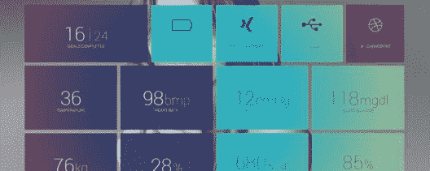

# 你需要知道的 10 大 JavaScript 库

> 原文：<https://www.edureka.co/blog/javascript-libraries/>

[web 开发](https://www.edureka.co/masters-program/full-stack-developer-training) 或者说 Web 编程催生了动态 Web 应用。随着网络的兴起， [JavaScript](https://www.edureka.co/blog/javascript-tutorial/) 已经成为当今世界最重要的语言之一。 这篇文章将按以下顺序列出应用程序中使用的一些最流行的 **JavaScript 库**:

*   [十大 JavaScript 库](#javascriptlibraries)
    *   [jQuery](#jquery)
    *   [D3.js](#d3)
    *   [反应](#react)
    *   [QUnit](#qunit)
    *   [香菜](#parsley)
    *   jquery ui
    *   [微光](#glimmer)
    *   [Anime.js](#anime)
    *   [Bideo.js](#bideo)
    *   [Multiple.js](#multiple)

## **十大 JavaScript 库**

JavaScript 库由用于构建功能强大的应用程序的函数组成。根据语言的不同，一个库有几种功能、对象和方法。因此您的应用程序可以链接到提供对该功能的访问的库。

这里列出了一些最流行的 JavaScript 库，可以帮助您轻松执行复杂的任务:

### **jQuery**

jQuery 是一个用于文档对象模型操作的库。DOM 是一种树状结构，表示网页上的所有元素。

它是最受欢迎的库之一，可以用来创建动画、处理事件等等。jQuery 的目标是可扩展、简单且易于使用。此外，它解决了所有跨浏览器的不兼容性，并促进了 HTML 和 JavaScript 的分离。

### **D3.js**

D3.js 用于可视化数据。它根据内容处理文档，还会通过使用 HTML、SVG 和 [CSS](https://www.edureka.co/blog/what-is-css/) 帮助你将数据变得生动。在这个库的帮助下，您可以生成 HTML 表格或创建交互式 SVG 图表。

这个库有一个强大的 API，使用类似 jQuery 的选择器。一旦在 DOM 中选择了一个元素，就可以进行各种转换和操作。

### **反应**

React 或 React.js 是由脸书支持的开源库。它有助于创建小型或大型 web 应用程序，在创建交互式网站时尤其有用。

React 是构建用户界面的最佳库，这有助于改善客户体验。如果你从事前端 web 开发，React 绝对是你应该关注的库。

### **QUnit**

复杂应用程序的手动测试相当麻烦和耗时。因此，开发 QUnit 是为了测试任何 JavaScript 代码。它支持 web 浏览器中的客户端环境和服务器端环境。

这是一个综合性的图书馆，拥有强大的社区支持和较短的学习曲线。

### **香菜**

如果你的下一个项目包含表单，欧芹就是你要找的库。这个 JavaScript 库关注于[表单验证](https://www.edureka.co/blog/javascript-validation/)，并且是用户友好的。

它还可以很好地与 Garlic 一起工作，Garlic 是一个 JavaScript 库，可以保存表单域的数据直到提交。欧芹是建设任何创意网站的最佳选择之一。不仅如此，它提供了比其他 JavaScript 库更多的表单验证技术。

### jquery ui

jQuery UI 只是 jQuery 众多附加组件中的一个。jQuery UI 用于在合并 jQuery 后向应用程序添加基本的图形元素。

这个图书馆因各种原因而脱颖而出。最重要的是，JQuery UI 可以在任何浏览器上运行，因此用户不太可能抱怨应用程序没有按预期运行。

### **微光**

Glimmer.js 是由 Ember 团队为寻找比 Ember.js 更小更轻的东西的开发人员开发的。它有助于 UI 组件和 DOM 渲染。此外，这个库是使用 Ember CLI 构建的，并使用 Git、Node.js、npm 和 Yarn。

如果您正在寻找一个工具来生成组件和助手，帮助项目布局，并简化您的过程，Glimmer 应该是您的选择。

### **Anime.js**

如今，动画和微互动相当流行。js 是一个灵活的 JavaScript 库，可以帮助你在你的网站上添加一些动感元素。

它可以与 CSS、单个转换、SVG、DOM 属性和 JavaScript 对象一起工作，使它非常通用，几乎适合任何项目。

### **Bideo.js**

Bideo.js 是一个 JavaScript 库，可以帮助你构建全屏视频来美化网站背景。此外，这个库使你添加视频背景的任务变得超级简单。

它在各种尺寸的屏幕上都很好看，缩放也非常流畅。因此，如果您正在为您的 web 应用程序处理视频，这是一个完美的选择。

### **Multiple.js**

Multiple.js 是一个了不起的库，它将帮助你创建有趣的背景视觉效果。它允许您使用 CSS 跨多个元素共享背景图像，这创建了一个非常有趣的视觉效果。

这是十大 JavaScript 库，可以帮助你建立一个有创意的网站设计。说到这里，我们的文章就到此为止了。

*既然你已经知道了排名前 10 的 JavaScript 库，那就去看看 Edureka 的 **[Web 开发认证培训](https://www.edureka.co/complete-web-developer)** 。* *Web 开发认证培训将帮助您学习如何使用 HTML5、CSS3、Twitter Bootstrap 3、jQuery 和 Google APIs 创建令人印象深刻的网站，并将其部署到亚马逊简单存储服务(S3)。*

*有问题吗？请在“JavaScript 库”的评论部分提到它，我们会回复您。*