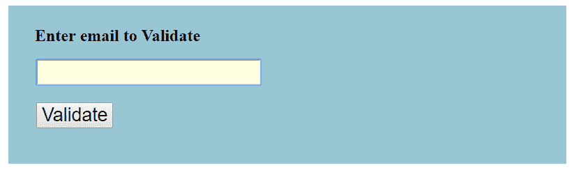
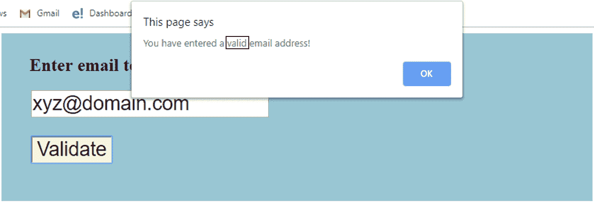
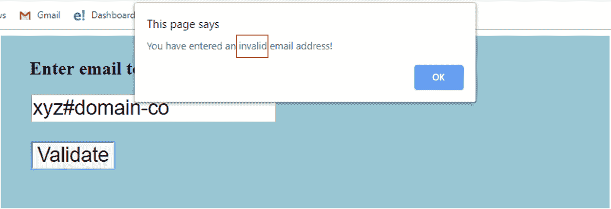

# 如何用 JavaScript 进行邮件验证？

> 原文：<https://www.edureka.co/blog/javascript-email-validation/>

JavaScript 是在[全栈](https://www.edureka.co/masters-program/full-stack-developer-training)，前端和后端开发中最流行的语言之一。它被用来创建设计精美的网站。在 JavaScript 中，验证用于认证用户。本文按以下顺序提供了一个用 JavaScript 代码进行**电子邮件验证的分步指南:**

*   什么是验证？
*   [JavaScript 中的电子邮件验证–一步一步](#emailvalidation)

## 什么是验证？

验证是一种通过  **认证** 用户的方法。JavaScript 提供了在客户端验证表单的工具，因此数据处理将比服务器端验证更快。这是大多数 web 开发人员的首选。通过 JavaScript，我们可以验证姓名、密码、电子邮件、日期、手机号码和更多字段。


**客户端** 验证防止客户端在重新加载页面之前知道表单是否可以。然而，  **服务器端** 验证很重要，因为客户端验证可以通过关闭 JavaScript 来完全绕过。

现在让我们继续，看看 JavaScript 中的电子邮件验证所涉及的步骤。

[https://www.youtube.com/embed/nm44wI6zOSc](https://www.youtube.com/embed/nm44wI6zOSc)

## **JavaScript 中的电子邮件验证–一步一步**

在**验证 HTML 表单**时，验证电子邮件是非常重要的一点。电子邮件是一个字符串或 ASCII 字符的子集，由“ **@** 符号分成两部分。

第一部分可由以下 **ASCII 字符**组成:

*   大写字母(a-z)和小写字母(A-Z)
*   数字(0-9)
*   人物如！# $ % & ' * + – / = ?^ _ ` { | } ~
*   性格。(句点、点号或句号)但它不应是第一个或最后一个字符，也不应一个接一个出现

域名由以下部分组成

*   信
*   数字
*   连字符
*   点

为了获得有效的电子邮件 id，我们使用了一个正则表达式 /^w+([.-]?w+)*@w+([。-]?w+)*(。w{2，3})+$/。现在让我们看看 JavaScript 代码中如何使用这个表达式来验证您的电子邮件 id:

**email-validation . js**

```

function ValidateEmail(inputText)
{
var mailformat = /^w+([.-]?w+)*@w+([.-]?w+)*(.w{2,3})+$/;
if(inputText.value.match(mailformat))
{
alert("You have entered a valid email address!");    //The pop up alert for a valid email address
document.form1.text1.focus();
return true;
}
else
{
alert("You have entered an invalid email address!");    //The pop up alert for an invalid email address
document.form1.text1.focus();
return false;
}
}

```

现在让我们在 HTML 表单中应用 JavaScript 函数:

emailvalidation.html

```

<!DOCTYPE html>
<html lang="en">
<head>
<meta charset="utf-8">
<title>JavaScript email validation</title>
<link rel='stylesheet' href='form-style.css' type='text/css' />   //link to the source file of css to add styles
</head>
<body onload='document.form1.text1.focus()'>
<div class="mail">
<h2>Enter email to Validate</h2>
<form name="form1" action="#">
<ul>
<li><input type='text' name='text1'/></li>
<li>&nbsp;</li>
<li class="Validate"><input type="submit" name="Validate" value="Validate" onclick="ValidateEmail(document.form1.text1)"/></li>  //Adding the submit button
<li>&nbsp;</li>
</ul>
</form>
</div>
    //link to the source file of javascript function
</body>
</html>

```

现在让我们在 **CSS** 的帮助下将**样式**添加到表单中:

form-style . CSS

```

li {list-style-type: none;
font-size: 16pt;
}
.mail {
margin: auto;
padding-top: 10px;
padding-bottom: 10px;
width: 800px;
background : rgb(153, 198, 211);
border: 1px soild rgb(1, 20, 24);
}
.mail h2 {
margin-left: 38px;
}
input {
font-size: 20pt;
}
input:focus, textarea:focus{
background-color: lightyellow;
}
input submit {
font-size: 10pt;
}

```

现在您已经创建了验证**电子邮件 id** 的表单，在执行 **HTML 代码**后，您将获得以下输出:

**输出**



现在根据正则表达式的格式，如果您输入有效的电子邮件 id，如***【xyz@domain.com】***，它将显示以下警告:



但是，如果您输入的电子邮件 id 违反了您的正则表达式格式规则，如 ***xyz#domain-co*** ，它将显示以下警告:



这些是 JavaScript 中电子邮件验证的不同步骤。我希望你了解 HTML、CSS 和 JavaScript 是如何一起用来构建一个验证表单的。

*既然你已经知道了 JavaScript 中的电子邮件验证，那就来看看 Edureka 的 **[Web 开发认证培训](https://www.edureka.co/complete-web-developer)** 。* *Web 开发认证培训将帮助您学习如何使用 HTML5、CSS3、Twitter Bootstrap 3、jQuery 和 Google APIs 创建令人印象深刻的网站，并将其部署到亚马逊简单存储服务(S3)。*

*有问题吗？请在“JavaScript 中的电子邮件验证”的评论部分提到它，我们会回复您。*