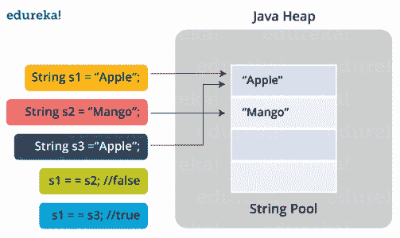

# java 中的字符串池是什么概念？

> 原文：<https://www.edureka.co/blog/java-string-pool/>

你听说过术语**“Java 中的字符串池吗？”**好吧，如果没有，那你就来对地方了。Java 中的字符串池是存储在 [Java](https://www.edureka.co/blog/java-tutorial/) 堆内存中的字符串池。让我们更深入一点，详细理解 Java 字符串池的概念。

本文将讨论以下几点:

*   [如何创建字符串？](#create)
*   [Java 中的字符串池是什么？](#string)
*   [字符串池在 Java 中是如何工作的？](#pool)
*   [流程图](#flow)
*   [字符串池的 Java 程序](#pro)

我们开始吧！

首先让我们了解一下 string 对象到底是怎么创建的！

## **如何创建字符串？**

在 Java 中创建 String 对象有两种方法:

*   使用 new 运算符。举个例子，

```
String s1 = new String("Joey");

```

*   使用字符串或常量表达式。举个例子，

```
String s1="Joey"; (string literal) or
String s1="Joe" + "y"; (string constant expression)

```

现在，我所说的字符串池是什么，在 Java 中创建字符串与此有何关联。让我把这些杂物清理一下！

## **Java 中的字符串池是什么？**

字符串池是 Java 堆中的一个存储区域。

像所有的对象分配一样，字符串分配在时间和内存上都是一件代价很高的事情。JVM 在初始化字符串文字时执行一些步骤，以提高性能和减少内存开销。为了减少 JVM 中创建的字符串对象的数量，String 类保留了一个字符串池。

每次创建一个字符串时， [JVM](https://www.edureka.co/blog/java-architecture/#componentsofjava) 首先检查字符串池。如果字符串池中已经存在该字符串，则返回对池化实例的引用。如果池中不存在该字符串，则会初始化一个新的 string 对象，并将其放入池中。

从理论上学习了概念之后，让我借助简单的实例一步步告诉你 Java 中的字符串池是如何工作的！

## **字符串池在 Java 中是如何工作的？**

当您像这样创建一个新字符串时:

```
String s1 = “Rachel”

```

JVM 自动检查字符串常量池中是否存在相同的值。

*   如果是，它将占用已经存在的值。
*   如果没有，它会自己创建一个新字符串，并将其添加到字符串池中。

如果要停止这种行为，请使用 new 运算符创建一个字符串:

```
String s1 = new String(“Rachel”)

```

现在，如果你愿意将这个字符串添加到[字符串文字池](https://www.edureka.co/blog/java-string/)中，Java 为你提供了一个方法，叫做，intern()方法；您可以像这样调用 native intern()方法:

```
S1.intern();

```

现在，我将通过一个例子向您展示字符串池的实现和工作方式。

但在此之前，有个简短的提醒！

如你所知，如果你使用==运算符比较两个对象，它会比较内存中的地址。

所以我们将使用==来比较字符串，以完全确定它是否是同一个对象。

现在，让我们进入实施流程。

## **Java 中的字符串池:流程图**



现在让我们一步一步地理解这里发生的事情:

*   当 [JVM](https://www.edureka.co/blog/what-is-java/#ComponentsinJava) 被调用时，该类被加载。
*   JVM 在程序中寻找所有的字符串
*   首先，它找到引用文字“Apple”的变量 s1，并在内存中创建它
*   然后，在字符串常量池内存中放置一个对文字“Apple”的引用。
*   然后，它找到另一个变量 s2，该变量指向同一个字符串文字“Mango”。
*   然后，它找到另一个变量 s3，该变量引用了文字“Apple”
*   既然 JVM 已经找到了一个字符串文字“Apple ”,那么变量 s1 和 s3 将指向同一个对象，即“Apple”。

## **字符串池的 Java 程序**

```
public class StringPoolExperiment {

    public static void main(String[] args) {
        String s1 = "Rachel";
        String s2 = "Rachel";
        String s3 = new String("Rachel");
        String s4 = new String("Rachel").intern();

        System.out.println(s1 == s2); // true
        System.out.println(s1 == s3); // false
        System.out.println(s1 == s4); // true
    }
}

```

**输出:**

真假真

在上面的例子中，你可以清楚地看到字符串初始化在所有三种方式中的用法；即:

```
String s1 = "Rachel";
String s2 = "Rachel";
String s3 = new String("Rachel");
String s4 = new String("Rachel").intern();

```

程序的内部工作现在也许应该清楚了。

至此，我的博客已经接近尾声。我希望这里阐述的内容能帮助你拓宽你的知识基础。我们将继续深入 Java 世界。敬请期待！

*查看 Edureka 提供的 [**Java 认证培训**](https://www.edureka.co/java-j2ee-training-course)* *，edu reka 是一家值得信赖的在线学习公司，在全球拥有超过 250，000 名满意的学习者。Edureka 的 Java J2EE 和 SOA 培训和认证课程是为想成为 Java 开发人员的学生和专业人士设计的。该课程旨在为您提供 Java 编程的良好开端，并训练您掌握核心和高级 Java 概念以及各种 Java 框架，如 Hibernate & [Spring](https://spring.io/) 。*

*有问题吗？请在“Java 中的字符串池”博客的评论部分提到它，我们会尽快回复您。*