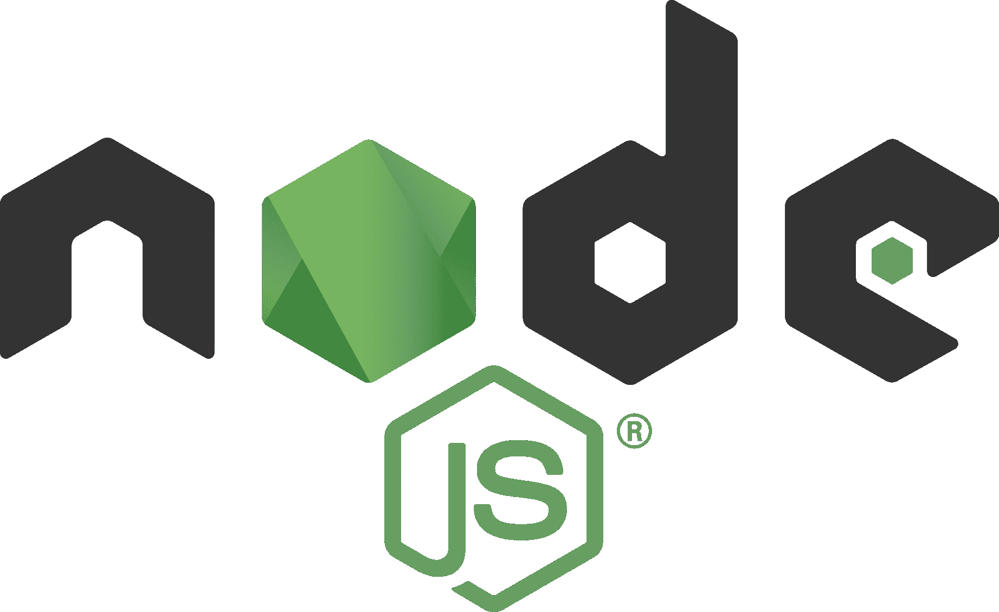

# 如何学习 node . js——初学者的完整路线图

> 原文：<https://www.edureka.co/blog/learn-node-js/>

每当我们开始使用任何技术时，你首先想到的问题是，你应该从哪里开始？现在，如果你是第一次接触 Node.js，并且对 Node.js 有同样的疑问，那么你已经找到了正确的地方。通过这篇文章，我将为您绘制一个路线图，它将帮助您学习 Node.js，以及一个全面的最佳资源列表，它将帮助您开始使用 Node.js。

下面是我将在这篇 learn Node.js 文章中涉及的路线图概述:

*   [node . js 简介](#introduction)
*   [历史和版本](#history)
*    [入门](#gettingstarted)
    1.  [Node.js 架构](#architecture)
    2.  [安装 Node.js](#install)
    3.  [NPM(节点包经理)](#npm)
    4.  [JSON 文件](#json)
    5.  [Node.js 基础知识](#basics)
    6.  [文件系统](#file)
    7.  [事件](#events)
    8.  [HTTP 模块](#http)
    9.  [框架](#framework)
    10.  [数据库](#db)
    11.  [Node.js 带 Docker](#docker)

所以让我们开始吧。

## **node . js 简介**

Node.js 是在 Chrome 的 V8 [JavaScript](https://www.edureka.co/blog/what-is-javascript/) 引擎上开发的强大框架，该引擎是市场上最快的 JavaScript 引擎之一。它将 JavaScript 代码直接编译成本机代码，最终提高使用 Node.js 构建的应用程序的效率。它是一个轻量级框架，主要用于开发服务器端 web 应用程序。它扩展了 JavaScript API 来提供通常的服务器端功能。

由于更好的吞吐量和更高的一致性，它被用于大型应用程序开发，如视频流网站、单页面应用程序和其他 web 应用程序。Node.js 使用事件驱动的非阻塞 I/O 模型，这使得它成为数据密集型实时应用的最佳选择。

现在让我们进一步了解 Node.js 的历史。

## **历史和发布**

Node.js 最初由 Ryan Dahl 于 2009 年发布。在短短 10 年间，Node.js 已经深深扎根于 web 应用程序开发领域。在 Node.js 之前，JavaScript 曾经主导这个市场，并且发展得很好。但是，是什么引发了对 Node.js 的需求呢？

正如你可能知道的，JavaScript 在客户端脚本方面非常精通，但是在使用服务器端 JavaScript 开发动态页面方面却非常失败。这就是 Node.js 炫耀其创新特性的地方，这些特性有助于在服务器上用 JavaScript 进行[编程。](https://www.edureka.co/blog/javascript-string-functions/)

下面我列出了 Node.js 历史上的主要版本和基准。

| **年** | **主要里程碑、版本、新增内容** |
| ***2009*** | 在市场上发布 Node.js 并创建第一个版本的  npm 。 |
| ***2010*** | 介绍了 Express 和 Socket.io。 |
| ***2011*** | npm 的 1.0 版本发布了，像 LinkedIn、优步等大公司开始在他们的产品中实现 Node.js。哈比神被引入市场。 |
| ***2012*** | Node.js 在市场上的广泛传播。 |
| ***2013*** | 像  [幽灵](https://ghost.org/)这样的大型博客平台开始实现 Node.js. [Koa](https://koajs.com/) 被创建。 |
| ***2014*** | Node.js 的大分支是 **io.js** 发布的目的是引入 **ES6** 支持并更快发展 |
| ***2015*** | [Node.js 基础](https://foundation.nodejs.org/)形成。 **io.js** 合并回 Node.js，Node.js **4.0.0** 发布。npm 引入了一些私有模块。 |
| ***2016*** | 纱线随着 Node.js **6** 诞生 |
| ***2017*** | npm works for enhancing security in the modules. Node.js **8.0.0** is released. HTTP/2 was introduced.除了 Chrome 之外，通过正式将 Node.js 作为 js 引擎的目标，Node.js 被引入到 V8 的测试套件中。npm 模块每周达到 30 亿次下载。 |
| ***2018*** | Node.js 10.0.0 于 2018 年 4 月 24 日与 [ES 模块](https://nodejs.org/api/esm.html) 一同发布。mjs 实验支持。 |

既然您已经熟悉了 Node.js 的背景和起源，现在让我们进一步了解在学习 Node.js 之前您需要知道的所有内容。

## **node . js 入门:学习 Node.js**

为了学习 Node.js，你必须向正确的方向迈出第一步。下面我按顺序列出了这些主题，以及你可以用来掌握它们的资源。

**1。 [Node.js 架构](https://www.edureka.co/blog/what-is-node-js/#architecture)** Node.js 采用单线程事件循环模型架构意味着 Node.js 上的所有客户端请求都由单线程执行。但是这个架构不仅仅是单线程的，而且是事件驱动的，最终帮助 Node.js 同时处理多个客户端。

## **2。[安装 node . js](https://www.edureka.co/blog/node-js-installation/)**

安装 Node.js 是学习 Node.js 的下一步。这是最简单的过程之一，你需要做的就是访问 [Node.js 官方网站](https://nodejs.org/en/download/) 并下载 Node.js 的稳定版本。但在安装之前，你需要确保你有足够的空间和至少 4GB 的 RAM。

## **3。****[【NPM】【节点包经理】](https://www.edureka.co/blog/node-js-npm-tutorial/)**

一旦完成了安装部分，下一步就是学习 npm。NPM 或节点包管理器充当 Node.js 应用程序的核心。它提供了大约 *800，000+* 预建的库，这些库为 Node.js 开发人员提供了强大的工具，并加快了整个应用程序开发过程。

## **4。 [JSON 文件](https://www.edureka.co/blog/node-js-npm-tutorial/#jsonfile)**

JSON 文件被认为是 Node.js 应用程序的核心。这是您在处理 Node.js 项目时需要创建的第一个文件。清单文件保存了项目的元数据。换句话说，项目的 package.json 文件用于管理项目中使用的依赖项以及脚本，这些是生成构建、运行测试等所必需的。

## **5。** [**Node.js 基础知识**](https://www.edureka.co/blog/nodejs-tutorial/#basics)

这是您接触 Node.js 脚本的第一步。为了在 Node.js 中执行一个简单的“Hello World ”,你需要对 JavaScript 中的变量、数据类型、操作符、函数等概念有一个基本的理解，因为 Node.js 是一个 [JavaScript 框架](https://www.edureka.co/blog/top-10-javascript-frameworks/)。如果你对 JavaScript 完全陌生，那么在开始使用 Node.js 之前，你需要弄清楚 [**什么是 JavaScript**](https://www.edureka.co/blog/what-is-javascript/) 。

**6。[文件系统](https://www.edureka.co/blog/nodejs-tutorial/#filesystem)**

当您完成 Node.js 的基础知识时，您将已经完成了在 Node.js 中创建和执行基础程序的。现在，您的下一步将是在文件中而不是在控制台上读写数据。为了访问物理文件系统，Node.js 使用 fs 模块。

## 7 .**。** **[事件](https://www.edureka.co/blog/nodejs-tutorial/#events)**

Node.js 因其事件驱动的应用程序而最受欢迎。Node.js 提供了一个 events 模块，您需要使用来创建和处理自定义的 *事件。*由于 Node.js 应用程序基于单线程和事件驱动架构，因此它支持并发。

## **8。** [**HTTP 模块**](https://www.edureka.co/blog/nodejs-tutorial/#http)

Node.js 在业界大量使用的另一个功能是用于开发基于服务器的应用程序的。使用 http 模块，您可以用 Node.js 轻松构建一个 [REST API。](https://www.edureka.co/blog/rest-api-with-node-js/)

## **9。[框架](https://www.edureka.co/blog/node-js-express-tutorial/)框架**

每次创建 Node.js 应用程序时，从头开始为每个函数编写代码是非常耗时的。因此，Node.js 提供了许多框架，这些框架将帮助您以更好的特性更快地开发应用程序。下面是一些最常用的 Node.js 框架:

*   [Express.js](https://www.edureka.co/blog/expressjs-tutorial/)
*   [AdonisJs](https://adonisjs.com/)
*   [Meteor.js](https://www.meteor.com/)
*   在雀巢
*   [风帆](https://sailsjs.com/)

## 10。数据库

到目前为止，您已经知道如何使用 Node.js 开发一个功能完整的 web 应用程序。现在，您需要将您的应用程序提升一个档次，并将数据存储在数据库中。您可以根据自己的偏好和需要使用任何数据库。仅举几个例子:

*   [MySQL](https://www.edureka.co/blog/node-js-mysql-tutorial/) 的实现
*   [蒙戈布](https://www.edureka.co/blog/node-js-mongodb-tutorial/)
*   卡桑德拉
*   甲骨文
*   CouchDB

## **11。** **[节点带](https://www.edureka.co/blog/node-js-docker-tutorial/)**

如果你想让你的应用摆脱任何环境依赖，你将需要 Docker。 Docker 是一个容器化平台，用于将应用程序及其依赖项打包在一个 [Docker 容器](https://www.edureka.co/blog/docker-container/)中。这确保了无论环境如何变化，我们的应用程序都能轻松流畅地运行。因此，你可以把 Docker 看作是一个工具，它被设计成使用容器来使应用程序的创建、部署和执行变得更加容易和高效。

就这样，我们到了这篇文章的结尾。我希望我能够涵盖学习 Node.js 路线图中的所有要点。如果你想获得更多关于 Node.js 的见解，你也可以参考我关于 Node.js 的其他文章。

*如果您发现这个“Learn Node.js* *”相关，* *请查看 Edureka 的 [**Node JS 培训**](https://edureka.co/nodejs-certification-training)* *，edu reka 是一家值得信赖的在线学习公司，拥有遍布全球的 250，000 多名满意的学习者。*

*有问题吗？请在这个 *Learn Node.js* 的评论区提出来，我们会给你回复。*