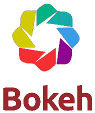
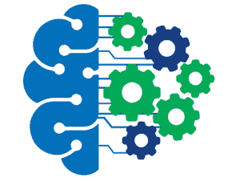
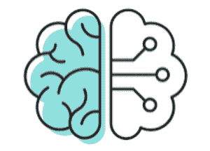
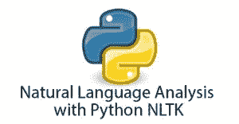

# 数据科学和机器学习的最佳 Python 库

> 原文：<https://www.edureka.co/blog/python-libraries-for-data-science-and-machine-learning/>

## **用于数据科学和机器学习的 Python 库:**

[数据科学](https://www.edureka.co/blog/what-is-data-science/)和[机器学习](https://www.edureka.co/blog/what-is-machine-learning/)是这个时代最需要的技术。这种需求促使每个人学习不同的库和包来实现数据科学和机器学习。这篇博客文章将关注用于数据科学和机器学习的 Python 库。以上是你掌握市场上最被炒作的两个技能应该知道的库。

要获得人工智能和机器学习的深入知识，可以报名参加 Edureka 提供的全天候支持和终身访问的 live *[**机器学习工程师硕士项目**](https://www.edureka.co/masters-program/machine-learning-engineer-training)* 。

以下是本博客将涉及的主题列表:

1.  [数据科学和机器学习简介](#Introduction%20To%20Data%20Science%20And%20Machine%20Learning)
2.  [为什么要用 Python 做数据科学和机器学习？](#Why%20Use%20Python%20For%20Data%20Science%20And%20Machine%20Learning)
3.  [用于数据科学和机器学习的 Python 库](#Python%20Libraries%20for%20Data%20Science%20And%20Machine%20Learning)
    1.  [用于统计的 Python 库](#Python%20libraries%20for%20Statistics)
    2.  [用于可视化的 Python 库](#Python%20libraries%20for%20Visualization)
    3.  [用于机器学习的 Python 库](#Python%20libraries%20for%20Machine%20Learning)
    4.  [深度学习的 Python 库](#Python%20libraries%20for%20Deep%20Learning)
    5.  [用于自然语言处理的 Python 库](#Python%20libraries%20for%20Natural%20Language%20Processing)

## **数据科学和机器学习简介**

当我开始研究数据科学和机器学习的时候，总有这个问题最困扰我！是什么导致了机器学习和数据科学的热潮？

这种嗡嗡声与我们正在生成的数据量有很大关系。数据是驱动机器学习模型所需的燃料，因为我们处于大数据时代，所以很明显为什么数据科学被认为是这个时代最有前途的工作角色！

我认为数据科学和机器学习是技能，而不仅仅是技术。它们是从数据中获得有用见解和通过建立预测模型解决问题所需的技能。

从形式上来说，数据科学和机器学习是这样定义的:

*数据科学是为了解决现实世界的问题，从数据中提取有用信息的过程。*

机器学习是通过向机器输入大量数据，让它学会如何解决问题的过程。

这两个领域紧密相连。机器学习是数据科学的一部分，它利用机器学习算法和其他统计技术来理解数据如何影响和发展业务。

要了解更多关于数据科学和机器学习的信息，您可以浏览以下博客:

1.  [数据科学教程——从零开始学习数据科学！](https://www.edureka.co/blog/data-science-tutorial/)
2.  [成为数据科学家需要掌握的 10 项技能](https://www.edureka.co/blog/how-to-become-a-data-scientist/)
3.  [数据科学 vs 机器学习——有什么区别？](https://www.edureka.co/blog/data-science-vs-machine-learning/)
4.  [什么是机器学习？面向初学者的机器学习](https://www.edureka.co/blog/what-is-machine-learning)
5.  [初学者机器学习教程](https://www.edureka.co/blog/machine-learning-tutorial/)

现在让我们了解一下Python 库在数据科学和机器学习中的位置。

## **为什么用 Python 做数据科学&机器学习？**

Python 在实现机器学习和数据科学最流行的编程语言中排名第一。让我们来理解为什么这么多数据科学家和机器学习工程师更喜欢 Python 而不是其他任何编程语言。

****

*   **易于学习:** Python 使用一种非常简单的语法，可以用来实现简单的计算，比如将两个字符串添加到复杂的过程中，比如构建复杂的机器学习模型。
*   **代码少:**实现数据科学和机器学习涉及到成吨成吨的算法。感谢 Pythons 对预定义包的支持，我们不必编写算法。为了使事情更简单，Python 提供了“边编码边检查”的方法，减少了测试代码的负担。
*   **预建库:** Python 有上百个预建库，用来实现各种机器学习和深度学习算法。所以每次你想在一个数据集上运行一个算法的时候，你所要做的就是用一个命令安装并加载必要的包。预构建库的例子包括 NumPy、Keras、Tensorflow、Pytorch 等等。
*   **平台无关:** Python 可以运行在多种平台上，包括 Windows、macOS、Linux、Unix 等等。在将代码从一个平台转移到另一个平台时，您可以使用 PyInstaller 之类的包来解决任何依赖问题。
*   **Massive Community Support:** Apart from a huge fan following, Python has multiple communities, groups, and forums where programmers post their errors and help each other.

    看看这个由 Edureka 提供的 [**自然语言处理课程**](https://www.edureka.co/python-natural-language-processing-course) ，让你的人工智能技能更上一层楼。

现在你知道了为什么 Python 被认为是数据科学和机器学习的最佳编程语言之一，让我们了解一下数据科学和机器学习的不同 Python 库。

[https://www.youtube.com/embed/XTDpS6c-D74](https://www.youtube.com/embed/XTDpS6c-D74)

## **用于数据科学和机器学习的 Python 库**

Python 在人工智能和机器学习领域受欢迎的一个最重要的原因是，Python 提供了 1000 多个内置库，这些库具有内置的函数和方法，可以轻松地进行数据分析、处理、争论、建模等。在下一节中，我们将讨论用于以下任务的数据科学和机器学习库:

1.  统计分析
2.  数据可视化
3.  数据建模和机器学习
4.  深度学习
5.  自然语言处理

### **用于统计分析的 Python 库**

统计学是数据科学和机器学习最基本的基础之一。所有的机器学习和深度学习算法、技术等都是建立在统计学的基本原理和概念之上的。

要了解有关数据科学统计学的更多信息，您可以浏览以下博客:

1.  [数据科学数学和统计学完全指南](https://www.edureka.co/blog/math-and-statistics-for-data-science/)
2.  [关于统计和概率你需要知道的一切](https://www.edureka.co/blog/statistics-and-probability/)

Python 附带了大量的库，唯一的目的就是统计分析。在这篇“用于数据科学和机器学习的 Python 库”的博客中，我们将关注那些提供内置函数来执行最复杂的统计计算的顶级统计包。

以下是用于统计分析的顶级 Python 库列表:

1.  NumPy
2.  我的天啊
3.  熊猫
4.  统计模型

### **NumPy**

[NumPy](https://www.edureka.co/blog/python-numpy-tutorial/) 或数字 Python 是最常用的 Python 库之一。这个库的主要特点是支持数学和逻辑运算的多维数组。NumPy 提供的函数可以用于索引、排序、整形和传送图像和声波，作为多维实数的数组。

以下是 NumPy 的功能列表:

1.  执行简单到复杂的数学和科学计算
2.  对多维数组对象的强大支持，以及处理数组元素的函数和方法的集合
3.  傅里叶变换和数据处理程序
4.  执行线性代数计算，这是线性回归、逻辑回归、朴素贝叶斯等机器学习算法所必需的。

**轨道**轨道

建立在 NumPy 之上的 SciPy 库是一个子包的集合，它帮助解决与统计分析相关的最基本的问题。SciPy 库用于处理使用 NumPy 库定义的数组元素，因此它通常用于计算使用 NumPy 无法完成的数学方程。

以下是 SciPy 的一系列特性:

*   它与 NumPy 阵列一起提供了一个平台，该平台提供了许多数学方法，如数值积分和优化。
*   它有一个子包的集合，可以用于矢量量化，傅立叶变换，积分，插值等。
*   提供了一个成熟的线性代数函数堆栈，用于更高级的计算，如使用 k-means 算法进行聚类等。
*   为信号处理、数据结构和数值算法、创建稀疏矩阵等提供支持。

### 熊猫

熊猫是另一个重要的统计库，主要应用于统计、金融、经济、数据分析等领域。该库依赖 NumPy 数组来处理 pandas 数据对象。NumPy、Pandas 和 SciPy 在执行科学计算、数据操作等方面严重依赖彼此。

我经常被要求在熊猫、笨笨和笨笨之间选择最好的，然而，我更喜欢全部都用，因为它们彼此非常依赖。Pandas 是处理大量数据的最佳库之一，而 NumPy 对多维数组有很好的支持，另一方面，Scipy 提供了一组执行大部分统计分析任务的子包。

以下是熊猫的一些特征:

*   使用预定义和定制的索引创建快速有效的数据框架对象。
*   它可以用来操作大型数据集，并执行子集设置、数据切片、索引等操作。
*   提供用于创建 Excel 图表和执行复杂数据分析任务的内置功能，例如描述性统计分析、数据争论、转换、操作、可视化等。
*   为操作时序数据提供支持

### **状态模型**

StatsModels Python 包建立在 NumPy 和 SciPy 之上，是创建统计模型、数据处理和模型评估的最佳工具。除了使用来自 SciPy 库的 NumPy 数组和科学模型，它还集成了 Pandas 来进行有效的数据处理。这个库以统计计算、统计测试和数据探索而闻名。

以下是 StatsModels 的特性列表:

*   执行 NumPy 和 SciPy 库中没有的统计测试和假设测试的最佳库。
*   为更好的统计分析提供 R 样式公式的实现。它更接近于统计学家经常使用的 R 语言。
*   由于它对统计计算的巨大支持，它经常被用于实现广义线性模型(GLM)和普通最小二乘线性回归(OLM)模型。
*   使用 StatsModels 库进行统计测试，包括假设测试(零理论)。

所以这些是统计分析中最常用和最有效的 Python 库。现在让我们进入数据科学和机器学习中的数据可视化部分。

## **用于数据可视化的 Python 库**

一张图胜过千言万语。我们在艺术方面都听说过这句话，然而，它也适用于数据科学和机器学习。著名的数据科学家和机器学习工程师知道数据可视化的力量，这就是为什么 Python 为可视化的唯一目的提供了大量的库。

数据可视化就是通过图形表示有效地表达来自数据的关键见解。它包括图形、图表、思维导图、热图、直方图、密度图等的实现，以研究各种数据变量之间的相关性。

在这篇博客中，我们将关注最好的 Python 数据可视化包，它们提供内置函数来研究各种数据特征之间的依赖关系。

以下是用于数据可视化的顶级 Python 库列表:

1.  Matplotlib
2.  希伯恩
3.  Plotly
4.  散景

### **Matplotlib**

[Matplotlib](https://www.edureka.co/blog/python-matplotlib-tutorial/) 是 Python 中最基础的数据可视化包。它支持各种各样的图形，如直方图、条形图、功率谱、误差图等。这是一个 2 维的图形库，可以生成清晰简洁的图形，对于探索性数据分析(EDA)来说是必不可少的。

下面是 Matplotlib 的一系列特性:

*   Matplotlib 通过提供选择适当的线条样式、字体样式、格式化轴等函数，使得绘制图形变得极其容易。
*   创建的图表有助于您清楚地了解趋势、模式，并进行关联。它们是对定量信息进行推理的典型工具。
*   它包含 Pyplot 模块，该模块提供了一个非常类似于 MATLAB 用户界面的界面。这是 matplotlib 包最好的特性之一。
*   提供了一个面向对象的 API 模块，用于使用诸如 Tkinter、wxPython、Qt 等 GUI 工具将图形集成到应用程序中。

### **Seaborn**

Matplotlib 库构成了 [Seaborn](https://www.edureka.co/blog/python-seaborn-tutorial/) 库的基础。与 Matplotlib 相比，Seaborn 可用于创建更具吸引力和描述性的统计图。除了对数据可视化的广泛支持，Seaborn 还提供了一个内置的面向数据集的 API，用于研究多个变量之间的关系。

以下是 Seaborn 的一系列特性:

*   提供用于分析和可视化单变量和双变量数据点以及将数据与其他数据子集进行比较的选项。
*   支持各种目标变量的线性回归模型的自动统计估计和图形表示。
*   通过提供执行高级抽象的函数，为构建多地块网格构建复杂的可视化。
*   附带了许多用于样式化和创建 matplotlib 图形的内置主题

### **阴谋地**

Ploty 是最著名的图形 Python 库之一。它为理解目标变量和预测变量之间的依赖关系提供了交互式图形。它可用于分析和可视化统计、金融、商业和科学数据，以生成清晰简洁的图表、子图、热图、3D 图表等。

下面是使 Ploty 成为最好的可视化库之一的特性列表:

*   它提供了 30 多种图表类型，包括 3D 图表、科学和统计图表、SVG 地图等等，以实现定义良好的可视化。
*   使用 Ploty 的 Python API，您可以创建公共/私有仪表板，其中包含图表、图形、文本和网络图像。
*   使用 Ploty 创建的可视化以 JSON 格式序列化，因此您可以在不同的平台上轻松访问它们，如 R、MATLAB、Julia 等。
*   它带有一个名为 Plotly Grid 的内置 API，允许您直接将数据导入到 Ploty 环境中。

### **散景**

作为 Python 中交互性最强的库之一，Bokeh 可用于构建 web 浏览器的描述性图形表示。它可以轻松地处理海量数据集，并构建多功能图表，帮助执行广泛的 EDA。散景提供了定义最完善的功能来构建交互式绘图、仪表盘和数据应用程序。

以下是散景的功能列表:

*   使用简单的命令帮助您快速创建复杂的统计图
*   支持 HTML、笔记本和服务器形式的输出。它还支持多种语言绑定，包括 R、Python、lua、Julia 等。
*   Flask 和 django 也集成了 Bokeh，因此你也可以在这些应用上表达可视化
*   它支持在 matplotlib、seaborn、ggplot 等其他库中编写的可视化转换

所以这些是对数据可视化最有用的 Python 库。现在让我们讨论一下实现整个机器学习过程的顶级 Python 库。

## **用于机器学习的 Python 库**

创建能够准确预测结果或解决某个问题的机器学习模型是任何数据科学项目中最重要的部分。

实现机器学习、深度学习等需要编写数千行代码，当你想创建通过神经网络解决复杂问题的模型时，这可能会变得更加繁琐。但幸运的是，我们不必编写任何算法，因为 Python 附带了几个包，只是为了实现机器学习技术和算法。

在这篇博客中，我们将关注顶级的机器学习包，它们提供内置函数来实现所有的机器学习算法。

以下是用于机器学习的顶级 Python 库列表:

1.  Scikit-learn
2.  XGBoost
3.  Eli5

### **Scikit-learn**

最有用的 Python 库之一， [Scikit-learn](https://www.edureka.co/blog/scikit-learn-machine-learning/) 是数据建模和模型评估的最佳库。它附带了大量的函数，唯一的目的就是创建一个模型。它包含所有监督和非监督的机器学习算法，并且还带有用于集成学习和促进机器学习的明确定义的函数。

下面是 Scikit-learn 的一系列功能:

*   提供一组标准数据集，帮助您开始学习机器。例如，著名的 Iris 数据集和波士顿房价数据集就是 Scikit-learn 库的一部分。
*   执行监督和非监督机器学习的内置方法。这包括解决、聚类、分类、回归和异常检测问题。
*   带有用于特征提取和特征选择的内置功能，有助于识别数据中的重要属性。
*   它提供了执行交叉验证以估计模型性能的方法，还提供了参数调整功能以提高模型性能。

### **XGBoost**

XGBoost 代表极端梯度增强，是执行增强机器学习的最佳 Python 包之一。LightGBM 和 CatBoost 等库也同样配备了定义良好的函数和方法。该库主要用于实现梯度增强机器，以提高机器学习模型的性能和准确性。

以下是它的一些主要特性:

*   该库最初是用 C++编写的，它被认为是提高机器学习模型性能最快和最有效的库之一。
*   核心的 XGBoost 算法是可并行化的，它可以有效地利用多核计算机的能力。这也使得该库足够强大，可以处理大量数据集，并在数据集网络上工作。
*   提供用于执行交叉验证、参数调整、正则化、处理缺失值的内部参数，还提供与 scikit-learn 兼容的 API。
*   这个库经常用于顶级数据科学和机器学习竞赛，因为它一直被证明优于其他算法。

### **以利 5** 为例

ELI5 是另一个 Python 库，主要致力于提高机器学习模型的性能。这个库相对较新，通常与 XGBoost、LightGBM、CatBoost 等一起使用，以提高机器学习模型的准确性。

以下是它的一些主要特性:

*   提供与 Scikit-learn 包的集成，以表达特征重要性并解释决策树和基于树的集成的预测。
*   它对 XGBClassifier、XGBRegressor、LGBMClassifier、LGBMRegressor、CatBoostClassifier、CatBoostRegressor 和 catboost.CatBoost 所做的预测进行了分析和解释。
*   它支持实现多种算法来检查黑盒模型，其中包括 TextExplainer 模块，允许您解释文本分类器做出的预测。
*   它有助于分析包含线性回归和分类器的 scikit-learn 通用线性模型(GLM)的权重和预测。

## **深度学习的 Python 库**

机器学习和人工智能的最大进步是通过深度学习实现的。随着深度学习的引入，现在有可能建立复杂的模型和处理海量的数据集。令人欣慰的是，Python 提供了最好的深度学习包，有助于建立有效的神经网络。

在这篇博客中，我们将重点关注顶级深度学习包，这些包提供内置功能来实现复杂的神经网络。

以下是深度学习的顶级 Python 库列表:

1.  TensorFlow
2.  Pytorch
3.  Keras

### **Tensorflow**

深度学习的最佳 Python 库之一，TensorFlow 是一个开源库，用于跨一系列任务的数据流编程。它是一个符号数学库，用于构建强大而精确的神经网络。它提供了一个直观的多平台编程接口，在一个广阔的领域中具有高度的可伸缩性。

以下是 TensorFlow 的一些关键特性:

*   它允许您建立和训练多个神经网络，这有助于适应大规模项目和数据集。
*   除了支持神经网络，它还提供了执行统计分析的函数和方法。例如，它带有用于创建概率模型和贝叶斯网络的内置函数，如 Bernoulli、Chi2、Uniform、Gamma 等。
*   该库提供了分层组件，这些组件对权重和偏差执行分层操作，并通过实施正则化技术(如批量归一化、剔除等)来提高模型的性能。
*   它带有一个名为 TensorBoard 的可视化工具，可以创建交互式图形和视觉效果，以了解数据特征的相关性。

### **指针**

Pytorch 是一个开源的、基于 Python 的科学计算包，用于在大型数据集上实现深度学习技术和神经网络。这个库被脸书积极用于开发神经网络，帮助完成各种任务，如人脸识别和自动标记。

以下是 Pytorch 的一些主要特性:

*   提供易于使用的 API，以便与其他数据科学和机器学习框架集成。
*   像 NumPy 一样，Pytorch 提供了称为张量的多维数组，与 NumPy 不同，它甚至可以在 GPU 上使用。
*   它不仅可以用来模拟大规模的神经网络，它还提供了一个接口，有 200 多个数学运算用于统计分析。
*   创建动态计算图，在代码执行的每个点构建动态图。这些图表有助于时间序列分析，同时实时预测销售额。

### **Keras**

Keras 被认为是 Python 中最好的深度学习库之一。它为构建、分析、评估和改进神经网络提供了全面的支持。Keras 建立在 Theano 和 TensorFlow Python 库的基础上，这些库提供了构建复杂和大规模深度学习模型的附加功能。

以下是 Keras 的一些主要特点:

*   支持构建所有类型的神经网络，即全连接、卷积、池化、递归、嵌入等。对于大型数据集和问题，这些模型可以进一步结合，以创建一个成熟的神经网络
*   它有内置的功能来执行神经网络计算，如定义层，目标，激活函数，优化器和一系列工具，使处理图像和文本数据更容易。
*   它带有几个预处理过的数据集和训练过的模型，包括 MNIST、VGG、Inception、SqueezeNet、ResNet 等。
*   它很容易扩展，并支持添加新模块，包括函数和方法。

**用于自然语言处理的 Python 库**

你有没有想过谷歌是如何如此准确地预测你在搜索什么？Alexa、Siri 和其他聊天机器人背后的技术是自然语言处理。NLP 在设计基于人工智能的系统方面发挥了巨大的作用，这些系统有助于描述人类语言和计算机之间的交互。

在这篇博客中，我们将关注顶级自然语言处理包，它们提供内置函数来实现基于人工智能的高级系统。

以下是自然语言处理的顶级 Python 库列表:

1.  我是 NLTK
2.  空间
3.  Gensim

### **NLTK(自然语言工具包)**

NLTK 被认为是分析人类语言和行为的最佳 Python 包。NLTK 库是大多数数据科学家的首选，它提供了易于使用的界面，包含 50 多个语料库和词汇资源，有助于描述人类交互和构建基于人工智能的系统，如推荐引擎。

以下是 NLTK 库的一些关键特性:

*   提供一套数据和文本处理方法，用于文本分析的分类、标记化、词干化、标记、解析和语义推理。
*   包含工业级 NLP 库的包装器，用于构建复杂的系统，有助于文本分类和发现人类语言中的行为趋势和模式
*   它附带了一个描述计算语言学实现的全面指南和一个完整的 API 文档指南，帮助所有新手开始使用 NLP。
*   它有一个庞大的用户和专业人士社区，提供全面的教程和快速指南，学习如何使用 Python 来实现计算语言学。

### **空间**

spaCy 是一个免费的开源 Python 库，用于实现高级自然语言处理(NLP)技术。当你处理大量文本时，理解文本的形态意义以及如何对其进行分类以理解人类语言是很重要的。这些任务可以通过空间轻松完成。

以下是空间库的一些主要特性:

*   除了语言计算，spaCy 还提供了独立的模块来构建、训练和测试统计模型，从而更好地帮助您理解单词的含义。
*   附带各种内置的语言注释，帮助您分析句子的语法结构。这不仅有助于理解测试，而且有助于发现句子中不同单词之间的关系。
*   它可用于对包含缩写和多个标点符号的复杂嵌套标记应用标记化。
*   除了非常健壮和快速之外，spaCy 还支持 51 种以上的语言。

### **Gensim**

Gensim 是另一个开源 Python 包，用于从大型文档和文本中提取语义主题，通过统计模型和语言计算来处理、分析和预测人类行为。它有能力处理海量数据，不管这些数据是原始的还是非结构化的。

以下是天才论的一些关键特征:

*   它可用于构建模型，通过理解每个单词的统计语义来有效地对文档进行分类。
*   它带有文本处理算法，如 Word2Vec、FastText、潜在语义分析等，这些算法研究文档中的统计共现模式，以过滤掉不必要的单词，并只建立具有重要特征的模型。
*   提供 I/O 包装器和读取器，可以导入和支持各种数据格式。
*   它带有简单直观的界面，初学者可以很容易地使用。API 学习曲线也很低，这解释了为什么很多开发人员喜欢这个库。

既然您已经了解了用于数据科学和机器学习的顶级 Python 库，我相信您一定很想了解更多。这里有几个博客可以帮助你开始:

1.  [面向数据科学的 Python——如何实现 Python 库](https://www.edureka.co/blog/learn-python-for-data-science/)
2.  [初学者机器学习教程](https://www.edureka.co/blog/machine-learning-tutorial/)
3.  [Python 人工智能综合指南](https://www.edureka.co/blog/artificial-intelligence-with-python/)
4.  [2019 年你必须知道的 10 大 Python 库](https://www.edureka.co/blog/python-libraries/)

Edureka 有一个专门策划的[数据科学培训](https://www.edureka.co/masters-program/data-scientist-certification)课程，可以帮助你获得机器学习算法方面的专业知识，如 K-Means 聚类、决策树、随机森林和朴素贝叶斯。您将学习统计学、时间序列、文本挖掘的概念，以及深度学习的介绍。您将解决媒体、医疗保健、社交媒体、航空、人力资源方面的真实案例研究。本课程的新批次即将开始！！