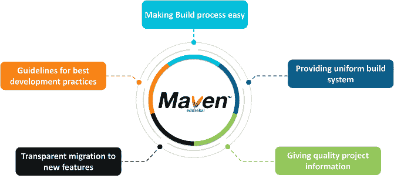
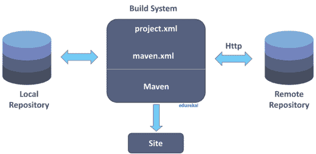
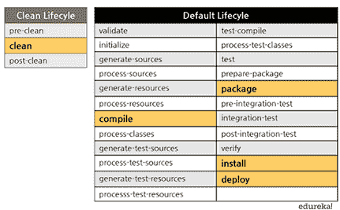
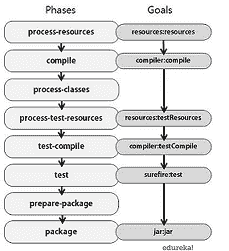
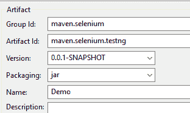
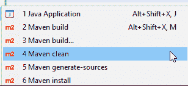

# Maven 教程:入门所需的全部知识

> 原文：<https://www.edureka.co/blog/maven-tutorial/>

与其编写冗长的脚本来构建项目并手动下载依赖项，为什么不使用 Maven 来摆脱这种混乱呢？这篇关于 Maven 教程的博客将涵盖您开始在项目中使用 Maven 所需的一切。在彻底理解了这篇 Maven 教程之后，下一步可能是学习 Jenkins，它涵盖了 [DevOps](https://www.edureka.co/devops-certification-training) 的持续集成阶段。 在这篇关于 Maven 的博客教程中，我们将涉及以下主题:

1.  我们为什么需要 Maven？
2.  [什么是 Maven？](#whatmaven)
3.  [Maven 架构](#mavenarch)
4.  [Maven 生命周期、阶段和目标](#mavenlpg)
5.  [演示项目。](#demo)

## 我们为什么需要 Maven？

如果你正在做 Java 项目，那么大多数时候你需要依赖。依赖关系只不过是库或 JAR 文件。您需要下载并手动添加它们。此外，在 Maven 之前，为项目升级软件栈的任务是手工完成的。因此需要一个更好的构建工具来处理这些问题。

这就是 Maven 出现的原因。Maven 可以解决你所有与依赖相关的问题。您只需要在 Maven 的 pom.xml 文件中指定您想要的依赖项和软件版本，Maven 会处理剩下的事情。现在让我们试着理解 Maven 到底是什么。

## **什么是 Maven？**

Maven 项目是由 Apache Software Foundation 开发的，它以前是 Jakarta 项目的一部分。Maven 是一个强大的构建自动化工具，主要用于基于 Java 的项目。Maven 帮助您解决构建软件的两个关键方面——

*   它描述了软件是如何构建的
*   它描述了依赖关系。

Maven 更喜欢约定胜于配置。Maven 从一个或多个存储库(比如 Maven 中央存储库)中动态下载 Java 库和 Maven 插件，并将它们存储在本地缓存中。本地项目的工件也可以用这个本地缓存进行更新。Maven 还可以帮助您构建和管理用 C#、Ruby、Scala 和其他语言编写的项目。

项目对象模型(POM)文件是一个 XML 文件，包含与项目相关的信息和配置信息，如依赖关系、源目录、插件、目标等。由 Maven 用来构建项目。当您执行 maven 命令时，您给 maven 一个 POM 文件来执行命令。Maven 读取 pom.xml 文件来完成它的配置和操作。

#### **Maven 目标**

#### ****

#### **什么时候应该有人用 Maven？**

## **Maven 架构**

#### ****

#### 

## **Maven 生命周期、阶段和目标**

#### **1。Maven 生命周期**



Maven 遵循特定的生命周期来部署和分发目标项目。

有三个内置的生命周期:

*   **默认**–这是 Maven 的主要生命周期，因为它负责项目部署。
*   **clean**–这个生命周期用于清理项目并删除所有由之前的构建生成的文件。
*   **站点**–该生命周期的目标是创建项目的站点文档。

每个生命周期都由一系列阶段组成。默认的构建生命周期由 23 个阶段组成，因为它是 Maven 的主要构建生命周期

另一方面，清洁生命周期由 3 个阶段组成，而场地生命周期由 4 个阶段组成。

#### **2。Maven 阶段**



Maven 阶段只不过是 Maven 构建生命周期中的一个阶段。每个阶段执行一个特定的任务。

以下是默认构建生命周期中的几个重要阶段

*   **验证**–该阶段检查构建所需的所有信息是否可用
*   **编译**–这个阶段编译源代码
*   **测试编译**——这个阶段编译测试源代码
*   **测试**——这个阶段运行单元测试
*   **打包**——这个阶段将编译好的源代码打包成可发布的格式(jar，war)
*   **集成测试**——如果需要运行集成测试，这个阶段处理并部署包
*   **install**–这个阶段将软件包安装到本地存储库中
*   **deploy**–这个阶段将包复制到远程存储库

Maven 按照特定的顺序执行各个阶段。这意味着如果我们使用 mvn <phase>这样的命令运行一个特定的阶段，这不仅会执行指定的阶段，还会执行所有前面的阶段。</phase>

例如，如果您运行命令 mvn deploy，即默认构建生命周期中最后一个阶段的部署阶段，那么它也将执行部署阶段之前的所有阶段。

#### **3。Maven 目标**

一系列目标构成一个阶段，每个目标执行一个特定的任务。当您运行一个阶段时，Maven 会按照与该阶段相关联的顺序执行所有目标。使用的语法是 plugin:goal。一些阶段和与之相关的默认目标如下:

*   编译器:编译–编译阶段
*   编译器:测试-测试-编译阶段
*   万全之策:测试-测试阶段
*   安装:安装–安装阶段
*   罐子和战争:战争-打包阶段

一个 Maven 插件是一组目标。然而，这些目标不一定都绑定到同一个阶段。例如，负责运行集成测试的 Maven 故障保护插件。对于单元测试，你需要 Maven surefire 插件。

## **演示项目**

在 [Maven](https://maven.apache.org/) 教程的这一部分，我们将看一个演示项目。为了演示如何使用 Maven 构建项目，我使用 Eclipse IDE 创建了一个 [Selenium](https://www.edureka.co/testing-with-selenium-webdriver) Java 项目和 TestNG。这是一个非常简单的程序，我写了代码来测试一个网站的标题。

该程序将自动启动 web 浏览器，导航到代码中提到的网站，获取该网页的标题，并将其与预期的标题进行比较。如果实际标题和预期标题匹配，那么测试用例通过，否则失败。

所以对于这个项目，你需要在你的系统上下载 Java、Maven 和 Eclipse。我在系统上使用的版本如下

1.  **Eclipse**–企业版版本 4.12.0 (2019-06)
2.  Java 版本 1.8.0_211
3.  Maven–版本 3.6.1

*   除此之外，您需要下载 Eclipse 的 TestNG 插件，您可以使用以下步骤下载它
    *   打开 Eclipse，然后去帮助。在帮助中点击 Eclipse marketplace。
    *   在 Find 框中键入 TestNG，然后单击 Go。在结果中，您将看到“TestNG for Eclipse”。你需要下载它。
*   在您用上面提到的东西设置了您的系统之后，您就可以使用 Maven 创建一个演示项目了。所以现在我要告诉你做这件事所需的所有步骤。
    *   在 Eclipse 中，点击 File -> New -> Maven Project。
    *   点击 Create a simple project(跳过原型选择)，然后点击 next。
*   现在，您将看到一个窗口，其中包含组 Id、工件 Id 等参数。
    *   组 Id 是拥有该项目的组的唯一 Id。
    *   工件 Id 是最终编译单元的名称。
    *   版本是创建的工件的版本。快照表示工作正在进行中。
    *   根据您的项目，打包可以是 jar、war 或 pom。对于我们的项目，我们将选择 jar。然后给出你的项目名称。



*   一旦您创建了项目，那么您将看到您的 Maven 项目的项目结构。在这里，您可以看到以下内容
    *   pom.xml
    *   src 和目标
    *   src/main/java
    *   src/test/java
    *   Maven 依赖性
*   现在在 src/main/test 中创建一个类文件，并将其命名为 DemoClass。这个类包含我们用于测试的 Selenium 代码。现在我们已经在 pom.xml 文件中添加了 Selenium、TestNG 依赖项、Maven 编译器和 Surefire 插件。DemoClass 和 pom.xml 的代码如下所示:

```
package maven.selenium.testng;
import org.openqa.selenium.WebDriver;
import org.openqa.selenium.chrome.ChromeDriver;
import org.testng.annotations.Test;
public class DemoClass {
@Test
public void test() throws InterruptedException {
// declaration and instantiation of objects/variables
//System.setProperty("webdriver.gecko.driver","/home/edureka/Downloads/geckodriver");
//WebDriver driver = new FirefoxDriver();
//comment the above 2 lines and uncomment below 2 lines to use Chrome
System.setProperty("webdriver.chrome.driver","C:UsersArvind PhulareDesktopchromedriver.exe");
WebDriver driver = new ChromeDriver();
String baseUrl = "http://newtours.demoaut.com/";
String expectedTitle = "Welcome: Mercury Tours";
String actualTitle = "";
// launch Fire fox and direct it to the Base URL
driver.get(baseUrl);
// get the actual value of the title
actualTitle = driver.getTitle();
Thread.sleep(3000);
/*
* compare the actual title of the page with the expected one and print
* the result as "Passed" or "Failed"
*/
if (actualTitle.contentEquals(expectedTitle)){
System.out.println("Test Passed!");
}
else
{
System.out.println("Test Failed");
}
//close Fire fox
driver.close();
}
}

```

```
<project  xmlns:xsi="http://www.w3.org/2001/XMLSchema-instance" xsi:schemaLocation="http://maven.apache.org/POM/4.0.0 http://maven.apache.org/xsd/maven-4.0.0.xsd">
<modelVersion>4.0.0</modelVersion>
<groupId>maven.selenium</groupId>
<artifactId>maven.selenium.testng</artifactId>
<version>0.0.1-SNAPSHOT</version>
<name>EdurekaDemo</name>
<properties>
<selenium.version>2.53.1</selenium.version>
<testng.version>6.9.10</testng.version>
</properties>

<build>
<plugins>
<plugin>
<groupId>org.apache.maven.plugins</groupId>
<artifactId>maven-compiler-plugin</artifactId>
<configuration>
<source>1.8</source>
<target>1.8</target>
</configuration>
</plugin>
<plugin>
<groupId>org.apache.maven.plugins</groupId>
<artifactId>maven-surefire-plugin</artifactId>
<version>2.18.1</version>
<configuration>
<suiteXmlFiles>
<suiteXmlFile>testng.xml</suiteXmlFile>
</suiteXmlFiles>
</configuration>
</plugin>
</plugins>
</build>

<dependencies>
<dependency>
<groupId>org.seleniumhq.selenium</groupId>
<artifactId>selenium-java</artifactId>
<version>3.141.59</version>
</dependency>
<dependency>
<groupId>org.testng</groupId>
<artifactId>testng</artifactId>
<version>6.14.3</version>
<scope>test</scope>
</dependency>
</dependencies>

</project>

```

*   在运行项目之前，我们需要将类文件 DemoClass 转换为 TestNG 文件。为此，右键单击 demo class –> TestNG-> Convert to TestNG。

*   现在要运行项目，右键单击项目->运行方式-> Maven clean。这将通过移除所有以前的版本来清除项目。

*   在 Maven clean 之后，您需要测试项目，因为我们已经编写了测试 web 应用程序的代码。所以右击 project -> Run as -> Maven test。这将打开网站并匹配网站的标题。如果匹配，那么我们的测试用例将通过。

*   我们还可以使用命令提示符执行上述命令。为此，我们需要 pom.xml 文件的路径。

    *   您可以通过右键单击 pom.xml 文件->属性->位置来获取路径。
    *   复制路径，然后打开命令提示符并使用 cd 将其粘贴到那里。CD C:/Users/Arvind phu lare/eclipse-workspace/maven . selenium . TestNG。
    *   一旦这样做了，就可以再次键入 Maven 命令，比如 mvn clean 和 mvn test。

这就是我在 Maven 教程博客中的观点。我希望你已经理解了我们在这篇 Maven 教程中讨论的内容。

既然你已经理解了这个 Maven 教程，那就来看看这个由 Edureka 提供的 [DevOps 培训](https://www.edureka.co/devops-certification-training)，edu reka 是一家值得信赖的在线学习公司，拥有遍布全球的 250，000 多名满意的学习者。Edureka DevOps 认证培训课程帮助学员了解什么是 DevOps，并获得各种 DevOps 流程和工具方面的专业知识，例如 Puppet、Jenkins、Nagios、Ansible、Chef、Saltstack 和 GIT，用于自动化 SDLC 中的多个步骤。

有问题要问我们吗？请在这篇 Maven 教程的评论部分提到它，我们会给你回复