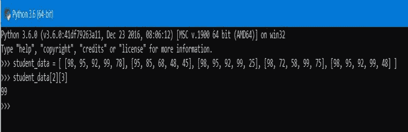
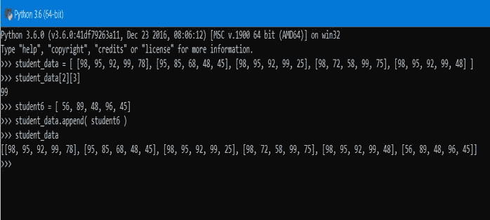
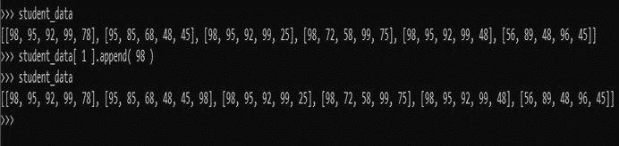
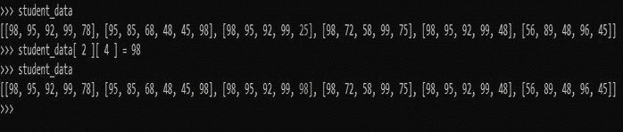
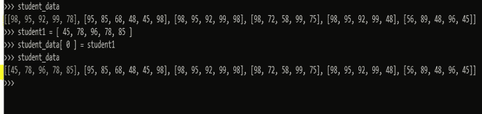
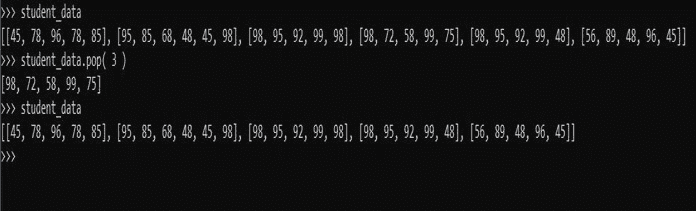
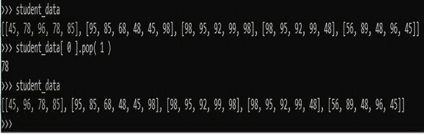

# 如何用 Python 实现二维数组？

> 原文：<https://www.edureka.co/blog/2d-arrays-in-python/>

欢迎大家来到这个 python 教程，在这里我们将学习到 [Python](https://www.edureka.co/blog/python-tutorial/) 中的 2D 数组。整篇文章被分成了几个主题，以保持流畅。本文将涉及以下几点:

*   [什么是数组？](#Whatarearrays?)
*   [python 中数组是如何定义和使用的？](#Howarearraysdefinedandusedinpython?)
*   [使用 list 对象作为数组有什么好处？](#Whataretheadvantagesofusinglistobjectananarray?)
*   什么是二维数组，如何使用列表对象创建二维数组？
*   如何在二维数组中插入元素？
*   如何更新二维数组的元素？
*   如何移除二维数组的元素？

因此，请系好安全带，让我们从这篇关于 Python 中 2D 数组的文章开始吧。

## **Python 中的 2D 数组**

## **什么是数组**？

所以在深入数组实现之前，首先让我们看看什么是真正的数组！

数组是一种线性数据结构，它包含顺序内存位置中相同类型元素的有序集合。所以数组是一种数据结构，用于在内存中线性存储相同类型的元素。在每一种编程语言中，数组都表示为 Array_name[index]。索引是表示特定元素在内存位置的位置号的数字。因为它使用顺序存储器，所以索引号也是连续的。很明显，数组索引从 0 开始，到 n-1 结束，其中 n 是数组的大小。

继续这篇关于 Python 中 2D 数组的文章。

## **python 中数组是如何定义和使用的？**

我们都知道数组在 python 中不是一个独立的对象，但是我们可以使用 list 对象来定义它，并把它作为一个数组来使用。

例如，考虑一个由十个数字组成的数组:A = {1，2，3，4，5} 用于声明数组的语法:

```
array_name=[ ]
```

如果您想用值初始化它，您可以使用:

```
array_name = [value1, value2, value3, value n]
```

为了遍历一个数组，我们使用索引，例如，如果我们想得到值 2，我们使用

```
array_name[ location of value 2 starting from 0]
```

继续这篇关于 Python 中 2D 数组的文章。

## **使用**列表**作为数组的优势**

使用列表描述数组有很多优点。它不仅支持数组的基本操作，还支持一些高级操作:

*   它支持切片。通过切片，我们可以在任何维度上对数组进行切片。
*   它支持负索引。现在，您可以使用 array_name[ -1 ]获得最后一个元素，类似地-2 给出倒数第二个元素。
*   它有存储、更新和操作数据的内置功能。
*   它可以将不相似的元素存储在一起。它重载了+和*运算符。

因此，列表提供了一种实现数组的强大方法。

继续这篇关于 Python 中 2D 数组的文章。

## 什么是二维数组，如何使用列表对象创建二维数组？

现在最重要的部分来了；二维数组。从机器学习数据帧到矩阵，最广泛使用的数组是二维数组。基本上，二维数组被定义为数组的数组。这听起来可能有点令人困惑，但让我们理解这是什么意思。

到目前为止，我们已经看到了一个保存类似[ 1，2，3，4，5]的数据的数组，如果要绘制这些点，它可以被解释为坐标几何中的线。如果我说我有 5 个学生的 5 个科目的数据:

*   学生 1 = [98，95，92，99，78]
*   学生 2 = [95，85，68，48，45]
*   学生 3 = [98，95，92，99，25]
*   学生 4 = [98，72，58，99，75]
*   学生 5 = [98，95，92，99，48]

现在你可以有五个不同的列表来存储这些数据，但是这将是低效的，坦率地说，这不是一个使用列表的好结构。此外，即使是小数据也是可能的，但在 10 万名学生的情况下，我们会怎么做？显然，这种结构对于一个优秀的程序员来说是不可接受的。

二维数组来拯救我们了。如果我们可以将这五个学生数组存储在一个数组中呢？嗯，我们可以！这就是数组的数组的含义。我们将把这些数组存储在数组本身中。因为如果你把这些元素看作几何点来绘制，那么你将需要两个平面(即 x 和 y)，因此称为 2-d 阵列或二维阵列。

同样的二维数组将是:

```
student_data = [ [98, 95, 92, 99, 78], [95, 85, 68, 48, 45], [98, 95, 92, 99, 25], [98, 72, 58, 99, 75], [98, 95, 92, 99, 48] ]
```

为了访问元素，我们将使用两个索引，第一个索引定义存储元素的列表的位置，第二个索引定义元素在列表中的位置。

例如，我们想要访问科目 4 的学生 3 的分数，那么我们可以使用

```
student_data[2][3]
```

 注意:我们对位置 3 使用了 2 号索引，因为索引从 0 开始

继续这篇关于 Python 中 2D 数组的文章。

## 如何在二维数组中插入元素？

现在我们已经学会了如何创建、初始化和遍历二维数组的元素。我们现在来看看元素是如何存储在二维数组中的。

考虑一下，如果我们想在这些二维数组中存储学生 6 的成绩，那么我们可以使用内置函数 append()。

 **例子**

```
student6 = [ 56, 89, 48, 96, 45]
```

然后我们想把它存储在学生数据中，

```
student_data.append(student6)
```

这将增加二维数组最后一个位置的元素。所以基本上通用的语法是:

```
array_name.append(list_name_to_add)
```

假设学生 2 进行了科目 6 的额外考试，那么他的分数也必须包括在内。所以这里我们也可以使用相同的附加函数。但是插入元素的语法是:

```
Array_name[ index_of_sub_array ].append(element_to_add)
```

使用上面的语法，如果我们想要插入 student2 获得的 98 个标记，那么我们可以使用上面的语法:

```
student_data[ 1 ].append( 98 )
```



继续这篇关于 Python 中 2D 数组的文章。

## 如何更新二维数组的元素？

到目前为止，我们已经看到了如何创建二维数组，如何初始化数组并用数据填充数组，以及如何在二维数组的任意位置插入元素。现在让我们进入下一个重要的主题，更新二维数组的元素。

为了理解这一点，让我们继续以 student_data 为例。现在假设学生 3 对科目 5 进行了复试，得到了 98 分，现在这个增加的分数必须更新。那么如何才能做到这一点呢？我们可以使用赋值操作符简单地实现这一点。

```
student_data[ 2 ][ 4 ] = 98
```

 可以看到 25 已经增加到 98。

更新二维数组的任何元素的通用语法如下:

```
Array_name[index_of_sub_array][ index_of_element_to_update ] = new_value
```

有了这些，你可以一个接一个地更新元素。但是，如果您想更新学生的完整标记表呢？然后编辑每个条目是忙乱的任务。因此，尽管一个接一个地编辑元素，我们可以改变整个信息阵列。

假设 student1 数据输入错误，现在需要更新，那么我们可以为 student1 创建一个新的 mark_sheet 数组，然后更新相应的列表。很明显，当我们替换整个数组时，我们不需要[index_of_element_to_update ],因此更新整个数组的新的通用语法将是:

```
Array_name[index_of_sub_array] = new_sub_array
```

例如，学生 1 的分数输入错误，新分数为 45，78，96，78，85。然后可以更新如下:

```
student1 = [45, 78, 96, 78, 85]
```

```
student_data[ 0 ] = student1
```



您可以看到整个阵列是如何更新的。

随着这篇文章移动

## 如何移除二维数组的元素？

现在让我们看看如何移除二维数组的任何元素。假设学生 4 离开了学校，他的记录必须被删除，那么我们将必须删除他的整个条目，或者我们可以说数组。因此，要删除列表对象的元素，我们使用 pop 函数。

因此，要删除学生 4 的数据，我们可以执行以下操作:

```
student_data.pop( 3 )
```



概括的语法是:

```
array_name.pop(index_of_sub_array_to_remove)
```

然而，在某些情况下，我们必须删除特定的元素，而不是整个数组。我们可以使用 pop 函数达到同样的效果。考虑学生 1 从科目 2 中取消注册，那么他在科目 2 中的条目必须被删除。所以要删除学生 1 的 subject2 条目，

```
student_data[ 0 ].pop(1)
```



因此，删除二维数组元素的通用语法是:

```
Array_name[index_of_sub_array].pop(index_of_element_to_remove)
```

通过这种方式，您可以在 python 中对二维数组执行任何操作。我们从了解阵列开始，然后我们看到了如何高效地执行每个操作。从创建到更新二维数组，我们涵盖了所有内容。是阿布舍克！，将在本系列的下一篇文章中再次与您见面。

**注:**

索引从 0 而不是 1 开始

这样，我们就结束了这篇关于“Python 中的 2D 数组”的文章。随着越来越受欢迎，在机器学习、人工智能、数据科学等领域的需求也在增加。为了掌握你的技能，报名参加 Edureka 的 [Python 在线课程](https://www.edureka.co/python-programming-certification-training) 项目，开始你的学习。

*有什么问题吗？请在评论中提及它们。我们会尽快回复你。*