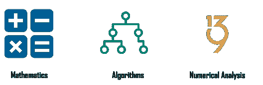
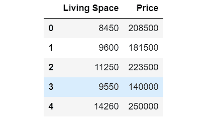
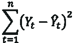
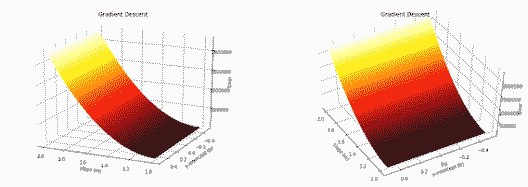

# 机器学习的前提条件是什么？

> 原文：<https://www.edureka.co/blog/prerequisites-for-machine-learning/>

机器学习无疑是这个时代最抢手的技术！如果你是刚开始学习机器的初学者，了解机器学习的先决条件很重要。这个博客将帮助你理解在开始机器学习之前你需要知道的不同概念。如果你想深入这个话题，你必须访问专家[机器学习 Python 培训](https://www.edureka.co/machine-learning-certification-training)并获得认证！

要获得深入的机器学习知识，可以报名参加 Edureka 提供的全天候支持、终身访问的直播 ***[机器学习工程师硕士项目](https://www.edureka.co/masters-program/machine-learning-engineer-training)*** 。

以下是这篇博客涉及的话题列表:

1.  [机器学习的前提条件](#Prerequisites%20for%20Machine%20Learning)
2.  [用用例理解机器学习](#Understanding%20Machine%20Learning%20with%20a%20use%20case)

## **机器学习的前提条件**

要开始使用机器学习，您必须熟悉以下概念:

1.  [统计数据](#Statistics)
2.  [线性代数](#Linear%20Algebra)
3.  [微积分](#Calculus)
4.  [概率](#Probability)
5.  [编程语言](#Programming%20Languages)

### **统计数据**

统计数据包含可用于从数据中获得某种结果的工具。有描述性统计，它是用来转换原始数据中的一些重要信息。此外，推理统计可用于从数据样本中获取重要信息，而不是使用完整的数据集。

要了解更多关于统计的信息，您可以浏览以下博客:

1.  [关于统计和概率你需要知道的一切](https://www.edureka.co/blog/statistics-and-probability/)
2.  [数据科学数学和统计学完全指南](https://www.edureka.co/blog/math-and-statistics-for-data-science/)

### **线性代数**

线性代数处理向量、矩阵和线性变换。它在机器学习中非常重要，因为它可以用于对数据集进行转换和执行操作。

### **微积分**

微积分是数学中的一个重要领域，它在许多机器学习算法中起着不可或缺的作用。具有多个特征的数据集用于建立机器学习模型，因为特征是多个的。多变量微积分在建立机器学习模型中起着重要作用。整合和差异化是必须的。

如果你想深入学习 AI-ML，来我们这里报名参加 Edureka 的这个研究生文凭[人工智能和机器学习课程](https://www.edureka.co/executive-programs/machine-learning-and-ai)。

### **概率**

概率有助于预测事件发生的可能性，它有助于我们推理这种情况是否会再次发生。对于机器学习来说，概率是一个基础。

要了解更多关于概率的知识，你可以浏览这个 *[所有你需要知道的关于统计和概率的](https://www.edureka.co/blog/statistics-and-probability/)* 博客。

**了解我们在顶级城市的机器学习认证培训课程**

| 印度 | 美国 | 其他国家 |
| [班加罗尔的机器学习课程](https://www.edureka.co/masters-program/machine-learning-engineer-training-bangalore) | [达拉斯的机器学习培训](https://www.edureka.co/masters-program/machine-learning-engineer-training-dallas) | [多伦多的机器学习培训](https://www.edureka.co/machine-learning-certification-training-toronto) |
| [海德拉巴的机器学习课程](https://www.edureka.co/masters-program/machine-learning-engineer-training-hyderabad) | [华盛顿的机器学习培训](https://www.edureka.co/masters-program/machine-learning-engineer-training-washington) | [伦敦的机器学习培训](https://www.edureka.co/machine-learning-certification-training-london) |
| [孟买的机器学习认证](https://www.edureka.co/machine-learning-certification-training-mumbai) | [纽约的机器学习认证](https://www.edureka.co/machine-learning-certification-training-new-york-city) | [迪拜的机器学习课程](https://www.edureka.co/masters-program/machine-learning-engineer-training-dubai) |

### **编程语言**

为了实现整个机器学习过程，了解像 R 和 Python 这样的编程语言是必不可少的。Python 和 R 都提供了内置库，使得实现机器学习算法变得非常容易。

除了具备基本的编程知识，知道如何提取、处理和分析数据也很重要。这是机器学习需要的最重要的技能之一。

要了解更多关于机器学习的编程语言，你可以浏览以下博客:

1.  [数据科学 R 综合指南](https://www.edureka.co/blog/r-for-data-science/)
2.  [面向数据科学的 Python——如何实现 Python 库](https://www.edureka.co/blog/learn-python-for-data-science/)
3.  [数据科学和机器学习的最佳 Python 库](https://www.edureka.co/blog/python-libraries-for-data-science-and-machine-learning/)

## **机器学习用例**

机器学习就是创建一种算法，可以从数据中学习，以做出预测，如图片中有什么样的对象，或推荐引擎，治疗某种疾病的最佳药物组合或垃圾邮件过滤。

机器学习是建立在数学先决条件之上的，如果你知道为什么数学会被用在机器学习中，它会变得有趣。你需要知道你将使用的函数背后的数学原理，以及哪个模型适合这些数据，为什么。

让我们从预测房价的有趣问题开始，有一个包含不同特征和价格历史的数据集，现在，我们将考虑居住空间的平方英尺面积和价格。

现在我们有一个包含两列的数据集，如下所示:

这两个变量之间一定有某种关联，我们需要建立一个模型来预测房价，我们该怎么做呢？

让我们用图表显示这些数据，看看它是什么样子的:

这里 X 轴是每平方英尺居住空间的价格，Y 轴是房价。如果我们绘制所有的数据点，我们将得到一个散点图，可以用一条线来表示，如上图所示，如果我们输入一些数据，它将预测一些结果。理想情况下，我们必须找到一条与最大数据点相交的线。

在这里，我们试图创建一条线，称为:

***Y = mX+c***

这种预测目标(因变量)和预测变量(自变量)之间线性关系的方法称为线性回归。它允许我们研究和总结两个变量之间的关系。

*   X =独立变量
*   Y =因变量
*   c = y 轴截距
*   m =直线斜率

如果我们考虑这个方程，我们有独立变量 X 的值，所以我们要做的就是计算 m 和 c 的值，来预测 y 的值。

那么我们如何找到这些变量呢？

为了找到这些变量，我们可以尝试一堆值，并尝试找出一条与最大数量的数据点相交的线。但是，我们如何找到最佳拟合线呢？

因此，为了找到最佳拟合线，我们可以使用最小二乘误差函数来找出 y 的真实值和预测值 y’之间的误差。

最小二乘误差函数可以用以下公式表示:

使用该函数，我们可以通过与数据点的实际值进行比较，找出每个预测数据点的误差。然后，你将所有这些误差求和，将它们平方，找出预测中的偏差。

如果我们将第三个轴添加到包含所有可能误差值的图表中，并在三维空间中绘制它，它将看起来像这样:

在上图中，理想值位于底部黑色部分，这将预测接近实际数据点的价格。下一步是找到 m 和 c 的最佳可能值，这可以通过使用称为梯度下降的优化技术来完成。

梯度下降是一种迭代方法，我们首先初始化变量的一些值，然后通过最小化实际值和预测值之间的误差来慢慢改进它们。

现在，如果我们认为公寓的价格实际上不仅仅取决于每平方英尺的价格，还有许多因素，如卧室、浴室等的数量。如果我们也考虑这些特征，那么等式看起来会像这样

***Y = b0 + b1x1 + b2x2 + …..**+bnxn+c*

这是多线性回归，属于线性代数，这里我们可以使用大小为 mxn 的矩阵，其中 m 是特征，n 是数据点。

让我们考虑另一种情况，在这种情况下，我们可以使用概率来找到房子的状况，以便根据房子的状况是好还是坏来对它进行分类。为此，我们将不得不使用一种称为逻辑回归的技术，这种技术对由 sigmoid 函数表示的发生概率起作用。

在本文中，我们讨论了机器学习的先决条件，以及如何在机器学习中应用它们。所以基本上，它由统计学、微积分、线性代数和概率论组成。微积分有用于优化的技术，线性代数有可以在巨大数据集上工作的算法，通过概率我们可以预测发生的可能性，统计帮助我们从数据集的样本中推断有用的见解。

既然你已经知道了机器学习的先决条件，我相信你一定很想了解更多。这里有几个博客可以帮助你开始学习数据科学:

1.  [初学者机器学习教程](https://www.edureka.co/blog/machine-learning-tutorial/)
2.  [机器学习简介:关于机器学习你需要知道的一切](https://www.edureka.co/blog/introduction-to-machine-learning/)
3.  [机器学习算法](https://www.edureka.co/blog/machine-learning-algorithms/)
4.  [机器学习面试问答指南](https://www.edureka.co/blog/machine-learning-interview-questions/)

*如果你希望注册一门完整的机器学习课程，Edureka 有一个专门策划的  [**机器学习认证**](https://www.edureka.co/masters-program/machine-learning-enginhttps://www.edureka.co/machine-learning-certification-trainingeer-training) ，它将使你精通监督学习、非监督学习和自然语言处理等技术。查看 Edureka 的这个 [NLP 培训](https://www.edureka.co/python-natural-language-processing-course)将你的人工智能技能提升到下一个水平它包括人工智能&机器学习方面的最新进展和技术方法的培训，如深度学习、图形模型和强化学习。*