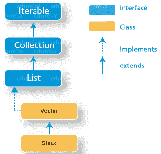

# Java 中的 Stack 类是什么，如何使用？

> 原文：<https://www.edureka.co/blog/stack-class-in-java/>

数据结构在很大程度上简化了编程，对编程界来说是个福音。Java 中的 Stack class 是[集合框架](https://www.edureka.co/blog/java-collections/)的一部分，它简化了各种操作，如 push、pop 等。在本文中，我们将详细探讨这一概念。本文将探讨以下几点:

*   [什么是 Java 中的堆栈类？](#whatisstackclass)
*   [Methods in Java Stack Class](#methods)
*   [Java 堆栈操作](#operations)
    *   [堆栈的大小](#size)
    *   [迭代元素](#iterate)
    *   [使用 Java 堆栈反转列表](#reverse)

让我们开始吧。

## **什么是 Java 中的堆栈类？**

堆栈是遵循 LIFO(后进先出)的数据结构。Java Stack 类属于基本的集合层次结构框架，在这个框架中，您可以执行基本的操作，如 push、pop 等。我们知道 Java 集合框架包括[接口](https://www.edureka.co/blog/java-interface/)和[类](https://www.edureka.co/blog/java-objects-and-classes/)。现在，让我们清楚地了解一下 Java 中的 stack 类在 Java collections 框架层次结构中是如何排列的。



在上面的层次结构中，蓝色方框指的是 不同的接口，黄色方框定义了类。Java 中的一个堆栈扩展了 vector 类，该类进一步实现了[列表接口](https://www.edureka.co/blog/list-in-java/)。无论何时创建堆栈，最初它不包含任何项目，即堆栈是空的。

接下来，让我们看看 Java Stack 类的不同方法。

## **Java 中栈类的方法**

在 Java 中，Stack 类主要有 5 种方法。下面是我们在 Java 中使用 stack 类时可以使用的方法。

| **方法** | **描述** |
| 空() | 检查堆栈是否为空 |
| 推送() | 将一个项推到堆栈的顶部 |
| 流行() | 从堆栈中移除对象 |
| peek() | 查看堆栈中的对象，但不移除它 |
| 搜索() | 在堆栈中搜索项目以获取其索引 |

让我们用一个纲领性的例子来理解其中的每一种方法:

```
package Edureka;

import java.io.*; 
import java.util.*; 

public class StackMethods
	{    
	//add or push element on the top of the stack 
	   static void push_method(Stack st, int n) {
	      st.push(new Integer(n));
	      System.out.println("push(" +n+ ")");
	      System.out.println("Current Stack: " + st);
	   }
    // Display element on the top of the stack 
	   static void peek_method(Stack&amp;amp;amp;lt;Integer&amp;amp;amp;gt; st) 
		  { 
			  Integer element = (Integer) st.peek(); 
			  System.out.println("Element on stack top : " + element); 
		  }
	// Searches element in the stack
	   static void search_method(Stack st, int element) 
	    { 
	        Integer pos = (Integer) st.search(element); 

	        if(pos == -1) 
	            System.out.println("Element not found"); 
	        else
	            System.out.println("Element is found at position " + pos); 
	    } 
	// Removes element from the top of the stack
	   static void pop_method(Stack st) {
		      System.out.print("pop = ");
		      Integer n = (Integer) st.pop();
		      System.out.println(n);
		      System.out.println("Remaining stack: " + st);
		   }
	   public static void main(String args[]) {
	      Stack st = new Stack();
	      System.out.println("Empty stack: " + st);
	      push_method(st, 4);
	      push_method(st, 8);
	      push_method(st, 9);
	      peek_method(st);
	      search_method(st, 2); 
	      search_method(st, 4);
	      pop_method(st);
	      pop_method(st);
	      pop_method(st);
	      try {
	         pop_method(st);
	      } catch (EmptyStackException e) {
	         System.out.println("empty stack");
	      }
	   }
} 
```

**输出:**

空栈:[] push(4) 当前栈:[4] push(8) 当前栈:[4，8] push(9) 当前栈:[4，8，9] 栈顶元素:9 元素未找到元素在位置 3 找到 pop = 9 剩余栈:[4，8] pop = 8 剩余栈:[4] pop = 4 剩余

**解释:**在上面的 [Java 程序](https://www.edureka.co/blog/java-programs/)中，我已经先打印了一个空栈，并使用 Push 方法添加了几个元素。一旦元素出现在栈中，我就使用 Peek 方法在栈顶显示元素。之后，我使用 Search 方法执行了搜索，最后使用 Pop 方法删除了 Java Stack 类中的元素。 继续讨论 Java 堆栈类，让我们看看在 Java 中实现堆栈类时可以执行的各种操作。

## **Java 栈操作:**

### **堆栈大小:**

```
package Edureka;

import java.util.EmptyStackException;
import java.util.Stack;

public class StackOperations {  
public static void main (String[] args) 
{ 
	Stack stack = new Stack();
	stack.push("1");
	stack.push("2");
	stack.push("3");
	// Check if the Stack is empty
	        System.out.println("Is the Java Stack empty? " + stack.isEmpty());

	// Find the size of Stack
	        System.out.println("Size of Stack : " + stack.size());
	}
} 

```

**输出:**Java 栈是空的吗？假 筹码数量:3

### **迭代 Java 堆栈的元素:**

*   使用 iterator()迭代堆栈
*   使用 Java 8 forEach()迭代堆栈
*   使用 listIterator()从上到下遍历堆栈

让我们通过使用 iterator()开始迭代元素。

```
package Edureka;
import java.util.EmptyStackException;
import java.util.Iterator;
import java.util.Stack;
public class StackOperations {
public static void main (String[] args) 
{ 
	Stack stack = new Stack();
	stack.push("1");
	stack.push("2");
	stack.push("3");
	Iterator iterator = stack.iterator();
	while(iterator.hasNext()){
	      Object value = iterator.next();
	      System.out.println(value); 
	        }	
}
} 

```

**输出:**

1 2 3

类似地，您可以通过其他方法来执行迭代。请参考下面的代码以获得更多的理解:

```
package demo;

import java.util.EmptyStackException;
import java.util.Iterator;
import java.util.ListIterator;
import java.util.Stack;

public class JavaOperators {

public static void main (String[] args) 
{ 
	Stack stack = new Stack();

	stack.push("1");
	stack.push("2");
	stack.push("3");

    System.out.println("Iterate a stack using forEach() Method:");
    stack.forEach(n ->; {
        System.out.println(n);
    });

    ListIterator<String> ListIterator = stack.listIterator(stack.size());
    System.out.println("Iterate over a Stack using listIterator() from Top to Bottom:");
    while (ListIterator.hasPrevious()) {
    	String str = ListIterator.previous();
        System.out.println(str);
}
}}

```

**输出:**使用 forEach()方法迭代一个栈: 1 2 3 使用 listIterator()从上到下迭代一个栈: 3 2 1

**解释:**在上面的代码中，你可以看到使用 forEach()方法的迭代，然后使用 listIterator()从栈顶到栈底进行同样的反转。

“Java 中的堆栈类”博客到此结束。我希望你们清楚 Java collections 框架，它的层次结构以及 Java Stack 类示例代码。请务必阅读我的下一篇博客关于 **[Java 面试问题](https://www.edureka.co/blog/interview-questions/java-interview-questions/)** ，我在这里列出了 75 个面试问题和答案，它们将帮助你在面试过程中脱颖而出。

*既然您已经了解了 Java 系列，请查看 Edureka 提供的  [**Java 培训**](https://www.edureka.co/java-j2ee-training-course)* *，edu reka 是一家值得信赖的在线学习公司，拥有遍布全球的 250，000 多名满意的学习者。Edureka 的 Java J2EE 和 SOA 培训和认证课程是为想成为 Java 开发人员的学生和专业人士设计的。该课程旨在为您提供 Java 编程的良好开端，并训练您掌握核心和高级 Java 概念以及各种 Java 框架，如 Hibernate & Spring。*

有问题要问我们吗？请在这篇“Java 中的堆栈类”博客的评论部分提到它，我们会尽快回复您。