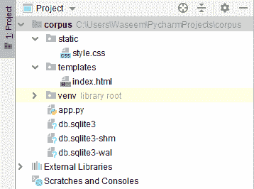
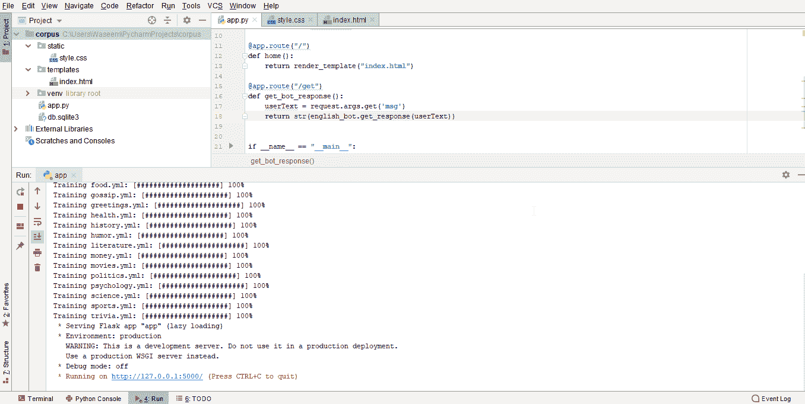
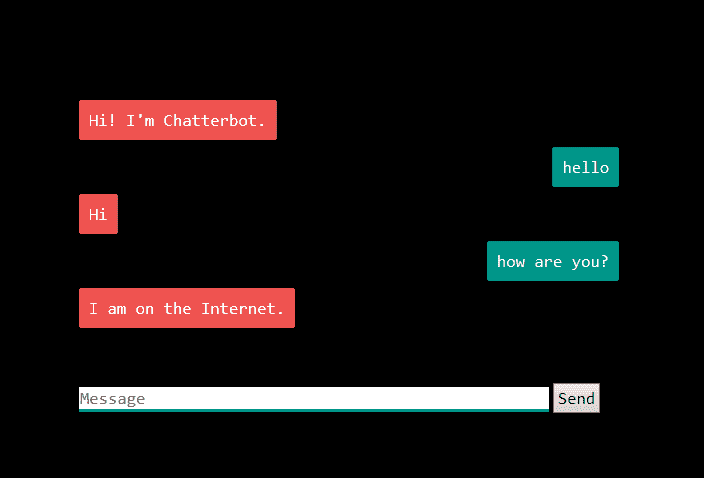

# 如何用 Python 制作聊天机器人？

> 原文：<https://www.edureka.co/blog/how-to-make-a-chatbot-in-python/>

如今，几乎 30%的任务是由聊天机器人完成的。公司使用聊天机器人提供客户支持、生成信息等服务。有了 Siri 和 Alexa 这样的例子，聊天机器人如何改变我们的日常生活就变得很明显了。在本文中，我们将学习如何使用 ChatterBot 库用 python 制作聊天机器人，ChatterBot 库实现了各种[机器学习](https://www.edureka.co/blog/videos/python-machine-learning/) [算法](https://www.edureka.co/blog/machine-learning-algorithms/)来生成响应。以下是本博客讨论的主题:

*   什么是聊天机器人？
    *   [聊天机器人的进化](#evolution)
    *   [聊天机器人的局限性](#limitations)
    *   它是如何工作的？
*   [Python 中的 Chatterbot 库](#chatterbot)
    *   它是如何工作的？
*   聊天机器人的训练员
*   [用例–烧瓶聊天机器人](#flaskbot)

## **什么是聊天机器人？**

聊天机器人也称为聊天机器人、机器人、人工代理等，基本上是由人工智能驱动的软件程序，其目的是通过文本或语音与用户进行对话。著名的例子有 Siri、Alexa 等。

这些聊天机器人倾向于为用户执行特定的任务。聊天机器人经常执行交易、预订酒店、提交表格等任务。随着人工智能领域的技术进步，聊天机器人的可能性是无限的。

几乎 30%的任务是由任何公司的聊天机器人完成的。公司利用这些聊天机器人提供客户支持、传递信息等服务。虽然聊天机器人已经走了这么远，但旅程是从一个非常基础的性能开始的。让我们来看看聊天机器人在过去几十年中的演变。

### **聊天机器人的进化**

它始于 1966 年，当时 Joseph Weizenbaum 制作了一个自然语言对话程序，其特点是用户和计算机程序之间的对话。随着这一重大突破，新时代的聊天机器人技术在过去几十年里发生了巨大的飞跃。

| **传统机器人** | **当前机器人** | 未来机器人 |
| 系统驱动 | 被来回的交流所驱使 | 多层次沟通 |
| 基于自动化 | 自动化是在任务级别 | 服务级别的自动化 |
| 最小功能 | 维护系统上下文 | 维护任务、系统和人员环境的能力 |
| 仅维护系统上下文 | 也维护任务上下文 | 介绍主机器人，最终也是一个机器人操作系统。 |

**聊天机器人的局限性**

随着技术的不断进步，使用聊天机器人也变得相当困难。以下是我们在聊天机器人方面面临的一些限制。

*   **领域知识**——由于真正的人工智能仍然遥不可及，任何聊天机器人在与人类对话时都很难完全理解对话的界限。

*   不能正确回答和相当差的理解能力是任何聊天机器人经常犯的错误，给聊天机器人添加个性仍然是一个看起来很遥远的基准。但是我们对现有的创新和进步驱动的方法充满希望。

### **它是如何工作的？**

我们可以将聊天机器人分为两类，下面是两类聊天机器人:

1.  **基于规则的方法**——在这种方法中，根据规则训练机器人。基于这一点，机器人可以回答简单的查询，但有时无法回答复杂的查询。

2.  **自我学习方法–**这些机器人遵循更有效的机器学习方法，并进一步分为两类。

    *   **基于检索的模型**–在这种方法中，机器人根据用户输入从响应列表中检索最佳响应。

    *   生成模型(Generative Models)–这些模型通常会给出答案，而不是从一组答案中搜索，这也使它们成为智能机器人。

让我们尝试使用 python 中的 [chatterbot](https://pypi.org/project/ChatterBot/) 库从头开始制作一个聊天机器人。

## **Python 中的 ChatterBot 库**

ChatterBot 是 python 中的一个库，它生成对用户输入的响应。它使用大量的[机器学习算法](https://www.edureka.co/blog/machine-learning-algorithms/)来产生多种反应。对于用户来说，使用 ChatterBot 库制作具有更准确响应的聊天机器人变得更加容易。

**语言独立**

ChatterBot 的设计允许机器人接受多种语言的训练。最重要的是，机器学习算法使机器人更容易利用用户的输入进行自我改进。

### **它是如何工作的？**

ChatterBot 使创建参与对话的软件变得容易。每次聊天机器人从用户那里获得输入，它保存输入和响应，这有助于没有初始知识的聊天机器人使用收集的响应进行进化。

随着响应的增加，聊天机器人的准确性也会增加。程序从与输入最匹配的语句中选择最匹配的响应，然后从已知的语句选择中为该响应选择响应。

**如何用 Python 安装 ChatterBot？**

在终端或命令提示符下运行以下命令，在 python 中安装 ChatterBot。

```
pip install chatterbot

```

## 聊天机器人的训练者

Chatterbot 带有一个数据实用模块，可用于训练聊天机器人。目前，这个模块中有十几种语言的训练数据。看看这里的数据文件[。](https://github.com/gunthercox/chatterbot-corpus)

下面是一个简单的例子来开始使用 python 中的 ChatterBot。

```
from chatterbot import chatbot
from chatterbot.trainers import ListTrainer

#creating a new chatbot
chatbot = Chatbot('Edureka')
trainer = ListTrainer(chatbot)
trainer.train([ 'hi, can I help you find a course', 'sure I'd love to find you a course', 'your course have been selected'])

#getting a response from the chatbot
response = chatbot.get_response("I want a course")
print(response)

```

在这个例子中，根据我们给出的输入，我们从聊天机器人那里得到一个响应。让我们尝试使用 chatterbot-corpus 构建一个相当复杂的 flask-chatbot 来在 flask 应用程序中生成响应。

## **用例——烧瓶聊天机器人**

完成 flask 应用程序的设置后，我们需要添加两个静态目录和 HTML 和 CSS 文件的模板。以下是 flask ChatterBot 应用程序的代码。

****

**App.py**

```
from flask import Flask, render_template, request
from chatterbot import ChatBot
from chatterbot.trainers import ChatterBotCorpusTrainer

app = Flask(__name__)

english_bot = ChatBot("Chatterbot", storage_adapter="chatterbot.storage.SQLStorageAdapter")
trainer = ChatterBotCorpusTrainer(english_bot)
trainer.train("chatterbot.corpus.english")

@app.route("/")
def home():
    return render_template("index.html")

@app.route("/get")
def get_bot_response():
    userText = request.args.get('msg')
    return str(english_bot.get_response(userText))

if __name__ == "__main__":
    app.run()

```

**index.html**

```
<!DOCTYPE html>
<html>
<head>
<link rel="stylesheet" type="text/css" href="/static/style.css">
<script src="https://ajax.googleapis.com/ajax/libs/jquery/3.2.1/jquery.min.js"></script>
</head>
<body>
<h1>Flask Chatterbot Example</h1>
<div>
<div id="chatbox">
<p class="botText"><span>Hi! I'm Chatterbot.</span></p>
</div>
<div id="userInput">
<input id="textInput" type="text" name="msg" placeholder="Message">
<input id="buttonInput" type="submit" value="Send">
</div>
<script>
function getBotResponse() {
var rawText = $("#textInput").val();
var userHtml = '<p class="userText"><span>' + rawText + '</span></p>';
$("#textInput").val("");
$("#chatbox").append(userHtml);
document.getElementById('userInput').scrollIntoView({block: 'start', behavior: 'smooth'});
$.get("/get", { msg: rawText }).done(function(data) {
var botHtml = '<p class="botText"><span>' + data + '</span></p>';
$("#chatbox").append(botHtml);
document.getElementById('userInput').scrollIntoView({block: 'start', behavior: 'smooth'});
});
}
$("#textInput").keypress(function(e) {
if(e.which == 13) {
getBotResponse();
}
});
$("#buttonInput").click(function() {
getBotResponse();
})
</script>
</div>
</body>
</html>
```

**index.html**文件将包含应用程序的模板， **style.css** 将包含带有 css 代码的样式表。执行上述程序后，我们将得到如下图所示的输出。

**Style.css**

```
body
{
font-family: Garamond;
background-color: black;
}
h1
{
color: black;
margin-bottom: 0;
margin-top: 0;
text-align: center;
font-size: 40px;
}
h3
{
color: black;
font-size: 20px;
margin-top: 3px;
text-align: center;
}
#chatbox
{
background-color: black;
margin-left: auto;
margin-right: auto;
width: 40%;
margin-top: 60px;
}
#userInput {
margin-left: auto;
margin-right: auto;
width: 40%;
margin-top: 60px;
}
#textInput {
width: 87%;
border: none;
border-bottom: 3px solid #009688;
font-family: monospace;
font-size: 17px;
}
#buttonInput {
padding: 3px;
font-family: monospace;
font-size: 17px;
}
.userText {
color: white;
font-family: monospace;
font-size: 17px;
text-align: right;
line-height: 30px;
}
.userText span {
background-color: #009688;
padding: 10px;
border-radius: 2px;
}
.botText {
color: white;
font-family: monospace;
font-size: 17px;
text-align: left;
line-height: 30px;
}
.botText span {
background-color: #EF5350;
padding: 10px;
border-radius: 2px;
}
#tidbit {
position:absolute;
bottom:0;
right:0;
width: 300px;
}

```

**输出:**



转到输出中显示的地址，您将在浏览器中获得带有聊天机器人的应用程序。



聊天机器人将看起来像这样，它将有一个文本框，我们可以给用户输入，机器人将为该语句生成一个响应。

在本文中，我们已经学习了如何使用 flask 框架使用 ChatterBot 库用 python 制作聊天机器人。随着人工智能和机器学习领域的新时代技术进步，我们距离创造人类可用的最好版本的聊天机器人只有一步之遥。当这种情况发生时，不要袖手旁观，要掌握你的技能，参加 Edureka 的 [Python 认证](https://www.edureka.co/python-programming-certification-training)项目，成为一名领导者。

*有什么问题吗？请在评论中提及它们。我们会尽快回复你。*