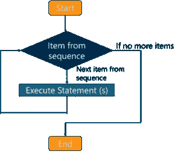

# 您需要知道的重要 JavaScript 循环

> 原文：<https://www.edureka.co/blog/javascript-loops/>

**循环 JavaScript** 用于根据给定的测试条件验证特定的值，并执行特定的代码段特定的次数，直到满足给定的条件。它有助于使你的代码简洁。 [JavaScript](https://www.edureka.co/javascript-jquery-training) 循环在本文中按以下顺序解释:

*   [JavaScript 循环](#javascriptloops)
    *   [为循环](#forloop)
    *   [While 循环](#whileloop)
    *   [Do-while 循环](#dowhile)
    *   [For-in 循环](#forin)
    *   [中断语句](#break)
    *   [继续语句](#continue)

## **JavaScript 循环**

JavaScript 循环提供了一种快速简单的方法来重复做一些事情。它们用于多次重复一个动作，而不必重复同一行代码。主要有两种类型的循环:

*   **进入控制循环**–在进入控制中，测试条件在进入循环体之前进行测试。  **为循环** 和  **而循环** 为入口控制循环。

*   **退出受控循环-** 在退出受控中，测试条件在循环体结束时进行评估。因此，循环体将至少执行一次，，不管测试条件是真还是假。  **do-while 循环** 是一个退出控制循环。

现在让我们继续讨论执行 JavaScript 循环的不同方法。

## **为循环**

这个方法提供了一种编写循环结构的简洁方法。for 循环重复进行，直到指定的条件评估为 false。

****

**语法-**

```

for (initialization condition; testing condition; increment/decrement)
{
statement
}

```

**举例-**

```

<script type = "text/javaScript">
// JavaScript program to illustrate for loop
var x;
// for loop begins when x=1
// and runs till x <=5
for (x = 1; x <= 5; x++)
{
document.write("Value of x:" + x + "<br />");
}
< /script>

```

**输出-**

```
Value of x:1
Value of x:2
Value of x:3
Value of x:4
```

## **While 循环**

while 循环是一个控制流语句，它允许基于特定的布尔条件重复执行代码。这个循环类似于重复 if 语句的循环。

****

**语法-**

```

while (boolean condition)
{
loop statements
}

```

**举例-**

```

<script type = "text/javaScript">
// JavaScript program to illustrate while loop
var x = 1;
// Exit when x becomes greater than 5
while (x <= 5)
{
document.write("Value of x:" + x + "<br />");
// increment the value of x for
// next iteration
x++;
}
< /script>

```

**输出-**

```
Value of x:1
Value of x:2
Value of x:3
Value of x:4
Value of x:5
```

### **Do-while 循环**

这个循环类似于 while 循环，但唯一的区别是它在执行语句后检查条件。因此，这是退出控制循环的一个例子。

****

**语法-**

```

do
{
statements
}
while (condition);

```

**举例-**

```

<script type = "text/javaScript">
// JavaScript program to illustrate do-while loop
var x = 20;
do
{
// if the condition is false
document.write("Value of x:" + x + "<br />");
x++;
} while (x < 10);
< /script>

```

**输出-**

```
Value of x: 20
```

**For-in 循环**

此循环在对象的所有可枚举属性上迭代指定的变量。对于每个不同的属性，JavaScript 将执行指定的语句。

**语法-**

```

for (variableName in Object)
{
statements
}

```

**举例-**

```

<script type = "text/javaScript">
// JavaScript program to illustrate for..in loop
// creating an Object
var characteristic = { first : "Name", second : "Age",
third : "Height", fourth : "Eye-color",
fifth : "Nationality" };
// iterate through every property of the
// object characteristics and print all of them
// using for..in loops
for (itr in characteristics)
{
document.write(characteristics[itr] + "<br >");
}
< /script>

```

**输出-**

```
Name
Age
Height
Eye-color
Nationality
```

## **中断语句**

break 语句用于跳出循环。它将帮助您打破循环，并在循环后继续执行代码。

**语法-**

```

break labelname;

```

**举例-**

```

var text = ""
var i;
for (i = 0; i < 10; i++) {
if (i === 5) {
break;
}
text += "The number is " + i + "<br>";
}

```

**输出-**

```
The number is 0
The number is 1
The number is 2
The number is 3
The number is 4
```

## **继续语句**

如果出现指定的条件，continue 语句将中断循环中的一次迭代，并继续循环中的下一次迭代。continue 和 break 语句的区别在于 continue 语句“跳过”循环中的一次迭代，而不是“跳出”。如欲了解更多信息，请立即查看此[全栈开发课程](https://www.edureka.co/masters-program/full-stack-developer-training)。

**语法-**

```

continue labelname;

```

**举例-**

```

var text = ""
var i;
for (i = 0; i < 5; i++) {
if (i === 2) {
continue;
}
text += "The number is " + i + "<br>";
}

```

**输出-**

```
The number is 0
The number is 1
The number is 3
The number is 4
```

这些是执行 JavaScript 循环的不同方法。我们的文章到此结束。

*既然你已经了解了 JavaScript 循环，那就去看看 Edureka 的 **[Web 开发认证培训](https://www.edureka.co/complete-web-developer)** 。* *Web 开发认证培训将帮助您学习如何使用 HTML5、CSS3、Twitter Bootstrap 3、jQuery 和 Google APIs 创建令人印象深刻的网站，并将其部署到亚马逊简单存储服务(S3)。*

*有问题吗？请在“JavaScript 循环”的评论部分提到它，我们会回复您。*