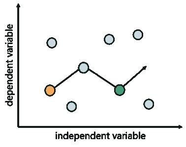

# 机器学习中如何使用正则化？

> 原文：<https://www.edureka.co/blog/regularization-in-machine-learning/>

您是否遇到过这样的情况:您的机器学习模型对训练数据的建模非常好，但对测试数据却表现不佳，即无法预测测试数据？这种情况可以用机器学习中的正则化来处理。

当模型从训练数据中学习到非常特定的模式和噪音，以至于对我们的模型从训练数据归纳到新的(“看不见的”)数据的能力产生负面影响时，就会发生过度拟合。所谓噪声，我们指的是数据集中不相关的信息或随机性。

防止过拟合对于提高我们的机器学习模型的性能是非常必要的。

以下几点将在本文中涉及，并最终帮助我们解决这个问题:

*   [什么是正规化](#WhatisRegularization?)
*   [正规化如何运作](#HowDoesRegularizationWork)
*   [规则化技术](#RegularizationTechniques)

继续这篇关于机器学习中正则化的文章。

## **什么是正规化？**

一般来说，规则化就是让事情变得有规律或者可以接受。这正是我们用它来进行应用机器学习的原因。在机器学习的上下文中，正则化是将系数正则化或缩小到零的过程。简而言之，正则化不鼓励学习更复杂或更灵活的模型，以防止过度拟合。

继续这篇关于机器学习中正则化的文章。

## **正规化是如何运作的？**

基本思想是惩罚复杂的模型，即增加一个复杂的项，这会给复杂的模型带来更大的损失。为了理解它，让我们考虑一个简单的线性回归关系。数学上表述如下:y≈w _ 0+w _ 1x _ 1+w _ 2x _(2 )+⋯+w_p x _ p

其中 Y 是学习的关系，即要预测的值。 X_1，X_，X \\, P，是决定 y 值的特征， W_1，W_，W \\, P，分别是赋予特征 X_1，X \\, P 的权重。w0 代表偏差。

现在，为了拟合精确预测 Y 值的模型，我们需要一个损失函数和优化参数，即偏差和权重。

通常用于线性回归的损失函数称为残差平方和(RSS)。根据上面陈述的线性回归关系，可以给出:RSS = ∑_(j=1)^m(y_i-w_0-∑_(i=1)^n w _ I x _ Ji )^2

我们也可以称 RSS 为没有正则化的线性回归目标。

现在，模型将通过这个损失函数来学习。基于我们的训练数据，它会调整权重(系数)。如果我们的数据集有噪声，它将面临过拟合问题，估计的系数不会在看不见的数据上推广。

这就是正规化发挥作用的地方。它通过惩罚系数的大小将这些学习到的估计值调整到零。

但是它是如何给系数分配惩罚的，让我们来探索一下。

继续这篇关于机器学习中正则化的文章。

利用我们在 [AI 和 ML 课程](https://www.edureka.co/executive-programs/machine-learning-and-ai)的研究生文凭，在人工智能领域建立职业生涯。

## **规则化技术**

有两种主要的正则化技术，即岭回归和套索回归。它们的不同之处在于对系数分配惩罚的方式。

**【岭回归(L2 正则化)**

这种正则化技术执行 L2 正则化。它通过添加相当于系数大小的平方的惩罚(收缩量)来修改 RSS。∑_(j=1)^m(y_i-w_0-∑_(i=1)^n w _ I x _ Ji )^2+ α∑_(i=1)^n w_i^2=rss+ α∑_(i=1)^n w_i^2

现在，使用这个修改的损失函数来估计系数。

在上面的等式中，您可能已经注意到了参数α (alpha)以及收缩量。这就是所谓的调整参数，它决定了我们想要惩罚模型的程度。换句话说，调整参数平衡了最小化 RSS 和最小化系数平方和的重要性。

让我们看看αα的值如何影响岭回归产生的估计值。

**当** α=0 时，惩罚项没有作用。这意味着它返回平方的残差和作为我们最初选择的损失函数，即我们将得到与简单线性回归相同的系数。

**当** α=∞时，岭回归系数将为零，因为修改的损失函数将忽略核心损失函数并最小化系数平方，最终将参数值取为 0。

**当** 0 < α < ∞时，对于简单线性回归，岭回归系数会在 0 到 1 之间。

这就是为什么选择一个好的α值是至关重要的。由岭回归正则化技术产生的系数方法也被称为 L2 范数。

**了解我们在顶级城市的机器学习认证培训课程**

| 印度 | 美国 | 其他国家 |
| [海德拉巴的机器学习培训](https://www.edureka.co/machine-learning-certification-training-hyderabad) | [达拉斯的机器学习课程](https://www.edureka.co/masters-program/machine-learning-engineer-training-dallas) | [墨尔本的机器学习课程](https://www.edureka.co/machine-learning-engineer-training-melbourne) |
| [班加罗尔的机器学习认证](https://www.edureka.co/machine-learning-certification-training-bangalore) | [夏洛特的机器学习课程](https://www.edureka.co/masters-program/machine-learning-engineer-training-charlotte) | [伦敦的机器学习课程](https://www.edureka.co/machine-learning-engineer-training-london) |
| [孟买的机器学习课程](https://www.edureka.co/masters-program/machine-learning-engineer-training-mumbai) | [纽约的机器学习认证](https://www.edureka.co/machine-learning-certification-training-new-york-city) | [迪拜的机器学习课程](https://www.edureka.co/machine-learning-engineer-training-dubai) |

**拉索回归(L1 正则化)**

这种正则化技术执行 L1 正则化。它通过添加相当于系数绝对值之和的罚值(收缩量)来修改 RSS。∑_(j=1)^m(y_i-w_0-∑_(i=1)^n w _ I x _ Ji )^2+ α∑_(i=1)^n | w _ I | = RSS+α∑_(i=1)^n | w _ I |现在，使用这个修改的损失函数来估计系数。

套索回归不同于岭回归，因为它使用绝对系数值进行归一化。

由于损失函数只考虑绝对系数(权重)，优化算法将惩罚高系数。这就是众所周知的 L1 规范。

这里，α (alpha)也是一个调整参数，工作方式类似于岭回归，并在平衡系数的 RS 幅度之间提供一个折衷。

像岭回归一样，lasso 回归中的α (alpha)可以取如下各种值:

**当** α=0 时，我们会得到与简单线性回归相同的系数。

**当** α=∞时，拉索回归系数将为零。

**当** 0 < α < ∞时，对于简单的线性回归，套索回归系数将在 0 和 1 之间。

它看起来与岭回归非常相似，但是让我们从不同的角度来看看这两种技术。

把岭回归想成解一个方程，其中权(系数)的平方和小于等于 s，据此，考虑到给定问题中有 2 个参数，岭回归用 W_1^2+ W_2^2≤s 表示

这意味着岭回归系数对于上式给出的圆内的所有点具有最小的损失函数。

同样，把 lasso 回归想成解一个方程，其中权(系数)的模之和小于等于 s，据此，考虑到给定问题中有 2 个参数，lasso 回归表示为| w1 |+| w2 |≤s

这意味着岭回归系数对于以上方程给出的菱形内的所有点具有最小的损失函数。下图描述了上述等式:

在这幅图中我们可以看到，约束函数(蓝色区域)；左图是套索图，而右图是山脊图，以及损失函数(即 RSS)的等高线(绿色日蚀图)。

在上述情况下，对于两种回归技术，系数估计值由轮廓(日蚀)接触约束(圆形或菱形)区域的第一个点给出。

岭回归系数估计将完全是非零的。为什么？因为岭回归有一个圆形约束，没有尖点，所以日蚀不会与轴上的约束相交。

另一方面，由于菱形，套索约束在每个轴上都有角，因此日蚀通常会在每个轴上相交。因此，至少有一个系数等于零。

上述情况表明，岭回归会将系数缩小到非常接近 0，但永远不会使它们精确到 0，这意味着最终模型将包括所有预测值。这是岭回归的一个缺点，叫做模型可解释性。

然而，当α足够大时，lasso 回归会将某些系数估计值缩小到恰好为 0。这就是 lasso 提供稀疏解的原因。

这就是正规化及其技术，我希望现在你能更好地理解它。你可以利用这一点来提高你的机器学习模型的准确性。

现在，我们到了这篇“机器学习中的正则化”文章的结尾。希望这篇文章是有见地的！

我希望这个教程是有用的，请随意访问我们的 edureka 的 youtube 页面，在那里你会找到大量关于几个主题的技术视频。如果你想在事业上出类拔萃，你可以参加使用 Python 的 [机器学习培训](https://www.edureka.co/machine-learning-certification-training)来自 E 杜蕾卡。不要只盲目相信某人的一面之词，这里有课程课程表的链接，看看你是否觉得真的值得投入你的时间和精力。如果你想学习更多的东西，请在下面的评论框中添加你的建议，如果建议足够好，我们甚至可以计划将它添加到我们的主菜中。

你也可以参加一个 [机器学习课程](https://www.edureka.co/masters-program/machine-learning-engineer-training) 硕士项目。该计划将为您提供关于现实世界中机器学习应用的最深入和实用的信息。此外，您将学习在机器学习领域取得成功所需的基本知识，如统计分析、Python 和数据科学。

*有问题吗？请在评论区提及它们，我们将会回复您。*