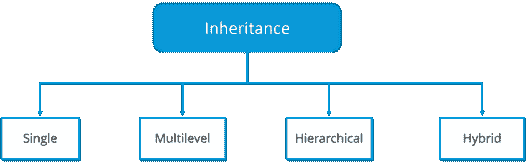

# 关于 C++面向对象编程你需要知道的一切

> 原文：<https://www.edureka.co/blog/object-oriented-programming-in-cpp/>

面向对象编程一出现就在编程界掀起了风暴，并且在很大程度上仍然是编程的基础。在本文中，我们将探索 C++中的面向对象编程。本文将涉及以下几点:

*   什么是面向对象编程？
*   [面向对象编程的特点](#Featuresofobject-orientedprogramming)
*   [物体](#Objects)
*   [类](#Classes)
*   [封装](#Encapsulation)
*   [抽象](#Abstraction)
*   [多态性](#Polymorphism)
*   [继承](#Inheritance)

从这篇关于 C++面向对象编程的文章开始

## 什么是面向对象编程？

发明面向对象方法的主要动机是消除过程方法中遇到的一些缺陷。在 OOP 中，数据被视为程序开发中的关键元素，并限制其在系统中的流动。它将数据与对其进行操作的函数更紧密地联系在一起，并保护数据免受外部函数的意外修改。它允许将问题分解成许多称为对象的实体，然后围绕这些对象构建数据和函数。对象的数据只能由与该特定对象相关联的函数访问。但是，如果需要，一个对象的函数可以访问其他对象的函数。

继续这篇关于 C++面向对象编程的文章

## **面向对象编程的特点:**

*   它更强调数据而不是过程。
*   这些程序被分成对象，因此很容易操作。
*   数据结构是以这样一种方式设计的，即它们表征对象。
*   对一个对象的数据起作用的函数被放在数据结构中。
*   数据是隐藏的，未经允许不能被外部函数访问。
*   借助于函数，可以进行对象之间的通信。
*   添加新的数据和函数变得很容易。
*   在程序设计中遵循自下而上的方法。

继续这篇关于 C++面向对象编程的文章

## **物体**

对象是 OOPs 中最基本的运行时实体。它们可能代表用户定义的数据，如向量、时间和列表或程序必须处理的任何项目。编程问题是根据对象和它们之间的通信性质来分析的。应该选择对象，使它们与真实世界的对象紧密匹配。对象占用内存空间，并且没有关联的地址。而执行对象通过相互发送消息来进行交互。例如，如果“Student”和*Student_roll_no 是程序中的两个对象，则 Student 对象可以向 Student_roll_no 对象发送消息，请求其相关标记。每个对象都包含操作数据的代码。对象可以与彼此的数据或代码进行交互，而不必知道其

继续这篇关于面向对象编程 C++的文章

**类**

一个对象的整套代码可以在一个类的帮助下变成用户自定义的数据类型，实际上，对象是类型类的变量。一旦我们定义了一个类，我们就可以创建任何数量的属于这个类的对象。每个对象都可以与创建它们所用的类类型的数据相关联。因此，类只不过是相似类型的对象的集合。例如，手机、笔记本电脑和智能手表都属于电子类。类是用户定义的数据类型。用于创建对象的语法非常简单。如果电子产品被定义为一个类别，那么声明电子笔记本电脑；将创建一个属于电子类的对象 laptop。

电子笔记本电脑；

这将创建一个属于类 electronics 的对象 laptop。

继续这篇关于 C++面向对象编程的文章

**封装**

封装可以定义为将数据和信息包装在一个单元下。在面向对象编程中，封装被定义为将数据和操作它们的函数绑定在一起。

考虑一个真实的封装示例，在学校中，有不同的部分，如学生部分、教师部分、帐户部分等。学生部分处理学生的所有活动，并记录所有与财务相关的数据。同样，教师部门处理所有与教师相关的活动，并记录学生的所有分数和表现。现在可能会出现这样的情况，由于某种原因，学生部分的学生需要所有学生的分数和表现的所有数据。在这种情况下，不允许他直接访问教师部分的数据。他必须首先联系教师部门的某个老师，然后要求他提供所有的数据。这就是封装。在这里，学生部分的数据和可以操作它们的教师部分的数据被包装在一个名称“教师部分”下。

继续这篇文章

## **抽象**

抽象是指只显示应用程序的重要和必需的特性，而隐藏细节。在 C++中，类可以向外部世界提供数据和函数来访问，保持变量不被直接访问，或者类甚至可以声明任何人都可以访问的任何东西，或者可能只是对继承它的类，我们可以根据我们的要求更改它们。

这可以通过使用访问说明符来完成。C++有 3 个访问说明符:

*   私人的
*   保护
*   公共

继续这篇文章

**多态性**

多态性这个词意味着有许多形式。我们可以将多态性定义为一个函数或数据以多种形式显示的能力。一个人可以同时拥有不同的特征。作为一个男孩同时又是一个学生，一个哥哥，一个儿子。所以同一个人在不同的情况下会有不同的行为。这就是所谓的多态性。

根据不同实例中的需求，一个操作可以表现出不同的行为。该行为取决于所使用的数据类型及其在操作中的要求。

C++支持运算符重载和函数重载。

*   操作符重载:它是让一个操作符在不同的实例中表现出不同行为的过程。
*   函数重载:函数重载是使用一个函数名来执行不同类型的任务。

多态性广泛用于实现继承。

继续这篇关于 C++面向对象编程的文章

**继承**

继承是一个类的对象获取另一个类的对象的属性、功能和数据的过程。它遵循层次分类的概念。例如，鸟“麻雀”是“飞鸟”类的一部分，而“飞鸟”又是“鸟”类的一部分。在这种划分的帮助下，每个派生类与它所继承的类共享共同的特征和数据。继承提供了可重用性的概念。这意味着我们可以在现有的类中添加额外的特性，而无需对其进行任何修改或变更。这可以通过从现有类派生一个新类来实现。新类将获得父类和子类的组合特征。

继承的真正用途是，它允许程序员重用一个几乎(但不完全)是他想要的类，并以这样一种方式改变该类和进行更改，即它不会给其余的类带来任何不希望的副作用。请注意，每个子类只定义了它独有的那些特性，其余的特性都是从它的父类派生出来的。如果不使用任何分类，每个类都必须显式地包含它的所有特性，这将花费大量的时间和精力。

这样，我们就结束了这篇关于“C++面向对象编程”的文章。如果你想了解更多，请查看由 Edureka(一家值得信赖的在线学习公司)提供的  [Java 培训](https://www.edureka.co/java-j2ee-soa-training)。Edureka 的 Java J2EE 和 SOA 培训和认证课程旨在培训您掌握核心和高级 Java 概念以及各种 Java 框架，如 Hibernate & Spring。

有问题要问我们吗？请在这个博客的评论部分提到它，我们会尽快回复你。