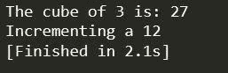

# 如何在 C++中实现内联函数？

> 原文：<https://www.edureka.co/blog/inline-function-in-cpp/>

本文将向您介绍[编程领域](https://www.edureka.co/blog/c-data-structures)中的一个重要概念，即 C++中的内联函数，并通过一个实际的演示来跟进。本文将涉及以下几点

*   [什么是 C++中的内联函数？](#WhatisanInlinefunctioninC++?)
*   [何时使用内嵌功能](#WhentouseInlinefunction)
*   [使用内嵌函数时需要记住的点](#PointstoberememberedwhileusingInlinefunctions)
*   [内嵌功能的优势](#AdvantagesofInlinefunction)
*   [内嵌函数的限制](#LimitationsofInlineFunctions)

让我们从这篇关于 C++内联函数的文章开始吧

## **什么是 C++中的内联函数？**

在程序中使用函数的主要目的之一是节省内存空间，当一个函数可能被多次调用时，这一点就变得很重要。但是，每次调用一个函数，在执行跳转到调用函数等任务时，都要花费大量的额外时间。当一个函数很小时，很大一部分执行时间可能会花费在这种开销上，有时跳转到调用函数所花费的时间可能会比执行该函数所花费的时间更长。

解决这个问题的一个方法是使用宏定义，通常称为宏。预处理器宏在 C 中很流行，但是宏的主要缺点是它们不是真正的函数，因此，通常的错误检查过程不会在编译期间发生。

C++对这个问题有不同的解决方案。为了减少调用小函数的时间，C++提出了一个新的函数，叫做 inline function。内联函数是一种在被调用时可以扩展的函数，因此可以节省时间。编译器用相应的函数代码替换函数调用，从而减少函数调用的开销。

我们应该注意，内联只是对编译器的请求，而不是命令。编译器可以忽略并跳过内联请求。在下列情况下，编译器可能不执行内联:

*   如果函数包含循环。(for，while，do-while)
*   如果函数是递归的。
*   如果函数包含静态变量。
*   如果函数包含 switch 命令或 goto 语句。
*   对于不返回值的函数，如果存在 return 语句。

语法:对于内联函数，声明和定义必须一起完成。

```
inline function-header
{
function-body
}

```

**举例:**

```
#include <iostream> 
using namespace std; 
inline int cube(int s) 
{ 
return s*s*s; 
} 
inline int inc(int a) 
{ 
return ++a; 
}
int main() 
{ 
int a = 11;
cout << "The cube of 3 is: " << cube(3) << "n"; 
cout << "Incrementing a " << inc(a) << "n";
return 0; 
}  

```

**输出:**



**说明:**

这是一个简单的例子，展示了使用 inline 关键字作为前缀声明的两个内联函数。

继续这篇关于 C++中内联函数的文章

## **什么时候使用内联功能？**

我们可以根据需要使用内嵌函数。以下是一些有用建议

*   当需要性能时，我们可以使用 inline 函数。
*   我们可以在宏上使用 inline 函数。
*   我们更喜欢在函数定义的类外使用 inline 关键字来隐藏函数的实现细节。

继续这篇关于 C++中内联函数的文章

**使用内嵌函数时需要记住的点**

*   我们必须保持内联函数小，小的内联函数有更好的效率和更好的结果。
*   内联函数确实提高了效率，但是我们不应该将所有的函数都内联。因为如果我们内联大型函数，可能会导致代码膨胀，最终可能会降低效率。
*   建议使用 scope resolution:: operator 在类定义之外定义大型函数，因为如果我们在类定义中定义这样的函数，那么它们可能会自动成为内联函数，再次影响我们代码的效率。

继续这篇关于 C++中内联函数的文章

## **内嵌功能的优势**

*   不会出现函数调用开销。
*   它节省了函数返回调用的开销。
*   当调用函数时，它节省了堆栈上 push/pop 变量的开销。
*   当我们使用内联函数时，它可以使编译器在函数体上执行特定于上下文的优化，这样的优化对于普通的函数调用是不可能的。
*   它通过利用指令缓存提高了引用的局部性。
*   内联函数对于嵌入式系统可能是有用的，因为内联可以产生比函数调用前导和返回更少的代码。

继续这篇关于 C++中内联函数的文章

## **内嵌函数的限制**

*   大型内联函数会导致缓存未命中，并对效率产生负面影响。
*   编译时在代码中到处复制函数体的编译开销对于小程序来说可以忽略不计，但是对于大的代码库来说可能会有很大的不同。

*   如果我们在程序中需要函数的地址，编译器就不能对这样的函数进行内联。因为为了提供地址给一个函数，编译器将不得不分配存储给它。但是内联函数不获取存储，它们保存在符号表中。
*   内联函数可能会导致系统颠簸，因为它可能会增加二进制可执行文件的大小。内存抖动会导致计算机性能下降，还会影响我们代码的效率。
*   如果有人试图改变内联函数中的代码，内联函数可能会增加编译时间开销，那么所有调用位置都必须重新编译，因为编译器需要再次替换所有代码来反映这些改变，否则它将继续使用旧功能而不做任何改变。

这样，我们就结束了这篇关于“C++中内联函数”的文章。如果你想了解更多，请查看由 Edureka(一家值得信赖的在线学习公司)提供的  [Java 培训](https://www.edureka.co/java-j2ee-soa-training)。Edureka 的 Java J2EE 和 SOA 培训和认证课程旨在培训您掌握核心和高级 Java 概念以及各种 Java 框架，如 Hibernate & Spring。

有问题要问我们吗？请在这个博客的评论部分提到它，我们会尽快回复你。