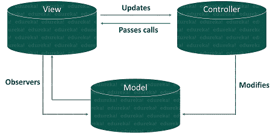

# 什么是 JavaScript MVC 架构，它是如何工作的？

> 原文：<https://www.edureka.co/blog/javascript-mvc/>

在[面向对象编程](https://www.edureka.co/blog/javascript-object/)的开发过程中，模型-视图-控制器(MVC)是一种方法或设计模式，帮助您高效、成功地将用户界面与底层数据模型相关联。在本文中，我们将按照以下顺序学习 [JavaScript](https://www.edureka.co/javascript-jquery-training) MVC 架构:

*   [JavaScript MVC 架构](#javascriptmvc)
*   [型号](#models)
*   [观点](#views)
*   [控制器](#controllers)
*   [JavaScript MVC 框架](#framework)

## **JavaScript MVC 架构**

最近，MVC 模式被应用于各种编程语言，包括 [JavaScript](https://www.edureka.co/blog/javascript-tutorial/) 。JavaScript 由许多支持 MVC 架构或其变体的框架组成。它允许开发人员轻松地将结构添加到他们的应用程序中，而不需要太多的努力。



MVC 由三个组件组成:

*   **型号**
*   **查看**
*   **控制器**

现在，让我们继续深入这三个 JavaScript MVC 组件。

## **型号**

模型用于管理应用程序的数据。他们不关心用户界面或表示层。相反，它们代表应用程序可能需要的独特数据形式。当一个模型被更改或更新时，它通常会通知它的观察者已经发生的更改，以便他们可以相应地采取行动。

让我们举一个使用 Backbone 实现的简单模型的例子:

```

var Photo = Backbone.Model.extend({
// Default attributes for the photo
defaults: {
src: "placeholder.jpg",
caption: "A default image",
viewed: false
},
// Ensure that each photo created has an `src`.
initialize: function() {
this.set( { "src": this.defaults.src} );
}
});

```

在照片库中，照片的概念应该有自己的模型，因为它代表了一种独特的领域特定数据。这种模型可能包含相关的属性，如标题、图像源和附加元数据。在上面的例子中，一张特定的照片将被存储在一个模型的实例中。

## **视图**

视图是模型的可视化表示，提供了模型当前状态的过滤视图。JavaScript 视图用于构建和维护 DOM 元素。视图通常会观察模型，并在模型发生变化时得到通知，从而允许视图相应地更新自身。例如:

```

var buildPhotoView = function ( photoModel, photoController ) {
var base = document.createElement( "div" ),
photoEl = document.createElement( "div" );
base.appendChild(photoEl);
var render = function () {
// We use a templating library such as Underscore
// templating which generates the HTML for our
// photo entry
photoEl.innerHTML = _.template( "#photoTemplate" , {
src: photoModel.getSrc()
});
};
photoModel.addSubscriber( render );
photoEl.addEventListener( "click", function () {
photoController.handleEvent( "click", photoModel );
});
var show = function () {
photoEl.style.display = "";
};
var hide = function () {
photoEl.style.display = "none";
};
return {
showView: show,
hideView: hide
};
};

```

这种架构的好处在于，每个组件在使应用程序按需运行的过程中扮演着各自独立的角色。

## **控制器**

控制器就像模型和视图之间的中介，当用户操作视图时，它负责更新模型。在我们的照片库应用程序的上述示例中，控制器将负责处理用户对特定照片的编辑视图所做的更改，在用户完成编辑时更新特定的照片模型。关于 Javascript 的更多信息，请查看这个[网络开发者在线课程](https://www.edureka.co/masters-program/full-stack-developer-training)。

```

var PhotosController = Spine.Controller.sub({
init: function () {
this.item.bind( "update" , this.proxy( this.render ));
this.item.bind( "destroy", this.proxy( this.remove ));
},
render: function () {
// Handle templating
this.replace( $( "#photoTemplate" ).tmpl( this.item ) );
return this;
},
remove: function () {
this.el.remove();
this.release();
}
});

```

这个例子将为你提供一个非常轻量、简单的方法来管理模型和视图之间的变化。

## **JavaScript MVC 框架**

在过去的几年里，已经开发了一系列 JavaScript MVC [框架](https://www.edureka.co/blog/top-10-javascript-frameworks/)。这些框架都遵循某种形式的 MVC 模式，目的是鼓励开发人员编写更结构化的 JavaScript 代码。一些框架是:

*   **backbone.js**
*   **Ember.js**
*   **角型**
*   **煎茶**
*   **剑道 UI**

至此，我们已经到了 JavaScript MVC 文章的结尾。我希望您理解了 MVC 架构中涉及的三个组件。

*既然你已经了解了 JavaScript MVC，那就去看看 Edureka 的 **[Web 开发认证培训](https://www.edureka.co/complete-web-developer)** 。* *Web 开发认证培训将帮助您学习如何使用 HTML5、CSS3、Twitter Bootstrap 3、jQuery 和 Google APIs 创建令人印象深刻的网站，并将其部署到亚马逊简单存储服务(S3)。*

*有问题吗？请在“JavaScript MVC”的评论部分提到它，我们会给你回复。*