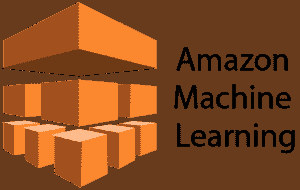
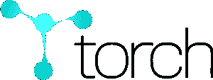
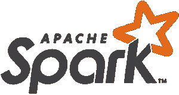

# 你需要知道的 10 大机器学习框架

> 原文：<https://www.edureka.co/blog/top-10-machine-learning-frameworks/>

[机器学习](https://www.edureka.co/masters-program/machine-learning-engineer-training) 的时代已经到来，它在技术领域取得了很多进展，根据 Gartner 的报告，到 2020 年，机器学习和人工智能将创造**230 万个** 工作岗位，这种巨大的增长导致了各种机器学习框架的演变。在本文中，我们将涵盖以下主题:

*   [什么是机器学习？](#machinelearning)
*   [十大机器学习框架](#machinelearningframeworks)
    *   [TensorFlow](#tensorflow)
    *   [theno](#theano)
    *   [Scikit-learn](#scikit)
    *   [咖啡](#caffe)
    *   [H20](#h20)
    *   [亚马逊机器学习](#amazonml)
    *   [火炬](#torch)
    *   [谷歌云 ML 引擎](#mlengine)
    *   [Azure ML 工作室](#azureml)
    *   [火花毫升库](#sparkml)

## **什么是机器学习？**

机器学习是一种类型的  [人工智能](https://www.edureka.co/blog/artificial-intelligence-tutorial/) ，它允许软件应用程序从数据中学习，并在没有人类干预的情况下更加准确地预测结果。

这是一个允许机器从例子和经验中学习的概念，也是在没有明确编程的情况下。为了实现这一点，我们现在有很多机器学习框架。 [机器学习算法](https://www.edureka.co/blog/machine-learning-algorithms/)是普通算法的进化。它们允许你的程序从你提供的数据中自动学习，从而使你的程序更加智能。

## **十大机器学习框架**

机器学习框架是一个接口、库或工具，允许开发人员轻松构建[机器学习模型](https://www.edureka.co/blog/machine-learning-classifier/)，而无需深入底层算法。让我们详细讨论 10 大机器学习框架:

### **TensorFlow**

谷歌的 Tensorflow 是当今最流行的框架之一。这是一个使用数据流图进行数值计算的开源软件库。TensorFlow 实现了数据流图，其中批量数据或张量可以通过一系列由图描述的算法来处理。

### **theno**

Theano 奇妙地折叠在 [Keras](https://www.edureka.co/blog/keras-vs-tensorflow-vs-pytorch/) 之上，这是一个异常状态神经系统库，几乎与 Theano 库并行运行。Keras 的根本优势在于，它是一个温和的 [Python 库](https://www.edureka.co/blog/python-libraries-for-data-science-and-machine-learning/)，可以不断超越 [Theano 或 TensorFlow。](https://www.edureka.co/blog/theano-vs-tensorflow/)

它的创建是为了使深入学习模型的实现对创新工作来说既快速又简单可行。在宽容的 MIT 许可下，它继续在 Python 2.7 或 3.5 上运行，并且可以在给定基本结构的 GPU 和 CPU 上一致地执行。

### **Sci-Kit 学习**

[Scikit-learn](https://www.edureka.co/blog/scikit-learn-machine-learning/) 是最知名的 [ML 库](https://www.edureka.co/blog/python-libraries-for-data-science-and-machine-learning/)。对于管理的和无监督的学习计算，它是优选的。先例实现直接和计算的复发、选择树、群聚、k-隐含等。

这个框架涉及到常规人工智能和数据挖掘任务的大量计算，包括群聚、复发和排序。

### **咖啡**

Caffe 是另一种受欢迎的学习结构，以清晰度、速度和测量质量为首要目标。它是由伯克利视觉和学习中心(BVLC)和网络捐助者创建的。

谷歌的 DeepDream 依赖于 Caffe 框架。这个结构是 BSD 授权的 C++库，带有 Python 接口。

### **H20**

H20 是一个开源的机器学习平台。这是一个[人工智能工具](https://www.edureka.co/blog/top-12-artificial-intelligence-tools/)，面向商业，帮助基于数据做出决策，并使用户能够获得洞察力。它主要用于预测建模、风险和欺诈分析、保险分析、广告技术、医疗保健和客户智能。

### **亚马逊机器学习**

亚马逊机器学习提供可视化工具，帮助你经历创建机器学习(ML)模型的过程，而不必学习复杂的 [ML 算法](https://www.edureka.co/blog/machine-learning-algorithms/)和技术。

这是一项让所有技能水平的开发人员都能轻松使用机器学习技术的服务。它连接到存储在亚马逊 S3、红移或 RDS 中的数据，并可以对数据运行二元分类、多类分类或回归来构建模型。

### **火炬**

这个框架首先向 GPU 提供了对机器学习算法的广泛支持。由于简单快速的脚本语言、 **LuaJIT** 和底层的 **C/CUDA** 实现，它易于使用且高效。

Torch 的目标是以极其简单的过程最大限度地提高构建科学算法的灵活性和速度。

*要了解更多关于 AI ML 的知识，那就去读人工智能教程吧。还有，报读 NIT Warangal 的 PGP [人工智能课程](https://www.edureka.co/executive-programs/machine-learning-and-ai)就可以精通了。*

### **谷歌云 ML 引擎**

云机器学习引擎是一项托管服务，可帮助开发人员和数据科学家在生产中构建和运行卓越的机器学习模型。

它提供训练和预测服务，可以一起使用，也可以单独使用。企业使用它来解决问题，如确保食品安全、卫星图像中的云、以四倍的速度回复客户电子邮件等。

### **Azure ML 工作室**

这个框架允许[微软 Azure](https://www.edureka.co/blog/microsoft-azure-tutorial) 用户创建和训练模型，然后将它们转换成可供其他服务使用的 API。此外，对于更大的模型，您可以将自己的 Azure 存储连接到服务。

要使用 Azure ML Studio，你甚至不需要一个帐户来试用这项服务。您可以匿名登录并使用 Azure ML Studio 长达八小时。

### **火花毫升库**

这是 [Apache Spark](https://www.edureka.co/blog/spark-architecture/) 的机器学习库。这个框架的目标是让实用的机器学习变得可扩展和简单。

它由常见的学习算法和实用程序组成，包括分类、回归、聚类、协同过滤、降维，以及较低级别的优化原语和较高级别的管道 API。

至此，我们已经到了十大机器学习框架列表的末尾。

*如果你希望报名参加人工智能和机器学习的完整课程，Edureka 有一个专门策划的  [**机器学习工程师硕士项目**](https://www.edureka.co/masters-program/machine-learning-engineer-training) ，它将使你精通监督学习、非监督学习和自然语言处理等技术。它包括人工智能&机器学习方面的最新进展和技术方法的培训，如深度学习、图形模型和强化学习。*