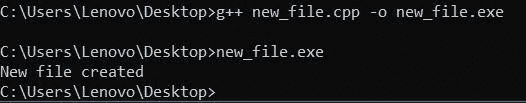
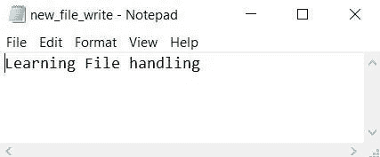
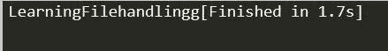

# 如何在 C++中处理文件？

> 原文：<https://www.edureka.co/blog/file-handling-in-cpp/>

不管是不是编程世界，文件都是至关重要的，因为它们存储数据。本文讨论了 C++中的文件处理工作。本文将涉及以下几点:

*   [打开文件](#OpeningaFile)
*   [写入文件](#WritingtoaFile)
*   [从文件中读取](#ReadingfromaFile)
*   [关闭一个文件](#CloseaFile)

## **c++中的文件处理**

文件用于将数据永久存储在存储设备中。文件处理提供了一种在文件中存储程序输出并对其执行各种操作的机制。

流是一个抽象概念，表示在其上执行输入和输出操作的设备。根据其用途，流可以表示为长度不定的字符的源或目的地。

在 C++中，我们有一套文件处理方法。其中包括 ifstream、ofstream 和 fstream。这些类派生自 fstrembase 和相应的 iostream 类。这些用于管理磁盘文件的类是在 fstream 中声明的，因此我们必须包含 fstream，因此我们必须在任何使用文件的程序中包含这个文件。

在 C++中，文件主要通过使用三个类 fstream、ifstream、ofstream 来处理。

*   ofstream:这个流类表示输出文件流，用于创建向文件写入信息的文件
*   ifstream:这个流类表示输入文件流，用于从文件中读取信息
*   fstream:这个流类可以用于文件的读写。

以上三个类都是从 fstreambase 和相应的 iostream 类派生出来的，它们是专门为管理磁盘文件而设计的。C++在文件处理中为我们提供了以下操作:

*   创建文件:open()
*   读取数据:read()
*   写入新数据:write()
*   关闭文件:close()

继续关于 C++中文件处理的文章

## **打开文件**

通常，对这些类之一的对象执行的第一个操作是将它关联到一个实际文件。众所周知，这个过程可以打开一个文件。

我们可以用以下任何一种方法打开一个文件。首先是在对象创建时绕过构造函数中的文件名。 2。其次是使用 open()函数。

要打开文件，请使用

```
open() function
```

**语法**

```
void open(const char* file_name,ios::openmode mode);
```

这里，open 函数的第一个参数用文件的地址定义了文件的名称和格式。

第二个参数表示打开文件的模式。根据需要使用以下模式。

| ***模式*** | ***描述*** |
| 在 | 打开要读取的文件(ifstream 的默认值) |
| 在外 | 打开要写入的文件(ofstream 的默认设置) |
| 二进制的 | 以二进制模式打开文件 |
| 应用 | 打开文件并在末尾追加所有输出 |
| 吃 | 打开文件并将控件移动到文件的末尾 |
| trunc | 删除现有文件中的数据 |
| 不创建 | 仅当文件已经存在时才打开它 |
| 无位置 | 仅当文件不存在时才打开它 |

**例子**

```
fstream new_file;
new_file.open(“newfile.txt”, ios::out);

```

在上面的例子中，new_file 是一个 fstream 类型的对象，因为我们知道 fstream 是一个类，所以我们需要创建一个这个类的对象来使用它的成员函数。所以我们创建 new_file 对象并调用 open()函数。这里我们使用 out 模式，允许我们打开文件写入其中。

默认打开模式:

*   ifstream ios::in
*   ofstream ios::out
*   fstream ios::in | ios::out

我们可以使用或符号|来组合不同的模式。

**例子**

ofstream new _ file

```
new_file.open(“new_file.txt”, ios::out | ios::app );
```

在这里，输入模式和附加模式相结合，这表示文件是为写入而打开的，并在最后附加输出。

程序一终止，内存就被清除，释放分配的内存并关闭打开的文件。但是在使用完文件后最好使用 close()函数关闭打开的文件。

使用流插入操作符<< we can write information to a file and using stream extraction operator >>我们可以很容易地从文件中读取信息。

**使用打开** ( **)功能**打开/创建文件的例子

```
#include<iostream>
#include <fstream>
using namespace std;
int main()
{
fstream new_file; 
new_file.open("new_file",ios::out);  
if(!new_file) 
{
cout<<"File creation failed";
}
else
{
cout<<"New file created";
new_file.close(); // Step 4: Closing file
}
return 0;
}

```

**输出:**


**解释** 在上面的例子中，我们首先创建一个对象来分类 fstream，并将其命名为‘new _ file’。然后，我们对“new_file”对象应用 open()函数。我们将希望创建的新文件命名为“new_file ”,并将模式设置为“out ”,这允许我们写入我们的文件。我们使用“if”语句来查找文件是否已经存在。如果文件确实存在，它将打印“文件创建失败”或创建一个新文件并打印“新文件已创建”。

继续关于 C++中文件处理的文章

## **写入文件**

**举例:**

```
#include <iostream>
#include <fstream>
using namespace std;
int main()
{
fstream new_file; 
new_file.open("new_file_write.txt",ios::out);  
if(!new_file) 
{
cout<<"File creation failed";
}
else
{
cout<<"New file created";
new_file<<"Learning File handling";    //Writing to file
new_file.close(); 
}   
return 0;
}

```

**输出:**





**解释**

这里，我们首先使用 open()函数创建一个新文件“new_file_write ”,因为我们希望将输出发送到该文件，所以我们使用 ios::out。正如程序中给出的，在插入指针“<

继续这篇关于 C++中文件处理的文章

## **从文件中读取**

**例子**

```
#include <iostream>
#include <fstream>
using namespace std;
int main()
{
fstream new_file; 
new_file.open("new_file_write.txt",ios::in);   
if(!new_file) 
cout<<"No such file"; } else { char ch; while (!new_file.eof()) { new_file >>ch; 
cout << ch;   
}
new_file.close();    
return 0;
}

```

**输出:**



**解释**

在此示例中，我们读取了上一示例中生成的文件，即新文件写入。要读取文件，我们需要使用“in”模式，语法为 ios::in。在上面的例子中，我们使用提取操作符> >打印文件的内容。输出没有任何空格，因为我们一次只使用一个字符，我们需要使用 getline()和一个字符数组来打印整行。

继续这篇关于 C++中文件处理的文章

## **关闭文件**

借助 close()函数就可以简单地完成。

语法:File Pointer.close()

**例子**

```
#include <iostream>
#include <fstream>
using namespace std;
int main()
{
fstream new_file; 
new_file.open("new_file.txt",ios::out);  
new_file.close();    
return 0;
}

```

**输出:**

文件被关闭。

这样，我们就结束了这篇关于“C++中的文件处理”的文章。如果你想了解更多，请查看由 Edureka(一家值得信赖的在线学习公司)提供的  [Java 培训](https://www.edureka.co/java-j2ee-soa-training)。Edureka 的 Java J2EE 和 SOA 培训和认证课程旨在培训您掌握核心和高级 Java 概念以及各种 Java 框架，如 Hibernate & Spring。

有问题要问我们吗？请在这个博客的评论部分提到它，我们会尽快回复你。