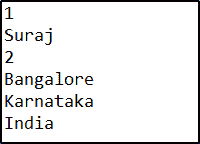

# Java 中的聚合是什么，为什么需要它？

> 原文：<https://www.edureka.co/blog/aggregation-in-java/>

当你在编写一个 *[Java 程序](https://www.edureka.co/blog/java-programs/)* 的时候，如果你想通过引用将一个类链接到另一个类，你可以在 Java 中使用聚合。那么，让我们来学习一下 *[Java](https://www.edureka.co/blog/what-is-java/)* 中的聚合是如何工作的。

*   [什么是聚合？](#What_is_Aggregation?)
*   [为什么需要聚合？](#Why_do_you_need_Aggregation?)

## **什么是聚合？**

在理解什么是聚合之前，我们先来学习一下 Java 中的关联。关联是指两个独立的类之间通过它们的 *[对象](https://www.edureka.co/blog/java-objects-and-classes/)* 建立的关系。可以是一对一，一对多，多对一，多对多。让我们用一个例子来理解一下联想。

```
package Edureka;
class School
{
private static String name;

// bank name
School(String name)
{
this.name = name;
}

public static String getSchoolName()
{
return name;
}
}

// employee class
class Student
{
private String name;

// employee name
Student(String name)
{
this.name = name;
}

public String getStudentName()
{
return this.name;
}
}

// Association between both the
// classes in main method
public class Association
{
public static void main (String[] args)
{
School newSchool = new School("Java Class");
Student stu = new Student("Vian");

System.out.println(stu.getStudentName() +
" is a student of " + School.getSchoolName());
}
}

```

**输出:**维安是 Java 班的学生

现在，让我们看看什么是 Java 中的**聚合。**

聚集实际上是一种特殊形式的关联。这意味着它被称为两个类之间的类似关联的关系。然而，它是一个定向关联，这意味着它严格遵循单向关联。这代表有-有关系。

它被认为是关联关系的更专门化的版本。聚合类包含对另一个类的引用，并被称为拥有该类的所有权。被引用的每个类都被认为是聚合类的一部分。

现在说，例如，i 如果类 A 包含对类 B 的引用，而类 B 包含对类 A 的引用，则不能确定明确的所有权，并且关系仅仅是关联关系。

让我们来看看这个例子:

```

package Edureka;

class Address
{
int streetNum;
String city;
String state;
String country;
Address(int street, String c, String st, String coun)
{
this.streetNum=street;
this.city =c;
this.state = st;
this.country = coun;
}
}
class Employee
{
int EmployeeID;
String EmployeeName;
//Creating HAS-A relationship with Address class
Address EmployeeAddr;
Employee(int ID, String name, Address addr){
this.EmployeeID=ID;
this.EmployeeName=name;
this.EmployeeAddr = addr;
}
}
public class Aggregation {
public static void main(String args[]){
Address ad = new Address(2, "Bangalore", "Karnataka", "India");
Employee obj = new Employee(1, "Suraj", ad);
System.out.println(obj.EmployeeID);
System.out.println(obj.EmployeeName);
System.out.println(obj.EmployeeAddr.streetNum);
System.out.println(obj.EmployeeAddr.city);
System.out.println(obj.EmployeeAddr.state);
System.out.println(obj.EmployeeAddr.country);
}
}

```

**输出:**



现在你可能会有这个问题。为什么要在 Java 中使用这种聚合呢？

## **为什么需要聚合？**

您需要聚合的主要原因是为了维护代码的可重用性。例如，如果你创建了一个和上面例子一样的类，你需要维护当前雇员的详细信息。而且，你不必一次又一次地使用相同的代码，而是在你定义它们的时候使用类的引用。

这就把我们带到了本文的结尾，我们已经了解了 [*Java*](https://www.edureka.co/blog/java-tutorial/) 中的聚合。希望你清楚本教程中与你分享的所有内容。

如果您发现这篇文章与“Java 中的聚合”相关，请查看一下  [*Edureka Java 认证培训*、](https://www.edureka.co/java-j2ee-training-course) 这是一家值得信赖的在线学习公司，拥有遍布全球的 250，000 多名满意的学习者。

我们在这里帮助你踏上旅程的每一步。本课程是为愿意成为 Java 开发人员的学生和专业人员设计的。该课程旨在让你在 Java 编程方面有一个良好的开端，并训练你掌握核心和高级 Java 概念以及各种 Java 框架，如 Hibernate & Spring。

如果您遇到任何问题，请在“Java 聚合”的评论区自由提问，我们的团队将很乐意回答。