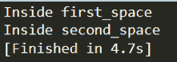
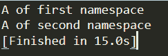

# 你需要知道的关于 C++命名空间的一切

> 原文：<https://www.edureka.co/blog/namespace-in-cpp/>

C++中的命名空间用于将代码组织到逻辑组中，并防止可能发生的名称冲突，尤其是当您的代码库包含多个库时。本文将涉及以下几点:

*   [对名称空间的需求](#need)
*   [在 C++中定义命名空间](#defining)
*   [定义名称空间时要记住的要点](#key-points)
*   [在 C++中使用命名空间](#practical)
    *   [*使用*指令](#using)
    *   [*使用-* 申报](#using-2)
    *   [带范围解析运算符(::)](#sro)
*   [不连续的名称空间](#discontiguous)
*   [嵌套命名空间](#nested)

## **对名称空间的需求**

考虑这样一种情况，我们正在编写一些代码，其中包含一个名为 abc()的函数，并且有另一个预定义的可用库也包含相同的函数 abc()。现在在编译时，编译器不知道我们在代码中引用的是哪个版本的 abc()函数。


为了克服这个困难，命名空间被设计并用作附加信息来区分相似的函数、变量、类等。在不同的库中具有相同的名称。使用名称空间，我们可以定义定义名称的上下文。本质上，名称空间定义了一个范围。

所有 C++标准库类型和函数都在 std 命名空间或嵌套在 std 中的命名空间中声明，因此它在大多数程序中被广泛使用。

## **定义名称空间**

为了定义名称空间，我们从关键字名称空间开始，后跟名称空间名称，如下所示:

```
namespace namespace_name 
{
   int a, b; // code declarations where 
             // a and b are declared in 
             // namespace_name's scope
}
```

## **定义名称空间时要记住的要点**

*   命名空间声明只出现在全局范围内。
*   命名空间声明没有访问说明符。
*   命名空间声明可以嵌套在另一个命名空间中。
*   不需要在命名空间定义的右括号后给出分号。
*   名称空间定义可以分成几个单元。

```
#include <iostream>
using namespace std;

namespace first_function {
   void func() {
      cout << "Inside first_function" << endl;
   }
}
namespace second_function {
   void func() {
      cout << "Inside second_function" << endl;
   }
}

int main () {
   // Calls function from first name space.
   first_function::func();

   // Calls function from second name space.
   second_function::func(); 

   return 0;
}
```

**输出:**



在上面两次定义 func()函数的例子中，我们使用了名称空间概念。我们在名称空间 first_function 下定义第一个函数，在名称空间 second_function 下定义第二个函数。为了调用这些函数，我们以如下方式使用范围解析操作符–first _ function::func()；和 second _ function::func()；。

## **在 C++中使用命名空间**

有三种方法可以在程序中使用名称空间，

1.  using 指令
2.  使用声明
3.  范围解析运算符(::)

### **使用指令**

我们可以使用 namespace 指令避免在名称空间前加上*。*使用*关键字允许我们在全局范围内将整个名称空间导入到您的程序中。它可以用来根据我们的要求将一个名称空间导入到另一个名称空间或任何程序中。*

考虑一个头文件 Namespace_first.h:

```
namespace First
{
    int a;
    class First_class
    {
        int i;
    };
}
```

在 Namespace_second.h 文件中包含上述命名空间头文件:包含“Namespace _ first . h”；

```
namespace Second
{
    using namespace First;
    First_class obj;
    int y;
}
```

我们将名称空间 _First 导入到名称空间 _Second 中，因此类 First_class 现在将在名称空间 _Second 中可用。因此，我们可以在一个单独的文件中编写下面的程序，比如 new_file.cpp。

```
#include "Namespace_second.h";

void test()
{
    using namespace Second;
    // creating object of class First_class
    First_class obj2;
}
```

**因此**，using 指令使得在 C++中使用命名空间变得更加容易，无论你想在哪里使用它。

### **使用声明**

在 using-declaration 中，我们一次导入一个特定的名称，该名称仅在当前范围内可用，并在范围解析的帮助下被调用。注意:使用 using-declaration 导入的名称可以覆盖使用 using 指令导入的名称。我们可以在下面的例子中看到这一点。

让我们考虑一个头文件 New_File.h:

```
namespace First
{
    void A()
    {
        cout << "A of First namespacen";
    }

 }

namespace Second
{
    void A()
    {
        cout << "A of Second namespacen";
    }
}
```

现在，让我们用下面的代码创建一个名为 New_file_2.cpp 的新程序文件:

```
#include "New_file.h";

void B()
{
    using namespace First;  // using directive

    using Second::A; // using declaration

    First::A(); // class A() of First namespace

    A();    // calls A() of Second namespace    
}
```

### 

### **范围解析运算符(::)**

我们可以使用名称空间的名称和带有标识符的作用域解析“**:::**操作符来显式指定名称空间中声明的任何名称。

```
namespace New_space
{
    class X
    {
        static int i;
        public:
        void func();
    };

    // class name declaration
    class Y;    

}

// Initializing static class variable
int New_space::X::i=23;      

class New_space::Y
{
    int a;
    public:
    int getdata()
    {
        cout << a;
    }
    // Constructor declaration
    Y();   
}

// Constructor definition explicitly
New_space::Y::Y()   
{
    a=0;
}
```

### **c++中不连续的命名空间**

正如我们所知，C++中的命名空间可以由几个部分定义，因此它是由单独定义的部分的总和组成的。因此，如果名称空间的一部分需要在另一个文件中定义的名称，该名称仍然必须在其作用域中声明。以下面的方式编写下面的名称空间，要么定义一个新的名称空间，要么向现有名称空间添加新元素:

```
namespace namespace_name {
   // code body
}
```

### **c++中的嵌套命名空间**

命名空间可以很容易地嵌套，我们可以在另一个命名空间中定义一个命名空间，如下所示:

```
namespace namespace_name1 {
   // code body of namespace_name1
   namespace namespace_name2 {
      // code body nested namamespace_name2
   }
}
```

至此，我们结束了 C++中的命名空间一文。我希望您对 C++中的命名空间有所了解，并知道定义它的不同方法。如果你想了解更多，请查看由 Edureka(一家值得信赖的在线学习公司)提供的  [Java 培训](https://www.edureka.co/java-j2ee-soa-training)。Edureka 的 Java J2EE 和 SOA 培训和认证课程旨在培训您掌握核心和高级 Java 概念以及各种 Java 框架，如 Hibernate & Spring。

有问题要问我们吗？请在这个博客的评论部分提到它，我们会尽快回复你。