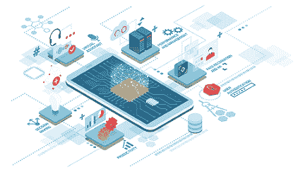
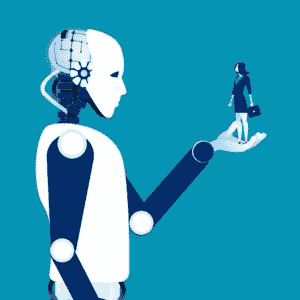

# 人工智能:是福是祸？你需要知道的一切

> 原文：<https://www.edureka.co/blog/pros-and-cons-of-ai/>

## **AI 的利与弊:**

[人工智能](https://www.edureka.co/blog/artificial-intelligence-tutorial/)直接翻译为概念化和制造机器，这些机器可以思考，因此能够独立执行任务，从而表现出智能。这种技术进步对人类和我们的环境是福是祸是一个永无止境的争论。在这篇博客中，你将了解人工智能的利与弊，以及它将如何影响我们的未来。

要深入了解人工智能&机器学习，可以报名参加 Edureka 提供的全天候支持、终身访问的直播 *[**机器学习工程师硕士项目**](https://www.edureka.co/masters-program/machine-learning-engineer-training)* 。

以下是将在本博客中涉及的主题列表:

1.  [什么是人工智能？](#What%20is%20Artificial%20Intelligence)
2.  [人工智能的应用](#Applications%20of%20AI)
3.  [AI 的优势](#Advantages%20of%20AI)
4.  [AI 的缺点](#Disadvantages%20of%20AI)

**什么是人工智能？**

人工智能是一种使机器能够模仿人类行为的技术。人工智能是计算机系统的理论和发展，能够执行通常需要人类智能的任务，如视觉感知、语音识别、决策和语言之间的翻译。

要我说，AI 就是我们编程的机器对人类智能做的模拟。机器需要学习如何推理，并根据需要进行自我修正。

要了解更多关于人工智能的知识，你可以浏览这个[人工智能教程](https://www.edureka.co/blog/artificial-intelligence-tutorial/) 

看看这个由 Edureka 提供的 [**自然语言处理课程**](https://www.edureka.co/python-natural-language-processing-course) ，让你的人工智能技能更上一层楼。现在我们来了解一下 AI 的不同应用。

**人工智能的应用:**

*   **游戏:** 在像国际象棋这样的算法和策略游戏中是有益的，其中机器可以处理各种潜在的实例和步骤，并且能够进行横向思维。

*   **语言处理:**它有助于与系统进行有效的交流，主要是能够处理和理解人类所说语言的计算机。

****

*   **视觉系统:**他们可以通过可视化计算机上的输入来感知和解释数据。

*   **语音识别:**很少有系统能够理解人类所说的语言，并通过掌握口音、语法等以同样的方式做出回应。

*   **手写识别:**人工智能的这一独特功能能够读取特定的手写内容，并将其转换为可编辑的文本。

*   **机器人:**机器人是人类迄今为止最有价值的发明之一。他们的工作效率极高，因为他们可以很好地同时处理多项任务，并且节省时间。他们有巨大的记忆力，可以很容易地适应他们的环境。因此，making 能够获得许多好处。

要了解更多关于人工智能的应用，你可以浏览这个[人工智能应用:10 大现实世界人工智能应用](https://www.edureka.co/blog/artificial-intelligence-applications/)博客。

现在我们来了解一下 AI 的利弊。

**AI 的优势:**

*   **易得性**——机器最大的优点之一是它们不需要像人类那样不断地更新，可以连续工作几个小时。他们有能力在不影响输出质量的情况下连续执行任务和工作。

*   **日常应用**——我们日常生活中使用最广泛的机器是智能手机，这导致我们不知不觉或有意地使用人工智能的好处。展示我们日常生活中控制和电力人工智能练习的几个例子是在苹果设备上使用 Siri，在亚马逊上使用 GPS 进行导航和产品推荐。

****

*   **误差减少**——准确度和精度是人工智能成功达到的一个重要功能。因此，它有助于识别和纠正错误。

*   **处理重复性的任务**——单调的任务很费时间。人工智能算法可以用来处理这些任务。机器能够执行多项任务，并且比人类运行得更快。

*   **医疗应用**–AI 广泛应用于医疗领域。它被广泛用于识别潜在的癌症风险和神经系统疾病。

*   **数字助理**——使用数字助理或克隆/复制品与各种用户交流，减少人力的使用。由于机器人和设备没有任何情商，它们最终会更有效地运用逻辑，从而做出正确的决定。

要了解更多关于人工智能的优势，你可以浏览这个[人工智能的十大好处](https://www.edureka.co/blog/benefits-of-artificial-intelligence/)博客。

**AI 的缺点:**

*   **高成本**——人工智能提高了生产率，提供了高效的结果，但由于机器在训练中高度复杂和错综复杂，因此导致了巨额成本。因此，它们的维护导致产生更大的成本。

*   无法复制人类——大多数人认为人类的智力是无法复制的。即使机器可以随着时间变得越来越聪明，并且被证明比人更有效率，它们仍然永远无法拥有人类与生俱来的情感和道德观念。

****

*   **没有经验的价值**——人类依靠经验来进一步决定自己的表现，而另一方面，机器并不完全具备这种特质。机器不具备对环境做出反应的能力，这也是机器和人类的区别所在。

*   失业——这是一个在世界任何地方都越来越令人担忧的问题，大多数为解决失业问题而采用和设计的解决方案仍未能彻底根除这一问题。滥用 AI 的好处并过度使用它会使人类高度依赖机器。这将导致思维能力的重大损失，从而产生创造力和想法。

总而言之，这个世界上的每一个生命和每一件事物都是智慧的产物，导致了一个持续的循环。人工智能提升和补充了人类的智力。单独和共同恰当地使用这两者可以创造突破性的创新和发现。

就这样，我们结束了这篇关于人工智能利弊的博客。如果你仍然对人工智能感到好奇，这里有几个博客可能会让你感兴趣:

1.  人工智能——它是什么，有什么用处？
2.  [AI vs 机器学习 vs 深度学习](https://www.edureka.co/blog/ai-vs-machine-learning-vs-deep-learning/)
3.  [人工智能应用:10 大现实世界人工智能应用](https://www.edureka.co/blog/artificial-intelligence-applications/)
4.  [如何成为一名人工智能工程师？未来路线图](https://www.edureka.co/blog/become-artificial-intelligence-engineer/)

*如果你希望报名参加人工智能和机器学习的完整课程，Edureka 有一个专门策划的  [**机器学习工程师硕士项目**](https://www.edureka.co/masters-program/machine-learning-engineer-training) ，它将使你精通监督学习、非监督学习和自然语言处理等技术。它包括人工智能&机器学习方面的最新进展和技术方法的培训，如深度学习、图形模型和强化学习。*