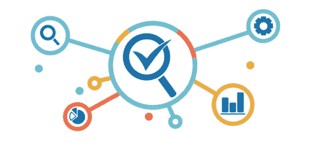
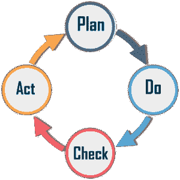

# 什么是软件质量保证测试，它是如何工作的？

> 原文：<https://www.edureka.co/blog/software-quality-assurance/>

一个软件应用程序在上市前需要通过质量检查。客户满意度对任何组织都至关重要，只有高质量的产品才能让您的客户满意。在本文中，我们将按以下顺序了解软件质量保证[测试](https://www.edureka.co/software-testing-fundamentals-training):

*   [什么是软件质量保证测试？](#sqatesting)
*   [软件质量保证测试活动](#sqaactivity)
*   [SQA 进程](#sqaprocess)
*   [SQA 测试的目的](#sqapurpose)
*   [SQA 组件](#sqacomponents)

**什么是软件质量保证测试？**

软件质量保证测试是一种用于确保[软件工程](https://www.edureka.co/blog/selenium-resume/)过程质量的方法。它确保开发的软件满足并符合标准化的质量规范。SQA 是软件开发[生命周期](https://www.edureka.co/blog/software-testing-life-cycle/)中的过程，用于检查开发的软件，以确保它满足期望的质量度量。

它专注于改进软件开发的过程，以便在问题变成大问题之前就可以预防。软件质量保证测试的工作就像一个应用于整个软件过程的伞状活动。

**软件质量保证测试活动**

一些 SQA 测试活动包括:

*   **SQA 管理计划:首先，你需要**计划在整个项目中实施 SQA。然后找出哪一套软件工程活动最适合这个项目，并检查 SQA 团队的技能水平。

*   **设置检查点:** SQA 团队需要设置检查点。这里，您需要根据在不同检查点上收集的数据来评估项目的性能。

*   多种测试策略:不应该依赖单一的测试方法。当你有很多可用的[测试方法](https://www.edureka.co/blog/software-testing-models/)时，你必须使用它们。

*   **测量变更影响:**为纠正错误而进行的变更有时会重新引入更多的错误。因此，保持对项目变更影响的度量。重置新的更改以检查与整个项目的兼容性。

*   **管理好关系**:在工作环境中，管理好与参与项目开发的其他团队的关系是必须的。SQA 团队和程序员团队的不良关系将直接影响项目。

**SQA 进程**

SQA 遵循由以下阶段组成的流程或周期:

*   **计划**——第一阶段是计划。组织需要策划和建立与过程相关的目标，并确定交付高质量最终产品所需的过程。

*   **Do**–该阶段涉及流程的开发和测试。此外，您可以在流程中进行更改。

*   **检查**——在此阶段，您可以监控和修改流程，并检查其是否符合预定的目标。

*   **行动**-最后阶段包括实施必要的行动，以实现流程的改进。

**SQA 测试的目的**

SQA 测试的目的是:

*   建立全组织的政策、程序和标准。

*   从整个组织的模板中定制特定于项目的政策、程序和标准。

*   帮助组织起草一个适当的软件质量保证计划和标准。

**SQA 组件**

SQA 系统总是结合了各种 SQA 组件。这些组件分为以下六类

*   **项目前组成部分—**这确保项目承诺已明确定义，牢记所需资源、进度和预算；并且已经正确地确定了开发和质量计划。

*   **项目生命周期活动评估的组成**–项目生命周期由两个阶段组成，如开发生命周期阶段和运营维护阶段。开发生命周期阶段检测设计和编程错误。在运行维护阶段使用的 SQA 组件包括专门的维护组件，以及用于改进维护任务的开发生命周期组件。

*   **基础设施错误预防和改进的组成部分-** 这些组成部分的主要目标是根据组织积累的 SQA 经验，消除或降低错误率。

*   软件质量管理的组成部分- 这类组成部分处理几个目标，例如开发和维护活动的控制，以及引入早期的管理支持行动，主要是防止进度和预算失败。

*   **标准化、认证和 SQA 体系评估的组成部分-** 本课程的主要目标是利用国际专业知识，改善组织质量体系与其他组织的协调，并根据通用标准评估质量体系的成就。

*   **为 SQA 组织**——SQA 组织基地包括经理、测试人员、SQA 单位以及对软件质量感兴趣的人，如 SQA 受托人、SQA 委员会成员和 SQA 论坛成员。他们的主要目标是启动和支持 SQA 组件的实施，发现与 SQA 程序的偏差并提出改进建议。

至此，我们已经结束了我们的 SQA 测试文章。我希望你了解 SQA 的不同活动和流程。

*既然你已经了解了软件质量保证测试，那就来看看* [***软件测试基础课程***](https://www.edureka.co/software-testing-fundamentals-training) *作者* *Edureka。本课程旨在向您介绍完整的软件测试生命周期。您将学习不同级别的测试、测试环境设置、测试用例设计技术、测试数据创建、测试执行、错误报告、DevOps 中的 CI/CD 管道以及软件测试的其他基本概念。* *有问题吗？请在“什么是软件测试”的评论部分提到它，我们会给你回复。*

有问题要问我们吗？请在本“*博客* *的评论区提及，我们会尽快回复您。*