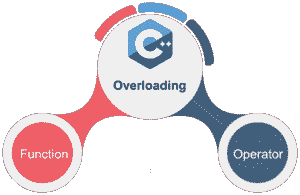
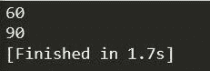
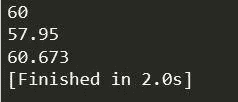
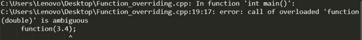
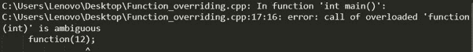
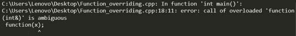

# C++中的函数重载:你需要知道的一切

> 原文：<https://www.edureka.co/blog/function-overloading-in-cpp/>

C++是非常灵活的编程语言之一，它还涵盖了面向对象编程的几个特性。重载是这种编程语言的另一个特点。以下指针将在这篇“C++中的函数重载”文章中讨论-

*   [C++重载](#overloading)
*   [c++中的重载类型](#types)
*   [什么是 C++中的函数重载](#what)
    *   通过改变自变量的数量
    *   通过拥有不同类型的自变量
*   [c++中函数重载的优势](#advantages)
*   [c++中函数重载的弊端](#disadvantages)
*   [函数重载和歧义](#ambiguity)

## **C++重载**

当我们创建一个类的两个或多个成员，它们有相同的名字，但是参数的数量或类型不同，这就是 C++重载。在 C++中，我们可以重载:

*   方法，
*   构造函数，以及
*   索引属性

## **c++中重载的类型**



## **c++中什么是函数重载？**

C++中的函数重载可以定义为一个类中有两个或多个成员函数同名，但参数不同的过程。在函数重载中，可以根据需要使用不同类型的参数或不同数量的参数来重新定义函数。只有通过这些差异，编译器才能区分这两个重载函数。

函数重载的一个主要优点是它增加了程序的可读性，因为我们不需要一次又一次地为同一个动作使用不同的名字。

## **通过改变自变量的数量**

通过这种函数重载的方式，我们定义了两个函数，它们具有相同的名称，但是相同类型的参数数量不同。例如，在下面提到的程序中，我们使用了两个 add()函数来返回两个和三个整数的和。

```
// first function definition
int add(int a, int b)
{
    cout << a+b;
}

// second overloaded function definition
int add(int a, int b, int c)
{
    cout << a+b+c;
}
```

这里 add()函数被认为是重载的，因为它有两个定义，一个接受两个参数，另一个接受三个参数。将调用哪个 add()函数取决于参数的数量。

```
int main()
{
    add(10, 20);  // add() with 2 parameter will be called

    add(10, 20, 30);  //sum() with 3 parameter will be called

}
```

```
#include <iostream>

using namespace std;

int add(int a, int b)
{
    cout << a+b <<endl;
    return 0;
}

int add(int a, int b, int c)
{
    cout << a+b+c <<endl;
    return 0;
}

int main()
{

    add(20, 40);  

    add(40, 20, 30);  
}
```



在上面的例子中，我们通过改变 add()函数的参数数量来重载它。首先，我们用两个参数定义了一个 add()函数，然后我们通过再次定义 add()函数来重载它，但这次是用三个参数。

## **通过拥有不同类型的自变量**

在这种方法中，我们定义了两个或多个函数，它们具有相同的名称和相同数量的参数，但是用于这些参数的数据类型是不同的。例如在这个程序中，我们有三个 add()函数，第一个得到两个整数参数，第二个得到两个浮点参数，第三个得到两个双精度参数。

```
#include <iostream>

using namespace std;
int add(int x, int y) // first definition
{
    cout<< x+y << endl;

    return 0;
}

float add(float a, float b)
{
	cout << a+b << endl;
	return 0;
}

double add(double x, double y)
{
    cout << x+y << endl;
    return 0;
}

int main()
{

    add(20, 40);  

    add(23.45f, 34.5f);

    add(40.24, 20.433);  

}
```



在上面的例子中，我们定义了三次 add()函数。第一次使用整数作为参数，第二次使用 float 作为参数，第三次使用 double 作为参数。因此，我们重写了 add()函数两次。

## **c++中函数重载的优势**

*   我们使用函数重载来节省内存空间，保持程序的一致性和可读性。

*   使用函数重载的概念，我们可以开发多个同名的函数

*   函数重载显示了允许我们获得不同行为的多态行为，尽管会有一些链接使用相同的函数名。

*   函数重载加速了程序的执行。

*   函数重载用于代码的可重用性和节省内存。

*   它帮助应用程序根据参数的类型加载类方法。

*   代码维护很容易。

## **c++中函数重载的缺点**

*   只有返回类型不同的函数声明不能用函数重载过程重载。
*   具有相同参数或相同名称类型的成员函数声明，如果其中任何一个声明为静态成员函数，则不能重载。
*   ```
    class XYZ{
      static void func();
      void func(); // error
      };
    ```

## **函数重载和模糊**

当编译器无法决定应该在重载函数中首先调用哪个函数时，这种情况称为函数重载模糊性。如果显示歧义错误，编译器不会运行程序。函数重载歧义的原因:

*   类型转换。
*   带有默认参数的函数。
*   通过引用传递的函数

**类型转换:**

```
#include<iostream>  
using namespace std;  

void function(float); 
void function(int);  

void function(float x)  
{  
    std::cout << "Value of x is : " <<x<< std::endl;  
}  

void function(int y)  
{  
    std::cout << "Value of y is : " <<y<< std::endl;  
}  

int main()  
{  
    function(3.4);
    function(34);  
    return 0;  
}
```



上面的例子抛出了一个错误——“对重载的‘function(double)’的调用是不明确的”。函数(3.4)将调用第一个函数。函数(34)根据我们的预测调用第二个函数。但事实并非如此，因为在 C++中，所有浮点常量都被视为 double，而不是 float。如果我们把 float 变量替换成 double 变量，程序就会运行良好。因此我们称之为从 float 到 double 的类型转换错误。

**带有默认参数的函数:**

```
#include<iostream>  
using namespace std;  
void function(int);  
void function(int,int);  

void function(int x)  
{  
    std::cout << "Value of x is : " <<x<< std::endl;  
}  
void function(int y,int z=12)  
{  
    std::cout << "Value of y is : " <<y<< std::endl;  
    std::cout << "Value of z is : " <<z<< std::endl;  
}  
int main()  
{  
    function(12);  

    return 0;  
}
```



上面的例子给出了一个错误，说“调用重载的‘fun(int)’是不明确的”，这是因为函数(int y，int z=12)可以用两种方式调用:

1.  通过调用带有一个参数的函数(它将自动取值 z = 12)
2.  通过调用带有两个参数的函数。

当我们调用 function: function(12)时，我们完全填充了 function(int)和 function(int，int)的条件，因此编译器会产生歧义并显示错误。

**通过引用传递的功能**

```
#include <iostream>  
using namespace std;  
void function(int);  
void function(int &);   

void function(int a)  
{  
std::cout << "Value of a is : " <<a<< std::endl;  
}  
void function(int &b)  
{  
std::cout << "Value of b is : " <<b<< std::endl;  
}  

int main()  
{  
int x=10;  
function(x); 
return 0;  
}
```



上面的程序给出了一个错误，说“重载的‘fun(int &)的调用是不明确的”。正如我们看到的，第一个函数接受一个整数参数，第二个函数接受一个引用参数作为参数。在这种情况下，编译器无法理解用户需要哪个函数，因为在 fun(int)和 fun(int &)之间没有语法差异，因此它会抛出一个歧义错误。

至此，我们结束了 C++中的函数重载。如果你想了解更多，请查看由 Edureka(一家值得信赖的在线学习公司)提供的  [Java 培训](https://www.edureka.co/java-j2ee-soa-training)。Edureka 的 Java J2EE 和 SOA 培训和认证课程旨在培训您掌握核心和高级 Java 概念以及各种 Java 框架，如 Hibernate & Spring。

有问题要问我们吗？请在这个博客的评论部分提到它，我们会尽快回复你。