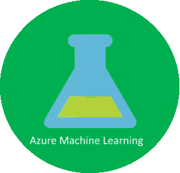
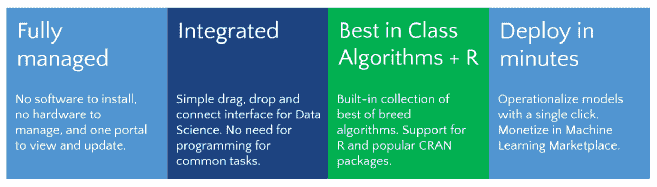
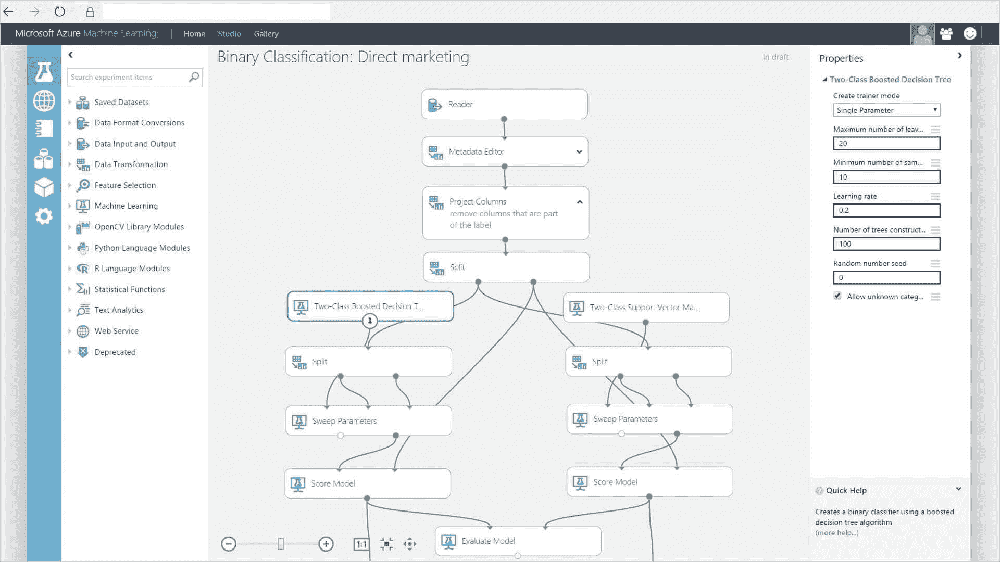

# 关于 Azure 机器学习服务你需要知道的一切

> 原文：<https://www.edureka.co/blog/azure-machine-learning>

本文将向您介绍在 Azure 机器学习服务上实现[机器学习](https://www.edureka.co/blog/machine-learning-tutorial/)实践的本质。本文将涉及以下几点:

*   [Azure 机器学习](#AzureMachineLearning)
*   [Azure 机器学习服务](#AzureMachineLearningService)
*   [机器学习云服务](#TheMachineLearningCloudService)
*   [图形界面](#GraphicalInterface)
*   [机器学习 API](#MachineLearningAPI)
*   [ML.NET](#ML.NET)
*   [AutoML](#AutoML)

让我们从这篇 Azure 机器学习文章开始吧，

## **Azure 机器学习**

云的出现标志着计算基础设施的新开端。这基本上意味着一个人可以通过互联网使用原本极其昂贵的资源。机器学习，尤其是深度学习，需要使用允许使用极高数量 RAM 和 VRAM(用于 Cuda 核心)的计算机架构。这两种商品都很难获得，主要有两个原因——

1.  例如，笔记本电脑只能在它们的框架中装入有限的资源。这意味着一个典型的笔记本电脑用户不可能拥有足够的资源来在机器上本地执行机器学习任务

2.  购买 RAM，尤其是 VRAM 非常昂贵，这似乎是一项非常高的投资。除了强大的 RAM 和 VRAM，我们还需要支持高级 CPU(否则 CPU 将成为系统的瓶颈),这进一步推高了整体价格。

继续阅读 Azure 机器学习文章，

## **Azure 机器学习服务**

考虑到上述问题，我们很容易理解对可通过互联网全天候远程访问的资源的需求。

Azure ML 是一种基于云的服务，为各级数据科学家提供简化的体验。这一点尤其重要，因为很多新工程师都在尝试进入这个领域，如果没有直观的用户界面，执行这些任务会非常困难。

(来源:Microsoft.com)

Azure ML 附带了 ML studio，它本质上是一个基于浏览器的工具，为数据科学家提供了一个易于使用的拖放界面来构建这些模型。

通过 [人工智能课程](https://www.edureka.co/executive-programs/machine-learning-and-ai) 将自己转变为高技能专业人士，并获得高薪工作。

大多数常用的算法和库都是用户现成的。它还拥有对 R 和 Python 的内置支持，允许经验丰富的数据科学家根据自己的喜好更改和定制他们的模型及其架构。

一旦模型建立并准备就绪，它就可以很容易地被用作 web 服务，可以被大量的编程语言调用，本质上使它对实际面对最终用户的应用程序可用。

Machine Learning Studio 通过提供一种构建工作流的拖放方式，使机器学习变得相当简单。有了 ML Studio 和它为工作流建模提供的大量模块，人们无需编写任何代码就可以创建高级模型。

机器学习从数据开始，这些数据可能来自多种来源。数据通常需要在使用前进行“清理”, ML Studio 包含了帮助清理的模块。一旦数据准备就绪，人们可以选择一种算法，根据数据“训练”模型，并从中找到模式。之后是对模型的评分和评估，这将告诉你模型预测结果的能力。所有这些都是在 ML Studio 中可视化地交付的。一旦模型准备就绪，只需点击几个按钮就可以将其部署为 Web 服务，这样就可以从客户端应用程序调用它。

ML Studio 提供了 25 种用于机器学习的标准算法的预录制实现。它将它们分成四个部分。

*   异常检测是一种对不符合常规模式或数据集中其他项目的事物、事件或观察结果进行分类的方法。
*   回归算法试图发现和量化变量之间的关系。通过在因变量和一个或多个自变量之间建立关系，回归分析能够在给定一组输入的情况下以可量化的准确度预测因变量的值。
*   分类算法的目标是基于由已经被分配到一个类别的观察值组成的训练数据来识别观察值所属的类别。
*   聚类寻求以这样的方式堆积一堆对象，即同一组(称为聚类)中的对象彼此之间比其他组(聚类)中的对象更相似。

一旦扩展为 Web 服务，模型就可以通过 HTTP 与简单的 REST 调用一起使用。这使得开发人员可以构建从机器学习中获取智能的应用程序。

这篇 azure 机器学习文章的后续内容是关于 Azure 及其特性的快速总结

**了解我们在顶级城市/国家的 Microsoft Azure 培训**

| **印度** | **美国** | **其他城市/国家** |
| [班加罗尔](https://www.edureka.co/microsoft-certified-azure-solution-architect-certification-training-bangalore) | [纽约](https://www.edureka.co/microsoft-certified-azure-solution-architect-certification-training-new-york-city) | [英国](https://www.edureka.co/microsoft-certified-azure-solution-architect-certification-training-uk) |
| [海德拉巴](https://www.edureka.co/microsoft-certified-azure-solution-architect-certification-training-hyderabad) | [芝加哥](https://www.edureka.co/microsoft-certified-azure-solution-architect-certification-training-chicago) | 伦敦 |
| [德里](https://www.edureka.co/microsoft-certified-azure-solution-architect-certification-training-delhi) | 亚特兰大 | [加拿大](https://www.edureka.co/microsoft-certified-azure-solution-architect-certification-training-canada) |
| [钦奈](https://www.edureka.co/microsoft-certified-azure-solution-architect-certification-training-chennai) | [休斯顿](https://www.edureka.co/microsoft-certified-azure-solution-architect-certification-training-houston) | [多伦多](https://www.edureka.co/microsoft-certified-azure-solution-architect-certification-training-toronto) |
| [孟买](https://www.edureka.co/microsoft-certified-azure-solution-architect-certification-training-mumbai) | 洛杉矶 | [澳大利亚](https://www.edureka.co/microsoft-certified-azure-solution-architect-certification-training-australia) |
| [浦那](https://www.edureka.co/microsoft-certified-azure-solution-architect-certification-training-pune) | [波士顿](https://www.edureka.co/microsoft-certified-azure-solution-architect-certification-training-boston) | 阿联酋 |
| 加尔各答 | [迈阿密](https://www.edureka.co/microsoft-certified-azure-solution-architect-certification-training-miami) | [迪拜](https://www.edureka.co/microsoft-certified-azure-solution-architect-certification-training-dubai) |
| 艾哈迈达巴德 | [旧金山](https://www.edureka.co/microsoft-certified-azure-solution-architect-certification-training-san-francisco) | [菲律宾](https://www.edureka.co/microsoft-certified-azure-solution-architect-certification-training-philippines) |

继续阅读 Azure 机器学习文章，

## **机器学习云服务**

云服务本质上允许最终用户通过互联网远程出租或使用另一家公司部署的服务(硬件设备)。

Azure 机器学习服务提供软件开发工具包&服务，以快速准备数据、训练和部署定制的 ML 模型。 对开源 Python 框架有现成的支持，比如 PyTorch、TensorFlow 和 scikit-learn。 如果需要构建定制模型或使用深度学习模型，应该考虑使用这个工具

然而，如果你倾向于不使用 Python 或者想要一个更简单的服务，就不要使用它。

这项服务需要大量的数据科学知识和背景，不建议新手使用。只为训练模型的资源付费。通过 Azure Kubernetes 服务部署的几个定价层。

继续阅读 Azure 机器学习文章，

## **图形界面**

图形界面是无代码或低代码平台，基于访问 ML 等功能的方式。其中一些可以是下拉列表，在这种情况下，它是一个拖放工具。

Azure Machine Learning Studio 是一个拖放式机器学习工具，它使您能够通过在图形界面中上传一组自定义数据来评估结果，从而构建、训练和定制机器学习模型。在训练一个模型之后，您可以直接从 Studio 中将它部署为一个 web 服务。你甚至可以通过 [Azure 云工程师课程](https://www.edureka.co/masters-program/azure-cloud-engineer-certification-training) 查看 Azure 的详细信息。

当要编写的代码必须很少，或者主要工作是围绕分类、回归和聚类等基本问题时，通常会使用该功能

这种方法通常对初学者友好，但是，它需要一些数据科学的背景知识。

虽然它有一个免费的选项，但标准层每个座位每月收费 9.99 美元，每个实验小时收费 1 美元。

## **机器学习 API**

应用程序接口(API)是一种可以由组织提供的服务，该组织可以发送对某些查询的响应，并且这些响应可以用于增强一个人的应用。

这使我们能够灵活地访问各种服务，而不会直接影响我们的核心应用。

微软的 API 服务被称为认知服务。这些可以直接部署在 Azure 上。有五类服务可用，包括视觉、语言、语音、搜索和决策。这些是预先训练的模型，适合热衷于使用机器学习但没有数据科学背景的开发人员。

然而，这些服务在定制方面有所欠缺，因此不推荐在很多东西定义明确但需求不灵活的情况下使用。

继续阅读 Azure 机器学习文章，

## **ML.NET**

框架是一般的概要代码，人们可以在其上构建自己的应用程序。框架允许较低层次的功能被照看，因此人们只需要照看他们的应用程序逻辑。

ML.NET 具有分类、回归、异常检测和推荐训练算法，并且可以用 Tensorflow 和 ONNX 扩展用于神经网络。

对于习惯于构建自己的 ML 管道的. NET 开发人员来说，这非常有用。 然而，学习曲线意味着一般的 python 开发者应该远离。

继续阅读 Azure 机器学习文章，

## **AutoML**

自动机器学习最近吸引了大量的注意力，它是一种自动选择和训练机器学习模型的软件。虽然很容易认为它可以在技术上取代数据科学家的工作，但实际使用过它的人清楚地知道，它能做什么和不能做什么是有限制的。

数据科学家的当前元(无 AutoML)将是首先创建一个基础模型，然后手动迭代超参数的各种可能性，直到它们达到产生最佳结果的一组值。正如人们可以很容易猜到的那样，这是一个非常耗时的策略。此外，随着超参数数量的增加，搜索空间呈指数增长，使得更新的、基于深度神经网络的架构几乎不可能完全迭代和优化。

目前，微软的 AutoML 能够自动建立一组 ML 模型，智能地选择模型进行训练，然后根据 ML 问题和数据类型为您推荐最佳模型。简而言之，它选择正确的算法并帮助调整超参数。目前，它只支持分类、预测和回归问题。

AutoML 与 Azure 机器学习服务或 ML.NET 一起使用，您需要支付任何相关费用。

因此，这就把我们带到了本文的结尾。我希望你喜欢这篇文章。如果你正在读这封信，让我祝贺你。因为你不再是 Azure 的新手了！你练习得越多，你学得就越多。为了让您的旅程更轻松，我们推出了这个 [**Azure 教程** **博客系列**](https://www.edureka.co/blog/microsoft-azure-tutorial) ，它将会经常更新或者加入我们的 [Azure master program](https://www.edureka.co/masters-program/azure-cloud-engineer-certification-training) 。我们还推出了一套课程，涵盖了你通过 Azure 考试所需的全部内容！您可以在这里查看 [***蔚蓝培训***](https://www.edureka.co/microsoft-certified-azure-solution-architect-certification-training) 的课程详情。

此外，如果您希望掌握 Azure 和 DevOps 中的原则，并致力于与商业世界有重大关联的分步任务，行业专业人士开发了 [Azure DevOps 认证](https://www.edureka.co/microsoft-azure-devops-solutions-training) 课程大纲。完成培训课程后，你可以申请全球薪酬最高的跨国公司顶级职位之一。

快乐学习！