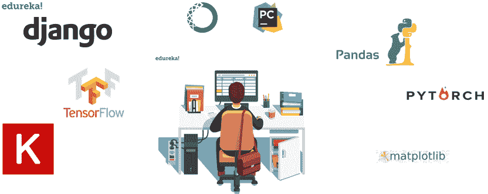
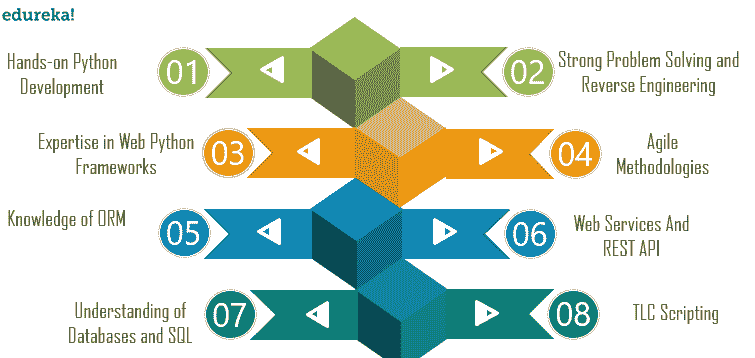
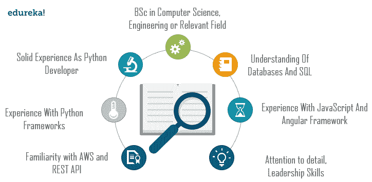
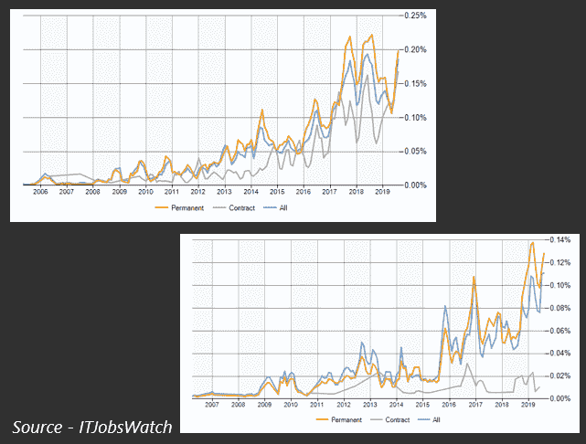
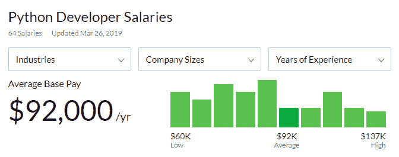
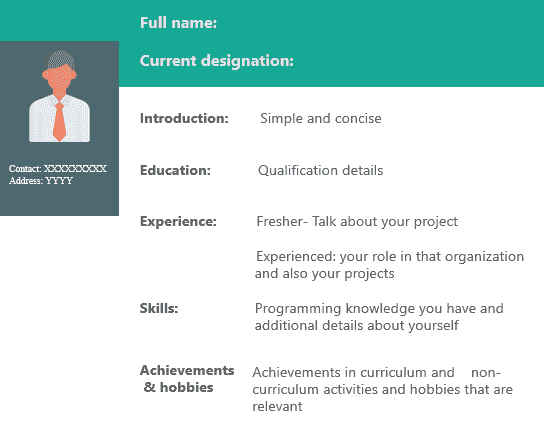

# 了解如何为 Python 开发人员制作简历

> 原文：<https://www.edureka.co/blog/python-developer-resume/>

Python 编程语言在过去的二十年里取得了很大的进步。凭借对[数据科学](https://www.edureka.co/blog/learn-python-for-data-science/)、[人工智能](https://www.edureka.co/blog/artificial-intelligence-with-python/)、[机器学习](https://www.edureka.co/blog/videos/python-machine-learning/)领域的巨大贡献，它已经成为 21 世纪最受欢迎的语言之一。越来越多的创新和技术进步对于任何 python 开发人员来说都有一个非常有前途的新的和巨大的工作机会。在本文中，我们将了解 python 开发人员简历构建的有效方面。以下是本博客涵盖的主题:

*   [谁是 Python 开发者？](#pythondeveloper)
*   [职位描述](#jd)
*   [所需技能](#skills)
*   [如何打造自己的简历？](#resume)
*   [Python 开发者工作趋势](#jt)
*   [薪资趋势](#st)
*   [Python 开发者简历样本](#sample)

## **谁是 Python 开发者？**

## ****

python 开发人员负责编写服务器端应用程序逻辑。对于 python 开发者来说，每天都有惊人的工作机会。公司正在转向 python 编程语言，这为 python 程序员和开发人员创造了机会。让我们来看看一家公司提供的 python 开发人员的典型职位描述。

## **职位描述**

典型的工作描述如下:

*We are looking for a python developer responsible for managing the interchange of data between the servers and the user. Your primary focus will be the development of all server-side logic, ensuring high performance and responsiveness to requests from the front-end. You will also be responsible for integrating the front-end elements built by your co-workers into the application. Therefore, a basic understanding of front-end technologies is a must as well.*

**为了获得更广泛的叙述，**这里是 python 开发人员的另一份工作描述**。**

***We are looking for a python developer to join our engineering team and help us develop and maintain various software products. The responsibilities include writing and testing code, debugging programs and integrating applications with third-party web servers.********To be successful in this role, you should have experience using server-side logic and work well in a team. Ultimately, you will build highly responsive web applications that align with our business needs.*****

******这是一个典型的 python 开发人员的工作描述，但它可能会根据不同的公司和他们对 python 开发人员简历的要求而有所不同。******

## ********所需技能********

## ****************

******初级 python 开发人员所需的技能包括:******

*******   动手操作 [Python 开发](https://www.edureka.co/blog/introduction-to-python/)*   强大的问题解决和逆向工程能力*   web python 框架的专业知识(django、flask 等)*   [敏捷方法](https://www.edureka.co/blog/why-organizations-are-adopting-agile-methodologies/)*   ORM(对象关系映射)知识*   很好地理解了 [Web 服务](https://www.edureka.co/blog/videos/aws-tutorial/)和 [REST API](https://www.edureka.co/blog/what-is-rest-api/)*   了解[数据库和 SQL](https://www.edureka.co/blog/mysql-tutorial/)*   TLC 脚本知识******

******其他技能包括:******

*******   强[弱](https://www.edureka.co/blog/devops-lifecycle/)*   使用[全栈开发的经验](https://www.edureka.co/blog/how-to-become-a-full-stack-web-developer/)*   [云服务知识](https://www.edureka.co/blog/google-cloud-services/)*   [HTML](https://www.edureka.co/blog/what-is-html/) ， [CSS](https://www.edureka.co/blog/what-is-css/) ， [JavaScript](https://www.edureka.co/blog/javascript-tutorial/) ， [JQuery](https://www.edureka.co/blog/jquery-tutorial-edureka/)*   出色的调试技能*   [软件开发生命周期](https://www.edureka.co/blog/videos/devops-is-going-to-replace-sdlc-learn-why/)******

## ****************

******以下是有经验的或高级 python 开发人员所需的一些技能:******

*******   计算机科学，工程或相关领域的学士学位*   作为 python 开发人员的丰富经验*   使用 [Python 框架的经验](https://www.edureka.co/blog/django-tutorial/)*   使用 JavaScript 和 T2 框架的经验*   熟悉 [AWS](https://www.edureka.co/blog/videos/aws-tutorial/) 和 [REST API](https://www.edureka.co/blog/what-is-rest-api/)*   关注细节和卓越的领导技能*   了解[数据库和 SQL](https://www.edureka.co/blog/postgresql-tutorial/)******

******现在我们知道了初级和有经验的 python 开发人员需要的所有技能，让我们来看看如何创建 python 开发人员简历。******

## ********如何打造自己的简历？********

******制作简历有两种方法，下面是我们可以定义简历的两个类别。******

*******   **职能性—**根据相关的工作角色提及你的经历。*   按时间顺序-以事情发生的方式讲述你的经历。******

******在创建 python 开发人员简历时，您的方法应该满足以下几点:******

*******   在格式方面简洁明了*   更新简历*   对于少于 8 年的经验，简历不应该超过一页*   2 年以上工作经验的实用简历*   根据特定工作角色的技能优先级*   提及你参与的活动*   成就和爱好必须包括在内******

## ********Python 开发者就业趋势********

******让我们考虑一下 2019 年初级和高级 python 开发人员的各种工作趋势。******

## ****************

******正如我们在上面的图表中所看到的，对于初级 python 开发人员来说，永久性工作的数量在过去 5 年中有了很大的飞跃。随着工作岗位超过 20%的增长，考虑到 it 行业的最新创新和进步，公司开始以指数速度转向 python 编程语言，这一数字只会继续增长。******

******对于高级 python 开发人员的工作，它比以往任何时候都要高，在 python 编程领域的经验会让你比其他候选人更有优势，从而增加你获得这份工作的机会。******

## ********薪资趋势********

******让我们来考虑一下 2019 年 python 开发者的薪资趋势。******

## ****************

******看一下这些统计数据，很明显一个 python 开发者平均一年能挣 92000 美元，在某些情况下甚至能达到 137000 美元。******

******印度初级 python 开发人员的平均年薪超过 50 万印度卢比，目前至少有 3 万个职位空缺。******

******对于一名高级 python 开发人员来说，平均工资为 60 万印度卢比，一年也可能高达 200 万印度卢比。随着需求的增加，拥有相关技能和经验的人很容易找到工作。以下是 python 开发人员简历的样本。******

## ********Python 开发者简历样本********

************

******在这篇博客中，我们已经讨论了构建 python 开发者简历时需要涉及的各个方面。有了对工作和工资趋势的洞察，人们可以弥补任何 python 开发人员的机会数量。******

******随着越来越多的创新和技术进步，以这样一种方式培养你的技能，使你能够为新时代的应用做出贡献，是非常必要的。报名参加 Edureka 的 [Python 课程](https://www.edureka.co/python-programming-certification-training)计划，开始学习。******

*******有什么问题吗？在评论中提到他们，我们会尽快回复你。*******